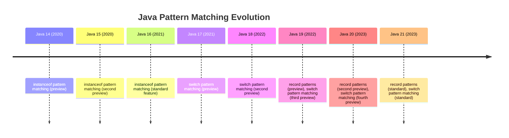

# Java Pattern Matching

Pattern matching is a powerful programming language feature that allows us to test whether a value has a certain shape and extract information from it when it does. Java has been gradually introducing pattern matching features since Java 14, making code more concise, safer, and more readable.

## Introduction to Pattern Matching

In traditional Java code, we often need to check the type of an object and then cast it to access its members. This results in verbose and error-prone code. Pattern matching simplifies this process by combining the type check and the cast in a single operation.

Let's start by understanding what problem pattern matching solves:

```java
// Traditional approach (without pattern matching)
if (obj instanceof String) {
    String s = (String) obj;
    // Use the String variable s
    System.out.println(s.length());
}
```

With pattern matching, we can simplify this to:

```java
// Using pattern matching (Java 16+)
if (obj instanceof String s) {
    // Use the String variable s directly
    System.out.println(s.length());
}
```

## Pattern Matching for `instanceof`

The most basic form of pattern matching in Java is the `instanceof` pattern. Introduced in Java 16 as a standard feature (after being previewed in Java 14 and 15), it allows you to test and cast in a single step.

### Syntax

```
if (expression instanceof Type variable) {
    // Use variable here
}
```

### Basic Example

```java
public void processObject(Object obj) {
    // Without pattern matching
    if (obj instanceof Integer) {
        Integer i = (Integer) obj;
        System.out.println("Integer value: " + i);
    }
    
    // With pattern matching
    if (obj instanceof Integer i) {
        System.out.println("Integer value: " + i);
    }
}
```

### Scope of Pattern Variables

The pattern variable is only in scope where the instanceof check is true:

```java
public void demonstrateScope(Object obj) {
    if (obj instanceof String s && s.length() > 5) {
        System.out.println("This is a String with length > 5: " + s);
    }
    // s is not available here
    
    if (!(obj instanceof String s)) {
        System.out.println("obj is not a String");
    } else {
        // s is available here because we know obj is a String
        System.out.println("String length: " + s.length());
    }
}
```

## Pattern Matching in `switch` Statements

Java 17 introduced preview support for pattern matching in switch expressions and statements, with refinements in Java 18 and 19. This feature became standardized in Java 21.

### Basic Syntax

```java
switch (obj) {
    case Type1 var1 -> handleType1(var1);
    case Type2 var2 -> handleType2(var2);
    default -> handleDefault();
}
```

### Example with Different Types

```java
public String describeObject(Object obj) {
    return switch (obj) {
        case String s -> "String of length " + s.length();
        case Integer i -> "Integer with value " + i;
        case Long l -> "Long with value " + l;
        case Double d -> "Double with value " + d;
        case null -> "It's null";
        default -> "It's something else";
    };
}
```

Input and output examples:

```
describeObject("Hello") → "String of length 5"
describeObject(42) → "Integer with value 42"
describeObject(42.5) → "Double with value 42.5"
describeObject(null) → "It's null"
describeObject(new ArrayList<>()) → "It's something else"
```

### Guarded Patterns

In Java 21, you can combine a pattern with a boolean expression using a "when" clause:

```java
public String categorizeNumber(Object obj) {
    return switch (obj) {
        case Integer i when i < 0 -> "Negative integer";
        case Integer i when i > 0 -> "Positive integer";
        case Integer i -> "Zero";
        case Float f when f < 0 -> "Negative float";
        case Float f when f > 0 -> "Positive float";
        case Float f -> "Zero float";
        default -> "Not a number";
    };
}
```

Input and output examples:

```
categorizeNumber(5) → "Positive integer"
categorizeNumber(-10) → "Negative integer"
categorizeNumber(0) → "Zero"
categorizeNumber(5.5f) → "Positive float"
categorizeNumber("hello") → "Not a number"
```

## Record Patterns

Java 19 introduced preview support for record patterns, which was enhanced in Java 20 and standardized in Java 21. This allows for destructuring record values in pattern matching contexts.

### Basic Record Pattern

```java
record Point(int x, int y) { }

public void processShape(Object obj) {
    if (obj instanceof Point p) {
        // Access individual components
        int x = p.x();
        int y = p.y();
        System.out.println("Point at (" + x + ", " + y + ")");
    }
}
```

### Nested Record Patterns

With record patterns, you can also destructure nested records:

```java
record Point(int x, int y) { }
record Rectangle(Point topLeft, Point bottomRight) { }

public void printArea(Object shape) {
    if (shape instanceof Rectangle(Point(int x1, int y1), Point(int x2, int y2))) {
        int width = x2 - x1;
        int height = y1 - y2;
        System.out.println("Rectangle with width " + width + " and height " + height);
        System.out.println("Area: " + (width * height));
    }
}
```

### Record Patterns in Switch

You can also use record patterns in switch expressions and statements:

```java
record Point(int x, int y) { }
record Rectangle(Point topLeft, Point bottomRight) { }
record Circle(Point center, int radius) { }

public double calculateArea(Object shape) {
    return switch (shape) {
        case Rectangle(Point(int x1, int y1), Point(int x2, int y2)) -> {
            int width = x2 - x1;
            int height = y1 - y2;
            yield width * height;
        }
        case Circle(Point p, int r) -> Math.PI * r * r;
        default -> 0.0;
    };
}
```

## Real-world Applications

### Example 1: Processing Different Message Types

In a messaging application, you might need to process different types of messages:

```java
record TextMessage(String sender, String content, boolean isRead) { }
record ImageMessage(String sender, String imageUrl, int width, int height) { }
record VideoMessage(String sender, String videoUrl, int durationSeconds) { }

public void processMessage(Object message) {
    switch (message) {
        case TextMessage(String sender, String content, boolean isRead) when !isRead -> 
            System.out.println("New text from " + sender + ": " + content);
        
        case TextMessage(String sender, var content, var isRead) -> 
            System.out.println("Already read text from " + sender);
        
        case ImageMessage(String sender, String url, int w, int h) -> 
            System.out.println("Image from " + sender + " (" + w + "x" + h + "): " + url);
        
        case VideoMessage(String sender, String url, int duration) -> 
            System.out.println("Video from " + sender + " (" + formatDuration(duration) + "): " + url);
        
        default -> 
            System.out.println("Unknown message type");
    }
}

private String formatDuration(int seconds) {
    int minutes = seconds / 60;
    int remainingSeconds = seconds % 60;
    return minutes + ":" + (remainingSeconds < 10 ? "0" + remainingSeconds : remainingSeconds);
}
```

### Example 2: Visitor Pattern Alternative

Pattern matching can sometimes replace the Visitor design pattern with more concise code:

```java
interface Shape { }
record Circle(double radius) implements Shape { }
record Rectangle(double width, double height) implements Shape { }
record Triangle(double a, double b, double c) implements Shape { }

public class ShapeProcessor {
    public double calculateArea(Shape shape) {
        return switch (shape) {
            case Circle c -> Math.PI * c.radius() * c.radius();
            case Rectangle r -> r.width() * r.height();
            case Triangle t -> {
                // Using Heron's formula
                double s = (t.a() + t.b() + t.c()) / 2;
                yield Math.sqrt(s * (s - t.a()) * (s - t.b()) * (s - t.c()));
            }
            default -> 0.0;
        };
    }
    
    public double calculatePerimeter(Shape shape) {
        return switch (shape) {
            case Circle c -> 2 * Math.PI * c.radius();
            case Rectangle r -> 2 * (r.width() + r.height());
            case Triangle t -> t.a() + t.b() + t.c();
            default -> 0.0;
        };
    }
}
```

## Pattern Matching Evolution in Java

Here's a summary of pattern matching features across Java versions:



## Best Practices

1. **Use pattern matching to eliminate explicit casts** — This makes your code safer by avoiding potential `ClassCastException`.

2. **Prefer pattern variables over subsequent field accesses** — Instead of `if (obj instanceof Person p) { use(p.getName()); }`, consider destructuring in future Java versions.

3. **Keep pattern matching expressions readable** — Just because you can combine multiple patterns in one switch doesn't mean you should make them overly complex.

4. **Use guarded patterns to express complex conditions** — The `when` clause can make your code more expressive than nested if statements.

5. **Consider exhaustiveness** — Make sure your switch patterns cover all possible cases to avoid unexpected behavior.

## Summary

Pattern matching in Java represents a significant enhancement to the language, making code that deals with different types and structures more concise, safer, and more readable. The feature has evolved across several Java versions:

- Java 16 standardized pattern matching for `instanceof`
- Java 21 standardized pattern matching in `switch` expressions and statements
- Java 21 also standardized record patterns, allowing for powerful destructuring

These features combine to provide a more expressive way to work with data in Java, bringing features that have long been popular in functional programming languages into the Java ecosystem.

## Additional Resources

- [JEP 394: Pattern Matching for instanceof](https://openjdk.java.net/jeps/394)
- [JEP 441: Pattern Matching for switch](https://openjdk.java.net/jeps/441)
- [JEP 440: Record Patterns](https://openjdk.java.net/jeps/440)
- [Oracle's Pattern Matching Tutorial](https://dev.java/learn/language-features/pattern-matching/)

## Exercises

1. Write a method that takes an `Object` and returns a descriptive string using pattern matching with `instanceof`.

2. Create a shape hierarchy with Circle, Square, and Triangle classes. Write a method that calculates the area of any shape using pattern matching in a switch expression.

3. Define a record hierarchy for representing different types of bank accounts. Write a method that applies different interest rates based on the account type using pattern matching.

4. Implement a simple expression evaluator that uses record patterns to interpret basic arithmetic expressions like addition, subtraction, multiplication, and division.

5. Refactor an existing piece of code that uses explicit type checking and casting to use pattern matching instead.