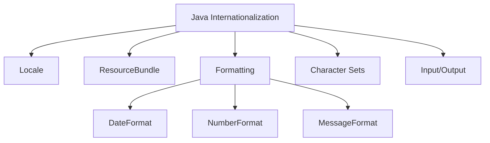

# Java Internationalization

In today's global marketplace, software applications need to cater to users from different countries, speaking different languages, and following different cultural conventions. Java Internationalization, often abbreviated as **i18n** (there are 18 letters between the 'i' and 'n' in "internationalization"), provides a framework for developing applications that can be adapted to various languages and regions without engineering changes to the source code.

## What is Java Internationalization?

Internationalization is the process of designing and preparing your application to be usable in different locales. A "locale" represents a specific geographical, political, or cultural region and encompasses:

- Language
- Country/region
- Character encoding
- Date and time format
- Number and currency format
- And other locale-specific settings

By properly implementing internationalization, your application can:
- Display text in the user's language
- Format dates, numbers, and currencies appropriately
- Sort text according to the locale's rules
- Handle culturally appropriate content

## Key Components of Java Internationalization



Let's explore each component in detail.

## Working with Locales

A `Locale` object represents a specific geographical, political, or cultural region. It's the foundation of all internationalization features in Java.

### Creating Locales

```java
// Create a Locale for US English
Locale usLocale = new Locale("en", "US");

// Create a Locale for French in Canada
Locale canadaFrenchLocale = new Locale("fr", "CA");

// Use predefined constants
Locale japaneseLocale = Locale.JAPAN;  // ja_JP
Locale germanLocale = Locale.GERMAN;   // de

// Get the default locale of the JVM
Locale defaultLocale = Locale.getDefault();
```

### Example: Displaying Locale Information

```java
public class LocaleDemo {
    public static void main(String[] args) {
        Locale locale = new Locale("fr", "FR");
        
        System.out.println("Language: " + locale.getLanguage());
        System.out.println("Country: " + locale.getCountry());
        System.out.println("Language Display Name: " + locale.getDisplayLanguage());
        System.out.println("Country Display Name: " + locale.getDisplayCountry());
        System.out.println("Display Name: " + locale.getDisplayName());
    }
}
```

**Output:**
```
Language: fr
Country: FR
Language Display Name: French
Country Display Name: France
Display Name: French (France)
```

## ResourceBundle for Message Externalization

`ResourceBundle` is a key component in Java internationalization. It allows you to externalize strings and other locale-specific resources from your code.

### Creating ResourceBundle Files

You typically organize resource bundles as properties files named according to the pattern:

`BaseName_language_country.properties`

For example:
- `Messages.properties` (default)
- `Messages_en_US.properties` (US English)
- `Messages_fr_FR.properties` (French)

### Example: Using ResourceBundle

Let's create a simple application that greets users in their preferred language.

**Messages.properties** (Default bundle):
```
greeting=Hello!
inquiry=How are you?
farewell=Goodbye!
```

**Messages_fr_FR.properties** (French bundle):
```
greeting=Bonjour!
inquiry=Comment allez-vous?
farewell=Au revoir!
```

**Messages_es_ES.properties** (Spanish bundle):
```
greeting=¡Hola!
inquiry=¿Cómo estás?
farewell=¡Adiós!
```

Now let's use these bundles:

```java
import java.util.Locale;
import java.util.ResourceBundle;

public class ResourceBundleDemo {
    public static void main(String[] args) {
        // Default locale (system locale)
        ResourceBundle bundle = ResourceBundle.getBundle("Messages");
        System.out.println("Default: " + bundle.getString("greeting"));
        
        // US English
        bundle = ResourceBundle.getBundle("Messages", new Locale("en", "US"));
        System.out.println("English: " + bundle.getString("greeting"));
        
        // French
        bundle = ResourceBundle.getBundle("Messages", new Locale("fr", "FR"));
        System.out.println("French: " + bundle.getString("greeting"));
        
        // Spanish
        bundle = ResourceBundle.getBundle("Messages", new Locale("es", "ES"));
        System.out.println("Spanish: " + bundle.getString("greeting"));
    }
}
```

**Output:**
```
Default: Hello!
English: Hello!
French: Bonjour!
Spanish: ¡Hola!
```

### Resource Lookup Process

When looking for a resource, Java follows a specific search pattern to find the most appropriate resource:

1. BaseName_language_country_variant
2. BaseName_language_country
3. BaseName_language
4. BaseName_default_locale_language_country_variant
5. BaseName_default_locale_language_country
6. BaseName_default_locale_language
7. BaseName

## Formatting Locale-Sensitive Data

### Date and Time Formatting

The `DateFormat` class provides locale-sensitive formatting and parsing of dates and times:

```java
import java.text.DateFormat;
import java.util.Date;
import java.util.Locale;

public class DateFormatDemo {
    public static void main(String[] args) {
        Date now = new Date();
        
        // Different date styles
        DateFormat shortDF = DateFormat.getDateInstance(DateFormat.SHORT, Locale.US);
        DateFormat mediumDF = DateFormat.getDateInstance(DateFormat.MEDIUM, Locale.US);
        DateFormat longDF = DateFormat.getDateInstance(DateFormat.LONG, Locale.US);

        System.out.println("US Short: " + shortDF.format(now));
        System.out.println("US Medium: " + mediumDF.format(now));
        System.out.println("US Long: " + longDF.format(now));
        
        // Different locales
        DateFormat frenchDF = DateFormat.getDateInstance(DateFormat.LONG, Locale.FRANCE);
        DateFormat germanDF = DateFormat.getDateInstance(DateFormat.LONG, Locale.GERMANY);

        System.out.println("French: " + frenchDF.format(now));
        System.out.println("German: " + germanDF.format(now));
    }
}
```

**Output** (will vary based on the current date):
```
US Short: 6/15/23
US Medium: Jun 15, 2023
US Long: June 15, 2023
French: 15 juin 2023
German: 15. Juni 2023
```

### Number and Currency Formatting

The `NumberFormat` class handles locale-specific formatting of numbers and currencies:

```java
import java.text.NumberFormat;
import java.util.Locale;

public class NumberFormatDemo {
    public static void main(String[] args) {
        double number = 1234567.89;
        
        // Number formatting in different locales
        NumberFormat usFormat = NumberFormat.getNumberInstance(Locale.US);
        NumberFormat frFormat = NumberFormat.getNumberInstance(Locale.FRANCE);
        NumberFormat deFormat = NumberFormat.getNumberInstance(Locale.GERMANY);
        
        System.out.println("US: " + usFormat.format(number));
        System.out.println("France: " + frFormat.format(number));
        System.out.println("Germany: " + deFormat.format(number));
        
        // Currency formatting in different locales
        NumberFormat usCurrency = NumberFormat.getCurrencyInstance(Locale.US);
        NumberFormat frCurrency = NumberFormat.getCurrencyInstance(Locale.FRANCE);
        NumberFormat jpCurrency = NumberFormat.getCurrencyInstance(Locale.JAPAN);
        
        System.out.println("US Currency: " + usCurrency.format(number));
        System.out.println("France Currency: " + frCurrency.format(number));
        System.out.println("Japan Currency: " + jpCurrency.format(number));
    }
}
```

**Output:**
```
US: 1,234,567.89
France: 1 234 567,89
Germany: 1.234.567,89
US Currency: $1,234,567.89
France Currency: 1 234 567,89 €
Japan Currency: ￥1,234,568
```

### MessageFormat for Complex Messages

`MessageFormat` provides a way to produce concatenated messages in a language-neutral way:

```java
import java.text.MessageFormat;
import java.util.Date;
import java.util.Locale;

public class MessageFormatDemo {
    public static void main(String[] args) {
        String pattern = "On {0}, file {1} was saved by {2}.";
        Object[] arguments = {
            new Date(),
            "report.doc",
            "John"
        };
        
        MessageFormat formatter = new MessageFormat(pattern, Locale.US);
        String output = formatter.format(arguments);
        
        System.out.println(output);
    }
}
```

**Output** (will vary based on the current date):
```
On Jun 15, 2023, file report.doc was saved by John.
```

## Real-world Application: Multilingual Web Application

Let's build a simple console application that simulates a multilingual shopping cart:

```java
import java.text.MessageFormat;
import java.text.NumberFormat;
import java.util.Locale;
import java.util.ResourceBundle;
import java.util.Scanner;

public class ShoppingCartApp {
    private Locale currentLocale;
    private ResourceBundle messages;
    private NumberFormat currencyFormatter;
    
    public ShoppingCartApp(Locale locale) {
        this.currentLocale = locale;
        this.messages = ResourceBundle.getBundle("ShoppingCart", locale);
        this.currencyFormatter = NumberFormat.getCurrencyInstance(locale);
    }
    
    public void displayWelcome() {
        System.out.println(messages.getString("welcome"));
    }
    
    public void displayMenu() {
        System.out.println("\n" + messages.getString("menu.title"));
        System.out.println("1. " + messages.getString("menu.addItem"));
        System.out.println("2. " + messages.getString("menu.viewCart"));
        System.out.println("3. " + messages.getString("menu.checkout"));
        System.out.println("4. " + messages.getString("menu.changeLanguage"));
        System.out.println("5. " + messages.getString("menu.exit"));
        System.out.print(messages.getString("menu.choice"));
    }
    
    public void displayTotal(double total) {
        String formattedMessage = MessageFormat.format(
            messages.getString("cart.total"), 
            currencyFormatter.format(total)
        );
        System.out.println(formattedMessage);
    }
    
    // Main method for demonstration
    public static void main(String[] args) {
        // Start with default locale
        ShoppingCartApp app = new ShoppingCartApp(Locale.getDefault());
        app.displayWelcome();
        app.displayMenu();
        
        // Simulate adding an item and showing the total
        double totalAmount = 125.75;
        app.displayTotal(totalAmount);
        
        // Change locale and show the same information
        System.out.println("\n--- Changing language to French ---");
        app = new ShoppingCartApp(Locale.FRANCE);
        app.displayWelcome();
        app.displayMenu();
        app.displayTotal(totalAmount);
    }
}
```

For this to work, you'd need these resource bundles:

**ShoppingCart.properties** (Default):
```
welcome=Welcome to the Online Shop!
menu.title=Main Menu
menu.addItem=Add item to cart
menu.viewCart=View cart
menu.checkout=Proceed to checkout
menu.changeLanguage=Change language
menu.exit=Exit
menu.choice=Enter your choice: 
cart.total=Total amount: {0}
```

**ShoppingCart_fr_FR.properties** (French):
```
welcome=Bienvenue à la Boutique en Ligne!
menu.title=Menu Principal
menu.addItem=Ajouter un article au panier
menu.viewCart=Afficher le panier
menu.checkout=Procéder au paiement
menu.changeLanguage=Changer de langue
menu.exit=Quitter
menu.choice=Entrez votre choix: 
cart.total=Montant total: {0}
```

## Best Practices for Internationalization

1. **Externalize strings**: Never hardcode user-facing strings in your code.
2. **Use resource bundles**: Organize translated strings in properties files.
3. **Format with placeholders**: Use `MessageFormat` rather than string concatenation.
4. **Handle text direction**: Some languages read right-to-left (RTL) instead of left-to-right (LTR).
5. **Consider cultural differences**: Be aware of cultural sensitivities in icons, colors, and imagery.
6. **Test with different locales**: Ensure your application works correctly with various languages.
7. **Allow for text expansion**: Translated text may be longer than the original, so design flexible UI layouts.
8. **Use Unicode**: Always use Unicode for character encoding to support all languages.

## Java Internationalization with Modern Frameworks

Modern Java frameworks like Spring and Jakarta EE provide additional internationalization support:

- **Spring Framework**: Offers `MessageSource` interface and integration with locale resolution.
- **Jakarta EE**: Provides JSF localization features and integration with CDI.
- **Micronaut and Quarkus**: Both offer internationalization support with similar concepts.

## Summary

Java Internationalization (i18n) is a powerful framework that allows your applications to adapt to different languages, regions, and cultural preferences. By leveraging `Locale`, `ResourceBundle`, and various formatting classes, you can build truly global applications that provide users with a localized experience.

Key takeaways from this guide:

- Use `Locale` to represent language and country combinations
- Externalize strings with `ResourceBundle`
- Format dates, numbers, and messages according to locale conventions
- Follow best practices to ensure your application is properly internationalized

By implementing these principles, you can create Java applications that work seamlessly for users around the world.

## Additional Resources

- [Oracle's Java Internationalization Tutorial](https://docs.oracle.com/javase/tutorial/i18n/index.html)
- [Unicode Consortium](https://unicode.org/) - For information on character encoding
- [CLDR (Common Locale Data Repository)](http://cldr.unicode.org/) - For locale-specific data

## Exercises

1. Create a simple console application that greets users in at least three different languages based on the selected locale.

2. Extend the shopping cart example to include product descriptions in multiple languages and format prices according to the locale.

3. Build a date and time utility class that formats dates in different styles (short, medium, long) for various locales.

4. Create a multilingual form that validates input according to locale-specific rules (e.g., different date formats, number formats).

5. Research how to handle bidirectional text for languages like Arabic and Hebrew, and implement a simple example that displays text correctly in these languages.