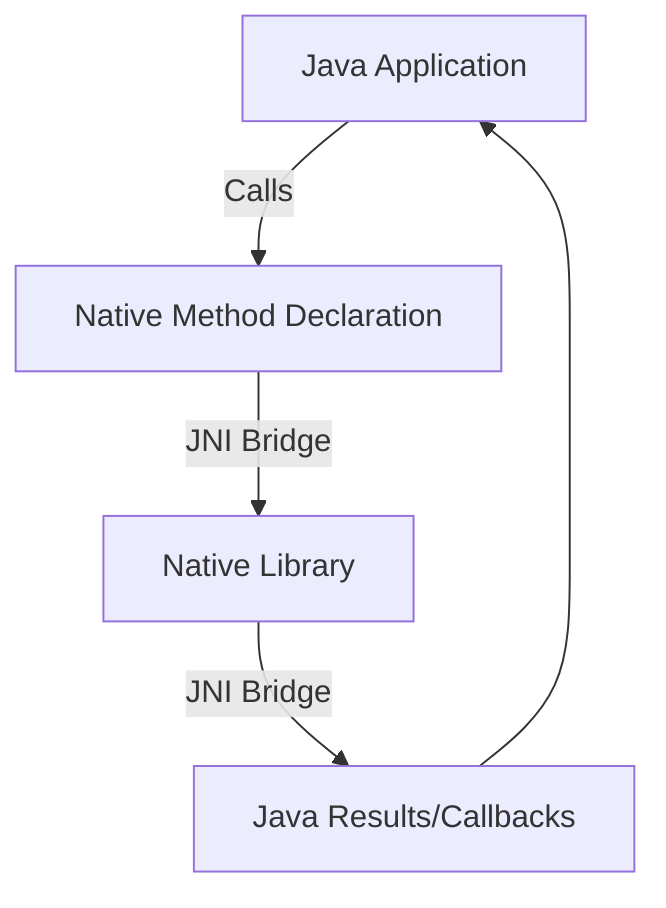

# Java Native Interface (JNI)

## Introduction

The Java Native Interface (JNI) is a powerful feature of the Java platform that allows Java code running in a Java Virtual Machine (JVM) to interact with native applications and libraries written in other languages like C, C++, or Assembly. JNI serves as a bridge between the Java world and the native world, enabling developers to call native code from Java and vice versa.

JNI is particularly useful when you need to:

- Access system or hardware-specific features not available in the Java API
- Reuse existing libraries written in other languages
- Perform performance-critical operations that require low-level optimization
- Interface with platform-specific APIs and services

## Understanding JNI Basics

### How JNI Works

JNI provides a framework that allows Java code to call native methods and native code to interact with Java objects, methods, and fields. The communication happens through a well-defined interface that manages data conversion between Java and native code.



### JNI Components

1. **Java Native Methods**: Methods declared in Java with the `native` keyword but implemented in native code
2. **Native Libraries**: Shared libraries (.dll, .so, .dylib) containing the implementation of native methods
3. **JNI Functions**: API functions that allow native code to access Java objects and features

## Implementing JNI: Step by Step

Let's create a simple example that shows how to use JNI to create a "Hello World" program with a native method.

### Step 1: Create a Java Class with Native Method Declaration

```java
public class HelloJNI {
    // Declare a native method
    private native void sayHello();
    
    // Load the native library
    static {
        System.loadLibrary("hello");
    }
    
    // Main method to call the native method
    public static void main(String[] args) {
        new HelloJNI().sayHello();
    }
}
```

In this code:
- We declare a native method `sayHello()` with the `native` keyword
- We use a static block to load the native library named "hello"
- We create an instance of `HelloJNI` and call the native method from the main method

### Step 2: Compile the Java Class and Generate the Header File

```bash
# Compile the Java file
javac HelloJNI.java

# Generate the C header file using javac (for Java 8+)
javac -h . HelloJNI.java

# For older Java versions, use javah
# javah -jni HelloJNI
```

This will generate a header file named `HelloJNI.h` containing the function prototype for the native method.

### Step 3: Implement the Native Method in C/C++

Create a C file named `HelloJNI.c` that implements the native method:

```c
#include <jni.h>
#include <stdio.h>
#include "HelloJNI.h"

JNIEXPORT void JNICALL Java_HelloJNI_sayHello(JNIEnv *env, jobject obj) {
    printf("Hello from native code!\n");
    return;
}
```

In this code:
- We include the JNI header file and our generated header file
- We implement the native method with the proper JNI naming convention
- The function receives two parameters:
  - `JNIEnv *env`: A pointer to the JNI environment
  - `jobject obj`: A reference to the Java object that called the method

### Step 4: Compile the Native Code into a Shared Library

#### On Windows:
```bash
gcc -I"%JAVA_HOME%\include" -I"%JAVA_HOME%\include\win32" -shared -o hello.dll HelloJNI.c
```

#### On Linux:
```bash
gcc -I"$JAVA_HOME/include" -I"$JAVA_HOME/include/linux" -shared -fPIC -o libhello.so HelloJNI.c
```

#### On macOS:
```bash
gcc -I"$JAVA_HOME/include" -I"$JAVA_HOME/include/darwin" -shared -fPIC -o libhello.dylib HelloJNI.c
```

### Step 5: Run the Java Program

```bash
# Make sure the library path includes the directory containing the native library
java -Djava.library.path=. HelloJNI
```

**Output:**
```
Hello from native code!
```

## Data Type Mapping Between Java and Native Code

When working with JNI, you need to understand how Java types map to native types:

| Java Type | JNI Type    | C/C++ Type       |
|-----------|-------------|------------------|
| boolean   | jboolean    | unsigned char    |
| byte      | jbyte       | signed char      |
| char      | jchar       | unsigned short   |
| short     | jshort      | short            |
| int       | jint        | int              |
| long      | jlong       | long long        |
| float     | jfloat      | float            |
| double    | jdouble     | double           |
| Object    | jobject     | struct pointer   |
| Class     | jclass      | struct pointer   |
| String    | jstring     | struct pointer   |
| array     | jarray      | struct pointer   |
| int[]     | jintArray   | struct pointer   |
| Object[]  | jobjectArray| struct pointer   |

## Working with Java Objects from Native Code

JNI allows native code to work with Java objects, call methods, and access fields. Here's an example that demonstrates this:

### Java Class with a Method to be Called from Native Code

```java
public class JNIObjectExample {
    private native void modifyObject();
    
    private String message = "Original Message";
    
    public void printMessage() {
        System.out.println(message);
    }
    
    static {
        System.loadLibrary("jniobject");
    }
    
    public static void main(String[] args) {
        JNIObjectExample example = new JNIObjectExample();
        System.out.println("Before native method call:");
        example.printMessage();
        
        example.modifyObject();
        
        System.out.println("After native method call:");
        example.printMessage();
    }
}
```

### Native Implementation

```c
#include <jni.h>
#include "JNIObjectExample.h"

JNIEXPORT void JNICALL Java_JNIObjectExample_modifyObject(JNIEnv *env, jobject obj) {
    // Get the class of the object
    jclass cls = (*env)->GetObjectClass(env, obj);
    
    // Get the field ID for 'message'
    jfieldID fid = (*env)->GetFieldID(env, cls, "message", "Ljava/lang/String;");
    if (fid == NULL) {
        return; // Field not found
    }
    
    // Create a new Java string
    jstring newMessage = (*env)->NewStringUTF(env, "Message Modified by Native Code");
    
    // Set the field value
    (*env)->SetObjectField(env, obj, fid, newMessage);
    
    // Call the 'printMessage' method from native code
    jmethodID mid = (*env)->GetMethodID(env, cls, "printMessage", "()V");
    if (mid != NULL) {
        (*env)->CallVoidMethod(env, obj, mid);
    }
}
```

**Output:**
```
Before native method call:
Original Message
Message Modified by Native Code
After native method call:
Message Modified by Native Code
```

## Real-World Applications of JNI

### 1. Hardware Access

JNI enables Java applications to interact with hardware devices through native code, which is particularly useful for:

- Controlling specialized hardware devices
- Accessing low-level system functionalities
- Interfacing with device drivers

**Example: Reading from a USB Device**

```java
public class USBReader {
    private native byte[] readFromUSB(int deviceId, int bufferSize);
    
    static {
        System.loadLibrary("usbreader");
    }
    
    public static void main(String[] args) {
        USBReader reader = new USBReader();
        byte[] data = reader.readFromUSB(1, 1024);
        // Process the data...
    }
}
```

### 2. Performance-Critical Operations

For computationally intensive tasks, native code can provide significant performance improvements.

**Example: Matrix Multiplication in Native Code**

```java
public class MatrixMultiplier {
    private native double[][] multiplyMatrices(double[][] a, double[][] b);
    
    static {
        System.loadLibrary("matrixmult");
    }
    
    public static void main(String[] args) {
        // Create matrices...
        double[][] matrixA = new double[1000][1000];
        double[][] matrixB = new double[1000][1000];
        // Fill matrices with values...
        
        MatrixMultiplier multiplier = new MatrixMultiplier();
        double[][] result = multiplier.multiplyMatrices(matrixA, matrixB);
    }
}
```

### 3. Reusing Existing Libraries

JNI allows Java developers to leverage existing C/C++ libraries without rewriting them in Java.

**Example: Using OpenCV for Image Processing**

```java
public class ImageProcessor {
    private native void processImage(String imagePath, String outputPath);
    
    static {
        System.loadLibrary("opencv_java");
        System.loadLibrary("imageprocessor");
    }
    
    public static void main(String[] args) {
        ImageProcessor processor = new ImageProcessor();
        processor.processImage("input.jpg", "output.jpg");
    }
}
```

## Best Practices for Using JNI

1. **Minimize JNI Calls**: JNI calls have overhead, so minimize crossing the JNI boundary
2. **Handle Errors Properly**: Use exception handling in both Java and native code
3. **Manage Resources**: Always release native resources to prevent memory leaks
4. **Consider Thread Safety**: Be careful with threading issues when using JNI
5. **Use Direct ByteBuffers**: For large data transfers, consider using direct ByteBuffers
6. **Document Native Dependencies**: Clearly document your native code dependencies

## Challenges and Limitations of JNI

1. **Platform Dependence**: Native code must be compiled for each target platform
2. **Complexity**: JNI adds complexity to the development and build process
3. **Debugging Difficulty**: Debugging across Java and native code boundaries can be challenging
4. **Maintenance**: Changes to Java classes may require corresponding changes in native code
5. **Security Risks**: Native code bypasses Java's security model

## Summary

The Java Native Interface (JNI) provides a powerful bridge between Java and native code, allowing developers to combine the platform independence and safety of Java with the performance and direct hardware access capabilities of native languages like C and C++.

Through JNI, Java applications can:
- Access platform-specific features and hardware
- Utilize existing native libraries
- Optimize performance-critical operations
- Interface with system-level APIs

While JNI offers significant benefits, it comes with complexities and considerations related to platform dependencies, security, and maintenance. When used appropriately and with best practices in mind, JNI can significantly enhance Java applications by extending their capabilities beyond what's possible with pure Java code.

## Additional Resources

1. [Oracle JNI Documentation](https://docs.oracle.com/en/java/javase/17/docs/specs/jni/index.html)
2. [JNI Functions Reference](https://docs.oracle.com/en/java/javase/17/docs/specs/jni/functions.html)
3. Book: "Essential JNI: Java Native Interface" by Rob Gordon
4. [Java Native Access (JNA)](https://github.com/java-native-access/jna) - A simpler alternative to JNI

## Exercises

1. Create a JNI program that retrieves system information (like CPU details) not accessible through pure Java.
2. Write a Java application that uses JNI to call a C function to sort an array, then compare its performance with a pure Java implementation.
3. Implement a JNI bridge to a simple C++ library of your choice.
4. Create a JNI program that handles exception cases and demonstrates proper error handling between Java and native code.
5. Build a small application that uses JNI to access a platform-specific feature (like Windows registry on Windows or sysfs on Linux).