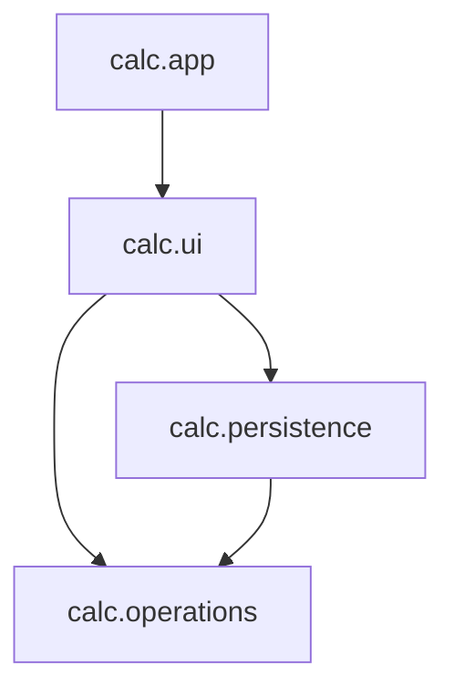

# Java Module System

## Introduction

The Java Module System, also known as Project Jigsaw, was one of the most significant changes introduced in Java 9. Before Java 9, applications were built using JAR files that could access any public class from any other JAR on the classpath. This led to several issues including:

- **JAR hell**: Dependencies between JARs were implicit and could lead to version conflicts
- **Lack of encapsulation**: Any public class was accessible from anywhere
- **Monolithic JDK**: The JDK was a single, massive unit that couldn't be broken down

The Java Module System addresses these concerns by introducing a higher level of aggregation above packages called **modules**. Modules explicitly declare their dependencies and clearly define which packages they expose to other modules, providing stronger encapsulation and more reliable configuration.

## Understanding Modules

A module in Java is a named, self-describing collection of code and data. It consists of:

1. **A unique name**: Used to identify the module
2. **Packages**: Groups of related classes and interfaces
3. **Module descriptor**: A file that defines the module's requirements and exports

### Key Concepts

- **Module path**: Similar to classpath but for modules
- **Module descriptor**: Defined in a file called `module-info.java`
- **Readability**: One module reads another when it depends on it
- **Accessibility**: Types are accessible only when the package is exported and the module is readable

## Creating Your First Module

Let's create a simple module example with two modules: one that provides a service and another that uses it.

### Project Structure

```
my-modular-app/
├── greeting.provider/
│   ├── src/
│   │   ├── main/
│   │   │   ├── java/
│   │   │   │   ├── module-info.java
│   │   │   │   └── com/
│   │   │   │       └── example/
│   │   │   │           └── greeting/
│   │   │   │               └── GreetingProvider.java
│   └── build/
├── greeting.consumer/
│   ├── src/
│   │   ├── main/
│   │   │   ├── java/
│   │   │   │   ├── module-info.java
│   │   │   │   └── com/
│   │   │   │       └── example/
│   │   │   │           └── app/
│   │   │   │               └── GreetingApp.java
│   └── build/
```

### Provider Module

First, let's create the provider module that offers greeting functionality:

**module-info.java**
```java
module greeting.provider {
    exports com.example.greeting;
}
```

**GreetingProvider.java**
```java
package com.example.greeting;

public class GreetingProvider {
    public String getGreeting(String name) {
        return "Hello, " + name + "! Welcome to the Java Module System.";
    }
    
    // This method won't be accessible from outside the module
    // even though the class is in an exported package and the method is public
    public String getInternalGreeting() {
        return "This is an internal greeting";
    }
}
```

### Consumer Module

Now, let's create the consumer module that uses the provider:

**module-info.java**
```java
module greeting.consumer {
    requires greeting.provider;
}
```

**GreetingApp.java**
```java
package com.example.app;

import com.example.greeting.GreetingProvider;

public class GreetingApp {
    public static void main(String[] args) {
        GreetingProvider provider = new GreetingProvider();
        String greeting = provider.getGreeting("Java Developer");
        System.out.println(greeting);
    }
}
```

### Compiling and Running the Modular Application

```bash
# Compile the provider module
javac -d greeting.provider/build greeting.provider/src/main/java/module-info.java greeting.provider/src/main/java/com/example/greeting/GreetingProvider.java

# Compile the consumer module (with provider module in module path)
javac --module-path greeting.provider/build -d greeting.consumer/build greeting.consumer/src/main/java/module-info.java greeting.consumer/src/main/java/com/example/app/GreetingApp.java

# Run the application
java --module-path greeting.provider/build:greeting.consumer/build -m greeting.consumer/com.example.app.GreetingApp
```

**Output**
```
Hello, Java Developer! Welcome to the Java Module System.
```

## Module Descriptor Details

The `module-info.java` file defines a module's characteristics. Here are the most important directives:

### `exports`

Makes packages accessible to other modules:

```java
module my.module {
    exports com.example.api;         // Export to all modules
    exports com.example.internal to  // Export to specific modules only
        another.module,
        yet.another.module;
}
```

### `requires`

Specifies dependencies on other modules:

```java
module my.module {
    requires java.sql;              // Standard dependency
    requires transitive java.xml;   // Re-export this dependency
    requires static java.desktop;   // Compile-time only dependency
}
```

### `opens`

Allows runtime access via reflection:

```java
module my.module {
    opens com.example.model;         // Open to all modules
    opens com.example.config to      // Open to specific modules only
        spring.core,
        hibernate.core;
}
```

### `uses` and `provides`

For service consumption and provision:

```java
module my.module {
    uses com.example.spi.Service;
    provides com.example.spi.Service with
        com.example.impl.ServiceImpl;
}
```

## Module Types

There are several module types you should be familiar with:

1. **Named modules**: Regular modules with module-info.java files
2. **Automatic modules**: Legacy JAR files placed on the module path (named based on JAR filename)
3. **Unnamed module**: Everything on the classpath (can read all modules but not be read by named modules)

## Module Patterns and Best Practices

Here are some common patterns and best practices when working with the Java Module System:

### Aggregator Modules

A module that depends on several other modules and re-exports their APIs:

```java
module com.example.aggregator {
    requires transitive com.example.service;
    requires transitive com.example.repository;
    requires transitive com.example.util;
}
```

### Service-Provider Interface (SPI) Pattern

Using the module system to implement plug-ins:

**Service Interface Module**:
```java
module com.example.spi {
    exports com.example.spi;
}
```

**Service Implementation Module**:
```java
module com.example.impl {
    requires com.example.spi;
    provides com.example.spi.MyService with
        com.example.impl.MyServiceImpl;
}
```

**Service Consumer Module**:
```java
module com.example.consumer {
    requires com.example.spi;
    uses com.example.spi.MyService;
}
```

## Real-World Example: Building a Modular Application

Let's build a more complete example - a simple calculator application with separate modules for:
- Core functionality (operations)
- User interface
- Persistence (saving calculation history)

### Project Structure

```
modular-calculator/
├── calc.operations/
│   ├── module-info.java
│   └── com/example/calc/operations/
│       ├── BasicOperations.java
│       └── AdvancedOperations.java
├── calc.ui/
│   ├── module-info.java
│   └── com/example/calc/ui/
│       └── ConsoleUI.java
├── calc.persistence/
│   ├── module-info.java
│   └── com/example/calc/persistence/
│       └── HistoryManager.java
└── calc.app/
    ├── module-info.java
    └── com/example/calc/app/
        └── CalculatorApp.java
```

### Operation Module

**module-info.java**
```java
module calc.operations {
    exports com.example.calc.operations;
}
```

**BasicOperations.java**
```java
package com.example.calc.operations;

public class BasicOperations {
    public double add(double a, double b) {
        return a + b;
    }
    
    public double subtract(double a, double b) {
        return a - b;
    }
    
    public double multiply(double a, double b) {
        return a * b;
    }
    
    public double divide(double a, double b) {
        if (b == 0) {
            throw new ArithmeticException("Division by zero");
        }
        return a / b;
    }
}
```

**AdvancedOperations.java**
```java
package com.example.calc.operations;

public class AdvancedOperations {
    public double power(double base, double exponent) {
        return Math.pow(base, exponent);
    }
    
    public double sqrt(double value) {
        if (value < 0) {
            throw new IllegalArgumentException("Cannot calculate square root of a negative number");
        }
        return Math.sqrt(value);
    }
}
```

### Persistence Module

**module-info.java**
```java
module calc.persistence {
    exports com.example.calc.persistence;
    requires calc.operations;
}
```

**HistoryManager.java**
```java
package com.example.calc.persistence;

import java.util.ArrayList;
import java.util.List;

public class HistoryManager {
    private List<String> history = new ArrayList<>();
    
    public void addEntry(String operation, double result) {
        history.add(operation + " = " + result);
    }
    
    public List<String> getHistory() {
        return new ArrayList<>(history);
    }
    
    public void clearHistory() {
        history.clear();
    }
}
```

### UI Module

**module-info.java**
```java
module calc.ui {
    exports com.example.calc.ui;
    requires calc.operations;
    requires calc.persistence;
}
```

**ConsoleUI.java**
```java
package com.example.calc.ui;

import com.example.calc.operations.BasicOperations;
import com.example.calc.operations.AdvancedOperations;
import com.example.calc.persistence.HistoryManager;
import java.util.Scanner;

public class ConsoleUI {
    private final BasicOperations basicOps = new BasicOperations();
    private final AdvancedOperations advancedOps = new AdvancedOperations();
    private final HistoryManager historyManager = new HistoryManager();
    private final Scanner scanner = new Scanner(System.in);
    
    public void start() {
        boolean running = true;
        
        System.out.println("Welcome to the Modular Calculator!");
        
        while (running) {
            System.out.println("\nAvailable operations:");
            System.out.println("1. Add");
            System.out.println("2. Subtract");
            System.out.println("3. Multiply");
            System.out.println("4. Divide");
            System.out.println("5. Power");
            System.out.println("6. Square Root");
            System.out.println("7. Show History");
            System.out.println("8. Exit");
            
            System.out.print("\nEnter your choice: ");
            String choice = scanner.nextLine();
            
            switch (choice) {
                case "1":
                    processAddition();
                    break;
                case "2":
                    processSubtraction();
                    break;
                case "7":
                    showHistory();
                    break;
                case "8":
                    running = false;
                    System.out.println("Goodbye!");
                    break;
                default:
                    System.out.println("Invalid option, try again.");
            }
        }
    }
    
    private void processAddition() {
        System.out.print("Enter first number: ");
        double a = Double.parseDouble(scanner.nextLine());
        System.out.print("Enter second number: ");
        double b = Double.parseDouble(scanner.nextLine());
        
        double result = basicOps.add(a, b);
        System.out.println("Result: " + result);
        
        historyManager.addEntry(a + " + " + b, result);
    }
    
    private void processSubtraction() {
        System.out.print("Enter first number: ");
        double a = Double.parseDouble(scanner.nextLine());
        System.out.print("Enter second number: ");
        double b = Double.parseDouble(scanner.nextLine());
        
        double result = basicOps.subtract(a, b);
        System.out.println("Result: " + result);
        
        historyManager.addEntry(a + " - " + b, result);
    }
    
    private void showHistory() {
        System.out.println("\nCalculation History:");
        List<String> history = historyManager.getHistory();
        
        if (history.isEmpty()) {
            System.out.println("No calculations yet.");
        } else {
            for (int i = 0; i < history.size(); i++) {
                System.out.println((i+1) + ". " + history.get(i));
            }
        }
    }
}
```

### Application Module

**module-info.java**
```java
module calc.app {
    requires calc.ui;
}
```

**CalculatorApp.java**
```java
package com.example.calc.app;

import com.example.calc.ui.ConsoleUI;

public class CalculatorApp {
    public static void main(String[] args) {
        ConsoleUI ui = new ConsoleUI();
        ui.start();
    }
}
```

### Module Visualization

Here's a diagram showing the dependencies between our modules:



## Benefits of the Module System

1. **Strong Encapsulation**: Hide implementation details more effectively
2. **Reliable Configuration**: Dependencies are explicit and verified at compile and build time
3. **Scalable Platform**: The JDK itself is modularized, allowing for custom runtime images
4. **Better Performance**: Startup time and memory footprint can be improved
5. **Enhanced Security**: Reduced attack surface by limiting accessible code

## Common Challenges and Solutions

### Migrating Legacy Applications

When migrating existing applications to use modules:

1. Start by turning your application into an automatic module
2. Analyze dependencies and create module descriptors
3. Address access issues incrementally
4. Consider a bottom-up approach (dependencies first)

### Split Packages

When the same package exists in multiple modules:

```
Problem: Package com.example.shared exists in modules module1 and module2
Solution: Merge the packages, rename one, or extract to a common module
```

### Reflection Access

When frameworks need reflective access to your classes:

```java
module my.domain {
    // Open specific packages to allow complete reflection access
    opens com.example.model to hibernate.core;
    
    // Or open the entire module
    // opens com.example.model;
}
```

## jlink: Creating Custom Runtime Images

One major advantage of the module system is the ability to create custom, optimized runtime images with only the modules you need:

```bash
jlink --module-path $JAVA_HOME/jmods:mods --add-modules calc.app --output customimage
```

This creates a custom runtime with only the modules required by your application.

## Summary

The Java Module System is a powerful feature that improves encapsulation, dependency management, and platform scalability in Java applications. Key benefits include:

- **Explicit dependencies** with module descriptors
- **Strong encapsulation** by controlling what's exposed
- **Platform modularization** allowing for smaller, targeted runtimes
- **Service-based design** with the `provides`/`uses` mechanism

While it may require significant effort to modularize existing applications, the long-term benefits in maintainability, security, and performance make it worthwhile for many projects, especially large-scale enterprise applications.

## Additional Resources

- [The Java Module System](https://www.oracle.com/corporate/features/understanding-java-9-modules.html) (Oracle)
- [Project Jigsaw](https://openjdk.org/projects/jigsaw/) (OpenJDK)
- [Java Platform Module System Specification](https://openjdk.org/jeps/261)

## Exercises

1. Create a simple "Hello World" modular application with two modules.
2. Modify the calculator example to add a new module for scientific calculations.
3. Create a service-based application using the `provides`/`uses` mechanism.
4. Build a custom runtime image for the calculator application using `jlink`.
5. Take an existing JAR application and try to modularize it step-by-step.