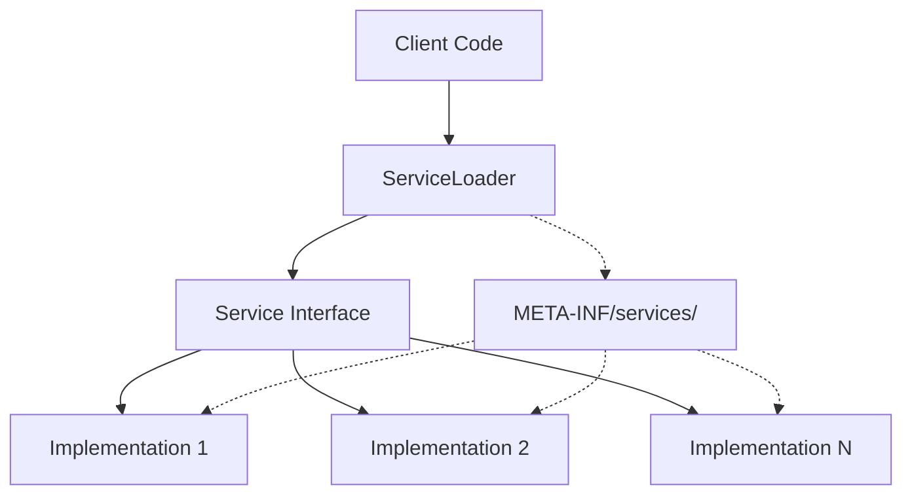

# Java ServiceLoader

## Introduction

Java's ServiceLoader is a powerful yet often overlooked feature that was introduced in Java 6 as part of the Java Service Provider Interface (SPI). It provides a simple and standard way to discover and load service provider implementations at runtime. 

ServiceLoader enables you to build extensible applications where components can be "plugged in" without modifying the core application code. This mechanism is widely used in Java SE and Java EE platforms for everything from database drivers to XML parsers.

In this tutorial, we'll explore:
- What ServiceLoader is and why it's useful
- How to define, implement, and consume services
- Real-world applications and best practices

## What is ServiceLoader?

ServiceLoader is a facility to load service provider implementations based on a service interface. It follows Java's "separation of concerns" principle by allowing:

1. **Decoupling of interfaces from implementations**
2. **Dynamic discovery of implementations** at runtime
3. **Extension of applications** without modifying existing code

This creates a plug-in architecture where your application can discover and utilize new functionality without recompiling the core codebase.

## How ServiceLoader Works



The ServiceLoader mechanism works through these key components:

1. **Service Interface**: Defines the contract for service implementations
2. **Service Providers**: Classes that implement the service interface
3. **Provider Configuration File**: A text file in `META-INF/services/` that lists implementations
4. **ServiceLoader**: API that loads and instantiates the service providers

## Step-by-Step Guide to Using ServiceLoader

### Step 1: Define the Service Interface

First, create an interface that defines the operations your service will provide:

```java
package com.example.services;

public interface MessageService {
    String getMessage();
}
```

### Step 2: Create Service Implementations

Next, create one or more implementations of your service interface:

```java
package com.example.services.impl;

import com.example.services.MessageService;

public class EnglishMessageService implements MessageService {
    @Override
    public String getMessage() {
        return "Hello, World!";
    }
}
```

```java
package com.example.services.impl;

import com.example.services.MessageService;

public class SpanishMessageService implements MessageService {
    @Override
    public String getMessage() {
        return "¡Hola, Mundo!";
    }
}
```

### Step 3: Create Provider Configuration File

Create a file named exactly after the fully qualified name of your service interface in the `META-INF/services/` directory. For our example, create:

`META-INF/services/com.example.services.MessageService`

The file should contain the fully qualified class names of your implementations, one per line:

```
com.example.services.impl.EnglishMessageService
com.example.services.impl.SpanishMessageService
```

### Step 4: Load Service Implementations

Now, you can use `ServiceLoader` to discover and load all available implementations:

```java
import java.util.ServiceLoader;
import com.example.services.MessageService;

public class ServiceDemo {
    public static void main(String[] args) {
        ServiceLoader<MessageService> serviceLoader = ServiceLoader.load(MessageService.class);
        
        // Iterate through available services
        for (MessageService service : serviceLoader) {
            System.out.println(service.getMessage());
        }
    }
}
```

**Output:**
```
Hello, World!
¡Hola, Mundo!
```

## Key Features of ServiceLoader

### Lazy Loading

ServiceLoader loads service providers lazily, meaning implementations are only instantiated when needed during iteration. This improves performance, especially with many service providers.

### Provider Instantiation

By default, ServiceLoader creates instances using the zero-argument constructor of each implementation class. The implementations must have a public no-arg constructor to work properly.

### Iteration and Reuse

You can iterate through a ServiceLoader multiple times. Each iteration will attempt to locate and instantiate providers that weren't loaded in previous iterations.

```java
ServiceLoader<MessageService> serviceLoader = ServiceLoader.load(MessageService.class);

// First iteration
System.out.println("First iteration:");
for (MessageService service : serviceLoader) {
    System.out.println(service.getMessage());
}

// Second iteration - same instances
System.out.println("\nSecond iteration:");
for (MessageService service : serviceLoader) {
    System.out.println(service.getMessage());
}
```

### Reloading Services

If you need to discover newly added implementations, you can use the `reload()` method:

```java
serviceLoader.reload(); // Clears cache and reloads providers
```

## Advanced Usage and Best Practices

### Using Module System (Java 9+)

With the Java module system introduced in Java 9, you can use `provides` and `uses` directives in your module-info.java file:

```java
// Service provider module
module com.example.services.impl {
    requires com.example.services;
    provides com.example.services.MessageService with
        com.example.services.impl.EnglishMessageService,
        com.example.services.impl.SpanishMessageService;
}

// Service consumer module
module com.example.app {
    requires com.example.services;
    uses com.example.services.MessageService;
}
```

This replaces the need for META-INF/services files in a modular application.

### Finding a Specific Provider

If you need a specific implementation, you can filter the ServiceLoader:

```java
ServiceLoader<MessageService> serviceLoader = ServiceLoader.load(MessageService.class);
MessageService spanishService = serviceLoader.stream()
    .map(ServiceLoader.Provider::get)
    .filter(service -> service instanceof SpanishMessageService)
    .findFirst()
    .orElseThrow(() -> new RuntimeException("Spanish service not found"));

System.out.println(spanishService.getMessage()); // ¡Hola, Mundo!
```

### Thread Safety

ServiceLoader is not thread-safe for iteration, so ensure proper synchronization when used across multiple threads.

## Real-World Application: Plugin System

Let's create a simple text processing application with plugins that can be extended without modifying the core code.

### 1. Define the plugin interface

```java
package com.example.textapp;

public interface TextProcessor {
    String getName();
    String process(String text);
}
```

### 2. Create implementations

```java
package com.example.textapp.processors;

import com.example.textapp.TextProcessor;

public class UpperCaseProcessor implements TextProcessor {
    @Override
    public String getName() {
        return "uppercase";
    }
    
    @Override
    public String process(String text) {
        return text.toUpperCase();
    }
}
```

```java
package com.example.textapp.processors;

import com.example.textapp.TextProcessor;

public class ReverseProcessor implements TextProcessor {
    @Override
    public String getName() {
        return "reverse";
    }
    
    @Override
    public String process(String text) {
        return new StringBuilder(text).reverse().toString();
    }
}
```

### 3. Create provider configuration

`META-INF/services/com.example.textapp.TextProcessor`:
```
com.example.textapp.processors.UpperCaseProcessor
com.example.textapp.processors.ReverseProcessor
```

### 4. Build the application

```java
package com.example.textapp;

import java.util.HashMap;
import java.util.Map;
import java.util.Scanner;
import java.util.ServiceLoader;

public class TextProcessingApp {
    private final Map<String, TextProcessor> processors = new HashMap<>();
    
    public TextProcessingApp() {
        // Load all available processors
        ServiceLoader<TextProcessor> serviceLoader = ServiceLoader.load(TextProcessor.class);
        for (TextProcessor processor : serviceLoader) {
            processors.put(processor.getName(), processor);
        }
    }
    
    public void start() {
        Scanner scanner = new Scanner(System.in);
        
        while (true) {
            System.out.println("\nAvailable processors: " + String.join(", ", processors.keySet()));
            System.out.println("Enter text to process (or 'exit' to quit):");
            String text = scanner.nextLine();
            
            if ("exit".equalsIgnoreCase(text)) {
                break;
            }
            
            System.out.println("Enter processor name:");
            String processorName = scanner.nextLine();
            
            TextProcessor processor = processors.get(processorName);
            if (processor != null) {
                String result = processor.process(text);
                System.out.println("Result: " + result);
            } else {
                System.out.println("Unknown processor: " + processorName);
            }
        }
        
        scanner.close();
    }
    
    public static void main(String[] args) {
        new TextProcessingApp().start();
    }
}
```

**Sample interaction:**
```
Available processors: uppercase, reverse
Enter text to process (or 'exit' to quit):
Hello world
Enter processor name:
uppercase
Result: HELLO WORLD

Available processors: uppercase, reverse
Enter text to process (or 'exit' to quit):
Hello world
Enter processor name:
reverse
Result: dlrow olleH

Available processors: uppercase, reverse
Enter text to process (or 'exit' to quit):
exit
```

The beauty of this approach is that you can add new text processors without modifying the application. Simply create a new implementation of the `TextProcessor` interface, add it to the provider configuration file, and it will be automatically discovered and loaded by the application.

## Common Use Cases for ServiceLoader

1. **Plugin systems** - Extend application functionality without code changes
2. **Driver registration** - JDBC drivers use SPI to register themselves
3. **Implementation selection** - Choose the best implementation at runtime
4. **Configuration providers** - Load different configurations based on environment
5. **Modular applications** - Clean separation between components

## Summary

Java's ServiceLoader is a powerful mechanism for creating extensible applications with loose coupling between interfaces and implementations. It enables:

- Dynamic discovery and loading of service providers
- Plug-in architecture without hardcoded dependencies
- Separation of API from implementation details
- Extension of applications without modifying core code

By using ServiceLoader effectively, you can build more modular, maintainable, and extensible Java applications.

## Additional Resources

- [Java ServiceLoader Documentation](https://docs.oracle.com/en/java/javase/17/docs/api/java.base/java/util/ServiceLoader.html)
- [Java Service Provider Interface (SPI) Tutorial](https://www.baeldung.com/java-spi)
- [JEP 261: Module System - Service and Service Providers](https://openjdk.org/jeps/261)

## Exercises

1. Create a simple calculator application where operations (+, -, *, /) are provided by service implementations.
2. Implement a logging framework where different log targets (console, file, database) are loaded via ServiceLoader.
3. Extend the text processing application above to add a new processor that counts words.
4. Create a file converter system where different file formats can be converted by dynamically discovered converters.
5. Implement a validation framework where validation rules are provided by service implementations.