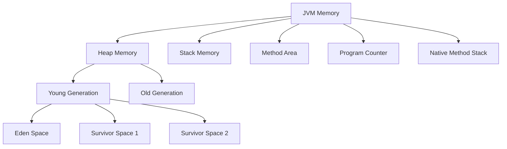

# Java Memory Management

Memory management is a critical aspect of Java programming that often goes unnoticed by beginners. Understanding how Java handles memory allocation and deallocation can help you write more efficient applications and avoid common pitfalls like memory leaks and performance bottlenecks.

## Introduction to Java Memory Management

Unlike languages like C or C++, Java manages memory automatically through its **Java Virtual Machine (JVM)**. This automatic memory management is one of Java's most significant advantages, as it frees developers from explicitly allocating and deallocating memory.

The JVM divides memory into different areas:



Let's explore each of these areas and understand their role in Java memory management.

## Stack Memory vs Heap Memory

### Stack Memory

The **stack** stores:
- Method calls
- Local variables
- Partial results
- Return addresses

Each thread in Java has its own stack memory that operates in a Last-In-First-Out (LIFO) manner.

```java
public void calculateSum() {
    int a = 10; // stored in stack
    int b = 20; // stored in stack
    int sum = a + b; // calculation and result stored in stack
    
    System.out.println("Sum: " + sum);
} // when method execution completes, all these variables are popped off the stack
```

Key characteristics of stack memory:
- Very fast access
- Local variables only exist during method execution
- Memory allocation and deallocation are automatically done
- Typically much smaller than heap memory
- A stack overflow occurs if too much stack space is used (e.g., infinite recursion)

### Heap Memory

The **heap** is where all objects and their instance variables are stored:

```java
public void createObjects() {
    // The reference variable 'person' is stored on the stack
    // The actual Person object is stored on the heap
    Person person = new Person("John", 30);
    
    // The reference 'numbers' is on stack
    // The actual array object is on heap
    int[] numbers = new int[1000];
}
```

Key characteristics of heap memory:
- Shared among all threads
- Much larger than stack memory
- Garbage collected when objects are no longer referenced
- Slower access compared to stack memory
- Can lead to memory leaks if objects remain referenced but unused

## Understanding Object Lifecycle

When you create an object in Java:

1. Memory is allocated on the heap
2. Object fields are initialized to default values
3. Constructors are executed
4. A reference to the object is returned

Let's see a complete example:

```java
public class MemoryExample {
    public static void main(String[] args) {
        // 1. Method execution begins - main method frame created on stack
        
        // 2. Local primitive variable created on stack
        int localVar = 42;
        
        // 3. Object creation - memory allocated on heap
        // 'student' reference variable stored on stack
        Student student = new Student("Alice", 20);
        
        // 4. Method call - new frame created on stack
        student.study();
        
        // 5. Method completes - stack frame removed
    } // main method ends, stack frame popped
}

class Student {
    // Instance variables stored on heap with the object
    private String name;
    private int age;
    
    public Student(String name, int age) {
        this.name = name;
        this.age = age;
    }
    
    public void study() {
        // Method frame created on stack when called
        System.out.println(name + " is studying");
        // Frame removed when method completes
    }
}
```

## Garbage Collection in Java

Garbage Collection (GC) is the process of automatically freeing memory by deleting objects that are no longer reachable. This happens when there are no more references pointing to an object.

### How Garbage Collection Works

1. **Mark**: The GC identifies which objects are still in use (referenced)
2. **Sweep**: Unreferenced objects are removed
3. **Compact**: Remaining objects may be moved to make memory contiguous (depending on the GC algorithm)

Let's see an example of objects becoming eligible for garbage collection:

```java
public class GarbageCollectionDemo {
    public static void main(String[] args) {
        // Create objects
        Person person1 = new Person("Alice");
        Person person2 = new Person("Bob");
        
        // At this point, both person1 and person2 point to objects on the heap
        System.out.println(person1.getName()); // Output: Alice
        System.out.println(person2.getName()); // Output: Bob
        
        // Reassign person1 to point to a new object
        person1 = new Person("Charlie");
        
        // The original "Alice" Person object is now unreachable
        // and becomes eligible for garbage collection
        System.out.println(person1.getName()); // Output: Charlie
        
        // Set person2 to null, making the "Bob" object eligible for GC
        person2 = null;
        
        // Suggest (but don't guarantee) garbage collection
        System.gc();
    }
}

class Person {
    private String name;
    
    public Person(String name) {
        this.name = name;
        System.out.println("Person created: " + name);
    }
    
    public String getName() {
        return name;
    }
    
    // This method is called by the Garbage Collector before removing the object
    @Override
    protected void finalize() throws Throwable {
        System.out.println("Person being garbage collected: " + name);
        super.finalize();
    }
}
```

Output (may vary due to non-deterministic nature of GC):
```
Person created: Alice
Person created: Bob
Alice
Bob
Person created: Charlie
Charlie
Person being garbage collected: Alice
Person being garbage collected: Bob
```

> **Note**: The `finalize()` method is deprecated in newer Java versions and should not be relied upon. It's shown here only for demonstration purposes.

### Different Garbage Collectors

Java offers several garbage collectors, each optimized for different scenarios:

1. **Serial GC**: Simple, single-threaded collector
2. **Parallel GC**: Uses multiple threads for collection
3. **CMS (Concurrent Mark Sweep)**: Minimizes application pause times
4. **G1 (Garbage First)**: Designed for larger heaps with predictable pause times
5. **ZGC**: Designed for very low latency with large heaps (Java 11+)

You can specify which collector to use via JVM parameters:

```
java -XX:+UseParallelGC MyApplication
```

## Memory Leaks in Java

Despite having automatic garbage collection, Java applications can still suffer from memory leaks. These occur when objects remain referenced even though they're no longer needed, preventing them from being garbage collected.

Common causes of memory leaks:

1. **Unclosed resources**: Forgetting to close connections, streams, etc.
2. **Static references**: Objects referenced by static fields remain in memory for the application's lifetime
3. **Improper caching**: Adding objects to a cache but never removing them
4. **Incorrect implementations of long-lived objects**: Like event listeners that aren't properly unregistered

### Example of a Memory Leak:

```java
public class MemoryLeakExample {
    // Static collection that will hold references forever
    private static final List<Object> leakyList = new ArrayList<>();
    
    public void addToList() {
        // This keeps adding objects, but never removes them
        for (int i = 0; i < 1000; i++) {
            leakyList.add(new byte[1024 * 1024]); // Adding 1MB objects
        }
    }
    
    public static void main(String[] args) {
        MemoryLeakExample example = new MemoryLeakExample();
        
        try {
            example.addToList();
        } catch (OutOfMemoryError e) {
            System.out.println("Out of memory error occurred!");
            e.printStackTrace();
        }
    }
}
```

This program will eventually throw an `OutOfMemoryError` because it keeps adding large objects to a static list that never gets cleared.

### Correcting the Memory Leak:

```java
public class FixedMemoryExample {
    public void processData() {
        // Using a local collection that will be garbage collected
        // when the method completes
        List<Object> temporaryList = new ArrayList<>();
        
        for (int i = 0; i < 1000; i++) {
            byte[] data = new byte[1024 * 1024]; // 1MB object
            temporaryList.add(data);
            
            // Process the data...
            
            // Clear references when done
            temporaryList.clear();
        }
        // temporaryList will be eligible for GC when method returns
    }
    
    public static void main(String[] args) {
        FixedMemoryExample example = new FixedMemoryExample();
        example.processData();
    }
}
```

## Best Practices for Memory Management

1. **Close resources properly**: Always close streams, connections, and other resources with `try-with-resources` or in a `finally` block.

```java
// Good practice: Using try-with-resources
public void readFile(String path) {
    try (BufferedReader reader = new BufferedReader(new FileReader(path))) {
        String line;
        while ((line = reader.readLine()) != null) {
            // Process the line
        }
        // BufferedReader automatically closed
    } catch (IOException e) {
        e.printStackTrace();
    }
}
```

2. **Avoid creating unnecessary objects**: Reuse objects when possible.

```java
// Not efficient - creates many temporary String objects
String result = "";
for (int i = 0; i < 1000; i++) {
    result += i;  // Creates a new String each time
}

// More efficient - uses StringBuilder
StringBuilder builder = new StringBuilder();
for (int i = 0; i < 1000; i++) {
    builder.append(i);  // Modifies the same object
}
String result = builder.toString();  // Only one new String created
```

3. **Use appropriate collections**: Choose the right collection for your needs.

```java
// If you need fast lookups, use a HashSet instead of repeatedly searching a List
Set<String> uniqueNames = new HashSet<>();  // O(1) lookups
// Not: List<String> names = new ArrayList<>();  // O(n) lookups
```

4. **Nullify references**: Set object references to null when you're done with them.

```java
public void processLargeData() {
    byte[] largeArray = new byte[100 * 1024 * 1024]; // 100MB
    
    // Use the array
    processArray(largeArray);
    
    // Set to null so it can be garbage collected
    // earlier, if this method has more code following
    largeArray = null;
    
    // More processing...
}
```

5. **Avoid memory-intensive operations in loops**: Be cautious with memory usage in loops.

```java
// Potential issue: Creating many large objects in a loop
for (int i = 0; i < 1000; i++) {
    byte[] largeArray = new byte[10 * 1024 * 1024]; // 10MB each iteration
    processArray(largeArray);
}

// Better approach: Reuse the same array
byte[] largeArray = new byte[10 * 1024 * 1024];
for (int i = 0; i < 1000; i++) {
    // Reset array if needed
    processArray(largeArray);
}
```

## Monitoring Java Memory

Java provides several tools to monitor memory usage:

1. **JVisualVM**: A visual tool to monitor JVM
2. **jstat**: Command-line tool for monitoring JVM statistics
3. **jmap**: Tool for creating heap dumps
4. **Java Mission Control**: Comprehensive monitoring tool

### Using Runtime to Check Memory:

```java
public class MemoryMonitoring {
    public static void main(String[] args) {
        // Get the Java runtime
        Runtime runtime = Runtime.getRuntime();
        
        // Run the garbage collector
        runtime.gc();
        
        // Calculate the used memory
        long memory = runtime.totalMemory() - runtime.freeMemory();
        System.out.println("Used memory: " + 
                           memory / (1024L * 1024L) + " MB");
        
        // Print maximum available memory
        System.out.println("Maximum memory: " + 
                           runtime.maxMemory() / (1024L * 1024L) + " MB");
    }
}
```

Output (sample):
```
Used memory: 4 MB
Maximum memory: 4096 MB
```

## Tuning JVM Memory Settings

You can customize JVM memory settings using various flags:

```
java -Xms512m -Xmx1024m MyApplication
```

- `-Xms`: Initial heap size
- `-Xmx`: Maximum heap size
- `-XX:NewSize`: Young generation size
- `-XX:MaxNewSize`: Maximum young generation size
- `-XX:MaxPermSize`: (Older JVMs) Maximum permanent generation size
- `-XX:MaxMetaspaceSize`: (Java 8+) Maximum metaspace size

## Summary

Java's memory management system is one of its greatest strengths, automating the complex task of memory allocation and deallocation through garbage collection. Understanding how Java manages memory helps you write more efficient applications and avoid common issues like memory leaks.

Key takeaways:
- Java divides memory into stack and heap
- Stack stores method calls and local variables
- Heap stores objects and instance variables
- Garbage collection automatically reclaims unreferenced objects
- Despite automatic GC, memory leaks can still occur
- Following best practices helps avoid memory-related issues

## Additional Resources

1. [Oracle Java Memory Management White Paper](https://www.oracle.com/technetwork/java/javase/memorymanagement-whitepaper-150215.pdf)
2. [Java Garbage Collection Handbook](https://plumbr.io/handbook/garbage-collection-handbook)
3. [JVM Internals](https://blog.jamesdbloom.com/JVMInternals.html)

## Exercises

1. Write a program that creates and collects 1 million small objects to see garbage collection in action.
2. Implement a memory leak scenario, then use a profiler to identify and fix it.
3. Compare the memory usage of different Java collections (ArrayList, LinkedList, HashSet) when storing the same data.
4. Create a program that uses different string concatenation methods (String +, StringBuilder, StringBuffer) and compare their memory efficiency.
5. Write a program that demonstrates how object references in different scopes affect garbage collection.