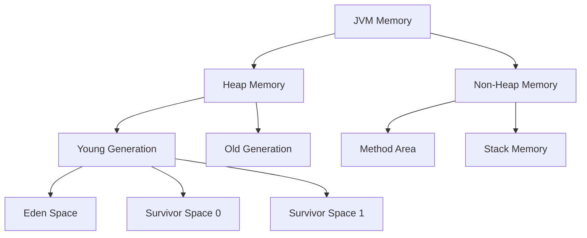
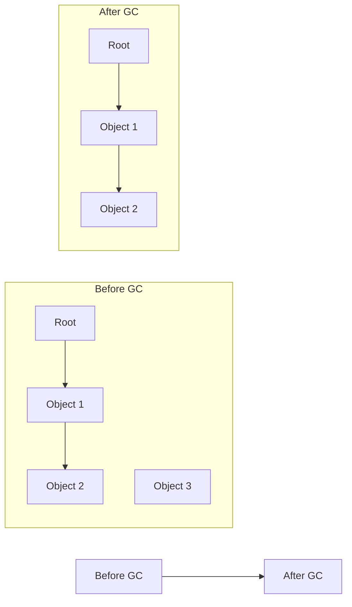
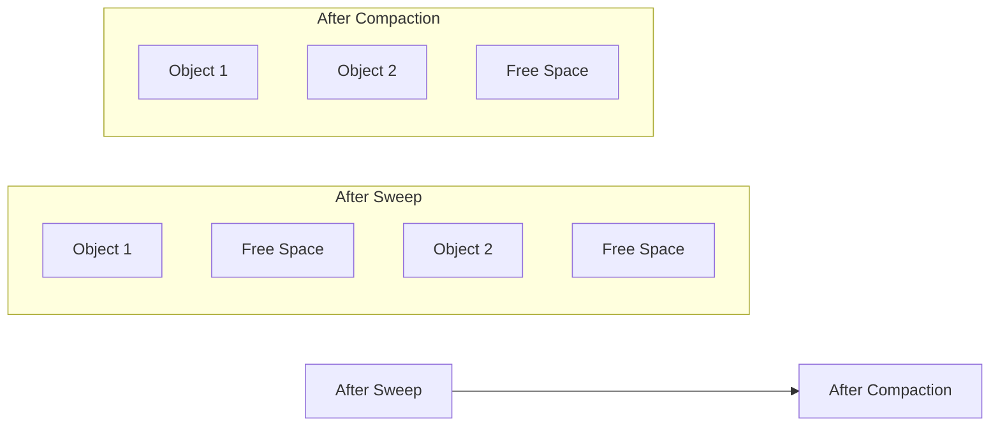

# Java Garbage Collection

Have you ever wondered how Java manages memory automatically? Unlike languages like C and C++ where you need to manually allocate and free memory, Java handles this for you through a process called **Garbage Collection**. This powerful feature helps prevent memory leaks and makes programming easier, but understanding how it works can help you write more efficient code.

## What is Garbage Collection?

Garbage Collection (GC) is the process by which Java automatically reclaims memory occupied by objects that are no longer in use or referenced by your program. It's one of Java's most important features, allowing developers to focus on writing application logic rather than memory management.

The basic principle is simple:
1. Java allocates memory for objects when they're created
2. The Garbage Collector identifies objects that are no longer needed
3. It reclaims the memory used by these unused objects

## How Java Memory is Organized

To understand garbage collection, you first need to know how Java organizes memory:



- **Heap Memory**: Where all objects are allocated
  - **Young Generation**: New objects start here
    - **Eden Space**: Initial allocation area
    - **Survivor Spaces (S0, S1)**: Objects that survive garbage collection in Eden
  - **Old Generation**: Long-lived objects that survived multiple collections

- **Non-Heap Memory**: 
  - **Method Area**: Stores class structures, methods, and constants
  - **Stack**: Stores local variables and method calls

## How Garbage Collection Works

### Step 1: Mark Phase

The Garbage Collector identifies which objects are still in use (reachable) by traversing all object references starting from "GC roots":

```java
// This object can be referenced through the variable 'person'
Person person = new Person("John");

// After this line executes, there's no way to access the Person object
person = null;
```

After setting `person` to null, the Person object becomes unreachable and eligible for garbage collection.

### Step 2: Sweep Phase

The GC reclaims memory from objects that are no longer reachable:



In this example, Object 3 is unreachable and gets removed during garbage collection.

### Step 3: Compact Phase (optional)

Some garbage collectors also reorganize memory to reduce fragmentation:



## Types of Garbage Collectors in Java

Java offers several garbage collection algorithms:

1. **Serial GC**: Simple, single-threaded collector
2. **Parallel GC**: Default until Java 8, uses multiple threads for collection
3. **CMS (Concurrent Mark Sweep)**: Minimizes pause times
4. **G1 (Garbage-First)**: Default since Java 9, balances throughput and pause time
5. **ZGC**: Low-latency collector for large heaps (Java 11+)
6. **Shenandoah**: Low-pause collector similar to ZGC (Java 12+)

You can select a collector using Java startup parameters:

```bash
# Use G1 Collector (default in newer Java versions)
java -XX:+UseG1GC MyApplication

# Use Serial Collector
java -XX:+UseSerialGC MyApplication
```

## Memory Leaks in Java

Even with garbage collection, memory leaks can still occur when you maintain unnecessary references to objects:

```java
public class MemoryLeakExample {
    // This static list will keep growing and objects won't be garbage collected
    private static final List<Object> leakyList = new ArrayList<>();
    
    public void addToList() {
        // These objects can't be garbage collected as long as they're in the list
        for (int i = 0; i < 1000; i++) {
            leakyList.add(new Object());
        }
    }
}
```

Common causes of memory leaks in Java:
- Static collections that grow unbounded
- Unclosed resources (streams, connections)
- Incorrect implementation of caching mechanisms
- Inner class references

## Influencing Garbage Collection

While Java handles garbage collection automatically, you can help the process:

### 1. Explicitly set references to null

```java
public void processLargeData() {
    byte[] largeArray = new byte[100_000_000]; // ~100MB
    // Process data...
    
    largeArray = null; // Help the GC by nullifying the reference
}
```

### 2. Use try-with-resources for auto-closeable resources

```java
// Resources will be automatically closed and eligible for GC
try (FileInputStream fis = new FileInputStream("file.txt")) {
    // Use the file input stream
} catch (IOException e) {
    e.printStackTrace();
}
```

### 3. Use WeakHashMap for caching

```java
// Entries will be removed when keys are no longer referenced elsewhere
Map<Key, Value> cache = new WeakHashMap<>();
```

### 4. Use tools to detect memory issues

```java
// Add these parameters when running your application
// java -XX:+HeapDumpOnOutOfMemoryError -XX:HeapDumpPath=/path/to/dump.hprof YourApplication
```

## Monitoring Garbage Collection

You can monitor GC activity using various JVM options:

```bash
# Print GC details
java -XX:+PrintGCDetails -XX:+PrintGCTimeStamps YourApplication
```

Sample output:
```
[0.631: [GC (Allocation Failure) [PSYoungGen: 33280K->5088K(38400K)] 33280K->24360K(125952K), 0.0072080 secs]
[0.687: [GC (Allocation Failure) [PSYoungGen: 38368K->5120K(71680K)] 57640K->46240K(159232K), 0.0156067 secs]
```

You can also use tools like:
- Java VisualVM
- JConsole
- Java Mission Control
- VisualGC plugin

## Practical Example: Optimizing a Cache

Let's see how understanding garbage collection helps in real-world scenarios:

```java
import java.lang.ref.SoftReference;
import java.util.HashMap;
import java.util.Map;

public class SmartCache<K, V> {
    private final Map<K, SoftReference<V>> cache = new HashMap<>();
    
    public V get(K key) {
        SoftReference<V> reference = cache.get(key);
        if (reference != null) {
            V value = reference.get();
            if (value != null) {
                return value;
            } else {
                // Value was garbage collected
                cache.remove(key);
            }
        }
        return null;
    }
    
    public void put(K key, V value) {
        cache.put(key, new SoftReference<>(value));
    }
    
    public static void main(String[] args) {
        SmartCache<String, byte[]> imageCache = new SmartCache<>();
        
        // Cache some large images
        imageCache.put("pic1.jpg", new byte[1024 * 1024]); // 1MB
        imageCache.put("pic2.jpg", new byte[1024 * 1024]); // 1MB
        
        // When memory gets low, GC may reclaim these objects
        // even though they're still referenced in our map
        System.out.println("Image 1 in cache: " + (imageCache.get("pic1.jpg") != null));
        
        // Try to allocate a lot of memory
        try {
            byte[][] memory = new byte[1000][];
            for (int i = 0; i < 1000; i++) {
                memory[i] = new byte[1024 * 1024]; // 1MB each
                System.out.println("Allocated " + (i + 1) + "MB");
            }
        } catch (OutOfMemoryError e) {
            System.out.println("Out of memory!");
        }
        
        // The cache entries might be gone now
        System.out.println("Image 1 in cache: " + (imageCache.get("pic1.jpg") != null));
    }
}
```

This example uses `SoftReference` which the garbage collector can collect when memory is tight, making it perfect for caches.

## Common Garbage Collection Tuning Parameters

Here are some common parameters to tune garbage collection:

```bash
# Set heap size
java -Xms1g -Xmx2g YourApplication

# Set young generation size
java -XX:NewSize=256m -XX:MaxNewSize=256m YourApplication

# Set the ratio of eden/survivor spaces
java -XX:SurvivorRatio=8 YourApplication

# Set the tenuring threshold (how many GC cycles before promotion)
java -XX:MaxTenuringThreshold=15 YourApplication
```

## Summary

Java's Garbage Collection is a powerful automated memory management system that:

- Automatically reclaims memory from objects that are no longer in use
- Works through mark, sweep, and (optionally) compact phases
- Uses different algorithms optimized for various performance needs
- Can be monitored and tuned for better performance

Understanding how garbage collection works helps you write more efficient Java applications by:
- Avoiding memory leaks
- Properly managing resources
- Making informed decisions about object lifecycles
- Tuning your application for specific performance requirements

## Additional Resources

1. [Oracle's Java Garbage Collection Tuning Guide](https://docs.oracle.com/en/java/javase/11/gctuning/index.html)
2. [Java Memory Management Whitepaper](https://www.oracle.com/technetwork/java/javase/memorymanagement-whitepaper-150215.pdf)
3. [VisualVM](https://visualvm.github.io/) - A tool for monitoring Java applications

## Exercises

1. Write a program that creates 1 million objects and observe the GC logs.
2. Experiment with different GC algorithms and compare their performance.
3. Implement a cache using WeakReferences and compare it with the SoftReference version above.
4. Profile a simple application using VisualVM to observe memory usage patterns.
5. Find and fix a deliberate memory leak in a sample application.