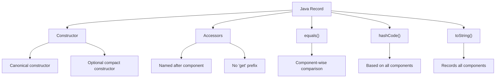

# Java Records

## Introduction

Java Records, introduced as a preview feature in Java 14 and fully standardized in Java 16, provide a concise way to declare classes that act primarily as data carriers. They are designed to reduce boilerplate code and enhance clarity in your codebase.

Before records, creating a simple data class in Java required extensive boilerplate code including constructors, getters, `equals()`, `hashCode()`, and `toString()` methods. With records, Java automatically generates these standard methods, allowing you to focus on the actual data structure.

## Understanding Java Records

A Java record is a special kind of class declaration that is designed for classes whose primary purpose is to store data immutably. Let's explore the basics of records and how they differ from traditional classes.

### Basic Syntax

```java
record Person(String name, int age) {}
```

This simple declaration automatically provides:

1. Constructor taking both fields
2. Accessor methods (getters) for each field 
3. `equals()` and `hashCode()` methods based on all fields
4. A descriptive `toString()` method
5. Immutability for each field

### Comparing Traditional Class vs Record

Let's see the difference between a traditional class and a record:

**Traditional Class:**

```java
public class Person {
    private final String name;
    private final int age;
    
    public Person(String name, int age) {
        this.name = name;
        this.age = age;
    }
    
    public String getName() {
        return name;
    }
    
    public int getAge() {
        return age;
    }
    
    @Override
    public boolean equals(Object o) {
        if (this == o) return true;
        if (o == null || getClass() != o.getClass()) return false;
        Person person = (Person) o;
        return age == person.age && Objects.equals(name, person.name);
    }
    
    @Override
    public int hashCode() {
        return Objects.hash(name, age);
    }
    
    @Override
    public String toString() {
        return "Person{" +
                "name='" + name + '\'' +
                ", age=" + age +
                '}';
    }
}
```

**Record Equivalent:**

```java
record Person(String name, int age) {}
```

The record declaration is significantly more concise while providing the same functionality!

## Key Features of Java Records

### 1. Immutability

Records are immutable by design. All fields are implicitly `final`, which makes records ideal for:
- Value objects
- Data transfer objects (DTOs)
- API responses
- Multi-threaded applications

```java
record Point(int x, int y) {}

// Usage
Point p = new Point(10, 20);
// p.x = 30; // Compilation error! Fields are final
```

### 2. Compact Constructor

While records automatically generate a canonical constructor, you can also define a compact constructor for validation or normalization:

```java
record Student(String name, int age) {
    // Compact constructor for validation
    public Student {
        if (age < 0) {
            throw new IllegalArgumentException("Age cannot be negative");
        }
        if (name == null || name.trim().isEmpty()) {
            throw new IllegalArgumentException("Name cannot be empty");
        }
        name = name.trim(); // Normalizing the name
    }
}
```

Let's see it in action:

```java
// Valid student
Student student1 = new Student("Alice", 20);
System.out.println(student1); // Output: Student[name=Alice, age=20]

try {
    // Invalid age
    Student student2 = new Student("Bob", -5);
} catch (IllegalArgumentException e) {
    System.out.println(e.getMessage()); // Output: Age cannot be negative
}

// Name will be trimmed
Student student3 = new Student("  Charlie  ", 22);
System.out.println(student3); // Output: Student[name=Charlie, age=22]
```

### 3. Custom Methods

Records can have custom methods just like regular classes:

```java
record Rectangle(double length, double width) {
    public double area() {
        return length * width;
    }
    
    public double perimeter() {
        return 2 * (length + width);
    }
    
    public boolean isSquare() {
        return length == width;
    }
}
```

Usage:

```java
Rectangle rect = new Rectangle(5.0, 3.0);
System.out.println("Area: " + rect.area()); // Output: Area: 15.0
System.out.println("Perimeter: " + rect.perimeter()); // Output: Perimeter: 16.0
System.out.println("Is square? " + rect.isSquare()); // Output: Is square? false
```

### 4. Static Fields and Methods

Records can have static fields and methods:

```java
record Currency(String code, String name) {
    public static final Currency USD = new Currency("USD", "US Dollar");
    public static final Currency EUR = new Currency("EUR", "Euro");
    
    public static Currency fromCode(String code) {
        return switch (code.toUpperCase()) {
            case "USD" -> USD;
            case "EUR" -> EUR;
            default -> throw new IllegalArgumentException("Unknown currency code: " + code);
        };
    }
}
```

### 5. Implementing Interfaces

Records can implement interfaces:

```java
interface Printable {
    void print();
}

record Message(String content, String sender) implements Printable {
    @Override
    public void print() {
        System.out.println("From: " + sender);
        System.out.println("Message: " + content);
    }
}
```

Example:

```java
Message message = new Message("Hello World", "John");
message.print();
// Output:
// From: John
// Message: Hello World
```

## Understanding the Generated Methods

Java records automatically generate several methods:



### Record Components vs Fields

It's important to understand the distinction between record components and fields:

1. **Components** are the parameters in the record header: `record Person(String name, int age) {}`
2. **Fields** are the private final fields generated from these components

Accessor methods are named after components, not using the traditional "get" prefix:

```java
record Person(String name, int age) {}

// Usage
Person person = new Person("Alice", 25);
String name = person.name(); // Not getName()
int age = person.age(); // Not getAge()
```

## Practical Examples

### Example 1: Data Transfer Object (DTO)

Records are perfect for DTOs in REST APIs:

```java
// API response record
record UserResponse(
    long id,
    String username,
    String email,
    List<String> roles,
    LocalDateTime createdAt
) {}

// Usage in a REST controller
@GetMapping("/users/{id}")
public ResponseEntity<UserResponse> getUser(@PathVariable long id) {
    // Fetch user from database
    User user = userService.findById(id);
    
    // Convert to DTO
    UserResponse response = new UserResponse(
        user.getId(),
        user.getUsername(),
        user.getEmail(),
        user.getRoles().stream().map(Role::getName).collect(Collectors.toList()),
        user.getCreatedAt()
    );
    
    return ResponseEntity.ok(response);
}
```

### Example 2: Complex Domain Object

Records can model more complex domain objects with validation:

```java
record Order(
    String orderId,
    Customer customer,
    List<OrderItem> items,
    LocalDateTime orderDate,
    OrderStatus status
) {
    // Compact constructor for validation
    public Order {
        Objects.requireNonNull(orderId, "Order ID cannot be null");
        Objects.requireNonNull(customer, "Customer cannot be null");
        Objects.requireNonNull(items, "Items cannot be null");
        Objects.requireNonNull(orderDate, "Order date cannot be null");
        Objects.requireNonNull(status, "Status cannot be null");
        
        if (items.isEmpty()) {
            throw new IllegalArgumentException("Order must have at least one item");
        }
        
        // Make defensive copies of mutable objects
        items = List.copyOf(items);
    }
    
    // Calculate total order value
    public BigDecimal totalValue() {
        return items.stream()
            .map(OrderItem::price)
            .reduce(BigDecimal.ZERO, BigDecimal::add);
    }
    
    // Check if order can be canceled
    public boolean canCancel() {
        return status == OrderStatus.NEW || status == OrderStatus.PROCESSING;
    }
}

record Customer(String id, String name, String email) {}
record OrderItem(String productId, int quantity, BigDecimal price) {}
enum OrderStatus { NEW, PROCESSING, SHIPPED, DELIVERED, CANCELED }
```

### Example 3: Nested Records

Records can be nested to create complex structures:

```java
record Address(String street, String city, String state, String zipCode) {}

record Employee(
    String id,
    String name,
    Address homeAddress,
    Address workAddress,
    Department department
) {}

record Department(String id, String name, Employee manager) {}
```

Usage:

```java
Address homeAddress = new Address("123 Home St", "Hometown", "State", "12345");
Address workAddress = new Address("456 Work Ave", "Workville", "State", "67890");

// Note: We need to handle the circular reference carefully
Department dept = new Department("D1", "Engineering", null);
Employee manager = new Employee("E1", "Alice", homeAddress, workAddress, dept);

// Now update the department with the manager
dept = new Department("D1", "Engineering", manager);

System.out.println(manager.name()); // Output: Alice
System.out.println(manager.homeAddress().city()); // Output: Hometown
```

## Limitations of Records

While records are powerful, they have some limitations you should be aware of:

1. **Records cannot extend other classes** - they implicitly extend `java.lang.Record`
2. **Records cannot declare instance fields** outside those in the record header
3. **Records cannot be abstract**
4. **Components are implicitly final** - making records immutable by design
5. **Records cannot use the `extends` keyword** but can implement interfaces

## Best Practices for Using Records

1. **Use records for immutable data carriers** - Perfect for POJOs, DTOs, value objects
2. **Perform validation in compact constructors**
3. **Make defensive copies of mutable objects** in constructors and accessor methods
4. **Add domain-specific methods** to enhance functionality
5. **Keep records focused on data** - they're not meant to replace classes with complex behavior
6. **Use nested records for complex structures**

## Summary

Java Records offer a concise way to define immutable data carrier classes without the traditional boilerplate. They automatically generate constructors, accessors, and standard object methods like `equals()`, `hashCode()`, and `toString()`.

Key points to remember:

- Records are immutable by design
- They provide compact constructor syntax for validation
- Records can have custom methods
- Records can implement interfaces
- They're ideal for DTOs, value objects, and data carriers
- Records have limitations, such as inability to extend other classes

By using records where appropriate, you can write more concise, readable, and maintainable code. They're particularly valuable in modern Java applications that work with immutable data structures.

## Exercises

1. Create a `Product` record with fields for id, name, price, and category. Add a method that calculates the price with tax.

2. Implement a `GeoLocation` record with latitude and longitude coordinates. Add methods to calculate the distance between two locations.

3. Design a system of records to model a library with books, authors, and borrowers.

4. Create a record to represent a HTTP response with status code, headers, and body content.

5. Implement a `EmailMessage` record with validation to ensure the email addresses are properly formatted.

## Additional Resources

- [Java Records - Official Java Documentation](https://docs.oracle.com/en/java/javase/16/language/records.html)
- [JEP 395: Records](https://openjdk.java.net/jeps/395)
- [Effective Java, 3rd Edition](https://www.oreilly.com/library/view/effective-java-3rd/9780134686097/) - For best practices on immutable objects
- [Java 14 Record vs. Lombok](https://www.baeldung.com/java-record-vs-lombok) - Comparing records with Lombok's @Data annotation