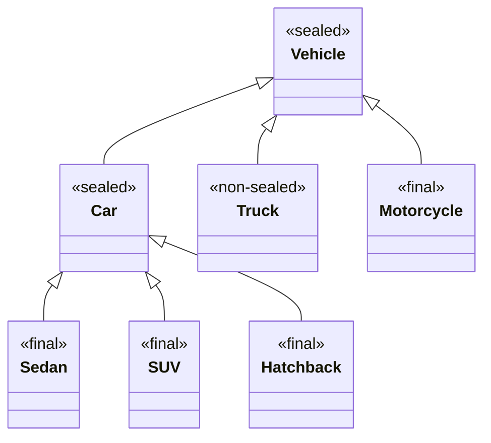

# Java Sealed Classes

## Introduction

Java sealed classes, introduced as a standard feature in Java 17, provide developers with fine-grained control over class inheritance. This feature allows you to explicitly specify which classes can extend a particular class or implement an interface, restricting unauthorized extensions and implementations.

The sealed classes feature addresses a common design challenge: how to define a fixed set of related classes that form a complete hierarchy without allowing unexpected extensions. Before sealed classes, developers relied on various workarounds like package-private access modifiers or final classes, which didn't provide an elegant solution to this problem.

## Understanding Sealed Classes

### What are Sealed Classes?

A sealed class is a class that restricts which other classes may extend it. Similarly, a sealed interface restricts which classes may implement it. This is achieved using the `sealed` keyword, along with the `permits` clause that specifies the allowed subclasses.

### Basic Syntax

```java
// Basic syntax for a sealed class
public sealed class Shape permits Circle, Rectangle, Triangle {
    // Class members and methods
}

// Permitted subclasses must be either final, sealed, or non-sealed
public final class Circle extends Shape {
    // Circle implementation
}

public final class Rectangle extends Shape {
    // Rectangle implementation
}

public final class Triangle extends Shape {
    // Triangle implementation
}
```

### Key Rules for Sealed Classes

1. All permitted subclasses must be explicitly named in the `permits` clause.
2. All permitted classes must be in the same module (if using modules) or package (if not using modules) as the sealed class, unless the subclass is nested within the sealed class.
3. Every permitted subclass must directly extend the sealed class.
4. Every subclass must define a modifier that indicates its ability to be extended:
   - `final`: Cannot be extended further
   - `sealed`: Can only be extended by its permitted subclasses
   - `non-sealed`: Can be extended by any class

## How to Use Sealed Classes

Let's see how to implement sealed classes with a complete example:

```java
// Define a sealed shape hierarchy
public sealed class Shape permits Circle, Rectangle, Triangle {
    protected String color;
    
    public Shape(String color) {
        this.color = color;
    }
    
    public abstract double area();
    
    public String getColor() {
        return color;
    }
}

public final class Circle extends Shape {
    private double radius;
    
    public Circle(String color, double radius) {
        super(color);
        this.radius = radius;
    }
    
    @Override
    public double area() {
        return Math.PI * radius * radius;
    }
}

public final class Rectangle extends Shape {
    private double width;
    private double height;
    
    public Rectangle(String color, double width, double height) {
        super(color);
        this.width = width;
        this.height = height;
    }
    
    @Override
    public double area() {
        return width * height;
    }
}

public final class Triangle extends Shape {
    private double base;
    private double height;
    
    public Triangle(String color, double base, double height) {
        super(color);
        this.base = base;
        this.height = height;
    }
    
    @Override
    public double area() {
        return 0.5 * base * height;
    }
}
```

Now we can use these classes:

```java
public class Main {
    public static void main(String[] args) {
        Shape circle = new Circle("Red", 5.0);
        Shape rectangle = new Rectangle("Blue", 4.0, 6.0);
        Shape triangle = new Triangle("Green", 3.0, 4.0);
        
        System.out.println("Circle: color=" + circle.getColor() + ", area=" + circle.area());
        System.out.println("Rectangle: color=" + rectangle.getColor() + ", area=" + rectangle.area());
        System.out.println("Triangle: color=" + triangle.getColor() + ", area=" + triangle.area());
    }
}
```

**Output:**
```
Circle: color=Red, area=78.53981633974483
Rectangle: color=Blue, area=24.0
Triangle: color=Green, area=6.0
```

## Advanced Usage of Sealed Classes

### Pattern Matching with Sealed Classes

One of the major benefits of sealed classes is their synergy with pattern matching (introduced in Java 17 as a preview feature). Since the compiler knows all possible subclasses of a sealed class, pattern matching becomes more powerful:

```java
public static String getShapeDescription(Shape shape) {
    return switch (shape) {
        case Circle c -> "A circle with radius " + c.getRadius();
        case Rectangle r -> "A rectangle with dimensions " + r.getWidth() + "x" + r.getHeight();
        case Triangle t -> "A triangle with base " + t.getBase() + " and height " + t.getHeight();
        // No default needed as all subclasses are covered!
    };
}
```

### Creating Sealed Hierarchies

You can create more complex hierarchies with sealed classes:

```java
public sealed class Vehicle permits Car, Truck, Motorcycle {
    // Vehicle implementation
}

public sealed class Car extends Vehicle permits Sedan, SUV, Hatchback {
    // Car implementation
}

public final class Sedan extends Car {
    // Sedan implementation
}

public final class SUV extends Car {
    // SUV implementation
}

public final class Hatchback extends Car {
    // Hatchback implementation
}

public non-sealed class Truck extends Vehicle {
    // Truck implementation - can be extended by any class
}

public final class Motorcycle extends Vehicle {
    // Motorcycle implementation
}
```

This hierarchy can be visualized as:



### Using Sealed Interfaces

Sealed interfaces work similarly to sealed classes:

```java
public sealed interface PaymentMethod permits CreditCard, DebitCard, PayPal, CryptoCurrency {
    boolean processPayment(double amount);
}

public final class CreditCard implements PaymentMethod {
    private String cardNumber;
    private String expiryDate;
    
    // Constructor and other methods
    
    @Override
    public boolean processPayment(double amount) {
        System.out.println("Processing credit card payment of $" + amount);
        // Implementation details
        return true;
    }
}

public final class DebitCard implements PaymentMethod {
    // Similar implementation
    @Override
    public boolean processPayment(double amount) {
        System.out.println("Processing debit card payment of $" + amount);
        return true;
    }
}

public final class PayPal implements PaymentMethod {
    // Implementation
    @Override
    public boolean processPayment(double amount) {
        System.out.println("Processing PayPal payment of $" + amount);
        return true;
    }
}

public non-sealed class CryptoCurrency implements PaymentMethod {
    // This can be extended by any cryptocurrency implementation
    @Override
    public boolean processPayment(double amount) {
        System.out.println("Processing cryptocurrency payment of $" + amount);
        return true;
    }
}

// Since CryptoCurrency is non-sealed, we can create this extension
public class Bitcoin extends CryptoCurrency {
    @Override
    public boolean processPayment(double amount) {
        System.out.println("Processing Bitcoin payment of $" + amount);
        return true;
    }
}
```

## Practical Use Cases for Sealed Classes

### 1. Domain Modeling

Sealed classes are excellent for representing domain models with a fixed set of entities:

```java
public sealed abstract class BankAccount permits CheckingAccount, SavingsAccount, FixedDepositAccount {
    protected double balance;
    protected String accountNumber;
    
    // Common methods for all bank accounts
    public abstract void deposit(double amount);
    public abstract boolean withdraw(double amount);
}

public final class CheckingAccount extends BankAccount {
    private double overdraftLimit;
    
    // Implementation details
    @Override
    public void deposit(double amount) {
        balance += amount;
    }
    
    @Override
    public boolean withdraw(double amount) {
        if (balance + overdraftLimit >= amount) {
            balance -= amount;
            return true;
        }
        return false;
    }
}

// Other account implementations
```

### 2. State Machines

Sealed classes are perfect for implementing state machines:

```java
public sealed interface OrderState permits OrderPlaced, OrderProcessing, OrderShipped, OrderDelivered, OrderCancelled {
    OrderState next();
}

public final class OrderPlaced implements OrderState {
    @Override
    public OrderState next() {
        return new OrderProcessing();
    }
}

public final class OrderProcessing implements OrderState {
    @Override
    public OrderState next() {
        return new OrderShipped();
    }
}

public final class OrderShipped implements OrderState {
    @Override
    public OrderState next() {
        return new OrderDelivered();
    }
}

public final class OrderDelivered implements OrderState {
    @Override
    public OrderState next() {
        // Terminal state
        return this;
    }
}

public final class OrderCancelled implements OrderState {
    @Override
    public OrderState next() {
        // Terminal state
        return this;
    }
}
```

### 3. API Design

Sealed classes enable library authors to define extensible yet controlled APIs:

```java
// In a library
public sealed interface HttpResponse permits SuccessResponse, ErrorResponse, RedirectResponse {
    int statusCode();
    Map<String, String> headers();
}

public final class SuccessResponse implements HttpResponse {
    private final int code;
    private final Map<String, String> headers;
    private final String body;
    
    // Implementation
    
    @Override
    public int statusCode() {
        return code;
    }
    
    @Override
    public Map<String, String> headers() {
        return Collections.unmodifiableMap(headers);
    }
    
    public String body() {
        return body;
    }
}

// Similar implementations for ErrorResponse and RedirectResponse
```

## Benefits of Sealed Classes

1. **Controlled inheritance**: Define exactly which classes can extend your class
2. **Exhaustiveness checking**: Enables the compiler to verify that all possible subtypes are handled
3. **Better pattern matching**: Works perfectly with Java's pattern matching features
4. **More expressive code**: Clearly conveys design intent
5. **Improved API design**: Enables library authors to define extensible yet controlled APIs

## Limitations of Sealed Classes

1. Permitted subclasses must be in the same module or package as the sealed class, unless they are nested within the sealed class
2. All permitted subclasses must directly extend the sealed class
3. Sealed classes add some complexity to your code and may be overkill for simple hierarchies

## Summary

Java sealed classes provide a powerful mechanism for controlling class inheritance hierarchies. By explicitly defining which classes can extend or implement a sealed class or interface, you gain control over your code's structure and can leverage compile-time checking to ensure all subclasses are properly handled.

Sealed classes work best when:
- You have a fixed set of related types
- You want to ensure comprehensive handling of all subtypes
- You need to communicate clear design intent about inheritance

Combined with pattern matching and other modern Java features, sealed classes help make your code more robust, maintainable, and expressive.

## Additional Resources

1. [JEP 409: Sealed Classes](https://openjdk.org/jeps/409) - The official Java Enhancement Proposal
2. [Java Language Specification - Sealed Classes](https://docs.oracle.com/javase/specs/jls/se17/html/jls-8.html#jls-8.1.1.2) - Official documentation
3. [Oracle's Tutorial on Sealed Classes](https://docs.oracle.com/en/java/javase/17/language/sealed-classes-and-interfaces.html)

## Exercises

1. Create a sealed hierarchy of `MediaFile` types with appropriate subclasses like `AudioFile`, `VideoFile`, and `ImageFile`.
2. Implement a sealed interface `Notification` with subclasses representing different notification types (email, SMS, push notification).
3. Design a command pattern implementation using sealed classes to represent different types of commands.
4. Convert an existing class hierarchy in your code to use sealed classes and see how it improves type safety.
5. Create a sealed class hierarchy for a simple expression language and implement pattern matching to evaluate expressions.