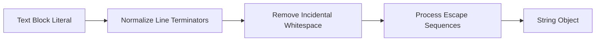

# Java Text Block

## Introduction

Text Blocks were officially added to Java in version 15, after being previewed in Java 13 and 14. This feature addresses one of the long-standing pain points in Java programming: working with multiline strings. Before Text Blocks, creating well-formatted multiline strings in Java was cumbersome, requiring concatenation, escape sequences, and careful attention to line breaks and indentation.

Text Blocks provide a cleaner, more readable way to represent multiline string literals in your code, making it particularly useful when working with:

- HTML, XML, or JSON content
- SQL queries
- Code snippets embedded in your Java program
- Any text that naturally spans multiple lines

Let's explore how Text Blocks work and how they can make your code cleaner and more maintainable.

## Understanding Java Text Blocks

### Basic Syntax

A Text Block is defined using three double quotes (`"""`) to open and close the block, with the content placed between them. Here's the basic syntax:

```java
String textBlock = """
    This is a
    multi-line
    text block
    """;
```

The opening triple quotes must be followed by a line break, and the closing triple quotes can be on their own line.

### Key Benefits

Text Blocks offer several advantages over traditional string literals:

1. **No escape sequences needed for most quotes** - You don't need to escape double quotes within the block
2. **Preserves new lines** - Line breaks in the text block appear as line breaks in the string
3. **Intelligent handling of indentation** - The compiler removes common leading whitespace
4. **Improved readability** - Code is cleaner and the structure of the text is more apparent

## Basic Examples

### Example 1: HTML Content

Before Text Blocks, HTML in Java looked like this:

```java
// Old way - String concatenation
String html = "<html>\n" +
              "    <body>\n" +
              "        <h1>Hello, World!</h1>\n" +
              "    </body>\n" +
              "</html>";

System.out.println(html);
```

With Text Blocks, it becomes:

```java
// New way - Text Block
String html = """
              <html>
                  <body>
                      <h1>Hello, World!</h1>
                  </body>
              </html>
              """;

System.out.println(html);
```

Both examples produce the same output:

```
<html>
    <body>
        <h1>Hello, World!</h1>
    </body>
</html>
```

### Example 2: SQL Queries

```java
// Old way
String query = "SELECT id, first_name, last_name\n" +
               "FROM employees\n" +
               "WHERE department = 'Engineering'\n" +
               "ORDER BY last_name";

// New way
String query = """
               SELECT id, first_name, last_name
               FROM employees
               WHERE department = 'Engineering'
               ORDER BY last_name
               """;
```

## Advanced Features of Text Blocks

### Indentation Control

Text Blocks automatically handle indentation by removing the common whitespace prefix from each line. The indentation is determined relative to the closing triple quotes:

```java
String text1 = """
               Line 1
               Line 2
               Line 3
               """;

// Is equivalent to "Line 1\nLine 2\nLine 3\n"
```

If you indent the closing delimiter, the indentation is adjusted:

```java
String text2 = """
               Line 1
               Line 2
               Line 3
    """;

// Is equivalent to "       Line 1\n       Line 2\n       Line 3\n"
```

### Escape Sequences

While Text Blocks reduce the need for escape sequences, you can still use them:

```java
String json = """
              {
                  "name": "John Doe",
                  "age": 30,
                  "messages": [
                      "Hello, \"World\"!"
                  ]
              }
              """;
```

### Trailing Spaces

By default, spaces at the end of each line are trimmed. If you need to keep them, use the `\s` escape sequence:

```java
String spaces = """
                Line with trailing spaces    \s
                Next line
                """;
```

### Preventing New Line at the End

If you don't want a new line at the end of your Text Block, place the closing quotes on the last line of content:

```java
String noNewLineAtEnd = """
                        Line 1
                        Line 2
                        Line 3""";
```

### String Concatenation

Text Blocks work seamlessly with string concatenation:

```java
String name = "John";
String greeting = """
                 Hello, """ + name + """
                 !
                 Welcome to our application.
                 """;
```

## Practical Applications

### Example 1: JSON Configuration

```java
String configJson = """
                   {
                       "appName": "TextBlockDemo",
                       "version": "1.0.0",
                       "settings": {
                           "darkMode": true,
                           "fontSize": 14,
                           "autosave": true
                       },
                       "paths": [
                           "/home/user",
                           "/tmp",
                           "C:\\\\Program Files"
                       ]
                   }
                   """;
```

### Example 2: Email Template

```java
public String generateEmailTemplate(String name, String productName, double price) {
    return """
           Dear %s,
           
           Thank you for your interest in our %s.
           
           The current price is $%.2f, and we're happy to offer you
           a 10%% discount if you purchase within the next 7 days.
           
           Best regards,
           The Sales Team
           """.formatted(name, productName, price);
}
```

### Example 3: Markdown Formatting

```java
String markdown = """
                 # Java Text Blocks
                 
                 ## Introduction
                 
                 Text Blocks were introduced in **Java 15** to make working with
                 multiline strings easier.
                 
                 ## Benefits
                 
                 * Improved readability
                 * Less escape sequences
                 * Better formatting control
                 
                 ```java
                 String example = "This is syntax highlighting";
                 ```
                 """;
```

## How Text Blocks Work Internally

Text Blocks in Java are ultimately converted to regular `String` objects. The Java compiler processes them during compilation by:

1. Removing the enclosing triple quotes
2. Processing escape sequences
3. Normalizing line terminators to `\n` regardless of platform
4. Removing incidental whitespace based on indentation
5. Creating a standard `String` instance

This diagram shows the processing flow:



## Text Blocks vs Traditional Strings

Let's compare Text Blocks with traditional string approaches:

| Feature | Text Blocks | String Literals | String Concatenation |
|---------|------------|----------------|---------------------|
| Multiline Support | Built-in | Requires `\n` | Requires `+` and `\n` |
| Escape Sequences | Minimized | Required for `"` | Required for `"` |
| Readability | High | Low for multiline | Medium |
| Whitespace Control | Automatic | Manual | Manual |
| Performance | Same as strings | Baseline | Compiler-optimized |

## Common Pitfalls and Best Practices

### Pitfalls to Avoid

1. **Inconsistent indentation**:
   ```java
   // BAD: Inconsistent indentation
   String text = """
                This line has one indent
                  This line has two
                    This one has three
                """;
   ```

2. **Forgetting the line break after opening quotes**:
   ```java
   // INCORRECT: No line break after opening quotes
   String text = """This is wrong
                 Because there's no line break
                 after the opening quotes""";
   ```

### Best Practices

1. **Align closing delimiter with content indentation**:
   ```java
   // GOOD: Content and closing quotes aligned
   String text = """
                 Line 1
                 Line 2
                 Line 3
                 """;
   ```

2. **Use the appropriate tool for the job**:
   ```java
   // For simple one-line strings, use traditional string literals
   String simple = "Hello, world!";
   
   // For multiline structured text, use Text Blocks
   String complex = """
                   <div>
                       <p>This is a paragraph</p>
                   </div>
                   """;
   ```

3. **Combine with String.format() or formatted() for dynamic content**:
   ```java
   String template = """
                     Name: %s
                     Age: %d
                     Email: %s
                     """.formatted(name, age, email);
   ```

## Summary

Java Text Blocks provide a more elegant and readable way to work with multiline string literals in Java code. Key takeaways include:

- Text Blocks start and end with triple quotes (`"""`)
- They automatically preserve line breaks and handle indentation
- They reduce the need for escape sequences
- They improve code readability when working with structured text like HTML, SQL, JSON, etc.
- Text Blocks are just `String` objects at runtime

Text Blocks are especially valuable when you need to include structured text in your Java programs, as they allow the text to maintain its natural layout in your code. This makes your code more maintainable and less error-prone compared to traditional string concatenation approaches.

## Additional Resources and Exercises

### Resources
- [JEP 378: Text Blocks](https://openjdk.org/jeps/378) - The official Java Enhancement Proposal
- [Oracle's Text Blocks tutorial](https://docs.oracle.com/en/java/javase/15/text-blocks/index.html)

### Exercises

1. **HTML Document**: Create a Text Block containing a complete HTML document with head and body sections, including CSS styles.

2. **Format Conversion**: Write a method that takes a JSON Text Block and converts it to XML format.

3. **Template Engine**: Implement a simple template engine that replaces placeholders like `{{name}}` in a Text Block with actual values.

4. **Code Generator**: Create a Java program that generates another Java class using Text Blocks for the code template.

5. **Comparison Tool**: Write a utility that compares two Text Blocks and highlights the differences between them.