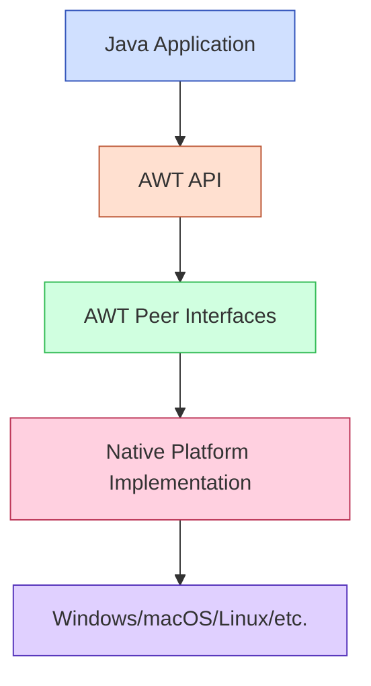

# Java AWT Introduction

## What is AWT?

The **Abstract Window Toolkit (AWT)** is Java's original platform-independent windowing, graphics, and user interface toolkit. It was introduced with Java's first version (JDK 1.0) and provides a set of classes for creating and manipulating graphical user interfaces (GUIs) in Java applications.

AWT serves as the foundation for Java's GUI programming and provides the basic building blocks for creating windows, buttons, text fields, and other GUI components.

## Why Learn AWT?

While Swing (a more advanced GUI toolkit built on top of AWT) has largely replaced AWT for most modern Java applications, understanding AWT is valuable for several reasons:

1. It forms the foundation of Java's GUI frameworks
2. It provides insight into Java's platform-independent design
3. It's still used in specific scenarios and legacy applications
4. Understanding AWT makes learning Swing easier

## AWT Architecture

AWT uses a **peer-based architecture**, which means each AWT component has a corresponding native component on the underlying operating system. This approach is sometimes referred to as "heavyweight" because AWT components rely on the native system's resources.



## Basic AWT Components

AWT provides a variety of components (also called widgets) to create graphical interfaces:

- **Window components**: Frame, Dialog, Panel
- **Controls**: Button, Label, TextField, TextArea, Checkbox, Choice, List
- **Layout managers**: FlowLayout, BorderLayout, GridLayout, CardLayout
- **Event handling**: ActionEvent, WindowEvent, MouseEvent

## Your First AWT Application

Let's create a simple AWT application that displays a window with a button:

```java
import java.awt.*;
import java.awt.event.*;

public class FirstAWTExample {
    public static void main(String[] args) {
        // Create a Frame (window)
        Frame frame = new Frame("My First AWT Application");
        
        // Set the size of the frame
        frame.setSize(300, 200);
        
        // Create a Button
        Button button = new Button("Click Me");
        
        // Add the button to the frame
        frame.add(button);
        
        // Add a window listener to handle window closing
        frame.addWindowListener(new WindowAdapter() {
            public void windowClosing(WindowEvent e) {
                System.exit(0);
            }
        });
        
        // Add action listener to the button
        button.addActionListener(new ActionListener() {
            public void actionPerformed(ActionEvent e) {
                System.out.println("Button clicked!");
            }
        });
        
        // Make the frame visible
        frame.setVisible(true);
    }
}
```

When you run this code, you'll see a window with a button that says "Click Me". When clicked, it will print "Button clicked!" to the console. Closing the window will terminate the application.

## Key Components in AWT

### Containers

Containers are components that can hold other AWT components. The main containers in AWT include:

1. **Frame**: A top-level window with a title and border
2. **Panel**: A rectangular area used to group related components
3. **Dialog**: A popup window typically used for brief user interaction

Example of using a Panel to organize components:

```java
import java.awt.*;

public class PanelExample {
    public static void main(String[] args) {
        // Create the main frame
        Frame frame = new Frame("Panel Example");
        frame.setSize(400, 200);
        frame.setLayout(new BorderLayout());
        
        // Create panels
        Panel northPanel = new Panel();
        Panel centerPanel = new Panel();
        Panel southPanel = new Panel();
        
        // Add components to panels
        northPanel.add(new Button("North Button"));
        centerPanel.add(new TextField("Center Text", 20));
        southPanel.add(new Button("South Button 1"));
        southPanel.add(new Button("South Button 2"));
        
        // Add panels to the frame
        frame.add(northPanel, BorderLayout.NORTH);
        frame.add(centerPanel, BorderLayout.CENTER);
        frame.add(southPanel, BorderLayout.SOUTH);
        
        // Handle window closing
        frame.addWindowListener(new java.awt.event.WindowAdapter() {
            public void windowClosing(java.awt.event.WindowEvent e) {
                System.exit(0);
            }
        });
        
        frame.setVisible(true);
    }
}
```

### Controls

Controls (or widgets) are UI elements that allow users to interact with your application:

#### Button

A button that can be clicked to trigger an action:

```java
Button submitButton = new Button("Submit");
```

#### Label

A component for displaying read-only text:

```java
Label titleLabel = new Label("Enter your information:");
```

#### TextField and TextArea

Components for text input:

```java
TextField nameField = new TextField(20); // 20 columns wide
TextArea commentArea = new TextArea(5, 40); // 5 rows, 40 columns
```

#### Checkbox and CheckboxGroup

For selecting options:

```java
Checkbox agreeCheckbox = new Checkbox("I agree to terms", true); // Initially checked

// Radio buttons (mutually exclusive checkboxes)
CheckboxGroup genderGroup = new CheckboxGroup();
Checkbox maleCheckbox = new Checkbox("Male", genderGroup, false);
Checkbox femaleCheckbox = new Checkbox("Female", genderGroup, false);
```

#### Choice and List

For selecting from dropdown menus or lists:

```java
// Dropdown
Choice countryChoice = new Choice();
countryChoice.add("USA");
countryChoice.add("Canada");
countryChoice.add("UK");

// List (with multiple selection enabled)
List languageList = new List(4, true); // Shows 4 items, allows multiple selection
languageList.add("Java");
languageList.add("Python");
languageList.add("JavaScript");
languageList.add("C++");
```

## Layout Managers

Layout managers control how components are arranged within containers. AWT provides several layout managers:

### FlowLayout

Arranges components in a left-to-right flow, wrapping to the next line when needed.

```java
Panel panel = new Panel();
panel.setLayout(new FlowLayout());
panel.add(new Button("Button 1"));
panel.add(new Button("Button 2"));
panel.add(new Button("Button 3"));
```

### BorderLayout

Divides the container into five areas: NORTH, SOUTH, EAST, WEST, and CENTER.

```java
Frame frame = new Frame();
frame.setLayout(new BorderLayout());
frame.add(new Button("North"), BorderLayout.NORTH);
frame.add(new Button("South"), BorderLayout.SOUTH);
frame.add(new Button("East"), BorderLayout.EAST);
frame.add(new Button("West"), BorderLayout.WEST);
frame.add(new Button("Center"), BorderLayout.CENTER);
```

### GridLayout

Arranges components in a grid with a specified number of rows and columns.

```java
Panel panel = new Panel();
panel.setLayout(new GridLayout(2, 3)); // 2 rows, 3 columns
panel.add(new Button("1"));
panel.add(new Button("2"));
panel.add(new Button("3"));
panel.add(new Button("4"));
panel.add(new Button("5"));
panel.add(new Button("6"));
```

## Event Handling in AWT

AWT uses an event-driven programming model. When a user interacts with a component, an event is generated. Your application can respond to these events by implementing event listeners.

### The Event Delegation Model

1. **Event Source**: The component that generates the event
2. **Event Object**: Encapsulates information about the event
3. **Event Listener**: The object that receives and handles the event

### Common Event Types

- **ActionEvent**: Generated when buttons are clicked or items selected
- **WindowEvent**: Generated for window activities (opening, closing, etc.)
- **MouseEvent**: Generated for mouse actions (clicks, movement, etc.)
- **KeyEvent**: Generated for keyboard input

### Example: Handling Button Clicks

```java
import java.awt.*;
import java.awt.event.*;

public class EventHandlingExample {
    public static void main(String[] args) {
        Frame frame = new Frame("Event Handling Example");
        frame.setSize(300, 200);
        frame.setLayout(new FlowLayout());
        
        Button button = new Button("Click Me");
        TextField textField = new TextField(20);
        
        // Add ActionListener to the button
        button.addActionListener(new ActionListener() {
            public void actionPerformed(ActionEvent e) {
                textField.setText("Button was clicked at: " + new java.util.Date());
            }
        });
        
        // Add components to frame
        frame.add(button);
        frame.add(textField);
        
        // Handle window closing
        frame.addWindowListener(new WindowAdapter() {
            public void windowClosing(WindowEvent e) {
                System.exit(0);
            }
        });
        
        frame.setVisible(true);
    }
}
```

## Practical Example: Simple Form Application

Let's create a more complete example - a simple user registration form:

```java
import java.awt.*;
import java.awt.event.*;

public class RegistrationForm {
    public static void main(String[] args) {
        // Create the main frame
        Frame frame = new Frame("User Registration");
        frame.setSize(400, 300);
        frame.setLayout(new GridLayout(7, 2, 10, 10));
        
        // Create form components
        Label nameLabel = new Label("Name:");
        TextField nameField = new TextField(20);
        
        Label emailLabel = new Label("Email:");
        TextField emailField = new TextField(20);
        
        Label passwordLabel = new Label("Password:");
        TextField passwordField = new TextField(20);
        passwordField.setEchoChar('*'); // Hide password with asterisks
        
        Label genderLabel = new Label("Gender:");
        Panel genderPanel = new Panel(new FlowLayout(FlowLayout.LEFT));
        CheckboxGroup genderGroup = new CheckboxGroup();
        Checkbox maleCheckbox = new Checkbox("Male", genderGroup, true);
        Checkbox femaleCheckbox = new Checkbox("Female", genderGroup, false);
        Checkbox otherCheckbox = new Checkbox("Other", genderGroup, false);
        genderPanel.add(maleCheckbox);
        genderPanel.add(femaleCheckbox);
        genderPanel.add(otherCheckbox);
        
        Label countryLabel = new Label("Country:");
        Choice countryChoice = new Choice();
        countryChoice.add("USA");
        countryChoice.add("Canada");
        countryChoice.add("UK");
        countryChoice.add("Australia");
        countryChoice.add("India");
        
        Label agreeLabel = new Label("Terms:");
        Checkbox agreeCheckbox = new Checkbox("I agree to terms and conditions");
        
        Button submitButton = new Button("Submit");
        Button resetButton = new Button("Reset");
        
        // Add components to the frame
        frame.add(nameLabel);
        frame.add(nameField);
        frame.add(emailLabel);
        frame.add(emailField);
        frame.add(passwordLabel);
        frame.add(passwordField);
        frame.add(genderLabel);
        frame.add(genderPanel);
        frame.add(countryLabel);
        frame.add(countryChoice);
        frame.add(agreeLabel);
        frame.add(agreeCheckbox);
        frame.add(resetButton);
        frame.add(submitButton);
        
        // Add button action listeners
        submitButton.addActionListener(new ActionListener() {
            public void actionPerformed(ActionEvent e) {
                if (!agreeCheckbox.getState()) {
                    showDialog(frame, "You must agree to the terms and conditions");
                    return;
                }
                
                String name = nameField.getText();
                String email = emailField.getText();
                
                if (name.isEmpty() || email.isEmpty()) {
                    showDialog(frame, "Name and email are required");
                    return;
                }
                
                showDialog(frame, "Registration successful for: " + name);
            }
        });
        
        resetButton.addActionListener(new ActionListener() {
            public void actionPerformed(ActionEvent e) {
                nameField.setText("");
                emailField.setText("");
                passwordField.setText("");
                maleCheckbox.setState(true);
                countryChoice.select(0);
                agreeCheckbox.setState(false);
            }
        });
        
        // Handle window closing
        frame.addWindowListener(new WindowAdapter() {
            public void windowClosing(WindowEvent e) {
                System.exit(0);
            }
        });
        
        // Add padding
        frame.setLocationRelativeTo(null);
        frame.setVisible(true);
    }
    
    // Helper method to show dialog
    private static void showDialog(Frame parent, String message) {
        Dialog dialog = new Dialog(parent, "Message", true);
        dialog.setLayout(new FlowLayout());
        dialog.add(new Label(message));
        Button okButton = new Button("OK");
        okButton.addActionListener(new ActionListener() {
            public void actionPerformed(ActionEvent e) {
                dialog.dispose();
            }
        });
        dialog.add(okButton);
        dialog.setSize(300, 100);
        dialog.setLocationRelativeTo(parent);
        dialog.setVisible(true);
    }
}
```

## Limitations of AWT

While AWT is important to understand, it has several limitations:

1. **Limited component set**: AWT offers fewer components compared to Swing
2. **Platform-dependent look and feel**: AWT components look different on different operating systems
3. **Heavyweight components**: AWT components use more system resources than Swing's lightweight components
4. **Limited customization**: Difficult to customize the appearance of components

These limitations led to the development of the Swing library, which provides more components, consistent cross-platform look and feel, and greater customization options.

## AWT vs. Swing

Here's a quick comparison between AWT and Swing:

| Feature | AWT | Swing |
|---------|-----|-------|
| Component Architecture | Heavyweight (platform-dependent) | Lightweight (platform-independent) |
| Look and Feel | Platform-specific | Pluggable, consistent across platforms |
| Component Set | Basic | Rich and extensive |
| Custom Drawing | Limited | Advanced capabilities |
| Performance | Usually faster | Slightly slower due to pure Java implementation |
| Package | `java.awt` | `javax.swing` |

## Summary

In this introduction to Java AWT, we've covered:

- What AWT is and its role in Java GUI programming
- The basic architecture and component model of AWT
- Essential components like Frame, Panel, Button, and Label
- Layout managers for organizing components
- Event handling for responding to user interactions
- A practical example creating a registration form

AWT provides the foundation for Java GUI development and understanding it will help you better grasp more advanced GUI frameworks like Swing and JavaFX.

## Additional Resources

- [Oracle's AWT Tutorial](https://docs.oracle.com/javase/tutorial/awt/)
- [Java AWT API Documentation](https://docs.oracle.com/javase/8/docs/api/java/awt/package-summary.html)
- [AWT Event Handling Documentation](https://docs.oracle.com/javase/tutorial/uiswing/events/index.html)

## Exercises

1. Create a simple calculator application using AWT components
2. Build a login form that validates username and password
3. Create a drawing application that lets users draw shapes on a canvas
4. Develop a simple text editor with open, save, and edit functionality
5. Build a multi-panel application with different sections for various functions