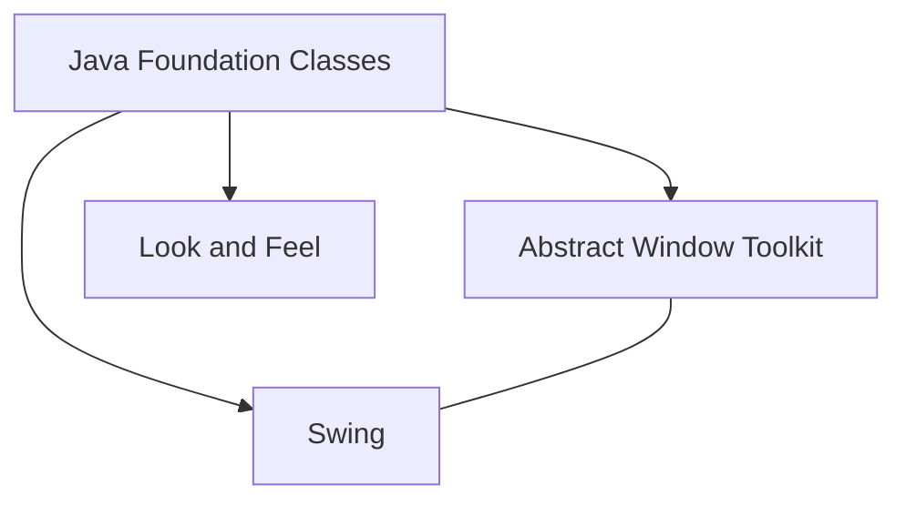

# Java Swing Basics

## Introduction

Java Swing is a lightweight GUI toolkit that provides a rich set of widgets for building sophisticated desktop applications in Java. As part of the Java Foundation Classes (JFC), Swing provides a native-looking alternative to the Abstract Window Toolkit (AWT). If you've ever wondered how to create windows, buttons, text fields, and other interactive elements in your Java applications, Swing is one of the most established frameworks to accomplish this.

In this tutorial, we'll explore the fundamental concepts of Swing, including its architecture, basic components, layouts, and event handling. By the end, you'll have the knowledge to build simple yet functional graphical user interfaces in Java.

## Getting Started with Swing

### What is Swing?

Swing is built on top of the AWT (Abstract Window Toolkit) and provides:

- Platform-independent components
- Pluggable look and feel
- Lightweight components (most components are drawn using Java code instead of native code)
- A rich set of UI components (buttons, tables, trees, etc.)



### Setting Up a Basic Swing Application

To create a Swing application, you need to:

1. Import the necessary Swing packages
2. Create a container (like JFrame)
3. Add components to the container
4. Make the container visible

Here's a simple example:

```java
import javax.swing.*;

public class HelloSwing {
    public static void main(String[] args) {
        // Create a new JFrame (window)
        JFrame frame = new JFrame("Hello Swing");
        
        // Set the default close operation
        frame.setDefaultCloseOperation(JFrame.EXIT_ON_CLOSE);
        
        // Set the window size
        frame.setSize(300, 200);
        
        // Create a label
        JLabel label = new JLabel("Hello, Swing World!");
        
        // Add the label to the content pane
        frame.getContentPane().add(label);
        
        // Center the label
        label.setHorizontalAlignment(JLabel.CENTER);
        
        // Display the window
        frame.setVisible(true);
    }
}
```

**Output:**

When you run this program, a window appears with the text "Hello, Swing World!" centered in it.

## Basic Swing Components

Swing provides a wide variety of components. Here are some of the most commonly used ones:

### Containers

Containers are components that can hold other components:

- **JFrame**: The main window (has a title bar, border, and minimize/maximize buttons)
- **JPanel**: A general-purpose container for organizing components
- **JDialog**: A dialog box
- **JScrollPane**: A scrollable view of a component

### Controls

Controls are components that allow user interaction:

- **JButton**: A clickable button
- **JLabel**: Displays text or images
- **JTextField**: A single-line text input field
- **JTextArea**: A multi-line text input field
- **JCheckBox**: A toggle button with a checkbox
- **JRadioButton**: A toggle button within a mutually exclusive group
- **JComboBox**: A dropdown list
- **JList**: A list of selectable items

Let's create an example that demonstrates several common components:

```java
import javax.swing.*;
import java.awt.*;

public class ComponentDemo {
    public static void main(String[] args) {
        // Create the main window
        JFrame frame = new JFrame("Swing Component Demo");
        frame.setDefaultCloseOperation(JFrame.EXIT_ON_CLOSE);
        frame.setSize(400, 300);
        
        // Create a panel with a border layout
        JPanel panel = new JPanel();
        panel.setLayout(new FlowLayout(FlowLayout.LEFT, 10, 10));
        
        // Add a label
        JLabel nameLabel = new JLabel("Name:");
        panel.add(nameLabel);
        
        // Add a text field
        JTextField nameField = new JTextField(15);
        panel.add(nameField);
        
        // Add a button
        JButton submitButton = new JButton("Submit");
        panel.add(submitButton);
        
        // Add checkbox
        JCheckBox agreeCheckbox = new JCheckBox("I agree to terms");
        panel.add(agreeCheckbox);
        
        // Add radio buttons in a group
        JRadioButton maleRadio = new JRadioButton("Male");
        JRadioButton femaleRadio = new JRadioButton("Female");
        JRadioButton otherRadio = new JRadioButton("Other");
        
        ButtonGroup genderGroup = new ButtonGroup();
        genderGroup.add(maleRadio);
        genderGroup.add(femaleRadio);
        genderGroup.add(otherRadio);
        
        // Create a panel for radio buttons
        JPanel radioPanel = new JPanel();
        radioPanel.setLayout(new BoxLayout(radioPanel, BoxLayout.Y_AXIS));
        radioPanel.setBorder(BorderFactory.createTitledBorder("Gender"));
        radioPanel.add(maleRadio);
        radioPanel.add(femaleRadio);
        radioPanel.add(otherRadio);
        
        panel.add(radioPanel);
        
        // Add a combo box
        String[] countries = {"USA", "Canada", "UK", "Australia", "India"};
        JComboBox<String> countryCombo = new JComboBox<>(countries);
        panel.add(new JLabel("Country:"));
        panel.add(countryCombo);
        
        // Add the panel to the frame
        frame.getContentPane().add(panel);
        
        // Display the window
        frame.setVisible(true);
    }
}
```

**Output:**

When you run this program, you'll see a window containing various GUI elements including a text field, button, checkbox, radio buttons, and a dropdown list.

## Layout Managers

Layout managers are used to arrange components within a container. Swing provides several layout managers:

### Common Layout Managers

1. **FlowLayout**: Arranges components from left to right, and then top to bottom
2. **BorderLayout**: Arranges components in five regions: North, South, East, West, and Center
3. **GridLayout**: Arranges components in a grid of equally sized cells
4. **BoxLayout**: Arranges components either vertically or horizontally
5. **GridBagLayout**: The most flexible but complex layout manager

Here's an example demonstrating BorderLayout:

```java
import javax.swing.*;
import java.awt.*;

public class BorderLayoutDemo {
    public static void main(String[] args) {
        JFrame frame = new JFrame("BorderLayout Demo");
        frame.setDefaultCloseOperation(JFrame.EXIT_ON_CLOSE);
        frame.setSize(400, 300);
        
        // Set BorderLayout as the layout manager
        frame.setLayout(new BorderLayout(10, 10));
        
        // Create components for each region
        JButton northButton = new JButton("North");
        JButton southButton = new JButton("South");
        JButton eastButton = new JButton("East");
        JButton westButton = new JButton("West");
        JButton centerButton = new JButton("Center");
        
        // Add components to the frame
        frame.add(northButton, BorderLayout.NORTH);
        frame.add(southButton, BorderLayout.SOUTH);
        frame.add(eastButton, BorderLayout.EAST);
        frame.add(westButton, BorderLayout.WEST);
        frame.add(centerButton, BorderLayout.CENTER);
        
        // Display the window
        frame.setVisible(true);
    }
}
```

**Output:**

When you run this program, you'll see a window with five buttons arranged in the north, south, east, west, and center regions of the window.

## Event Handling

Swing uses an event-driven programming model. Components generate events when the user interacts with them, and your application responds to these events through event listeners.

### Event Handling Steps

1. Identify the component that will generate an event
2. Create a listener object that implements the appropriate listener interface
3. Register the listener with the component

Here's a simple example of button click event handling:

```java
import javax.swing.*;
import java.awt.*;
import java.awt.event.*;

public class EventHandlingDemo {
    public static void main(String[] args) {
        JFrame frame = new JFrame("Event Handling Demo");
        frame.setDefaultCloseOperation(JFrame.EXIT_ON_CLOSE);
        frame.setSize(300, 200);
        frame.setLayout(new FlowLayout());
        
        // Create a button and a label
        JButton clickButton = new JButton("Click Me");
        JLabel resultLabel = new JLabel("No button clicked yet");
        
        // Add an action listener to the button
        clickButton.addActionListener(new ActionListener() {
            @Override
            public void actionPerformed(ActionEvent e) {
                resultLabel.setText("Button clicked at " + new java.util.Date());
            }
        });
        
        // Alternative approach using lambda expression (Java 8+)
        // clickButton.addActionListener(e -> resultLabel.setText("Button clicked at " + new java.util.Date()));
        
        // Add components to the frame
        frame.add(clickButton);
        frame.add(resultLabel);
        
        // Display the window
        frame.setVisible(true);
    }
}
```

**Output:**

When you run this program, you'll see a window with a "Click Me" button and a label. When you click the button, the label text changes to show the current time.

## Creating a Complete Simple Application

Let's put everything together to create a simple form application:

```java
import javax.swing.*;
import java.awt.*;
import java.awt.event.*;

public class SimpleFormApplication {
    public static void main(String[] args) {
        // Create the main window
        JFrame frame = new JFrame("Registration Form");
        frame.setDefaultCloseOperation(JFrame.EXIT_ON_CLOSE);
        frame.setSize(400, 350);
        
        // Create a panel with GridBagLayout for better control
        JPanel panel = new JPanel(new GridBagLayout());
        GridBagConstraints gbc = new GridBagConstraints();
        gbc.insets = new Insets(5, 5, 5, 5);
        gbc.fill = GridBagConstraints.HORIZONTAL;
        
        // Name input
        gbc.gridx = 0;
        gbc.gridy = 0;
        panel.add(new JLabel("Name:"), gbc);
        
        gbc.gridx = 1;
        gbc.gridwidth = 2;
        JTextField nameField = new JTextField(20);
        panel.add(nameField, gbc);
        
        // Email input
        gbc.gridx = 0;
        gbc.gridy = 1;
        gbc.gridwidth = 1;
        panel.add(new JLabel("Email:"), gbc);
        
        gbc.gridx = 1;
        gbc.gridwidth = 2;
        JTextField emailField = new JTextField(20);
        panel.add(emailField, gbc);
        
        // Age input
        gbc.gridx = 0;
        gbc.gridy = 2;
        gbc.gridwidth = 1;
        panel.add(new JLabel("Age:"), gbc);
        
        gbc.gridx = 1;
        gbc.gridwidth = 2;
        String[] ages = new String[100];
        for (int i = 0; i < 100; i++) {
            ages[i] = Integer.toString(i + 1);
        }
        JComboBox<String> ageCombo = new JComboBox<>(ages);
        panel.add(ageCombo, gbc);
        
        // Gender selection
        gbc.gridx = 0;
        gbc.gridy = 3;
        panel.add(new JLabel("Gender:"), gbc);
        
        gbc.gridx = 1;
        JRadioButton maleRadio = new JRadioButton("Male");
        panel.add(maleRadio, gbc);
        
        gbc.gridx = 2;
        JRadioButton femaleRadio = new JRadioButton("Female");
        panel.add(femaleRadio, gbc);
        
        ButtonGroup genderGroup = new ButtonGroup();
        genderGroup.add(maleRadio);
        genderGroup.add(femaleRadio);
        
        // Newsletter subscription
        gbc.gridx = 0;
        gbc.gridy = 4;
        gbc.gridwidth = 3;
        JCheckBox newsletterCheckbox = new JCheckBox("Subscribe to newsletter");
        panel.add(newsletterCheckbox, gbc);
        
        // Comments area
        gbc.gridx = 0;
        gbc.gridy = 5;
        panel.add(new JLabel("Comments:"), gbc);
        
        gbc.gridy = 6;
        JTextArea commentsArea = new JTextArea(5, 20);
        JScrollPane scrollPane = new JScrollPane(commentsArea);
        panel.add(scrollPane, gbc);
        
        // Submit button
        gbc.gridx = 0;
        gbc.gridy = 7;
        gbc.gridwidth = 3;
        gbc.anchor = GridBagConstraints.CENTER;
        JButton submitButton = new JButton("Submit");
        panel.add(submitButton, gbc);
        
        // Result label
        gbc.gridy = 8;
        JLabel resultLabel = new JLabel("");
        panel.add(resultLabel, gbc);
        
        // Add event listener to the submit button
        submitButton.addActionListener(new ActionListener() {
            @Override
            public void actionPerformed(ActionEvent e) {
                StringBuilder result = new StringBuilder("<html>Form Submitted:<br>");
                result.append("Name: ").append(nameField.getText()).append("<br>");
                result.append("Email: ").append(emailField.getText()).append("<br>");
                result.append("Age: ").append(ageCombo.getSelectedItem()).append("<br>");
                
                String gender = maleRadio.isSelected() ? "Male" : (femaleRadio.isSelected() ? "Female" : "Not specified");
                result.append("Gender: ").append(gender).append("<br>");
                
                result.append("Newsletter: ").append(newsletterCheckbox.isSelected() ? "Subscribed" : "Not subscribed").append("<br>");
                result.append("Comments: ").append(commentsArea.getText()).append("</html>");
                
                resultLabel.setText(result.toString());
            }
        });
        
        // Add the panel to the frame
        frame.getContentPane().add(panel);
        
        // Display the window
        frame.setVisible(true);
    }
}
```

**Output:**

When you run this program, you'll see a form with fields for name, email, age selection, gender selection, newsletter subscription, and comments. When you fill in the form and click Submit, a summary of your entries appears at the bottom.

## Best Practices for Swing Development

1. **Run Swing code on the Event Dispatch Thread (EDT)**:
   ```java
   SwingUtilities.invokeLater(() -> {
       // Create and display the GUI here
   });
   ```

2. **Use appropriate layout managers** for complex interfaces instead of absolute positioning

3. **Separate UI logic from business logic** using the MVC (Model-View-Controller) pattern

4. **Add proper spacing and borders** to improve visual appeal:
   ```java
   panel.setBorder(BorderFactory.createEmptyBorder(10, 10, 10, 10));
   ```

5. **Keep the UI responsive** by performing time-consuming operations in background threads:
   ```java
   SwingWorker<Result, Void> worker = new SwingWorker<>() {
       @Override
       protected Result doInBackground() throws Exception {
           // Lengthy operation here
           return result;
       }
       
       @Override
       protected void done() {
           try {
               Result result = get();
               // Update UI with the result
           } catch (Exception e) {
               e.printStackTrace();
           }
       }
   };
   worker.execute();
   ```

## Summary

In this tutorial, you've learned the basics of Java Swing:

- Creating windows and containers using JFrame and JPanel
- Adding various UI components like buttons, text fields, and labels
- Managing the layout of components using layout managers
- Handling user events with listeners
- Building a complete simple application

Swing provides a rich set of components and capabilities for building desktop applications. While it may not be as modern as JavaFX, it is still widely used and offers great flexibility for creating user interfaces in Java.

## Additional Resources and Exercises

### Resources

1. [Oracle's Swing Tutorial](https://docs.oracle.com/javase/tutorial/uiswing/)
2. [Java Swing Documentation](https://docs.oracle.com/javase/8/docs/api/javax/swing/package-summary.html)
3. Books: "Swing: A Beginner's Guide" by Herbert Schildt
4. Books: "Core Java Volume I—Fundamentals" by Cay S. Horstmann (chapters on Swing)

### Exercises

1. **Simple Calculator**: Create a calculator application with buttons for digits and basic operations (addition, subtraction, multiplication, division).

2. **Todo List Application**: Build a simple todo list where users can add, edit, and delete tasks.

3. **Image Viewer**: Create an application that allows users to browse and view images from a folder.

4. **Enhanced Registration Form**: Extend the registration form from the example to include more fields and validation.

5. **Menu and Toolbar**: Create an application with a menu bar, menus, and a toolbar providing various functionalities.

Remember to apply what you've learned about layouts, event handling, and best practices when working on these exercises. Practice is key to mastering Swing development!