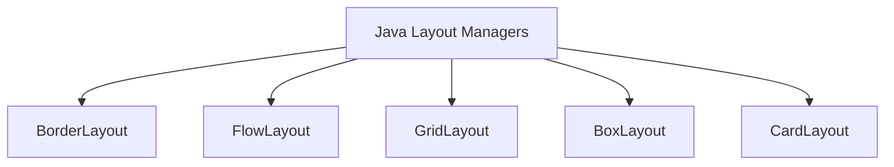

# Java Layout Managers

When building graphical user interfaces (GUIs) in Java using Swing or AWT, one of the most important aspects is arranging components like buttons, labels, and text fields on the screen. Java layout managers are responsible for this arrangement, enabling developers to create flexible, responsive interfaces without hardcoding component positions.

## What are Layout Managers?

Layout managers are classes that control the size, position, and behavior of components within a container. Instead of specifying exact pixel coordinates for each component, layout managers automatically arrange components following specific layout rules.

Using layout managers offers several benefits:

- **Responsive interfaces**: Components adjust when the window is resized
- **Platform independence**: Layouts work across different operating systems
- **Easier maintenance**: No need to manually update positions when adding or removing components
- **Better localization support**: Text in different languages needs different amounts of space

## Common Java Layout Managers

Let's explore the five most commonly used layout managers in Java:



### 1. BorderLayout

BorderLayout divides a container into five regions: North, South, East, West, and Center. Components are added to a specific region, and each region can contain only one component (though that component could be a panel with multiple components).

```java
import javax.swing.*;
import java.awt.*;

public class BorderLayoutExample {
    public static void main(String[] args) {
        JFrame frame = new JFrame("BorderLayout Example");
        frame.setDefaultCloseOperation(JFrame.EXIT_ON_CLOSE);
        frame.setSize(400, 300);
        
        // Set BorderLayout as the layout manager
        frame.setLayout(new BorderLayout(10, 10)); // Horizontal and vertical gaps
        
        // Add components to different regions
        frame.add(new JButton("North"), BorderLayout.NORTH);
        frame.add(new JButton("South"), BorderLayout.SOUTH);
        frame.add(new JButton("East"), BorderLayout.EAST);
        frame.add(new JButton("West"), BorderLayout.WEST);
        frame.add(new JButton("Center"), BorderLayout.CENTER);
        
        frame.setVisible(true);
    }
}
```

When you run this example, you'll see:
- North button stretches across the top
- South button stretches across the bottom
- East and West buttons take up the sides
- Center button fills the remaining space

**Key points about BorderLayout:**
- Default layout for JFrame and JDialog
- Center region expands to fill available space
- Components maintain preferred size in North and South regions
- East and West components maintain preferred width but expand vertically

### 2. FlowLayout

FlowLayout is the simplest layout manager. It places components in a row, left to right, and creates a new row when there's no more room in the current one.

```java
import javax.swing.*;
import java.awt.*;

public class FlowLayoutExample {
    public static void main(String[] args) {
        JFrame frame = new JFrame("FlowLayout Example");
        frame.setDefaultCloseOperation(JFrame.EXIT_ON_CLOSE);
        frame.setSize(300, 200);
        
        // Set FlowLayout as the layout manager
        frame.setLayout(new FlowLayout(FlowLayout.LEFT, 10, 15)); // Alignment, hgap, vgap
        
        // Add components
        frame.add(new JButton("Button 1"));
        frame.add(new JButton("Button 2"));
        frame.add(new JButton("Button 3"));
        frame.add(new JButton("Long Button 4"));
        frame.add(new JButton("Button 5"));
        
        frame.setVisible(true);
    }
}
```

When you run this example, the buttons will flow from left to right and wrap to a new row when needed. Try resizing the window to see how the buttons reflow.

**Key points about FlowLayout:**
- Default layout for JPanel
- Respects component's preferred size
- Can align components LEFT, CENTER (default), or RIGHT
- Simple but limited for complex interfaces

### 3. GridLayout

GridLayout arranges components in a grid of equally sized cells. Components are added from left to right, top to bottom.

```java
import javax.swing.*;
import java.awt.*;

public class GridLayoutExample {
    public static void main(String[] args) {
        JFrame frame = new JFrame("GridLayout Example");
        frame.setDefaultCloseOperation(JFrame.EXIT_ON_CLOSE);
        frame.setSize(300, 300);
        
        // Set GridLayout as the layout manager - 3 rows, 2 columns
        frame.setLayout(new GridLayout(3, 2, 5, 10)); // rows, columns, hgap, vgap
        
        // Add components
        frame.add(new JButton("1"));
        frame.add(new JButton("2"));
        frame.add(new JButton("3"));
        frame.add(new JButton("4"));
        frame.add(new JButton("5"));
        frame.add(new JButton("6"));
        
        frame.setVisible(true);
    }
}
```

When you run this example, you'll see 6 buttons arranged in a 3x2 grid, all with the same size.

**Key points about GridLayout:**
- All cells have identical size
- Components expand to fill their cells
- Good for calculator buttons or similar grid-based layouts
- If you specify rows=0, it will create as many rows as needed based on the column count

### 4. BoxLayout

BoxLayout arranges components either in a single row (X_AXIS) or a single column (Y_AXIS). Unlike FlowLayout, it doesn't wrap components to a new line.

```java
import javax.swing.*;
import java.awt.*;

public class BoxLayoutExample {
    public static void main(String[] args) {
        JFrame frame = new JFrame("BoxLayout Example");
        frame.setDefaultCloseOperation(JFrame.EXIT_ON_CLOSE);
        frame.setSize(300, 200);
        
        // Create a panel with BoxLayout
        JPanel panel = new JPanel();
        panel.setLayout(new BoxLayout(panel, BoxLayout.Y_AXIS)); // vertical arrangement
        
        // Add components
        JButton button1 = new JButton("Button 1");
        JButton button2 = new JButton("Button 2");
        JButton button3 = new JButton("Button 3");
        
        // Set alignment for components
        button1.setAlignmentX(Component.CENTER_ALIGNMENT);
        button2.setAlignmentX(Component.CENTER_ALIGNMENT);
        button3.setAlignmentX(Component.CENTER_ALIGNMENT);
        
        panel.add(button1);
        panel.add(Box.createRigidArea(new Dimension(0, 10))); // Add spacing
        panel.add(button2);
        panel.add(Box.createRigidArea(new Dimension(0, 10))); // Add spacing
        panel.add(button3);
        
        frame.add(panel);
        frame.setVisible(true);
    }
}
```

When you run this example, you'll see three buttons stacked vertically with spacing between them.

**Key points about BoxLayout:**
- Respects preferred sizes of components
- Never wraps to a new row/column
- Provides "glue" and "strut" components for spacing
- Can align components within their row/column

### 5. CardLayout

CardLayout displays one component at a time from a group of components, like a stack of cards. This is useful for wizards or tabbed interfaces.

```java
import javax.swing.*;
import java.awt.*;
import java.awt.event.ActionEvent;
import java.awt.event.ActionListener;

public class CardLayoutExample {
    public static void main(String[] args) {
        JFrame frame = new JFrame("CardLayout Example");
        frame.setDefaultCloseOperation(JFrame.EXIT_ON_CLOSE);
        frame.setSize(300, 200);
        
        // Create panel with CardLayout
        final JPanel cards = new JPanel(new CardLayout());
        
        // Create first card (panel)
        JPanel card1 = new JPanel();
        card1.add(new JLabel("This is the first card"));
        card1.add(new JTextField(10));
        
        // Create second card
        JPanel card2 = new JPanel();
        card2.add(new JLabel("This is the second card"));
        card2.add(new JButton("Click me"));
        
        // Add cards
        cards.add(card1, "CARD1");
        cards.add(card2, "CARD2");
        
        // Create button panel to switch cards
        JPanel buttonPanel = new JPanel();
        JButton nextButton = new JButton("Next Card");
        nextButton.addActionListener(new ActionListener() {
            @Override
            public void actionPerformed(ActionEvent e) {
                CardLayout cl = (CardLayout)(cards.getLayout());
                cl.next(cards);
            }
        });
        buttonPanel.add(nextButton);
        
        // Add components to frame
        frame.add(cards, BorderLayout.CENTER);
        frame.add(buttonPanel, BorderLayout.SOUTH);
        
        frame.setVisible(true);
    }
}
```

When you run this example, you'll see one panel at a time. Click the "Next Card" button to switch between them.

**Key points about CardLayout:**
- Only one component is visible at a time
- Good for wizards, settings panels, or tab-like interfaces
- Provides methods like `first()`, `last()`, `next()`, `previous()`, and `show()`
- Components are identified by a string name

## Combining Layout Managers

For complex interfaces, you'll often need to combine layout managers. You can nest panels, each with its own layout manager:

```java
import javax.swing.*;
import java.awt.*;

public class CombinedLayoutExample {
    public static void main(String[] args) {
        JFrame frame = new JFrame("Combined Layouts Example");
        frame.setDefaultCloseOperation(JFrame.EXIT_ON_CLOSE);
        frame.setSize(400, 300);
        
        // Main layout is BorderLayout
        frame.setLayout(new BorderLayout(10, 10));
        
        // North panel with FlowLayout
        JPanel northPanel = new JPanel(new FlowLayout(FlowLayout.LEFT));
        northPanel.add(new JButton("New"));
        northPanel.add(new JButton("Open"));
        northPanel.add(new JButton("Save"));
        frame.add(northPanel, BorderLayout.NORTH);
        
        // Center panel with GridLayout
        JPanel centerPanel = new JPanel(new GridLayout(2, 2, 5, 5));
        centerPanel.add(new JButton("1"));
        centerPanel.add(new JButton("2"));
        centerPanel.add(new JButton("3"));
        centerPanel.add(new JButton("4"));
        frame.add(centerPanel, BorderLayout.CENTER);
        
        // South panel with BoxLayout
        JPanel southPanel = new JPanel();
        southPanel.setLayout(new BoxLayout(southPanel, BoxLayout.X_AXIS));
        southPanel.add(Box.createHorizontalGlue()); // Push buttons to the right
        southPanel.add(new JButton("OK"));
        southPanel.add(Box.createRigidArea(new Dimension(10, 0))); // Spacing
        southPanel.add(new JButton("Cancel"));
        frame.add(southPanel, BorderLayout.SOUTH);
        
        frame.setVisible(true);
    }
}
```

This example creates a complex interface using three different layout managers:
- A toolbar at the top using FlowLayout
- A grid of buttons in the center using GridLayout
- OK/Cancel buttons at the bottom right using BoxLayout

## Creating Custom Layouts

For very specific layout requirements, you can create a custom layout manager by implementing the `LayoutManager` or `LayoutManager2` interface. However, this is usually not necessary for most applications, as the standard layout managers combined with nested panels can handle most scenarios.

## Practical Example: Registration Form

Let's build a simple registration form that demonstrates a practical use of layout managers:

```java
import javax.swing.*;
import java.awt.*;
import java.awt.event.ActionEvent;
import java.awt.event.ActionListener;

public class RegistrationForm {
    public static void main(String[] args) {
        JFrame frame = new JFrame("User Registration");
        frame.setDefaultCloseOperation(JFrame.EXIT_ON_CLOSE);
        frame.setSize(400, 300);
        
        // Main panel with BorderLayout
        JPanel mainPanel = new JPanel(new BorderLayout(10, 10));
        mainPanel.setBorder(BorderFactory.createEmptyBorder(10, 10, 10, 10));
        
        // Form panel with GridLayout
        JPanel formPanel = new JPanel(new GridLayout(4, 2, 10, 10));
        
        formPanel.add(new JLabel("Username:"));
        formPanel.add(new JTextField());
        
        formPanel.add(new JLabel("Email:"));
        formPanel.add(new JTextField());
        
        formPanel.add(new JLabel("Password:"));
        formPanel.add(new JPasswordField());
        
        formPanel.add(new JLabel("Confirm Password:"));
        formPanel.add(new JPasswordField());
        
        mainPanel.add(formPanel, BorderLayout.CENTER);
        
        // Button panel with FlowLayout
        JPanel buttonPanel = new JPanel(new FlowLayout(FlowLayout.RIGHT));
        JButton registerButton = new JButton("Register");
        registerButton.addActionListener(new ActionListener() {
            @Override
            public void actionPerformed(ActionEvent e) {
                JOptionPane.showMessageDialog(frame, "Registration submitted!");
            }
        });
        JButton cancelButton = new JButton("Cancel");
        
        buttonPanel.add(registerButton);
        buttonPanel.add(cancelButton);
        
        mainPanel.add(buttonPanel, BorderLayout.SOUTH);
        
        // Title at the top
        JLabel titleLabel = new JLabel("User Registration Form", JLabel.CENTER);
        titleLabel.setFont(new Font("Arial", Font.BOLD, 18));
        mainPanel.add(titleLabel, BorderLayout.NORTH);
        
        frame.add(mainPanel);
        frame.setVisible(true);
    }
}
```

This example combines:
- BorderLayout for the main structure
- GridLayout for the form fields
- FlowLayout for the button panel

## Summary

Layout managers are essential for creating flexible and maintainable Java GUIs. Here's a quick recap:

- **BorderLayout**: Divides space into five regions (North, South, East, West, Center)
- **FlowLayout**: Arranges components in a flowing row, wrapping as needed
- **GridLayout**: Arranges components in a grid of equal-sized cells
- **BoxLayout**: Arranges components in a single row or column
- **CardLayout**: Shows one component at a time, like a stack of cards

For complex interfaces, combine layout managers by nesting panels. Choose the right layout manager based on the structure and behavior you need for your components.

## Additional Resources

- [Oracle's Layout Manager Tutorial](https://docs.oracle.com/javase/tutorial/uiswing/layout/index.html)
- [Java Swing Layouts on GeeksforGeeks](https://www.geeksforgeeks.org/layouts-java/)

## Exercises

1. Create a calculator interface using GridLayout for the buttons and BorderLayout for the overall structure.
2. Build a form with labels on the left and text fields on the right that properly resize when the window is resized.
3. Create a tabbed interface using CardLayout where buttons at the bottom allow switching between different "pages."
4. Design a chat application UI with a message area in the center, an input field at the bottom, and a user list on the right.
5. Modify the registration form example to add validation and improve its visual appearance.