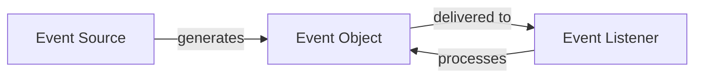

# Java Events Handling

## Introduction

Event handling is a fundamental concept in Java GUI programming that allows applications to respond to user interactions. When a user clicks a button, types in a text field, or performs any action on a graphical interface, an event is generated. Java's event handling mechanism provides a way to capture these events and execute code in response to them.

In this tutorial, we'll explore Java's event-driven programming model, understand the core components involved in event handling, and learn how to implement event handlers for various GUI components.

## Event Handling Fundamentals

Java uses a delegation event model where event handling is separated into three key components:



1. **Event Source**: Any component that generates events (like buttons, menus, or text fields)
2. **Event Object**: Contains information about the event that occurred
3. **Event Listener**: An object that receives and processes the event

## The Event Handling Process

The event handling process in Java follows these steps:

1. Register an event listener with an event source
2. Implement methods in the listener to handle specific events
3. When the user interacts with the component, an event object is created
4. The event object is passed to the appropriate method in the listener
5. The listener's method executes the code to respond to the event

## Common Event Listeners in Java

Java provides several event listener interfaces for different types of events:

| Listener Interface | Description | Common Events |
|-------------------|-------------|--------------|
| ActionListener | Responds to action events | Button clicks, menu selections |
| MouseListener | Responds to mouse events | Click, press, release, enter, exit |
| KeyListener | Responds to keyboard events | Key press, release, type |
| WindowListener | Responds to window events | Open, close, minimize, maximize |
| ItemListener | Responds to item selection events | Checkbox selection, dropdown selection |

## Implementing Event Handlers

### Basic Event Handling with ActionListener

Let's create a simple application with a button that displays a message when clicked:

```java
import javax.swing.*;
import java.awt.*;
import java.awt.event.*;

public class SimpleEventExample {
    public static void main(String[] args) {
        // Create a frame
        JFrame frame = new JFrame("Event Handling Example");
        frame.setDefaultCloseOperation(JFrame.EXIT_ON_CLOSE);
        frame.setSize(300, 200);
        frame.setLayout(new FlowLayout());
        
        // Create a button
        JButton button = new JButton("Click Me!");
        
        // Add ActionListener to the button
        button.addActionListener(new ActionListener() {
            public void actionPerformed(ActionEvent e) {
                JOptionPane.showMessageDialog(frame, "Button was clicked!");
            }
        });
        
        // Add button to frame
        frame.add(button);
        
        // Display the frame
        frame.setVisible(true);
    }
}
```

When you run this code, a window appears with a "Click Me!" button. When clicked, a dialog box shows the message "Button was clicked!".

### Using Lambda Expressions (Java 8+)

With Java 8 and later, you can use lambda expressions to simplify event handling:

```java
// Using lambda expression for ActionListener
button.addActionListener(e -> JOptionPane.showMessageDialog(frame, "Button was clicked!"));
```

This concise syntax is equivalent to the anonymous inner class approach shown earlier.

## Handling Multiple Events

You can handle multiple events from different components:

```java
import javax.swing.*;
import java.awt.*;
import java.awt.event.*;

public class MultipleEventsExample {
    public static void main(String[] args) {
        JFrame frame = new JFrame("Multiple Events Example");
        frame.setDefaultCloseOperation(JFrame.EXIT_ON_CLOSE);
        frame.setSize(400, 200);
        frame.setLayout(new FlowLayout());
        
        JButton button1 = new JButton("Button 1");
        JButton button2 = new JButton("Button 2");
        JLabel resultLabel = new JLabel("Click a button");
        
        // ActionListener for button1
        button1.addActionListener(e -> {
            resultLabel.setText("Button 1 was clicked!");
        });
        
        // ActionListener for button2
        button2.addActionListener(e -> {
            resultLabel.setText("Button 2 was clicked!");
        });
        
        frame.add(button1);
        frame.add(button2);
        frame.add(resultLabel);
        
        frame.setVisible(true);
    }
}
```

In this example, clicking each button updates the text in the label accordingly.

## Mouse Event Handling

To handle mouse events, implement the `MouseListener` interface:

```java
import javax.swing.*;
import java.awt.*;
import java.awt.event.*;

public class MouseEventExample {
    public static void main(String[] args) {
        JFrame frame = new JFrame("Mouse Events Example");
        frame.setDefaultCloseOperation(JFrame.EXIT_ON_CLOSE);
        frame.setSize(400, 300);
        
        JPanel panel = new JPanel();
        panel.setBackground(Color.WHITE);
        
        JLabel statusLabel = new JLabel("Move the mouse over the panel");
        
        // Add MouseListener to the panel
        panel.addMouseListener(new MouseListener() {
            @Override
            public void mouseClicked(MouseEvent e) {
                statusLabel.setText("Mouse clicked at: (" + e.getX() + ", " + e.getY() + ")");
            }
            
            @Override
            public void mousePressed(MouseEvent e) {
                statusLabel.setText("Mouse pressed");
            }
            
            @Override
            public void mouseReleased(MouseEvent e) {
                statusLabel.setText("Mouse released");
            }
            
            @Override
            public void mouseEntered(MouseEvent e) {
                panel.setBackground(Color.LIGHT_GRAY);
                statusLabel.setText("Mouse entered panel");
            }
            
            @Override
            public void mouseExited(MouseEvent e) {
                panel.setBackground(Color.WHITE);
                statusLabel.setText("Mouse exited panel");
            }
        });
        
        // For simplicity, use MouseAdapter instead of implementing all methods
        panel.addMouseMotionListener(new MouseMotionAdapter() {
            @Override
            public void mouseMoved(MouseEvent e) {
                statusLabel.setText("Mouse position: (" + e.getX() + ", " + e.getY() + ")");
            }
        });
        
        frame.setLayout(new BorderLayout());
        frame.add(panel, BorderLayout.CENTER);
        frame.add(statusLabel, BorderLayout.SOUTH);
        
        frame.setVisible(true);
    }
}
```

This example demonstrates how to handle various mouse events: clicking, entering/exiting a component, and tracking mouse position.

## Using Adapter Classes

When you only need to implement some methods of a listener interface, you can use adapter classes to avoid implementing all methods:

```java
// Using MouseAdapter instead of implementing MouseListener directly
panel.addMouseListener(new MouseAdapter() {
    @Override
    public void mouseClicked(MouseEvent e) {
        statusLabel.setText("Mouse clicked at: (" + e.getX() + ", " + e.getY() + ")");
    }
    
    @Override
    public void mouseEntered(MouseEvent e) {
        panel.setBackground(Color.LIGHT_GRAY);
    }
    
    @Override
    public void mouseExited(MouseEvent e) {
        panel.setBackground(Color.WHITE);
    }
});
```

Common adapter classes include:
- MouseAdapter
- KeyAdapter
- WindowAdapter
- ComponentAdapter

## Keyboard Event Handling

To handle keyboard events, implement the `KeyListener` interface:

```java
import javax.swing.*;
import java.awt.*;
import java.awt.event.*;

public class KeyEventExample {
    public static void main(String[] args) {
        JFrame frame = new JFrame("Key Events Example");
        frame.setDefaultCloseOperation(JFrame.EXIT_ON_CLOSE);
        frame.setSize(400, 300);
        
        JTextField textField = new JTextField(20);
        JLabel keyLabel = new JLabel("Type something");
        
        textField.addKeyListener(new KeyAdapter() {
            @Override
            public void keyPressed(KeyEvent e) {
                keyLabel.setText("Key pressed: " + KeyEvent.getKeyText(e.getKeyCode()) + 
                                " (code: " + e.getKeyCode() + ")");
            }
            
            @Override
            public void keyReleased(KeyEvent e) {
                keyLabel.setText("Key released: " + KeyEvent.getKeyText(e.getKeyCode()));
            }
            
            @Override
            public void keyTyped(KeyEvent e) {
                keyLabel.setText("Key typed: " + e.getKeyChar());
            }
        });
        
        JPanel panel = new JPanel();
        panel.setLayout(new FlowLayout());
        panel.add(textField);
        panel.add(keyLabel);
        
        frame.add(panel);
        frame.setVisible(true);
    }
}
```

This example shows how to capture keyboard events when typing in a text field.

## Real-World Application: Simple Calculator

Now, let's put our event handling knowledge to work by building a simple calculator:

```java
import javax.swing.*;
import java.awt.*;
import java.awt.event.*;

public class SimpleCalculator {
    private JFrame frame;
    private JTextField display;
    private double firstNumber = 0;
    private String operation = "";
    private boolean startNewInput = true;
    
    public SimpleCalculator() {
        // Create the main frame
        frame = new JFrame("Simple Calculator");
        frame.setDefaultCloseOperation(JFrame.EXIT_ON_CLOSE);
        frame.setSize(300, 400);
        frame.setLayout(new BorderLayout());
        
        // Create the display
        display = new JTextField("0");
        display.setEditable(false);
        display.setHorizontalAlignment(JTextField.RIGHT);
        display.setFont(new Font("Arial", Font.PLAIN, 24));
        frame.add(display, BorderLayout.NORTH);
        
        // Create the button panel
        JPanel buttonPanel = new JPanel();
        buttonPanel.setLayout(new GridLayout(5, 4, 5, 5));
        
        // Create and add buttons
        String[] buttonLabels = {
            "7", "8", "9", "/",
            "4", "5", "6", "*",
            "1", "2", "3", "-",
            "0", ".", "=", "+",
            "C", "CE", "", ""
        };
        
        for (String label : buttonLabels) {
            if (label.isEmpty()) {
                buttonPanel.add(new JLabel());
                continue;
            }
            
            JButton button = new JButton(label);
            button.setFont(new Font("Arial", Font.PLAIN, 18));
            button.addActionListener(new ButtonClickListener());
            buttonPanel.add(button);
        }
        
        frame.add(buttonPanel, BorderLayout.CENTER);
        frame.setVisible(true);
    }
    
    private class ButtonClickListener implements ActionListener {
        @Override
        public void actionPerformed(ActionEvent e) {
            String command = e.getActionCommand();
            
            // Handle digit buttons (0-9) and decimal point
            if ((command.charAt(0) >= '0' && command.charAt(0) <= '9') || command.equals(".")) {
                if (startNewInput) {
                    display.setText(command);
                    startNewInput = false;
                } else {
                    display.setText(display.getText() + command);
                }
            }
            // Handle operations
            else if (command.equals("+") || command.equals("-") || 
                     command.equals("*") || command.equals("/")) {
                firstNumber = Double.parseDouble(display.getText());
                operation = command;
                startNewInput = true;
            }
            // Handle equals button
            else if (command.equals("=")) {
                double secondNumber = Double.parseDouble(display.getText());
                double result = 0;
                
                switch (operation) {
                    case "+":
                        result = firstNumber + secondNumber;
                        break;
                    case "-":
                        result = firstNumber - secondNumber;
                        break;
                    case "*":
                        result = firstNumber * secondNumber;
                        break;
                    case "/":
                        if (secondNumber != 0) {
                            result = firstNumber / secondNumber;
                        } else {
                            display.setText("Error");
                            startNewInput = true;
                            return;
                        }
                        break;
                }
                
                display.setText(String.valueOf(result));
                startNewInput = true;
            }
            // Handle clear button
            else if (command.equals("C")) {
                display.setText("0");
                firstNumber = 0;
                operation = "";
                startNewInput = true;
            }
            // Handle clear entry button
            else if (command.equals("CE")) {
                display.setText("0");
                startNewInput = true;
            }
        }
    }
    
    public static void main(String[] args) {
        SwingUtilities.invokeLater(() -> new SimpleCalculator());
    }
}
```

This calculator example demonstrates how to handle events from multiple buttons and implement a functional application using event handling.

## Event Handling Best Practices

1. **Use the appropriate event listener** for the specific event you need to handle
2. **Keep event handlers short and focused** - delegate complex logic to other methods
3. **Consider using adapter classes** when you only need to implement a few methods
4. **Use lambda expressions** (Java 8+) for simpler and more readable event handling
5. **Prefer named inner classes** for complex or reusable listeners
6. **Avoid blocking the Event Dispatch Thread (EDT)** with long-running operations

## The Event Dispatch Thread (EDT)

In Swing applications, all GUI operations should be performed on the Event Dispatch Thread (EDT). The EDT is a special thread responsible for processing events and updating the UI.

```java
// Running code on the EDT using SwingUtilities.invokeLater
SwingUtilities.invokeLater(() -> {
    JFrame frame = new JFrame("EDT Example");
    // Set up the frame
    frame.setVisible(true);
});
```

For long-running operations, use `SwingWorker` to avoid freezing the UI:

```java
new SwingWorker<Void, Void>() {
    @Override
    protected Void doInBackground() throws Exception {
        // Long-running operation here
        return null;
    }
    
    @Override
    protected void done() {
        // Update UI here (runs on EDT)
    }
}.execute();
```

## Creating Custom Events

For advanced applications, you may need to create custom events:

1. **Create a custom event class** (extends `java.util.EventObject`)
2. **Define a listener interface** for the event
3. **Create methods to register/unregister listeners**
4. **Fire events** when appropriate

Here's a simple example:

```java
import java.util.EventObject;
import java.util.ArrayList;
import java.util.List;
import javax.swing.*;
import java.awt.*;

// 1. Custom event class
class TemperatureEvent extends EventObject {
    private double temperature;
    
    public TemperatureEvent(Object source, double temperature) {
        super(source);
        this.temperature = temperature;
    }
    
    public double getTemperature() {
        return temperature;
    }
}

// 2. Listener interface
interface TemperatureListener {
    void temperatureChanged(TemperatureEvent event);
}

// 3. Event source
class TemperatureSensor {
    private List<TemperatureListener> listeners = new ArrayList<>();
    private double temperature = 0.0;
    
    // Register a listener
    public void addTemperatureListener(TemperatureListener listener) {
        listeners.add(listener);
    }
    
    // Remove a listener
    public void removeTemperatureListener(TemperatureListener listener) {
        listeners.remove(listener);
    }
    
    // Set temperature and notify listeners
    public void setTemperature(double temperature) {
        this.temperature = temperature;
        
        // Fire the event
        TemperatureEvent event = new TemperatureEvent(this, temperature);
        for (TemperatureListener listener : listeners) {
            listener.temperatureChanged(event);
        }
    }
}

// Usage example
public class CustomEventExample {
    public static void main(String[] args) {
        JFrame frame = new JFrame("Custom Event Example");
        frame.setDefaultCloseOperation(JFrame.EXIT_ON_CLOSE);
        frame.setSize(400, 200);
        frame.setLayout(new FlowLayout());
        
        JLabel tempLabel = new JLabel("Temperature: 0.0°C");
        JSlider tempSlider = new JSlider(0, 100, 0);
        
        TemperatureSensor sensor = new TemperatureSensor();
        
        // Register listener
        sensor.addTemperatureListener(new TemperatureListener() {
            @Override
            public void temperatureChanged(TemperatureEvent event) {
                tempLabel.setText("Temperature: " + event.getTemperature() + "°C");
            }
        });
        
        // Connect slider to sensor
        tempSlider.addChangeListener(e -> {
            sensor.setTemperature(tempSlider.getValue());
        });
        
        frame.add(tempSlider);
        frame.add(tempLabel);
        frame.setVisible(true);
    }
}
```

This example demonstrates creating a custom event system for monitoring temperature changes.

## Summary

Java event handling is a powerful mechanism that enables interactive GUI applications:

- **Event model**: Based on event sources, event objects, and event listeners
- **Event registration**: Components register listeners to receive notifications
- **Event processing**: Listener methods are called when events occur
- **Adapter classes**: Simplify implementation by providing default method implementations
- **Lambda expressions**: Make event handling code more concise (Java 8+)

Mastering event handling is essential for building interactive Java applications that respond to user input. The event-driven model allows for clean separation between UI components and the logic that responds to user actions.

## Exercises

1. Create a simple drawing application that lets users draw lines by dragging the mouse
2. Implement a form with validation that checks input as the user types
3. Build a color picker that shows RGB values as sliders are adjusted
4. Create a simple game that responds to keyboard input (e.g., arrow keys)
5. Extend the calculator example to include memory functions and scientific operations

## Additional Resources

- [Oracle's Java Tutorials: Writing Event Listeners](https://docs.oracle.com/javase/tutorial/uiswing/events/index.html)
- [Java Event Handling Mechanisms](https://docs.oracle.com/javase/8/docs/api/java/awt/event/package-summary.html)
- [Working with the Event Dispatch Thread](https://docs.oracle.com/javase/tutorial/uiswing/concurrency/index.html)
- [Java Swing Documentation](https://docs.oracle.com/javase/8/docs/technotes/guides/swing/index.html)