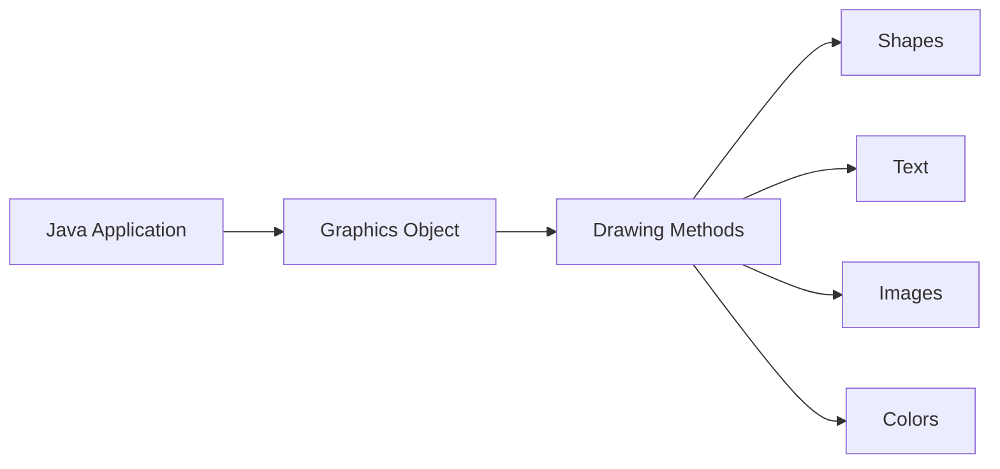

# Java Graphics Class

## Introduction

The `Graphics` class is a fundamental component in Java's Abstract Window Toolkit (AWT) that enables developers to create visual elements in Java applications. It serves as the foundation for all graphical operations in Java, providing methods for drawing shapes, text, images, and managing colors.

In this tutorial, we'll explore how to use the `Graphics` class to create visual elements in Java applications. Whether you're building a simple drawing application or a complex GUI, understanding the `Graphics` class is essential.

## Understanding the Graphics Class

The `Graphics` class is an abstract class in the `java.awt` package. It provides the basic tools for drawing in Java, acting as a canvas on which you can paint various elements. Since it's abstract, you don't create instances of it directly. Instead, Java provides instances when needed, like in `paint()` or `paintComponent()` methods.

### Key Concepts

1. **Coordinate System**: The Java graphics coordinate system starts from the top-left corner (0,0) with the x-axis extending to the right and the y-axis extending downward.

2. **Graphics Context**: The `Graphics` object represents a graphics context that contains state information about colors, fonts, and other drawing attributes.

3. **Double Buffering**: Modern Java applications often use double buffering to prevent flickering when updating graphics.



## Basic Drawing with the Graphics Class

### Setting Up a Simple Drawing Application

Let's create a simple application that demonstrates how to use the `Graphics` class:

```java
import javax.swing.*;
import java.awt.*;

public class SimpleDrawing extends JPanel {
    
    @Override
    protected void paintComponent(Graphics g) {
        super.paintComponent(g);
        
        // Set the drawing color to blue
        g.setColor(Color.BLUE);
        
        // Draw a rectangle
        g.drawRect(50, 50, 200, 100);
        
        // Fill a rectangle with the current color
        g.fillRect(300, 50, 200, 100);
        
        // Set the drawing color to red
        g.setColor(Color.RED);
        
        // Draw a circle (oval)
        g.drawOval(50, 200, 100, 100);
        
        // Fill a circle with the current color
        g.fillOval(300, 200, 100, 100);
    }
    
    public static void main(String[] args) {
        JFrame frame = new JFrame("Simple Drawing Example");
        frame.setDefaultCloseOperation(JFrame.EXIT_ON_CLOSE);
        frame.add(new SimpleDrawing());
        frame.setSize(550, 350);
        frame.setVisible(true);
    }
}
```

**Output:**

When you run this code, a window appears displaying:
- A blue outlined rectangle in the top-left
- A blue filled rectangle in the top-right
- A red outlined circle in the bottom-left
- A red filled circle in the bottom-right

### Common Drawing Methods

The `Graphics` class provides several methods for drawing different shapes:

| Method | Description |
|--------|-------------|
| `drawLine(int x1, int y1, int x2, int y2)` | Draws a line between points (x1, y1) and (x2, y2) |
| `drawRect(int x, int y, int width, int height)` | Draws the outline of a rectangle |
| `fillRect(int x, int y, int width, int height)` | Fills a rectangle with the current color |
| `drawOval(int x, int y, int width, int height)` | Draws the outline of an oval |
| `fillOval(int x, int y, int width, int height)` | Fills an oval with the current color |
| `drawArc(int x, int y, int width, int height, int startAngle, int arcAngle)` | Draws an arc |
| `fillArc(int x, int y, int width, int height, int startAngle, int arcAngle)` | Fills an arc |
| `drawPolygon(int[] xPoints, int[] yPoints, int nPoints)` | Draws a polygon |
| `fillPolygon(int[] xPoints, int[] yPoints, int nPoints)` | Fills a polygon |

## Drawing Text and Working with Fonts

### Drawing Text

The `Graphics` class allows you to render text on components using various methods:

```java
import javax.swing.*;
import java.awt.*;

public class TextExample extends JPanel {
    
    @Override
    protected void paintComponent(Graphics g) {
        super.paintComponent(g);
        
        // Set color to black
        g.setColor(Color.BLACK);
        
        // Default font
        g.drawString("Hello, this is default font!", 50, 50);
        
        // Change font to Serif, bold, 20pt
        Font serifFont = new Font("Serif", Font.BOLD, 20);
        g.setFont(serifFont);
        g.drawString("Hello, this is Serif Bold 20pt!", 50, 100);
        
        // Change font to SansSerif, italic, 16pt
        Font sansFont = new Font("SansSerif", Font.ITALIC, 16);
        g.setFont(sansFont);
        g.drawString("Hello, this is SansSerif Italic 16pt!", 50, 150);
        
        // Change color
        g.setColor(Color.BLUE);
        g.drawString("This text is blue!", 50, 200);
    }
    
    public static void main(String[] args) {
        JFrame frame = new JFrame("Text Example");
        frame.setDefaultCloseOperation(JFrame.EXIT_ON_CLOSE);
        frame.add(new TextExample());
        frame.setSize(500, 300);
        frame.setVisible(true);
    }
}
```

**Output:**

This displays different text samples with various fonts, styles, and colors in a window.

## Working with Colors

### Setting and Using Colors

Java provides several ways to define colors:

```java
import javax.swing.*;
import java.awt.*;

public class ColorExample extends JPanel {
    
    @Override
    protected void paintComponent(Graphics g) {
        super.paintComponent(g);
        
        // Predefined colors
        g.setColor(Color.RED);
        g.fillRect(50, 50, 100, 50);
        
        g.setColor(Color.GREEN);
        g.fillRect(200, 50, 100, 50);
        
        g.setColor(Color.BLUE);
        g.fillRect(350, 50, 100, 50);
        
        // RGB colors
        g.setColor(new Color(128, 0, 128));  // Purple
        g.fillRect(50, 150, 100, 50);
        
        // RGB with alpha (transparency)
        g.setColor(new Color(255, 165, 0, 128));  // Semi-transparent orange
        g.fillRect(200, 150, 100, 50);
        
        // HSB color
        g.setColor(Color.getHSBColor(0.6f, 0.8f, 0.9f));  // Light blue
        g.fillRect(350, 150, 100, 50);
    }
    
    public static void main(String[] args) {
        JFrame frame = new JFrame("Color Example");
        frame.setDefaultCloseOperation(JFrame.EXIT_ON_CLOSE);
        frame.add(new ColorExample());
        frame.setSize(500, 300);
        frame.setVisible(true);
    }
}
```

**Output:**

This displays rectangles with various colors, including predefined colors, RGB-defined colors, and colors with transparency.

## Drawing Images

The `Graphics` class allows you to display images in your applications:

```java
import javax.swing.*;
import java.awt.*;
import java.awt.image.BufferedImage;
import java.io.File;
import java.io.IOException;
import javax.imageio.ImageIO;

public class ImageExample extends JPanel {
    private BufferedImage image;
    
    public ImageExample() {
        try {
            // Load an image from file
            image = ImageIO.read(new File("sample.jpg"));
        } catch (IOException e) {
            e.printStackTrace();
        }
    }
    
    @Override
    protected void paintComponent(Graphics g) {
        super.paintComponent(g);
        
        if (image != null) {
            // Draw the full image
            g.drawImage(image, 50, 50, this);
            
            // Draw a scaled version of the image
            g.drawImage(image, 300, 50, 200, 150, this);
            
            // Draw a portion of the image
            g.drawImage(image, 50, 250, 200, 350, 100, 100, 300, 250, this);
        }
    }
    
    public static void main(String[] args) {
        JFrame frame = new JFrame("Image Example");
        frame.setDefaultCloseOperation(JFrame.EXIT_ON_CLOSE);
        frame.add(new ImageExample());
        frame.setSize(600, 400);
        frame.setVisible(true);
    }
}
```

**Note:** For this example to work, you'll need an image file named "sample.jpg" in the same directory as your Java class file.

## Advanced Graphics: Graphics2D

While the basic `Graphics` class is useful, Java provides an enhanced version called `Graphics2D` with additional capabilities:

```java
import javax.swing.*;
import java.awt.*;
import java.awt.geom.*;

public class Graphics2DExample extends JPanel {
    
    @Override
    protected void paintComponent(Graphics g) {
        super.paintComponent(g);
        
        // Cast to Graphics2D
        Graphics2D g2d = (Graphics2D) g;
        
        // Enable anti-aliasing for smooth edges
        g2d.setRenderingHint(RenderingHints.KEY_ANTIALIASING, RenderingHints.VALUE_ANTIALIAS_ON);
        
        // Draw a rounded rectangle
        RoundRectangle2D roundedRectangle = new RoundRectangle2D.Float(50, 50, 200, 100, 20, 20);
        g2d.setColor(Color.BLUE);
        g2d.fill(roundedRectangle);
        
        // Create a gradient
        GradientPaint gradient = new GradientPaint(300, 50, Color.RED, 500, 150, Color.YELLOW);
        g2d.setPaint(gradient);
        
        // Draw an ellipse with the gradient
        Ellipse2D ellipse = new Ellipse2D.Double(300, 50, 200, 100);
        g2d.fill(ellipse);
        
        // Set a stroke for thicker lines
        g2d.setStroke(new BasicStroke(5));
        g2d.setColor(Color.BLACK);
        
        // Draw a curved line
        QuadCurve2D quadCurve = new QuadCurve2D.Float(50, 200, 150, 100, 250, 200);
        g2d.draw(quadCurve);
        
        // Draw a cubic curve
        CubicCurve2D cubicCurve = new CubicCurve2D.Float(300, 200, 350, 100, 450, 300, 500, 200);
        g2d.draw(cubicCurve);
    }
    
    public static void main(String[] args) {
        JFrame frame = new JFrame("Graphics2D Example");
        frame.setDefaultCloseOperation(JFrame.EXIT_ON_CLOSE);
        frame.add(new Graphics2DExample());
        frame.setSize(600, 350);
        frame.setVisible(true);
    }
}
```

**Output:**

This displays advanced graphical elements including:
- A blue rounded rectangle
- An ellipse filled with a red-to-yellow gradient
- A thick black quadratic curve
- A thick black cubic curve

## Practical Example: Simple Paint Application

Let's build a simple paint application to demonstrate the practical use of the `Graphics` class:

```java
import javax.swing.*;
import java.awt.*;
import java.awt.event.*;
import java.util.ArrayList;

public class SimplePaint extends JPanel {
    // Store points for drawing
    private ArrayList<Point> points = new ArrayList<>();
    
    public SimplePaint() {
        // Add mouse listeners for drawing
        addMouseListener(new MouseAdapter() {
            public void mousePressed(MouseEvent e) {
                points.add(e.getPoint());
                repaint();
            }
        });
        
        addMouseMotionListener(new MouseMotionAdapter() {
            public void mouseDragged(MouseEvent e) {
                points.add(e.getPoint());
                repaint();
            }
        });
    }
    
    @Override
    protected void paintComponent(Graphics g) {
        super.paintComponent(g);
        
        // Draw white background
        g.setColor(Color.WHITE);
        g.fillRect(0, 0, getWidth(), getHeight());
        
        // Draw all points as small circles
        g.setColor(Color.BLACK);
        for (Point point : points) {
            g.fillOval(point.x - 2, point.y - 2, 5, 5);
        }
    }
    
    // Clear the drawing
    public void clearDrawing() {
        points.clear();
        repaint();
    }
    
    public static void main(String[] args) {
        JFrame frame = new JFrame("Simple Paint");
        SimplePaint paint = new SimplePaint();
        
        // Create a clear button
        JButton clearButton = new JButton("Clear");
        clearButton.addActionListener(e -> paint.clearDrawing());
        
        // Set up the frame
        frame.setDefaultCloseOperation(JFrame.EXIT_ON_CLOSE);
        frame.setLayout(new BorderLayout());
        frame.add(paint, BorderLayout.CENTER);
        frame.add(clearButton, BorderLayout.SOUTH);
        frame.setSize(600, 400);
        frame.setVisible(true);
    }
}
```

**How it works:**
1. We create a panel that tracks mouse movements
2. When the mouse is pressed or dragged, we add that point to our collection
3. In the `paintComponent` method, we draw all the collected points
4. A "Clear" button allows the user to reset the drawing

This simple paint application demonstrates how to:
- Handle mouse events
- Use the `Graphics` context to draw in response to user input
- Implement basic functionality of a drawing application

## Summary

The Java `Graphics` class is a powerful tool for creating visual elements in Java applications. In this tutorial, we've covered:

- The basics of the `Graphics` class and its coordinate system
- Drawing shapes like rectangles, ovals, and lines
- Working with text and fonts
- Managing colors and transparency
- Drawing and manipulating images
- Advanced graphics capabilities with `Graphics2D`
- Building a practical application using graphics

Understanding the `Graphics` class is essential for developing visually rich Java applications, from simple drawings to complex GUIs. The examples provided in this tutorial serve as a foundation for more advanced graphical applications in Java.

## Exercises

1. Create a program that draws a simple house with a roof, door, and windows using the `Graphics` class.
2. Modify the SimplePaint application to include color selection options.
3. Create an animation that moves a ball across the screen.
4. Build a simple pie chart using the `fillArc` method.
5. Create a custom clock face that draws hour, minute, and second hands.

## Additional Resources

- [Java Graphics Tutorial (Oracle Documentation)](https://docs.oracle.com/javase/tutorial/2d/index.html)
- [Java2D API Specification](https://docs.oracle.com/javase/8/docs/api/java/awt/Graphics2D.html)
- [Painting in AWT and Swing](https://www.oracle.com/java/technologies/painting.html)
- Books: "Java Graphics Programming" by Ahmed Binshahib
- Books: "Filthy Rich Clients: Developing Animated and Graphical Effects for Desktop Java Applications" by Chet Haase and Romain Guy

With these resources and the knowledge gained from this tutorial, you'll be well equipped to create advanced graphical applications in Java.