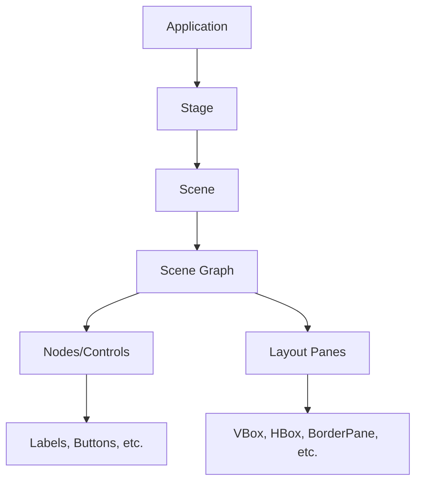

# Java JavaFX Introduction

## What is JavaFX?

JavaFX is a powerful Java library that enables developers to create rich desktop applications with modern user interfaces. It's the successor to Swing and AWT, offering more features and a more intuitive design approach that follows the Model-View-Controller (MVC) architectural pattern.

Introduced by Sun Microsystems in 2008 and now maintained by Oracle, JavaFX provides a comprehensive set of tools for building cross-platform applications that can run on various operating systems including Windows, macOS, and Linux.

## Why Use JavaFX?

JavaFX offers several advantages over older Java GUI frameworks:

- **Modern UI Design**: Create sleek, contemporary interfaces with CSS styling
- **Rich Components**: Extensive library of UI controls and layouts
- **Media Support**: Built-in support for audio, video, and animations
- **FXML**: Separation of UI design from application logic
- **Scene Builder**: Visual design tool for building interfaces
- **3D Graphics**: Support for 3D rendering capabilities
- **WebView**: Embedded web browser component

## Setting Up JavaFX

Starting with Java 11, JavaFX is no longer bundled with the JDK and must be added as a separate dependency. Here's how to set it up:

### Method 1: Using Maven

Add the following dependencies to your `pom.xml` file:

```xml
<dependencies>
    <dependency>
        <groupId>org.openjfx</groupId>
        <artifactId>javafx-controls</artifactId>
        <version>17.0.1</version>
    </dependency>
    <dependency>
        <groupId>org.openjfx</groupId>
        <artifactId>javafx-fxml</artifactId>
        <version>17.0.1</version>
    </dependency>
</dependencies>
```

### Method 2: Manual Download

1. Download the JavaFX SDK from [OpenJFX website](https://openjfx.io/)
2. Extract the ZIP file
3. Add the JavaFX library JAR files to your project
4. Configure VM options: `--module-path /path/to/javafx-sdk/lib --add-modules javafx.controls,javafx.fxml`

## Your First JavaFX Application

Let's create a simple "Hello World" application to get started:

```java
import javafx.application.Application;
import javafx.scene.Scene;
import javafx.scene.control.Label;
import javafx.scene.layout.StackPane;
import javafx.stage.Stage;

public class HelloWorldFX extends Application {

    @Override
    public void start(Stage primaryStage) {
        // Create a Label with text
        Label label = new Label("Hello, JavaFX World!");
        
        // Create a layout pane and add the label
        StackPane root = new StackPane();
        root.getChildren().add(label);
        
        // Create a scene with the layout pane
        Scene scene = new Scene(root, 300, 200);
        
        // Set the scene on the stage and configure it
        primaryStage.setTitle("My First JavaFX App");
        primaryStage.setScene(scene);
        primaryStage.show();
    }

    public static void main(String[] args) {
        // Launch the JavaFX application
        launch(args);
    }
}
```

When you run this code, you'll see a window like this:


## Understanding JavaFX Core Concepts

Let's break down the key components in a JavaFX application:



### 1. Application

The `Application` class is the entry point for all JavaFX applications. You extend this class and override the `start()` method to initialize and display your UI.

### 2. Stage

The `Stage` class represents the top-level container for a JavaFX application - essentially, it's the window that contains your application.

### 3. Scene

A `Scene` represents the content within the window. A stage can display different scenes at different times (like different screens in an application).

### 4. Scene Graph

The scene graph is a hierarchical structure of nodes (UI elements) that make up your interface. It contains:

- **Nodes/Controls**: UI elements like buttons, labels, text fields
- **Layout Panes**: Containers that manage the arrangement of nodes

## Common JavaFX Controls

JavaFX provides a rich set of UI controls. Here are some of the most frequently used:

### Basic Controls

```java
// Label - displays text
Label nameLabel = new Label("Enter your name:");

// Button - performs an action when clicked
Button submitButton = new Button("Submit");
submitButton.setOnAction(e -> System.out.println("Button clicked!"));

// TextField - for text input
TextField nameField = new TextField();
nameField.setPromptText("Your name here");

// CheckBox - for boolean selections
CheckBox agreeCheckbox = new CheckBox("I agree to terms");

// RadioButton - for mutually exclusive options
RadioButton maleRadio = new RadioButton("Male");
RadioButton femaleRadio = new RadioButton("Female");

// Create a toggle group to make radio buttons exclusive
ToggleGroup genderGroup = new ToggleGroup();
maleRadio.setToggleGroup(genderGroup);
femaleRadio.setToggleGroup(genderGroup);
```

## Layout Panes in JavaFX

Layout panes manage the arrangement of UI elements. Here are some common ones:

### HBox and VBox

```java
// HBox - arranges elements in a horizontal row
HBox hbox = new HBox(10); // 10 pixels of spacing between elements
hbox.getChildren().addAll(new Button("One"), new Button("Two"), new Button("Three"));

// VBox - arranges elements in a vertical column
VBox vbox = new VBox(10); // 10 pixels of spacing between elements
vbox.getChildren().addAll(new Button("Top"), new Button("Middle"), new Button("Bottom"));
```

### BorderPane

BorderPane divides the space into five regions: top, bottom, left, right, and center.

```java
BorderPane borderPane = new BorderPane();
borderPane.setTop(new Label("This is the top area"));
borderPane.setBottom(new Button("Bottom Button"));
borderPane.setLeft(new Button("Left"));
borderPane.setRight(new Button("Right"));
borderPane.setCenter(new TextArea("Center content here"));
```

### GridPane

GridPane arranges elements in a flexible grid of rows and columns:

```java
GridPane grid = new GridPane();
grid.setHgap(10); // Horizontal gap
grid.setVgap(10); // Vertical gap

// Add a label at column 0, row 0
grid.add(new Label("Name:"), 0, 0);
// Add a text field at column 1, row 0
grid.add(new TextField(), 1, 0);
// Add a label at column 0, row 1
grid.add(new Label("Email:"), 0, 1);
// Add a text field at column 1, row 1
grid.add(new TextField(), 1, 1);
// Add a button that spans 2 columns at row 2
grid.add(new Button("Submit"), 0, 2, 2, 1);
```

## Practical Example: User Registration Form

Let's create a more complete example - a user registration form:

```java
import javafx.application.Application;
import javafx.geometry.Insets;
import javafx.geometry.Pos;
import javafx.scene.Scene;
import javafx.scene.control.*;
import javafx.scene.layout.GridPane;
import javafx.scene.layout.HBox;
import javafx.scene.text.Font;
import javafx.scene.text.FontWeight;
import javafx.scene.text.Text;
import javafx.stage.Stage;

public class RegistrationForm extends Application {

    @Override
    public void start(Stage primaryStage) {
        // Create the form grid
        GridPane grid = new GridPane();
        grid.setAlignment(Pos.CENTER);
        grid.setHgap(10);
        grid.setVgap(10);
        grid.setPadding(new Insets(25, 25, 25, 25));

        // Add title
        Text sceneTitle = new Text("Welcome");
        sceneTitle.setFont(Font.font("Tahoma", FontWeight.NORMAL, 20));
        grid.add(sceneTitle, 0, 0, 2, 1);

        // Name Label and Field
        Label nameLabel = new Label("Full Name:");
        grid.add(nameLabel, 0, 1);
        
        TextField nameTextField = new TextField();
        grid.add(nameTextField, 1, 1);

        // Email Label and Field
        Label emailLabel = new Label("Email:");
        grid.add(emailLabel, 0, 2);
        
        TextField emailTextField = new TextField();
        grid.add(emailTextField, 1, 2);

        // Password Label and Field
        Label pwLabel = new Label("Password:");
        grid.add(pwLabel, 0, 3);
        
        PasswordField pwField = new PasswordField();
        grid.add(pwField, 1, 3);

        // Gender selection
        Label genderLabel = new Label("Gender:");
        grid.add(genderLabel, 0, 4);
        
        HBox genderBox = new HBox(20);
        RadioButton maleRadio = new RadioButton("Male");
        RadioButton femaleRadio = new RadioButton("Female");
        ToggleGroup genderGroup = new ToggleGroup();
        maleRadio.setToggleGroup(genderGroup);
        femaleRadio.setToggleGroup(genderGroup);
        genderBox.getChildren().addAll(maleRadio, femaleRadio);
        grid.add(genderBox, 1, 4);

        // Terms checkbox
        CheckBox termsCheckBox = new CheckBox("I agree to terms");
        grid.add(termsCheckBox, 1, 5);

        // Buttons
        Button registerBtn = new Button("Register");
        Button clearBtn = new Button("Clear");
        
        HBox buttonBox = new HBox(10);
        buttonBox.setAlignment(Pos.BOTTOM_RIGHT);
        buttonBox.getChildren().addAll(registerBtn, clearBtn);
        grid.add(buttonBox, 1, 6);

        // Message text
        final Text actionTarget = new Text();
        grid.add(actionTarget, 1, 7);

        // Register button action
        registerBtn.setOnAction(e -> {
            if (termsCheckBox.isSelected()) {
                actionTarget.setText("Registration successful!");
            } else {
                actionTarget.setText("You must agree to terms");
            }
        });

        // Clear button action
        clearBtn.setOnAction(e -> {
            nameTextField.clear();
            emailTextField.clear();
            pwField.clear();
            termsCheckBox.setSelected(false);
            genderGroup.selectToggle(null);
            actionTarget.setText("");
        });

        // Create the scene and set it on the stage
        Scene scene = new Scene(grid, 400, 350);
        primaryStage.setTitle("Registration Form");
        primaryStage.setScene(scene);
        primaryStage.show();
    }

    public static void main(String[] args) {
        launch(args);
    }
}
```

This registration form demonstrates several key JavaFX concepts:
- Layout management with GridPane
- Form controls (labels, text fields, radio buttons, etc.)
- Event handling with lambda expressions
- Visual organization and spacing

When run, it looks like this:


## Styling with CSS

JavaFX allows you to style your UI with CSS, similar to web development. Here's a simple example:

```java
// In your JavaFX application
Scene scene = new Scene(root, 300, 200);
scene.getStylesheets().add("styles.css");
```

And in your `styles.css` file:

```css
/* Target elements by their type */
.button {
    -fx-background-color: #4CAF50;
    -fx-text-fill: white;
    -fx-font-weight: bold;
}

/* Target elements by ID */
#submitButton {
    -fx-background-color: #008CBA;
}

/* Target elements by class */
.important-label {
    -fx-text-fill: red;
    -fx-font-size: 14px;
}
```

To apply an ID or class to a JavaFX control:

```java
Button submitBtn = new Button("Submit");
submitBtn.setId("submitButton");

Label errorLabel = new Label("This field is required");
errorLabel.getStyleClass().add("important-label");
```

## Summary

In this introduction to JavaFX, we've covered:

- What JavaFX is and why it's useful for building modern desktop applications
- How to set up JavaFX in your Java projects
- Creating your first JavaFX application
- Core concepts like Application, Stage, Scene, and Nodes
- Common UI controls and how to use them
- Different layout panes for organizing your UI elements
- A practical example of a registration form
- Basics of styling with CSS

JavaFX offers a powerful platform for creating rich, interactive desktop applications with Java. Its modern architecture and extensive component library make it a strong choice for GUI development.

## Additional Resources

- [Official JavaFX Documentation](https://openjfx.io/javadoc/17/)
- [Getting Started with JavaFX](https://openjfx.io/openjfx-docs/)
- [Scene Builder Download](https://gluonhq.com/products/scene-builder/) - Visual layout tool
- [JavaFX CSS Reference Guide](https://docs.oracle.com/javase/8/javafx/api/javafx/scene/doc-files/cssref.html)

## Exercises

1. Modify the "Hello World" application to include a button that changes the label text when clicked.
2. Create a simple calculator application with buttons for digits and basic operations.
3. Build a to-do list application where users can add, edit, and remove tasks.
4. Create a login form that checks for a predefined username and password.
5. Build an image gallery application that displays a grid of images and allows the user to view them in larger size when clicked.