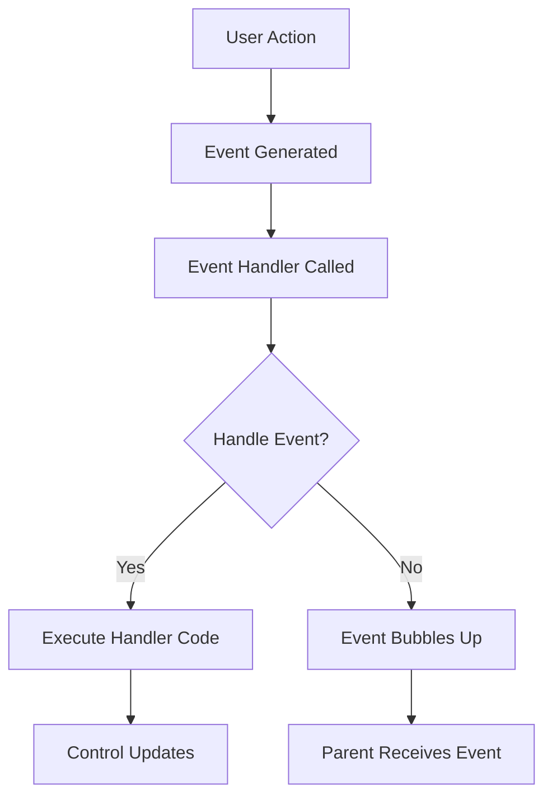

# Java JavaFX Controls

## Introduction

JavaFX provides a rich set of user interface controls that allow developers to create interactive and visually appealing applications. These controls are the building blocks of any JavaFX application, enabling users to input data, make selections, and trigger actions in your programs.

In this tutorial, we'll explore the most commonly used JavaFX controls and learn how to implement them in your applications. Whether you're creating a simple form or a complex application interface, understanding these controls is essential for effective Java GUI programming.

## Getting Started with JavaFX Controls

Before diving into specific controls, let's understand what JavaFX controls are and how they fit into the JavaFX scene graph model.

JavaFX controls are specialized nodes in the scene graph that provide interactive elements for user input and display of information. They inherit from the `Control` class, which itself extends from `Region`, providing them with styling capabilities through CSS.

To use JavaFX controls in your application, you need to:

1. Import the appropriate packages
2. Instantiate the controls
3. Configure their properties
4. Add them to a layout container
5. Handle their events

Let's start with a simple example that demonstrates the basic pattern:

```java
import javafx.application.Application;
import javafx.scene.Scene;
import javafx.scene.control.Button;
import javafx.scene.layout.StackPane;
import javafx.stage.Stage;

public class SimpleControlExample extends Application {
    @Override
    public void start(Stage primaryStage) {
        // Create a button control
        Button btn = new Button("Click Me!");
        
        // Set an action for the button
        btn.setOnAction(e -> {
            System.out.println("Button clicked!");
        });
        
        // Create a layout container
        StackPane root = new StackPane();
        
        // Add the button to the container
        root.getChildren().add(btn);
        
        // Set up the scene and stage
        Scene scene = new Scene(root, 300, 200);
        primaryStage.setTitle("Simple Control Example");
        primaryStage.setScene(scene);
        primaryStage.show();
    }
    
    public static void main(String[] args) {
        launch(args);
    }
}
```

When you run this code, a simple window appears with a button in the center. When clicked, the button outputs "Button clicked!" to the console.

## Common JavaFX Controls

Let's explore the most commonly used JavaFX controls, organized by their function:

### Button Controls

Button controls are used to trigger actions in your application.

#### Button

The `Button` control represents a standard push button that performs an action when clicked.

```java
Button saveButton = new Button("Save");
saveButton.setOnAction(e -> {
    // Save functionality here
    System.out.println("Save button clicked");
});
```

#### ToggleButton

`ToggleButton` is a button that can be selected (pressed) or unselected (not pressed).

```java
ToggleButton toggleButton = new ToggleButton("Bold");
toggleButton.setOnAction(e -> {
    if (toggleButton.isSelected()) {
        System.out.println("Bold is ON");
    } else {
        System.out.println("Bold is OFF");
    }
});
```

#### RadioButton

`RadioButton` controls are used in groups where only one can be selected at a time.

```java
ToggleGroup group = new ToggleGroup();
RadioButton rb1 = new RadioButton("Option 1");
RadioButton rb2 = new RadioButton("Option 2");
rb1.setToggleGroup(group);
rb2.setToggleGroup(group);
rb1.setSelected(true);

group.selectedToggleProperty().addListener((observable, oldValue, newValue) -> {
    RadioButton selected = (RadioButton) newValue;
    System.out.println("Selected: " + selected.getText());
});
```

#### CheckBox

`CheckBox` is used to create a selectable item that can be toggled on or off.

```java
CheckBox checkBox = new CheckBox("Subscribe to newsletter");
checkBox.selectedProperty().addListener((observable, oldValue, newValue) -> {
    System.out.println("Subscribed: " + newValue);
});
```

### Text Input Controls

#### TextField

`TextField` allows users to enter a single line of plain text.

```java
TextField nameField = new TextField();
nameField.setPromptText("Enter your name");
nameField.textProperty().addListener((observable, oldValue, newValue) -> {
    System.out.println("Name changed to: " + newValue);
});
```

#### PasswordField

`PasswordField` is similar to TextField but masks the characters entered, typically used for password entry.

```java
PasswordField passwordField = new PasswordField();
passwordField.setPromptText("Enter password");
```

#### TextArea

`TextArea` allows users to enter multiple lines of plain text.

```java
TextArea commentArea = new TextArea();
commentArea.setPromptText("Enter your comments here");
commentArea.setPrefRowCount(5);
```

### Choice Controls

#### ComboBox

`ComboBox` provides a drop-down list from which users can select one item.

```java
ComboBox<String> comboBox = new ComboBox<>();
comboBox.getItems().addAll("Option 1", "Option 2", "Option 3");
comboBox.setValue("Option 1");
comboBox.setOnAction(e -> {
    System.out.println("Selected: " + comboBox.getValue());
});
```

#### ChoiceBox

`ChoiceBox` is similar to ComboBox but with simpler functionality.

```java
ChoiceBox<String> choiceBox = new ChoiceBox<>();
choiceBox.getItems().addAll("Small", "Medium", "Large");
choiceBox.setValue("Medium");
choiceBox.getSelectionModel().selectedItemProperty().addListener((observable, oldValue, newValue) -> {
    System.out.println("Size: " + newValue);
});
```

#### ListView

`ListView` displays a list of items that can be selected.

```java
ListView<String> listView = new ListView<>();
listView.getItems().addAll("Item 1", "Item 2", "Item 3", "Item 4");
listView.getSelectionModel().setSelectionMode(SelectionMode.MULTIPLE);
listView.getSelectionModel().selectedItemProperty().addListener((observable, oldValue, newValue) -> {
    System.out.println("Selected: " + newValue);
});
```

### Range Controls

#### Slider

`Slider` allows users to select a value by moving a thumb along a track.

```java
Slider slider = new Slider(0, 100, 50);
slider.setShowTickLabels(true);
slider.setShowTickMarks(true);
slider.setMajorTickUnit(25);
slider.valueProperty().addListener((observable, oldValue, newValue) -> {
    System.out.println("Slider value: " + newValue);
});
```

#### ProgressBar

`ProgressBar` shows the progress of a task.

```java
ProgressBar progressBar = new ProgressBar(0);
// To update progress:
progressBar.setProgress(0.75); // 75% complete
```

#### ProgressIndicator

`ProgressIndicator` is similar to ProgressBar but displayed as a circular indicator.

```java
ProgressIndicator progressIndicator = new ProgressIndicator(0.5); // 50% complete
```

### Complex Controls

#### TableView

`TableView` displays data in a table format with rows and columns.

```java
// Define a simple Person class
class Person {
    private final SimpleStringProperty firstName;
    private final SimpleStringProperty lastName;
    private final SimpleIntegerProperty age;
    
    public Person(String firstName, String lastName, int age) {
        this.firstName = new SimpleStringProperty(firstName);
        this.lastName = new SimpleStringProperty(lastName);
        this.age = new SimpleIntegerProperty(age);
    }
    
    public String getFirstName() { return firstName.get(); }
    public String getLastName() { return lastName.get(); }
    public int getAge() { return age.get(); }
}

// Create TableView
TableView<Person> tableView = new TableView<>();

// Define columns
TableColumn<Person, String> firstNameCol = new TableColumn<>("First Name");
firstNameCol.setCellValueFactory(new PropertyValueFactory<>("firstName"));

TableColumn<Person, String> lastNameCol = new TableColumn<>("Last Name");
lastNameCol.setCellValueFactory(new PropertyValueFactory<>("lastName"));

TableColumn<Person, Integer> ageCol = new TableColumn<>("Age");
ageCol.setCellValueFactory(new PropertyValueFactory<>("age"));

// Add columns to TableView
tableView.getColumns().addAll(firstNameCol, lastNameCol, ageCol);

// Add data
tableView.getItems().add(new Person("John", "Doe", 25));
tableView.getItems().add(new Person("Jane", "Smith", 30));
tableView.getItems().add(new Person("Bob", "Johnson", 45));
```

#### TreeView

`TreeView` displays hierarchical data in a tree structure.

```java
TreeItem<String> rootItem = new TreeItem<>("Root");
rootItem.setExpanded(true);

TreeItem<String> item1 = new TreeItem<>("Item 1");
TreeItem<String> item2 = new TreeItem<>("Item 2");
item2.getChildren().add(new TreeItem<>("Subitem 2.1"));
item2.getChildren().add(new TreeItem<>("Subitem 2.2"));

rootItem.getChildren().addAll(item1, item2);

TreeView<String> treeView = new TreeView<>(rootItem);
```

## Styling Controls

JavaFX controls can be styled using CSS. You can apply styles directly to individual controls or create style sheets for your entire application.

### Inline Styling

```java
Button button = new Button("Styled Button");
button.setStyle("-fx-background-color: #4CAF50; -fx-text-fill: white;");
```

### External CSS

Create a CSS file (e.g., `styles.css`):

```css
.button {
    -fx-background-color: #4CAF50;
    -fx-text-fill: white;
    -fx-font-weight: bold;
}

.text-field {
    -fx-prompt-text-fill: gray;
    -fx-background-radius: 5;
}
```

Apply it to your scene:

```java
Scene scene = new Scene(root, 600, 400);
scene.getStylesheets().add("styles.css");
```

## Practical Example: Creating a Registration Form

Let's combine multiple controls to create a registration form:

```java
import javafx.application.Application;
import javafx.geometry.Insets;
import javafx.scene.Scene;
import javafx.scene.control.*;
import javafx.scene.layout.GridPane;
import javafx.stage.Stage;

public class RegistrationForm extends Application {

    @Override
    public void start(Stage primaryStage) {
        // Create a grid pane layout
        GridPane grid = new GridPane();
        grid.setPadding(new Insets(20));
        grid.setVgap(10);
        grid.setHgap(10);

        // Create form controls
        Label nameLabel = new Label("Name:");
        TextField nameField = new TextField();
        
        Label emailLabel = new Label("Email:");
        TextField emailField = new TextField();
        
        Label passwordLabel = new Label("Password:");
        PasswordField passwordField = new PasswordField();
        
        Label genderLabel = new Label("Gender:");
        ToggleGroup genderGroup = new ToggleGroup();
        RadioButton maleRadio = new RadioButton("Male");
        RadioButton femaleRadio = new RadioButton("Female");
        RadioButton otherRadio = new RadioButton("Other");
        maleRadio.setToggleGroup(genderGroup);
        femaleRadio.setToggleGroup(genderGroup);
        otherRadio.setToggleGroup(genderGroup);
        
        Label interestsLabel = new Label("Interests:");
        CheckBox sportsCheckbox = new CheckBox("Sports");
        CheckBox musicCheckbox = new CheckBox("Music");
        CheckBox travelCheckbox = new CheckBox("Travel");
        
        Label countryLabel = new Label("Country:");
        ComboBox<String> countryComboBox = new ComboBox<>();
        countryComboBox.getItems().addAll("USA", "Canada", "UK", "Australia", "Japan");
        
        Label commentLabel = new Label("Comments:");
        TextArea commentArea = new TextArea();
        commentArea.setPrefRowCount(3);
        
        Button submitButton = new Button("Submit");
        submitButton.setOnAction(e -> {
            // Validate and process form data
            if (nameField.getText().isEmpty() || emailField.getText().isEmpty() || 
                    passwordField.getText().isEmpty() || genderGroup.getSelectedToggle() == null) {
                showAlert("Required fields are empty!");
                return;
            }
            
            // Show success message
            StringBuilder userData = new StringBuilder();
            userData.append("Registration successful!\n\n");
            userData.append("Name: ").append(nameField.getText()).append("\n");
            userData.append("Email: ").append(emailField.getText()).append("\n");
            userData.append("Gender: ").append(((RadioButton) genderGroup.getSelectedToggle()).getText()).append("\n");
            
            userData.append("Interests: ");
            if (sportsCheckbox.isSelected()) userData.append("Sports ");
            if (musicCheckbox.isSelected()) userData.append("Music ");
            if (travelCheckbox.isSelected()) userData.append("Travel ");
            userData.append("\n");
            
            if (countryComboBox.getValue() != null) {
                userData.append("Country: ").append(countryComboBox.getValue()).append("\n");
            }
            
            if (!commentArea.getText().isEmpty()) {
                userData.append("Comments: ").append(commentArea.getText());
            }
            
            showInfo(userData.toString());
        });

        // Add controls to the grid
        grid.add(nameLabel, 0, 0);
        grid.add(nameField, 1, 0);
        
        grid.add(emailLabel, 0, 1);
        grid.add(emailField, 1, 1);
        
        grid.add(passwordLabel, 0, 2);
        grid.add(passwordField, 1, 2);
        
        grid.add(genderLabel, 0, 3);
        
        GridPane genderPane = new GridPane();
        genderPane.setHgap(10);
        genderPane.add(maleRadio, 0, 0);
        genderPane.add(femaleRadio, 1, 0);
        genderPane.add(otherRadio, 2, 0);
        grid.add(genderPane, 1, 3);
        
        grid.add(interestsLabel, 0, 4);
        
        GridPane interestsPane = new GridPane();
        interestsPane.setHgap(10);
        interestsPane.add(sportsCheckbox, 0, 0);
        interestsPane.add(musicCheckbox, 1, 0);
        interestsPane.add(travelCheckbox, 2, 0);
        grid.add(interestsPane, 1, 4);
        
        grid.add(countryLabel, 0, 5);
        grid.add(countryComboBox, 1, 5);
        
        grid.add(commentLabel, 0, 6);
        grid.add(commentArea, 1, 6);
        
        grid.add(submitButton, 1, 7);

        // Create scene and show
        Scene scene = new Scene(grid, 500, 400);
        primaryStage.setTitle("Registration Form");
        primaryStage.setScene(scene);
        primaryStage.show();
    }
    
    private void showAlert(String message) {
        Alert alert = new Alert(Alert.AlertType.ERROR);
        alert.setTitle("Error");
        alert.setHeaderText(null);
        alert.setContentText(message);
        alert.showAndWait();
    }
    
    private void showInfo(String message) {
        Alert alert = new Alert(Alert.AlertType.INFORMATION);
        alert.setTitle("Registration Complete");
        alert.setHeaderText(null);
        alert.setContentText(message);
        alert.showAndWait();
    }

    public static void main(String[] args) {
        launch(args);
    }
}
```

When you run this code, you'll get a registration form with various controls. The form validates input and displays a summary of the entered information when submitted.

## Control Lifecycle and Event Handling

Understanding the lifecycle of controls and how to handle their events is crucial for creating interactive applications.

Here's a diagram illustrating the control event flow:



### Common Events

Most controls have specific events you can handle:

1. **ActionEvent** - Generated when buttons are clicked or items are selected
2. **MouseEvent** - Generated when mouse actions occur
3. **KeyEvent** - Generated when keyboard actions occur
4. **ChangeEvent** - Generated when the value of a control changes

### Event Registration Example

```java
Button button = new Button("Click Me");

// Method 1: Using setOnAction
button.setOnAction(event -> {
    System.out.println("Button clicked!");
});

// Method 2: Using addEventHandler
button.addEventHandler(ActionEvent.ACTION, event -> {
    System.out.println("Button clicked (via event handler)!");
});

// Method 3: Using addEventFilter (captures events at an earlier phase)
button.addEventFilter(ActionEvent.ACTION, event -> {
    System.out.println("Button click filtered!");
});
```

## Best Practices for Working with JavaFX Controls

1. **Group related controls** - Use appropriate layout containers (HBox, VBox, GridPane) to organize controls logically
2. **Provide feedback** - Use tooltips and visual feedback to help users understand control functionality
3. **Validate input** - Always validate user input before processing
4. **Use binding** - Utilize JavaFX's property binding features to keep your UI and data in sync
5. **Apply consistent styling** - Use CSS to maintain a consistent look and feel
6. **Consider accessibility** - Provide keyboard navigation and screen reader support
7. **Handle errors gracefully** - Show meaningful error messages when something goes wrong

## Summary

JavaFX controls provide a rich set of UI components that allow you to build interactive user interfaces for your Java applications. In this guide, we covered:

- Basic controls like buttons, text fields, and checkboxes
- Selection controls like combo boxes, radio buttons, and list views
- Complex controls like TableView and TreeView
- How to style controls using CSS
- How to handle control events
- A practical example of building a registration form

With these fundamentals, you can create a wide variety of user interfaces for your Java applications. As you develop more advanced applications, you might want to explore custom controls, data binding, and more sophisticated event handling techniques.

## Additional Resources

1. [JavaFX API Documentation](https://openjfx.io/javadoc/16/)
2. [Oracle JavaFX UI Controls Tutorial](https://docs.oracle.com/javase/8/javafx/user-interface-tutorial/ui-controls.htm)
3. [JavaFX CSS Reference Guide](https://openjfx.io/javadoc/16/javafx.graphics/javafx/scene/doc-files/cssref.html)

## Exercises

1. Create a simple calculator using JavaFX controls (buttons, text field)
2. Build a to-do list application with the ability to add, edit, and delete tasks
3. Create a form that validates different types of input (email, phone number, required fields)
4. Build a multi-step wizard interface using different controls
5. Create a custom control by extending an existing JavaFX control class