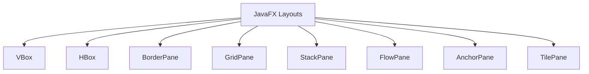

# Java JavaFX Layouts

## Introduction

Layouts in JavaFX are container classes that control the positioning and sizing of user interface elements (nodes) within your application. They provide a structured way to organize components, ensuring your application looks good and remains usable across different screen sizes and resolutions.

Understanding JavaFX layouts is essential for creating well-designed user interfaces. Unlike absolute positioning, where you specify exact coordinates for each element, layouts automatically adjust components based on their container's size and the layout's rules. This creates responsive interfaces that adapt to different window sizes and display settings.

In this tutorial, we'll explore the most commonly used JavaFX layouts, their properties, and how to implement them effectively in your applications.

## Basic Concepts

Before diving into specific layout types, let's understand some fundamental concepts:

1. **Parent and Child Nodes**: In JavaFX, layouts are parent nodes that contain child nodes (UI components).
2. **Layout Properties**: Each layout type offers specific properties to control how children are positioned.
3. **Nesting Layouts**: Complex UIs often combine multiple layout containers.
4. **Responsive Design**: Layouts should adjust to different window sizes and orientations.

## Common JavaFX Layout Containers

JavaFX provides several layout containers, each with unique characteristics:



Let's explore each of these layout types in detail.

## 1. VBox Layout

VBox arranges nodes vertically in a single column.

### Key Properties:
- **spacing**: Sets the gap between nodes
- **alignment**: Controls how nodes are aligned within the container
- **margin**: Sets spacing around individual nodes

### Example:

```java
import javafx.application.Application;
import javafx.geometry.Insets;
import javafx.geometry.Pos;
import javafx.scene.Scene;
import javafx.scene.control.Button;
import javafx.scene.control.Label;
import javafx.scene.layout.VBox;
import javafx.stage.Stage;

public class VBoxExample extends Application {
    @Override
    public void start(Stage primaryStage) {
        // Create the VBox with 10px spacing
        VBox vbox = new VBox(10);
        vbox.setPadding(new Insets(15));
        vbox.setAlignment(Pos.CENTER);
        
        // Add components
        Label titleLabel = new Label("VBox Layout Example");
        Button button1 = new Button("Button 1");
        Button button2 = new Button("Button 2");
        Button button3 = new Button("Button 3");
        
        // Add nodes to the VBox
        vbox.getChildren().addAll(titleLabel, button1, button2, button3);
        
        // Create the scene
        Scene scene = new Scene(vbox, 300, 250);
        
        // Configure stage
        primaryStage.setTitle("VBox Example");
        primaryStage.setScene(scene);
        primaryStage.show();
    }

    public static void main(String[] args) {
        launch(args);
    }
}
```

In this example, three buttons and a label are arranged vertically with 10-pixel spacing between them. The VBox is centered and has 15-pixel padding around its edges.

## 2. HBox Layout

HBox arranges nodes horizontally in a single row.

### Key Properties:
- **spacing**: Sets the gap between nodes
- **alignment**: Controls how nodes are aligned within the container
- **margin**: Sets spacing around individual nodes

### Example:

```java
import javafx.application.Application;
import javafx.geometry.Insets;
import javafx.geometry.Pos;
import javafx.scene.Scene;
import javafx.scene.control.Button;
import javafx.scene.layout.HBox;
import javafx.stage.Stage;

public class HBoxExample extends Application {
    @Override
    public void start(Stage primaryStage) {
        // Create the HBox with 10px spacing
        HBox hbox = new HBox(10);
        hbox.setPadding(new Insets(15));
        hbox.setAlignment(Pos.CENTER);
        
        // Add buttons
        Button button1 = new Button("Button 1");
        Button button2 = new Button("Button 2");
        Button button3 = new Button("Button 3");
        
        // Add nodes to the HBox
        hbox.getChildren().addAll(button1, button2, button3);
        
        // Create the scene
        Scene scene = new Scene(hbox, 300, 100);
        
        // Configure stage
        primaryStage.setTitle("HBox Example");
        primaryStage.setScene(scene);
        primaryStage.show();
    }

    public static void main(String[] args) {
        launch(args);
    }
}
```

This example creates three buttons arranged horizontally in an HBox with 10-pixel spacing.

## 3. BorderPane Layout

BorderPane divides the screen into five regions: top, bottom, left, right, and center.

### Key Regions:
- **Top**: Typically used for menus and toolbars
- **Bottom**: Often contains status bars
- **Left and Right**: Navigation panels or toolbars
- **Center**: Main content area

### Example:

```java
import javafx.application.Application;
import javafx.geometry.Insets;
import javafx.scene.Scene;
import javafx.scene.control.Button;
import javafx.scene.control.Label;
import javafx.scene.layout.BorderPane;
import javafx.scene.layout.HBox;
import javafx.stage.Stage;

public class BorderPaneExample extends Application {
    @Override
    public void start(Stage primaryStage) {
        // Create the BorderPane
        BorderPane borderPane = new BorderPane();
        borderPane.setPadding(new Insets(10));
        
        // Create components for each region
        HBox topRegion = new HBox(10);
        topRegion.setPadding(new Insets(10));
        topRegion.getChildren().add(new Label("Top Region - Menu Bar"));
        
        HBox bottomRegion = new HBox(10);
        bottomRegion.setPadding(new Insets(10));
        bottomRegion.getChildren().add(new Label("Bottom Region - Status Bar"));
        
        Button leftButton = new Button("Left Region");
        Button rightButton = new Button("Right Region");
        Label centerContent = new Label("Center Region - Main Content Area");
        
        // Set the components in their regions
        borderPane.setTop(topRegion);
        borderPane.setBottom(bottomRegion);
        borderPane.setLeft(leftButton);
        borderPane.setRight(rightButton);
        borderPane.setCenter(centerContent);
        
        // Create the scene
        Scene scene = new Scene(borderPane, 450, 300);
        
        // Configure stage
        primaryStage.setTitle("BorderPane Example");
        primaryStage.setScene(scene);
        primaryStage.show();
    }

    public static void main(String[] args) {
        launch(args);
    }
}
```

This example demonstrates how BorderPane divides the screen into five regions, each containing different UI elements.

## 4. GridPane Layout

GridPane arranges nodes in a flexible grid of rows and columns.

### Key Properties:
- **rowIndex/columnIndex**: Specifies a node's position in the grid
- **rowSpan/columnSpan**: Controls how many rows/columns a node spans
- **alignment**: Positions the grid within its container
- **hgap/vgap**: Sets horizontal and vertical spacing between cells

### Example:

```java
import javafx.application.Application;
import javafx.geometry.Insets;
import javafx.geometry.Pos;
import javafx.scene.Scene;
import javafx.scene.control.Button;
import javafx.scene.control.Label;
import javafx.scene.control.TextField;
import javafx.scene.layout.GridPane;
import javafx.stage.Stage;

public class GridPaneExample extends Application {
    @Override
    public void start(Stage primaryStage) {
        // Create the GridPane
        GridPane grid = new GridPane();
        grid.setPadding(new Insets(10));
        grid.setHgap(10); // Horizontal gap
        grid.setVgap(10); // Vertical gap
        grid.setAlignment(Pos.CENTER);
        
        // Add components to specific cells
        Label nameLabel = new Label("Name:");
        grid.add(nameLabel, 0, 0);  // column 0, row 0
        
        TextField nameField = new TextField();
        grid.add(nameField, 1, 0);  // column 1, row 0
        
        Label emailLabel = new Label("Email:");
        grid.add(emailLabel, 0, 1);  // column 0, row 1
        
        TextField emailField = new TextField();
        grid.add(emailField, 1, 1);  // column 1, row 1
        
        Button submitButton = new Button("Submit");
        // This button spans 2 columns and is in row 2
        grid.add(submitButton, 0, 2, 2, 1);
        
        // Create the scene
        Scene scene = new Scene(grid, 300, 200);
        
        // Configure stage
        primaryStage.setTitle("GridPane Example");
        primaryStage.setScene(scene);
        primaryStage.show();
    }

    public static void main(String[] args) {
        launch(args);
    }
}
```

This example creates a simple form layout using GridPane, with labels in the first column and text fields in the second column. The submit button spans both columns.

## 5. StackPane Layout

StackPane places nodes on top of each other in a stack. This layout is useful for overlapping elements.

### Key Properties:
- **alignment**: Controls the position of children within the stack
- **margin**: Sets spacing around individual nodes

### Example:

```java
import javafx.application.Application;
import javafx.geometry.Pos;
import javafx.scene.Scene;
import javafx.scene.control.Button;
import javafx.scene.layout.StackPane;
import javafx.scene.paint.Color;
import javafx.scene.shape.Rectangle;
import javafx.stage.Stage;

public class StackPaneExample extends Application {
    @Override
    public void start(Stage primaryStage) {
        // Create the StackPane
        StackPane stackPane = new StackPane();
        stackPane.setAlignment(Pos.CENTER);
        
        // Create components
        Rectangle background = new Rectangle(200, 150);
        background.setFill(Color.LIGHTBLUE);
        
        Button button = new Button("Click Me!");
        
        // Add nodes to the stack (first added appears on bottom)
        stackPane.getChildren().addAll(background, button);
        
        // Create the scene
        Scene scene = new Scene(stackPane, 300, 200);
        
        // Configure stage
        primaryStage.setTitle("StackPane Example");
        primaryStage.setScene(scene);
        primaryStage.show();
    }

    public static void main(String[] args) {
        launch(args);
    }
}
```

In this example, a button is stacked on top of a light blue rectangle. Both are centered within the StackPane.

## 6. FlowPane Layout

FlowPane arranges nodes in rows or columns that wrap when they reach the boundary of the layout.

### Key Properties:
- **orientation**: Horizontal (default) or Vertical
- **hgap/vgap**: Sets horizontal and vertical spacing between cells
- **alignment**: Controls the position of the flow within the container
- **prefWrapLength**: Sets the preferred width or height where wrapping occurs

### Example:

```java
import javafx.application.Application;
import javafx.geometry.Insets;
import javafx.geometry.Orientation;
import javafx.scene.Scene;
import javafx.scene.control.Button;
import javafx.scene.layout.FlowPane;
import javafx.stage.Stage;

public class FlowPaneExample extends Application {
    @Override
    public void start(Stage primaryStage) {
        // Create the FlowPane
        FlowPane flowPane = new FlowPane(Orientation.HORIZONTAL, 10, 10); // 10px gaps
        flowPane.setPadding(new Insets(10));
        flowPane.setPrefWrapLength(300); // preferred wrap length
        
        // Add multiple buttons
        for (int i = 1; i <= 10; i++) {
            Button button = new Button("Button " + i);
            flowPane.getChildren().add(button);
        }
        
        // Create the scene
        Scene scene = new Scene(flowPane, 350, 200);
        
        // Configure stage
        primaryStage.setTitle("FlowPane Example");
        primaryStage.setScene(scene);
        primaryStage.show();
    }

    public static void main(String[] args) {
        launch(args);
    }
}
```

This example creates a FlowPane with 10 buttons that wrap to new lines when they reach the edge of the container.

## 7. AnchorPane Layout

AnchorPane allows nodes to be anchored to the top, bottom, left, or right sides of the container.

### Key Properties:
- **topAnchor**: Distance from the top edge
- **bottomAnchor**: Distance from the bottom edge
- **leftAnchor**: Distance from the left edge
- **rightAnchor**: Distance from the right edge

### Example:

```java
import javafx.application.Application;
import javafx.scene.Scene;
import javafx.scene.control.Button;
import javafx.scene.layout.AnchorPane;
import javafx.stage.Stage;

public class AnchorPaneExample extends Application {
    @Override
    public void start(Stage primaryStage) {
        // Create the AnchorPane
        AnchorPane anchorPane = new AnchorPane();
        
        // Create buttons for each corner
        Button topLeftBtn = new Button("Top Left");
        Button topRightBtn = new Button("Top Right");
        Button bottomLeftBtn = new Button("Bottom Left");
        Button bottomRightBtn = new Button("Bottom Right");
        Button centerBtn = new Button("Center");
        
        // Add buttons to the AnchorPane
        anchorPane.getChildren().addAll(
            topLeftBtn, topRightBtn, 
            bottomLeftBtn, bottomRightBtn,
            centerBtn
        );
        
        // Set anchors for top left button
        AnchorPane.setTopAnchor(topLeftBtn, 10.0);
        AnchorPane.setLeftAnchor(topLeftBtn, 10.0);
        
        // Set anchors for top right button
        AnchorPane.setTopAnchor(topRightBtn, 10.0);
        AnchorPane.setRightAnchor(topRightBtn, 10.0);
        
        // Set anchors for bottom left button
        AnchorPane.setBottomAnchor(bottomLeftBtn, 10.0);
        AnchorPane.setLeftAnchor(bottomLeftBtn, 10.0);
        
        // Set anchors for bottom right button
        AnchorPane.setBottomAnchor(bottomRightBtn, 10.0);
        AnchorPane.setRightAnchor(bottomRightBtn, 10.0);
        
        // Set anchors for center button (all sides)
        AnchorPane.setTopAnchor(centerBtn, 80.0);
        AnchorPane.setRightAnchor(centerBtn, 80.0);
        AnchorPane.setBottomAnchor(centerBtn, 80.0);
        AnchorPane.setLeftAnchor(centerBtn, 80.0);
        
        // Create the scene
        Scene scene = new Scene(anchorPane, 350, 250);
        
        // Configure stage
        primaryStage.setTitle("AnchorPane Example");
        primaryStage.setScene(scene);
        primaryStage.show();
    }

    public static void main(String[] args) {
        launch(args);
    }
}
```

This example creates an AnchorPane with buttons anchored to each corner and the center. The buttons will maintain their distances from their respective anchored sides even when the window is resized.

## 8. TilePane Layout

TilePane arranges nodes in uniformly-sized cells in rows and columns.

### Key Properties:
- **orientation**: Horizontal (default) or Vertical
- **hgap/vgap**: Sets horizontal and vertical spacing between tiles
- **prefRows/prefColumns**: Sets the preferred number of rows or columns
- **tileAlignment**: Controls the position of nodes within each tile

### Example:

```java
import javafx.application.Application;
import javafx.geometry.Insets;
import javafx.geometry.Pos;
import javafx.scene.Scene;
import javafx.scene.control.Button;
import javafx.scene.layout.TilePane;
import javafx.stage.Stage;

public class TilePaneExample extends Application {
    @Override
    public void start(Stage primaryStage) {
        // Create the TilePane
        TilePane tilePane = new TilePane();
        tilePane.setPadding(new Insets(10));
        tilePane.setHgap(10);
        tilePane.setVgap(10);
        tilePane.setPrefColumns(3); // prefer 3 columns
        tilePane.setTileAlignment(Pos.CENTER);
        
        // Add buttons of different sizes (they'll appear in uniform tiles)
        for (int i = 1; i <= 9; i++) {
            Button button = new Button("Button " + i);
            // Make some buttons larger to demonstrate tile uniformity
            if (i % 3 == 0) {
                button.setPrefSize(100, 20);
            }
            tilePane.getChildren().add(button);
        }
        
        // Create the scene
        Scene scene = new Scene(tilePane, 350, 250);
        
        // Configure stage
        primaryStage.setTitle("TilePane Example");
        primaryStage.setScene(scene);
        primaryStage.show();
    }

    public static void main(String[] args) {
        launch(args);
    }
}
```

This example creates a TilePane with 9 buttons arranged in 3 columns. Each tile has the same size, regardless of its content's size.

## Practical Example: Contact Form Application

Let's build a more complex example combining multiple layouts to create a practical contact form application:

```java
import javafx.application.Application;
import javafx.geometry.Insets;
import javafx.geometry.Pos;
import javafx.scene.Scene;
import javafx.scene.control.*;
import javafx.scene.layout.*;
import javafx.stage.Stage;

public class ContactFormApplication extends Application {
    @Override
    public void start(Stage primaryStage) {
        // Create the root BorderPane
        BorderPane root = new BorderPane();
        
        // Create the header
        Label headerLabel = new Label("Contact Form");
        headerLabel.setStyle("-fx-font-size: 20px; -fx-font-weight: bold;");
        HBox header = new HBox(headerLabel);
        header.setPadding(new Insets(15));
        header.setAlignment(Pos.CENTER);
        header.setStyle("-fx-background-color: #f0f0f0;");
        
        // Create the form using GridPane
        GridPane form = new GridPane();
        form.setPadding(new Insets(20));
        form.setHgap(10);
        form.setVgap(10);
        form.setAlignment(Pos.CENTER);
        
        // Add form fields
        form.add(new Label("First Name:"), 0, 0);
        form.add(new TextField(), 1, 0);
        
        form.add(new Label("Last Name:"), 0, 1);
        form.add(new TextField(), 1, 1);
        
        form.add(new Label("Email:"), 0, 2);
        form.add(new TextField(), 1, 2);
        
        form.add(new Label("Phone:"), 0, 3);
        form.add(new TextField(), 1, 3);
        
        form.add(new Label("Message:"), 0, 4);
        TextArea messageArea = new TextArea();
        messageArea.setPrefRowCount(5);
        form.add(messageArea, 1, 4);
        
        // Create the button section using HBox
        HBox buttonSection = new HBox(10);
        buttonSection.setAlignment(Pos.CENTER_RIGHT);
        buttonSection.setPadding(new Insets(10));
        
        Button resetButton = new Button("Reset");
        Button submitButton = new Button("Submit");
        submitButton.setDefaultButton(true);
        buttonSection.getChildren().addAll(resetButton, submitButton);
        
        // Add event handlers
        resetButton.setOnAction(e -> {
            // Clear all form fields
            for (javafx.scene.Node node : form.getChildren()) {
                if (node instanceof TextField) {
                    ((TextField) node).clear();
                } else if (node instanceof TextArea) {
                    ((TextArea) node).clear();
                }
            }
        });
        
        submitButton.setOnAction(e -> {
            // In a real app, this would submit the form
            Alert alert = new Alert(Alert.AlertType.INFORMATION);
            alert.setTitle("Form Submitted");
            alert.setHeaderText("Thank you!");
            alert.setContentText("Your message has been submitted successfully.");
            alert.showAndWait();
        });
        
        // Create a status bar for the bottom
        HBox statusBar = new HBox();
        statusBar.setPadding(new Insets(5));
        statusBar.setStyle("-fx-background-color: #f0f0f0;");
        Label statusLabel = new Label("Ready to submit");
        statusBar.getChildren().add(statusLabel);
        
        // Add all sections to the BorderPane
        root.setTop(header);
        root.setCenter(form);
        root.setBottom(VBox.margin(buttonSection, new Insets(10)));
        root.setBottom(new VBox(buttonSection, statusBar));
        
        // Create the scene
        Scene scene = new Scene(root, 450, 400);
        
        // Configure stage
        primaryStage.setTitle("Contact Form");
        primaryStage.setScene(scene);
        primaryStage.show();
    }

    public static void main(String[] args) {
        launch(args);
    }
}
```

This example demonstrates how multiple layouts (BorderPane, GridPane, HBox, VBox) can be combined to create a cohesive user interface. The form has:

1. A header (HBox) at the top
2. A form section (GridPane) in the center
3. A button section (HBox) and status bar at the bottom

## Choosing the Right Layout

Here's a quick guide to help you choose the appropriate layout for your needs:

- **VBox/HBox**: When you need simple vertical or horizontal arrangement of components
- **BorderPane**: For classic application layouts with distinct regions
- **GridPane**: For form layouts or when you need precise grid-based arrangements
- **StackPane**: When components need to be layered on top of each other
- **FlowPane**: For collections of elements that should reflow when space is limited
- **AnchorPane**: When you need elements anchored to specific points or edges
- **TilePane**: For uniform grid layouts where each cell should have the same size

## Summary

JavaFX layouts are powerful tools for organizing UI components in your Java applications. They provide flexibility, responsiveness, and make it easier to create professional-looking interfaces. In this tutorial, we've covered:

1. The basic principles of JavaFX layouts
2. Eight different layout containers and their unique properties
3. Code examples for each layout type
4. A practical example combining multiple layouts

By mastering these layouts, you'll be able to create complex, responsive user interfaces without having to manually position each element. Remember that layouts can be nested to create sophisticated interfaces, and proper use of spacing, padding, and alignment properties will help you create clean, professional designs.

## Exercises

1. Create a simple calculator interface using GridPane for the number pad and BorderPane for the overall structure.
2. Build a file browser interface with a TreeView in a left pane and a content view in the center using BorderPane.
3. Create a photo gallery application that displays images in a FlowPane that adapts to the window size.
4. Design a music player interface using various layouts, including controls at the bottom and a playlist on the side.
5. Implement a responsive dashboard that uses various panes and adjusts its layout based on the window size.

## Additional Resources

- [JavaFX API Documentation](https://openjfx.io/javadoc/17/)
- [Oracle's JavaFX Layout Tutorial](https://docs.oracle.com/javase/8/javafx/layout-tutorial/index.html)
- [JavaFX CSS Reference Guide](https://openjfx.io/javadoc/17/javafx.graphics/javafx/scene/doc-files/cssref.html)
- [Scene Builder](https://gluonhq.com/products/scene-builder/) - Visual layout tool for JavaFX

Happy coding!