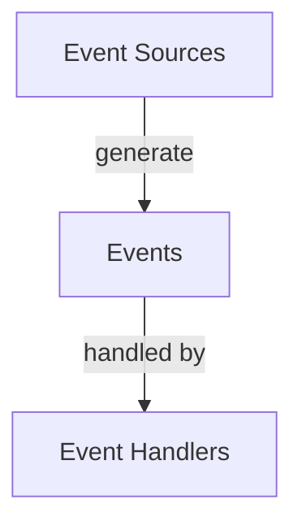

# Java JavaFX Events

Events are the foundation of interactive applications in JavaFX. They allow your application to respond to user actions such as mouse clicks, key presses, or window resizing. Understanding events and how to handle them is crucial for creating responsive and user-friendly applications.

## What are JavaFX Events?

In JavaFX, events are objects that represent something that happened in the user interface. These events can be triggered by:

- User actions (mouse clicks, key presses)
- System changes (window resizing, focus changes)
- Application logic (custom events)

JavaFX uses an event-driven programming model where your application waits for events to occur and then responds to them through event handlers.

## The JavaFX Event Model

JavaFX's event model consists of three main components:



1. **Event Sources**: UI components that generate events (e.g., buttons, text fields)
2. **Events**: Objects representing actions or occurrences
3. **Event Handlers**: Code that executes in response to specific events

## Common JavaFX Event Types

JavaFX provides many event classes, all extending from `javafx.event.Event`. Here are some of the most commonly used event types:

| Event Class | Description | Common Use Cases |
|-------------|-------------|------------------|
| `MouseEvent` | Events generated by mouse actions | Clicks, drags, movement |
| `KeyEvent` | Events generated by keyboard actions | Key presses, releases |
| `ActionEvent` | High-level events from UI controls | Button clicks, menu selections |
| `WindowEvent` | Events related to window actions | Window closing, showing |
| `ScrollEvent` | Events from scrolling operations | Scrolling lists, zooming |
| `DragEvent` | Events from drag-and-drop operations | Dragging items between components |

## Basic Event Handling in JavaFX

Let's start with a simple example of adding an event handler to a button:

```java
import javafx.application.Application;
import javafx.scene.Scene;
import javafx.scene.control.Button;
import javafx.scene.layout.StackPane;
import javafx.stage.Stage;

public class BasicEventHandling extends Application {
    
    @Override
    public void start(Stage primaryStage) {
        Button btn = new Button("Click Me!");
        
        // Add an event handler to the button
        btn.setOnAction(event -> {
            System.out.println("Button clicked!");
            btn.setText("Clicked!");
        });
        
        StackPane root = new StackPane();
        root.getChildren().add(btn);
        
        Scene scene = new Scene(root, 300, 250);
        primaryStage.setTitle("JavaFX Event Example");
        primaryStage.setScene(scene);
        primaryStage.show();
    }
    
    public static void main(String[] args) {
        launch(args);
    }
}
```

When you run this program, a window appears with a button labeled "Click Me!". When clicked, the button's text changes to "Clicked!" and a message is printed to the console.

**Output in console when button is clicked:**
```
Button clicked!
```

## Ways to Handle Events

JavaFX offers several approaches to handle events:

### 1. Lambda Expressions (Recommended for simple handlers)

```java
button.setOnAction(event -> System.out.println("Button clicked!"));
```

### 2. Anonymous Inner Classes

```java
button.setOnAction(new EventHandler<ActionEvent>() {
    @Override
    public void handle(ActionEvent event) {
        System.out.println("Button clicked!");
    }
});
```

### 3. Named Method References

```java
button.setOnAction(this::handleButtonClick);

// Method defined elsewhere in the class
private void handleButtonClick(ActionEvent event) {
    System.out.println("Button clicked!");
}
```

### 4. Implementing EventHandler Interface

```java
public class MyController implements EventHandler<ActionEvent> {
    private Button button;
    
    public void initialize() {
        button.setOnAction(this);
    }
    
    @Override
    public void handle(ActionEvent event) {
        System.out.println("Button clicked!");
    }
}
```

## Event Bubbling and Capturing

JavaFX events follow a propagation model where events can travel through the node hierarchy. This process has three phases:

1. **Capturing Phase**: Event travels from root to target
2. **Target Phase**: Event reaches the target node
3. **Bubbling Phase**: Event bubbles up from target to root

Most event handlers in JavaFX are registered for the bubbling phase by default.

## Working with Mouse Events

Mouse events provide information about mouse actions like clicks, movement, and dragging. Here's an example that demonstrates different mouse events:

```java
import javafx.application.Application;
import javafx.scene.Scene;
import javafx.scene.control.Label;
import javafx.scene.input.MouseEvent;
import javafx.scene.layout.VBox;
import javafx.scene.paint.Color;
import javafx.scene.shape.Rectangle;
import javafx.stage.Stage;

public class MouseEventDemo extends Application {
    
    private Label statusLabel;
    
    @Override
    public void start(Stage primaryStage) {
        Rectangle rect = new Rectangle(200, 100);
        rect.setFill(Color.LIGHTBLUE);
        
        statusLabel = new Label("Mouse events will be displayed here");
        
        // Register different mouse event handlers
        rect.setOnMouseEntered(this::handleMouseEvent);
        rect.setOnMouseExited(this::handleMouseEvent);
        rect.setOnMousePressed(this::handleMouseEvent);
        rect.setOnMouseReleased(this::handleMouseEvent);
        rect.setOnMouseClicked(this::handleMouseEvent);
        rect.setOnMouseMoved(this::handleMouseEvent);
        
        VBox root = new VBox(10);
        root.getChildren().addAll(rect, statusLabel);
        
        Scene scene = new Scene(root, 300, 200);
        primaryStage.setTitle("Mouse Events Demo");
        primaryStage.setScene(scene);
        primaryStage.show();
    }
    
    private void handleMouseEvent(MouseEvent event) {
        String eventType = event.getEventType().toString();
        double x = event.getX();
        double y = event.getY();
        
        statusLabel.setText(String.format("Event: %s at position (%.1f, %.1f)", 
                                          eventType, x, y));
    }
    
    public static void main(String[] args) {
        launch(args);
    }
}
```

This program displays a blue rectangle that responds to various mouse events, showing information about each event in a label.

## Working with Keyboard Events

Keyboard events allow you to handle key presses and releases. Here's an example:

```java
import javafx.application.Application;
import javafx.scene.Scene;
import javafx.scene.control.Label;
import javafx.scene.control.TextField;
import javafx.scene.input.KeyCode;
import javafx.scene.input.KeyEvent;
import javafx.scene.layout.VBox;
import javafx.stage.Stage;

public class KeyEventDemo extends Application {
    
    private Label statusLabel;
    
    @Override
    public void start(Stage primaryStage) {
        TextField textField = new TextField();
        textField.setPromptText("Type something...");
        
        statusLabel = new Label("Key events will be displayed here");
        
        textField.setOnKeyPressed(this::handleKeyEvent);
        textField.setOnKeyReleased(this::handleKeyEvent);
        textField.setOnKeyTyped(this::handleKeyEvent);
        
        VBox root = new VBox(10);
        root.getChildren().addAll(textField, statusLabel);
        
        Scene scene = new Scene(root, 300, 200);
        primaryStage.setTitle("Keyboard Events Demo");
        primaryStage.setScene(scene);
        primaryStage.show();
    }
    
    private void handleKeyEvent(KeyEvent event) {
        String eventType = event.getEventType().toString();
        String keyInfo;
        
        if (event.getEventType() == KeyEvent.KEY_TYPED) {
            keyInfo = "Character: " + event.getCharacter();
        } else {
            keyInfo = "Key code: " + event.getCode();
        }
        
        statusLabel.setText(String.format("Event: %s, %s", eventType, keyInfo));
        
        // Special handling for the Escape key
        if (event.getCode() == KeyCode.ESCAPE && event.getEventType() == KeyEvent.KEY_PRESSED) {
            statusLabel.setText(statusLabel.getText() + " (ESC pressed - special action)");
        }
    }
    
    public static void main(String[] args) {
        launch(args);
    }
}
```

This example shows how to handle different keyboard events and access information about the keys that were pressed.

## Event Filters

Event filters are similar to event handlers but operate during the capturing phase of event propagation. They allow you to intercept events before they reach their target:

```java
// Adding an event filter to a node
node.addEventFilter(MouseEvent.MOUSE_CLICKED, event -> {
    System.out.println("Event filter executed");
    // event.consume(); // Uncomment to prevent the event from propagating further
});
```

## Custom Events

Sometimes you need to create your own event types for application-specific actions. Here's how to create and fire custom events:

```java
import javafx.application.Application;
import javafx.event.Event;
import javafx.event.EventHandler;
import javafx.event.EventType;
import javafx.scene.Scene;
import javafx.scene.control.Button;
import javafx.scene.control.Label;
import javafx.scene.layout.VBox;
import javafx.stage.Stage;

public class CustomEventDemo extends Application {
    
    // Define a custom event type
    public static final EventType<CustomEvent> CUSTOM_EVENT_TYPE = 
        new EventType<>(Event.ANY, "CUSTOM_EVENT");
    
    // Define a custom event class
    public static class CustomEvent extends Event {
        private final String message;
        
        public CustomEvent(String message) {
            super(CUSTOM_EVENT_TYPE);
            this.message = message;
        }
        
        public String getMessage() {
            return message;
        }
    }
    
    @Override
    public void start(Stage primaryStage) {
        VBox root = new VBox(10);
        Label resultLabel = new Label("No custom events yet");
        Button fireEventBtn = new Button("Fire Custom Event");
        
        // Add event handler for custom events
        root.addEventHandler(CUSTOM_EVENT_TYPE, event -> {
            if (event instanceof CustomEvent) {
                resultLabel.setText("Custom event received: " + 
                                   ((CustomEvent) event).getMessage());
            }
        });
        
        // Fire a custom event when button is clicked
        fireEventBtn.setOnAction(event -> {
            CustomEvent customEvent = new CustomEvent("Hello from custom event!");
            root.fireEvent(customEvent);
        });
        
        root.getChildren().addAll(fireEventBtn, resultLabel);
        
        Scene scene = new Scene(root, 300, 200);
        primaryStage.setTitle("Custom Events Demo");
        primaryStage.setScene(scene);
        primaryStage.show();
    }
    
    public static void main(String[] args) {
        launch(args);
    }
}
```

## Real-world Example: Form Validation with Events

Here's a practical example of using events for form validation in a registration form:

```java
import javafx.application.Application;
import javafx.geometry.Insets;
import javafx.scene.Scene;
import javafx.scene.control.*;
import javafx.scene.layout.GridPane;
import javafx.stage.Stage;

public class FormValidationDemo extends Application {
    
    private TextField nameField;
    private TextField emailField;
    private PasswordField passwordField;
    private PasswordField confirmPasswordField;
    private Label validationLabel;
    private Button submitButton;
    
    @Override
    public void start(Stage primaryStage) {
        // Create UI components
        Label nameLabel = new Label("Name:");
        nameField = new TextField();
        
        Label emailLabel = new Label("Email:");
        emailField = new TextField();
        
        Label passwordLabel = new Label("Password:");
        passwordField = new PasswordField();
        
        Label confirmLabel = new Label("Confirm Password:");
        confirmPasswordField = new PasswordField();
        
        validationLabel = new Label("");
        validationLabel.setStyle("-fx-text-fill: red;");
        
        submitButton = new Button("Register");
        submitButton.setDisable(true);
        
        // Set up the layout
        GridPane grid = new GridPane();
        grid.setPadding(new Insets(20));
        grid.setVgap(10);
        grid.setHgap(10);
        
        grid.add(nameLabel, 0, 0);
        grid.add(nameField, 1, 0);
        grid.add(emailLabel, 0, 1);
        grid.add(emailField, 1, 1);
        grid.add(passwordLabel, 0, 2);
        grid.add(passwordField, 1, 2);
        grid.add(confirmLabel, 0, 3);
        grid.add(confirmPasswordField, 1, 3);
        grid.add(validationLabel, 0, 4, 2, 1);
        grid.add(submitButton, 1, 5);
        
        // Set up event handlers for form validation
        nameField.textProperty().addListener((observable, oldValue, newValue) -> {
            validateForm();
        });
        
        emailField.textProperty().addListener((observable, oldValue, newValue) -> {
            validateForm();
        });
        
        passwordField.textProperty().addListener((observable, oldValue, newValue) -> {
            validateForm();
        });
        
        confirmPasswordField.textProperty().addListener((observable, oldValue, newValue) -> {
            validateForm();
        });
        
        // Submit button event handler
        submitButton.setOnAction(event -> {
            Alert alert = new Alert(Alert.AlertType.INFORMATION);
            alert.setTitle("Form Submitted");
            alert.setHeaderText(null);
            alert.setContentText("Registration successful for: " + nameField.getText());
            alert.showAndWait();
        });
        
        // Set the scene
        Scene scene = new Scene(grid, 400, 300);
        primaryStage.setTitle("Registration Form");
        primaryStage.setScene(scene);
        primaryStage.show();
    }
    
    private void validateForm() {
        String errorMessage = "";
        boolean valid = true;
        
        // Validate name
        if (nameField.getText().trim().isEmpty()) {
            errorMessage += "Name is required.\n";
            valid = false;
        }
        
        // Validate email
        String email = emailField.getText().trim();
        if (email.isEmpty()) {
            errorMessage += "Email is required.\n";
            valid = false;
        } else if (!email.matches("[a-zA-Z0-9._%+-]+@[a-zA-Z0-9.-]+\\.[a-zA-Z]{2,}")) {
            errorMessage += "Invalid email format.\n";
            valid = false;
        }
        
        // Validate password
        String password = passwordField.getText();
        if (password.isEmpty()) {
            errorMessage += "Password is required.\n";
            valid = false;
        } else if (password.length() < 6) {
            errorMessage += "Password must be at least 6 characters.\n";
            valid = false;
        }
        
        // Validate password confirmation
        String confirmPassword = confirmPasswordField.getText();
        if (!confirmPassword.equals(password)) {
            errorMessage += "Passwords do not match.\n";
            valid = false;
        }
        
        // Update UI based on validation result
        validationLabel.setText(errorMessage);
        submitButton.setDisable(!valid);
    }
    
    public static void main(String[] args) {
        launch(args);
    }
}
```

This example demonstrates:
- Real-time form validation using property change events
- Enabling/disabling the submit button based on validation status
- Providing immediate feedback to the user about form errors

## Summary

In this tutorial, we've covered:

- Basic concepts of JavaFX events
- Different ways to handle events
- Working with mouse and keyboard events
- Event propagation (bubbling and capturing)
- Creating and handling custom events
- A practical example of form validation using events

Events are a fundamental part of JavaFX applications, allowing you to create interactive and responsive user interfaces. By understanding how to work with events effectively, you can create applications that provide a better user experience.

## Additional Resources

- [JavaFX API Documentation on Events](https://openjfx.io/javadoc/17/javafx.base/javafx/event/Event.html)
- [Oracle's JavaFX Event Handling Tutorial](https://docs.oracle.com/javase/8/javafx/events-tutorial/events.htm)
- [JavaFX Property Binding and Events](https://openjfx.io/javadoc/17/javafx.base/javafx/beans/property/package-summary.html)

## Exercises

1. Create a drawing application that allows users to draw lines by dragging the mouse.
2. Implement a text editor that responds to keyboard shortcuts (e.g., Ctrl+S for save, Ctrl+C for copy).
3. Build a custom slider control that fires events when its value changes.
4. Create a form with multiple input fields and validate each field as the user types.
5. Implement a custom dialog box that closes when the user presses the Escape key.