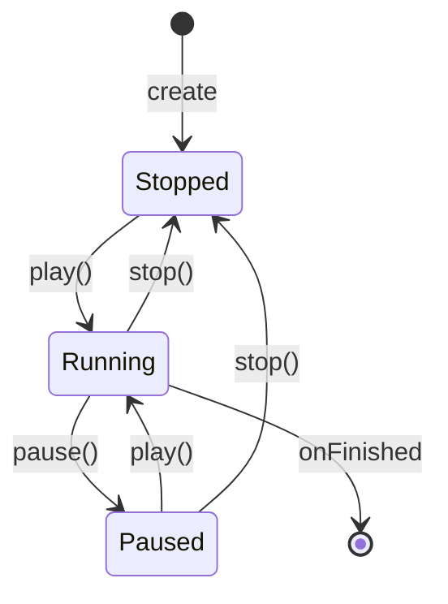

# Java JavaFX Animation

Animation brings user interfaces to life, creating engaging and interactive experiences. In this tutorial, we'll explore JavaFX's powerful animation capabilities that allow you to create smooth, professional-looking animations with minimal code.

## Introduction to JavaFX Animation

JavaFX provides a robust animation framework that allows developers to create various types of animations, from simple transitions to complex animated sequences. Animations in JavaFX are primarily handled through two main approaches:

1. **Timeline Animations**: Low-level animations that give fine-grained control over property changes over time.
2. **Transitions**: High-level, pre-built animations for common effects like fading, rotation, and scaling.

Both approaches are based on the fundamental concept of manipulating object properties over a specified duration to create the illusion of smooth movement or transformation.

## Setting Up JavaFX Animation

Before diving into creating animations, make sure your project is set up correctly with JavaFX:

```java
import javafx.animation.*;
import javafx.application.Application;
import javafx.scene.Scene;
import javafx.scene.layout.Pane;
import javafx.scene.shape.Rectangle;
import javafx.stage.Stage;
import javafx.util.Duration;
```

Now, let's start by creating a simple application that we'll use to demonstrate animations:

```java
public class AnimationDemo extends Application {
    @Override
    public void start(Stage primaryStage) {
        // Create a container for our animated objects
        Pane root = new Pane();
        
        // Create a scene
        Scene scene = new Scene(root, 600, 400);
        
        // Set up the stage
        primaryStage.setTitle("JavaFX Animation Demo");
        primaryStage.setScene(scene);
        primaryStage.show();
    }

    public static void main(String[] args) {
        launch(args);
    }
}
```

## Timeline Animation

Timeline animations provide the most flexibility and control. They operate by defining "keyframes" - points in time where properties have specific values.

### Basic Timeline Example

Let's create a simple animation that moves a rectangle across the screen:

```java
// Create a rectangle to animate
Rectangle rect = new Rectangle(100, 50, 100, 50);
rect.setFill(javafx.scene.paint.Color.BLUE);
root.getChildren().add(rect);

// Create a timeline animation
Timeline timeline = new Timeline();
timeline.setCycleCount(Timeline.INDEFINITE); // Loop indefinitely
timeline.setAutoReverse(true); // Reverse direction at the end

// Define the keyframes (start and end points of animation)
KeyFrame start = new KeyFrame(
    Duration.ZERO,
    new KeyValue(rect.translateXProperty(), 0)
);

KeyFrame end = new KeyFrame(
    Duration.seconds(2),
    new KeyValue(rect.translateXProperty(), 400)
);

// Add the keyframes to the timeline
timeline.getKeyFrames().addAll(start, end);

// Start the animation
timeline.play();
```

In this example:
1. We create a blue rectangle
2. We set up a Timeline that will run indefinitely and reverse direction
3. We define two KeyFrames - one at the start (0 seconds) and one at the end (2 seconds)
4. Each KeyFrame contains a KeyValue that specifies what property value should be at that time
5. Finally, we start the animation with `play()`

### Timeline Control Methods

Timelines provide several useful control methods:

```java
// Pausing an animation
timeline.pause();

// Stopping an animation (resets to start)
timeline.stop();

// Getting the current rate (speed)
double rate = timeline.getRate();

// Setting the rate (2.0 = 2x speed, 0.5 = half speed)
timeline.setRate(2.0);
```

## Transition Animations

JavaFX provides pre-built transitions for common animation effects. These are easier to use than timelines for basic animations.

### Common Transitions

Here are some of the most commonly used transitions:

#### FadeTransition

Animates the opacity of a node:

```java
Rectangle rect = new Rectangle(250, 150, 100, 80);
rect.setFill(javafx.scene.paint.Color.RED);
root.getChildren().add(rect);

// Create a fade transition
FadeTransition fadeTransition = new FadeTransition(Duration.seconds(2), rect);
fadeTransition.setFromValue(1.0); // Start fully opaque
fadeTransition.setToValue(0.1);   // Fade to nearly transparent
fadeTransition.setCycleCount(Transition.INDEFINITE);
fadeTransition.setAutoReverse(true);
fadeTransition.play();
```

#### TranslateTransition

Moves a node from one position to another:

```java
Rectangle rect = new Rectangle(50, 50, 80, 80);
rect.setFill(javafx.scene.paint.Color.GREEN);
root.getChildren().add(rect);

// Create a translate transition
TranslateTransition translateTransition = new TranslateTransition(Duration.seconds(3), rect);
translateTransition.setFromX(0);
translateTransition.setToX(300);
translateTransition.setFromY(0);
translateTransition.setToY(200);
translateTransition.setCycleCount(Transition.INDEFINITE);
translateTransition.setAutoReverse(true);
translateTransition.play();
```

#### RotateTransition

Rotates a node around its center:

```java
Rectangle rect = new Rectangle(250, 150, 100, 80);
rect.setFill(javafx.scene.paint.Color.ORANGE);
root.getChildren().add(rect);

// Create a rotate transition
RotateTransition rotateTransition = new RotateTransition(Duration.seconds(4), rect);
rotateTransition.setByAngle(360); // Rotate a full 360 degrees
rotateTransition.setCycleCount(Transition.INDEFINITE);
rotateTransition.play();
```

#### ScaleTransition

Changes the size of a node:

```java
Rectangle rect = new Rectangle(250, 150, 100, 80);
rect.setFill(javafx.scene.paint.Color.PURPLE);
root.getChildren().add(rect);

// Create a scale transition
ScaleTransition scaleTransition = new ScaleTransition(Duration.seconds(2), rect);
scaleTransition.setFromX(1.0);
scaleTransition.setFromY(1.0);
scaleTransition.setToX(2.0);  // Double the width
scaleTransition.setToY(0.5);  // Half the height
scaleTransition.setCycleCount(Transition.INDEFINITE);
scaleTransition.setAutoReverse(true);
scaleTransition.play();
```

## Combining Animations

### Sequential Animations

To run animations one after another, use `SequentialTransition`:

```java
Rectangle rect = new Rectangle(50, 50, 100, 50);
rect.setFill(javafx.scene.paint.Color.BLUE);
root.getChildren().add(rect);

// Create individual transitions
FadeTransition fade = new FadeTransition(Duration.seconds(1), rect);
fade.setFromValue(1.0);
fade.setToValue(0.3);

RotateTransition rotate = new RotateTransition(Duration.seconds(2), rect);
rotate.setByAngle(360);

TranslateTransition translate = new TranslateTransition(Duration.seconds(1), rect);
translate.setToX(200);

// Combine them in sequence
SequentialTransition sequentialTransition = new SequentialTransition();
sequentialTransition.getChildren().addAll(fade, rotate, translate);
sequentialTransition.setCycleCount(Transition.INDEFINITE);
sequentialTransition.setAutoReverse(true);
sequentialTransition.play();
```

### Parallel Animations

To run animations simultaneously, use `ParallelTransition`:

```java
Rectangle rect = new Rectangle(150, 150, 100, 100);
rect.setFill(javafx.scene.paint.Color.CRIMSON);
root.getChildren().add(rect);

// Create individual transitions
FadeTransition fade = new FadeTransition(Duration.seconds(2), rect);
fade.setFromValue(1.0);
fade.setToValue(0.3);

RotateTransition rotate = new RotateTransition(Duration.seconds(2), rect);
rotate.setByAngle(180);

// Run them in parallel
ParallelTransition parallelTransition = new ParallelTransition();
parallelTransition.getChildren().addAll(fade, rotate);
parallelTransition.setCycleCount(Transition.INDEFINITE);
parallelTransition.setAutoReverse(true);
parallelTransition.play();
```

## Animation Events

You can add event handlers to respond to animation state changes:

```java
FadeTransition fade = new FadeTransition(Duration.seconds(2), rect);
fade.setFromValue(1.0);
fade.setToValue(0.1);
fade.setCycleCount(4);

// Event handlers
fade.setOnFinished(event -> System.out.println("Animation finished!"));
fade.statusProperty().addListener((obs, oldStatus, newStatus) -> {
    System.out.println("Animation status changed: " + newStatus);
});

fade.play();
```

## Practical Example: Button Animation

Let's create a practical example - an animated button that gives visual feedback when clicked:

```java
import javafx.animation.*;
import javafx.application.Application;
import javafx.geometry.Insets;
import javafx.scene.Scene;
import javafx.scene.control.Button;
import javafx.scene.layout.VBox;
import javafx.stage.Stage;
import javafx.util.Duration;

public class AnimatedButtonExample extends Application {
    @Override
    public void start(Stage primaryStage) {
        Button button = new Button("Click Me!");
        button.setPrefSize(150, 50);
        
        // Set up animation
        ScaleTransition scaleDown = new ScaleTransition(Duration.millis(100), button);
        scaleDown.setToX(0.9);
        scaleDown.setToY(0.9);
        
        ScaleTransition scaleUp = new ScaleTransition(Duration.millis(100), button);
        scaleUp.setToX(1.0);
        scaleUp.setToY(1.0);
        
        SequentialTransition clickAnimation = new SequentialTransition(scaleDown, scaleUp);
        
        // Trigger animation on click
        button.setOnAction(event -> {
            clickAnimation.play();
        });
        
        VBox root = new VBox(20);
        root.setPadding(new Insets(20));
        root.getChildren().add(button);
        
        Scene scene = new Scene(root, 300, 200);
        primaryStage.setTitle("Animated Button");
        primaryStage.setScene(scene);
        primaryStage.show();
    }

    public static void main(String[] args) {
        launch(args);
    }
}
```

In this example, when the button is clicked:
1. It first scales down to 90% of its size
2. Then it scales back up to its original size
3. This creates a "push" effect that gives the user visual feedback

## Animation Lifecycle

The following diagram illustrates the typical lifecycle of a JavaFX animation:



## Advanced Example: Creating an Interactive Game Element

Let's create a simple "dodge the falling objects" game element using JavaFX animations:

```java
import javafx.animation.*;
import javafx.application.Application;
import javafx.scene.Scene;
import javafx.scene.input.KeyCode;
import javafx.scene.layout.Pane;
import javafx.scene.paint.Color;
import javafx.scene.shape.Circle;
import javafx.scene.shape.Rectangle;
import javafx.stage.Stage;
import javafx.util.Duration;
import java.util.Random;

public class FallingObjectsGame extends Application {
    private static final int WIDTH = 600;
    private static final int HEIGHT = 400;
    private Rectangle player;
    private Pane gamePane;
    private Timeline gameLoop;
    private Random random = new Random();

    @Override
    public void start(Stage primaryStage) {
        gamePane = new Pane();
        Scene scene = new Scene(gamePane, WIDTH, HEIGHT);
        
        // Create player rectangle
        player = new Rectangle(WIDTH/2, HEIGHT-30, 50, 15);
        player.setFill(Color.BLUE);
        gamePane.getChildren().add(player);
        
        // Set up keyboard input
        scene.setOnKeyPressed(e -> {
            if (e.getCode() == KeyCode.LEFT && player.getX() > 0) {
                player.setX(player.getX() - 15);
            } else if (e.getCode() == KeyCode.RIGHT && player.getX() < WIDTH - player.getWidth()) {
                player.setX(player.getX() + 15);
            }
        });
        
        // Create game loop
        gameLoop = new Timeline(new KeyFrame(Duration.millis(50), e -> {
            // Create new falling object occasionally
            if (random.nextInt(20) < 2) {
                createFallingObject();
            }
        }));
        gameLoop.setCycleCount(Timeline.INDEFINITE);
        gameLoop.play();
        
        primaryStage.setTitle("Dodge Game");
        primaryStage.setScene(scene);
        primaryStage.show();
    }
    
    private void createFallingObject() {
        // Create a circle at random X position at the top of the screen
        Circle circle = new Circle(10, Color.RED);
        circle.setCenterX(random.nextInt(WIDTH - 20) + 10);
        circle.setCenterY(0);
        gamePane.getChildren().add(circle);
        
        // Create falling animation
        TranslateTransition fall = new TranslateTransition(Duration.seconds(3), circle);
        fall.setToY(HEIGHT);
        
        // When the animation finishes, remove the circle
        fall.setOnFinished(e -> gamePane.getChildren().remove(circle));
        
        fall.play();
    }

    public static void main(String[] args) {
        launch(args);
    }
}
```

In this example:
1. We create a blue player rectangle controlled by the left and right arrow keys
2. A game loop (Timeline) periodically spawns red circles at random positions at the top
3. The circles fall down the screen using TranslateTransition
4. When the animation finishes, the circles are removed from the scene

This demonstrates how JavaFX animations can be used in interactive applications like games.

## Summary

JavaFX provides a powerful animation framework that makes it easy to create interactive and visually appealing user interfaces. In this tutorial, we covered:

- **Timeline animations** for fine-grained control over property changes
- **Transition animations** for common effects like fade, rotate, scale, and translate
- **Combining animations** with sequential and parallel transitions
- **Animation events** to respond to animation state changes
- **Practical examples** including button feedback and a simple game element

With these tools, you can bring your JavaFX applications to life and create more engaging user experiences.

## Exercises

1. Create a "pulsing" button that grows and shrinks continuously until clicked.
2. Implement a loading spinner using RotateTransition.
3. Create a notification that slides in from the side of the screen, stays visible for a few seconds, then slides out.
4. Build a simple slideshow that transitions between images with fade effects.
5. Extend the "dodge the falling objects" game to detect collisions and keep score.

## Additional Resources

- [JavaFX Animation API Documentation](https://openjfx.io/javadoc/17/javafx.graphics/javafx/animation/package-summary.html)
- [Oracle JavaFX Animation Tutorial](https://docs.oracle.com/javase/8/javafx/visual-effects-tutorial/animations.htm)
- [OpenJFX Project](https://openjfx.io/)
- Book: "Pro JavaFX 9" by Johan Vos, Stephen Chin, and James Weaver

Happy animating!