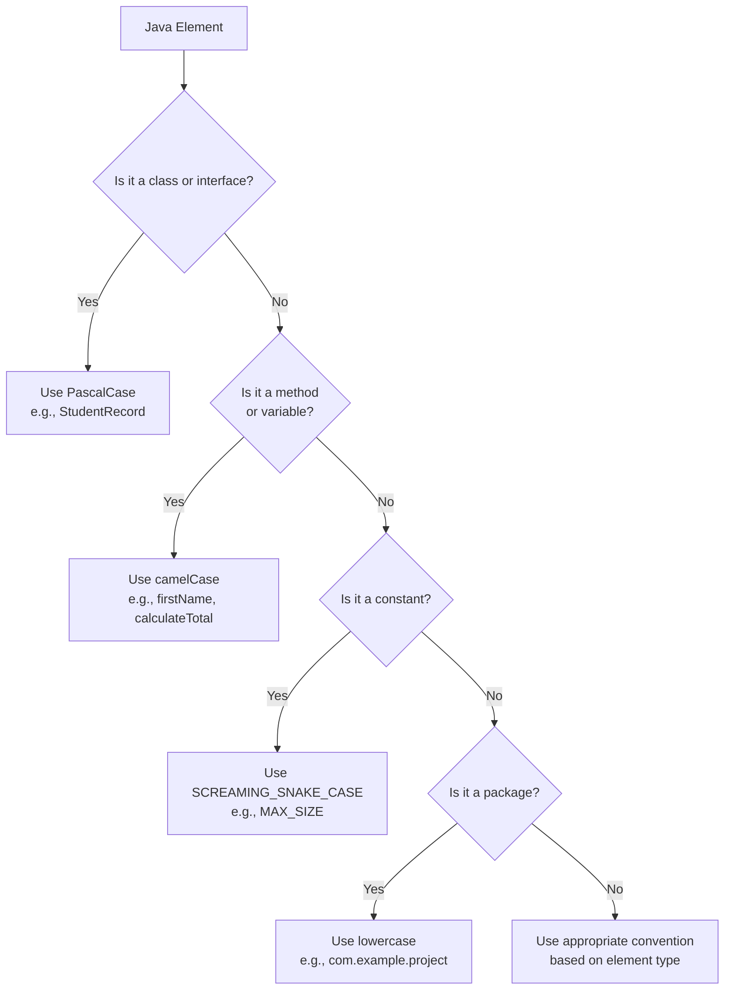

# Java Naming Conventions

## Introduction

Naming conventions in Java are a set of rules and guidelines for naming different program elements such as classes, methods, variables, constants, and packages. Following these conventions makes your code more readable, maintainable, and consistent with the broader Java ecosystem. They represent an important part of Java's coding standards and are widely adopted across the Java community.

In this guide, we'll explore the standard Java naming conventions, understand why they're important, and learn how to apply them in your own code with practical examples.

## Why Naming Conventions Matter

Before diving into specific conventions, let's understand why they're crucial for effective programming:

1. **Readability**: Well-named elements make code easier to understand
2. **Maintainability**: Consistent naming helps future developers (including yourself) work with your code
3. **Collaboration**: Following standard conventions makes code sharing and teamwork smoother
4. **Reduced Cognitive Load**: Intuitive names reduce the mental effort needed to understand code

## Java Naming Conventions for Different Elements

### 1. Class and Interface Naming

Classes and interfaces follow these conventions:

- Use **PascalCase** (UpperCamelCase) - start with an uppercase letter and capitalize the first letter of each internal word
- Use nouns or noun phrases for class names
- Use descriptive, meaningful names that reflect the class's purpose
- Avoid abbreviations unless they're widely understood

```java
// Good class names
public class Student { }
public class DatabaseConnection { }
public class OrderProcessor { }

// Bad class names
public class student { }  // Should start with uppercase
public class DB { }       // Too abbreviated
public class DoStuff { }  // Not descriptive enough
```

For interfaces, the same PascalCase rules apply, but some developers add the prefix "I" (though this isn't official Java convention):

```java
// Interface names
public interface Runnable { }
public interface Comparable<T> { }
public interface Serializable { }

// Some teams might use this style (Microsoft-influenced)
public interface IClickable { }  
```

### 2. Method Naming

Methods follow these conventions:

- Use **camelCase** - start with a lowercase letter and capitalize the first letter of each internal word
- Use verbs or verb phrases that describe the action performed
- Method names should clearly state what they do

```java
// Good method names
public void calculateTotalPrice() { }
public String getUserName() { }
public boolean isValid() { }

// Bad method names
public void Calculate() { }  // Should start with lowercase
public void data() { }       // Not descriptive, not a verb
public void doIt() { }       // Too vague
```

For methods that return boolean values, it's conventional to use prefixes like `is`, `has`, or `can`:

```java
public boolean isEmpty() { }
public boolean hasPermission() { }
public boolean canProcessOrder() { }
```

### 3. Variable Naming

Variables follow these conventions:

- Use **camelCase** like method names
- Choose names that describe what the variable represents
- Keep names concise but meaningful
- Avoid single-letter names except for temporary variables

```java
// Good variable names
String firstName;
int itemCount;
boolean isComplete;

// Bad variable names
String FirstName;   // Should start with lowercase
int a;              // Not descriptive (except in simple loops)
boolean flag;       // Too vague
```

For temporary variables or loop counters, short names are acceptable:

```java
// Acceptable short names for specific contexts
for (int i = 0; i < 10; i++) { }
for (int x = 0; x < width; x++) { }
```

### 4. Constant Naming

Constants (variables declared with `final` and typically `static`) follow these conventions:

- Use **SCREAMING_SNAKE_CASE** - all uppercase letters with words separated by underscores
- Names should describe what the constant represents

```java
// Good constant names
public static final int MAX_USERS = 100;
public static final String DATABASE_URL = "jdbc:mysql://localhost/mydb";
public static final double PI = 3.14159;

// Bad constant names
public static final int maxUsers = 100;        // Should be uppercase
public static final String DatabaseURL = "..."; // Should be uppercase with underscores
```

### 5. Package Naming

Package names follow these conventions:

- Use all **lowercase** letters
- Use reverse domain name notation as a prefix (e.g., `com.company.project`)
- Avoid underscores or other special characters
- Use meaningful and descriptive names after the domain prefix

```java
// Good package names
package com.example.project;
package org.apache.commons.lang;
package java.util;

// Bad package names
package com.example.MyProject;    // Shouldn't use uppercase
package utilities;                // Should use domain prefix
package com.example_project;      // Shouldn't use underscores
```

### 6. Generic Type Parameter Naming

For generic type parameters:

- Use single uppercase letters
- Common conventions include:
  - `T` for type
  - `E` for element
  - `K` for key
  - `V` for value
  - `N` for number

```java
// Generic type parameter naming
public class Box<T> { }
public interface Pair<K, V> { }
public static <E> void printArray(E[] array) { }
```

## Real-World Examples

Let's look at a more comprehensive example that demonstrates these conventions in action. Here's a simple banking application:

```java
package com.bankingsystem.accounts;

import java.util.ArrayList;
import java.util.List;

public class BankAccount {
    private static final double MINIMUM_BALANCE = 100.0;
    private static final double OVERDRAFT_FEE = 35.0;
    
    private String accountNumber;
    private String ownerName;
    private double balance;
    private List<Transaction> transactions;
    
    public BankAccount(String accountNumber, String ownerName, double initialBalance) {
        this.accountNumber = accountNumber;
        this.ownerName = ownerName;
        this.balance = initialBalance;
        this.transactions = new ArrayList<>();
    }
    
    public boolean deposit(double amount) {
        if (amount <= 0) {
            return false;
        }
        
        balance += amount;
        transactions.add(new Transaction("DEPOSIT", amount));
        return true;
    }
    
    public boolean withdraw(double amount) {
        if (amount <= 0) {
            return false;
        }
        
        if (balance - amount < MINIMUM_BALANCE) {
            // Apply overdraft fee
            balance -= (amount + OVERDRAFT_FEE);
            transactions.add(new Transaction("WITHDRAW", amount));
            transactions.add(new Transaction("FEE", OVERDRAFT_FEE));
        } else {
            balance -= amount;
            transactions.add(new Transaction("WITHDRAW", amount));
        }
        
        return true;
    }
    
    public double getBalance() {
        return balance;
    }
    
    public List<Transaction> getTransactionHistory() {
        return new ArrayList<>(transactions);
    }
    
    public boolean hasOverdrafted() {
        return balance < MINIMUM_BALANCE;
    }
    
    private class Transaction {
        private String type;
        private double amount;
        private long timestamp;
        
        public Transaction(String type, double amount) {
            this.type = type;
            this.amount = amount;
            this.timestamp = System.currentTimeMillis();
        }
        
        // Getters omitted for brevity
    }
}
```

The example demonstrates:
- PascalCase for class names (`BankAccount`, `Transaction`)
- camelCase for method names (`deposit`, `withdraw`, `getBalance`)
- camelCase for variable names (`accountNumber`, `balance`)
- SCREAMING_SNAKE_CASE for constants (`MINIMUM_BALANCE`, `OVERDRAFT_FEE`)
- Method names that reflect actions (`deposit`, `withdraw`) or information retrieval (`getBalance`)
- Boolean method using the `has` prefix (`hasOverdrafted`)

## Common Naming Anti-patterns to Avoid

1. **Meaningless names**: Avoid names like `temp`, `stuff`, or `data` that don't convey purpose
2. **Inconsistent casing**: Don't mix camelCase and snake_case in similar elements
3. **Misleading names**: Don't name a method `getCustomer` if it actually creates a customer
4. **Encoded types in names**: Modern IDEs make it unnecessary to use names like `strName` or `iCount`
5. **Abbreviations**: Unless widely understood, avoid abbreviations like `calcTotPrc` (instead use `calculateTotalPrice`)

## Visualizing Java Naming Conventions

Here's a simple flowchart to help decide which naming convention to use:



## Best Practices and Tips

1. **Be consistent**: If you join a project with established naming conventions, follow them even if they differ from standard Java conventions.

2. **Use meaningful names**: 
   ```java
   // Bad
   int d; // elapsed time in days
   
   // Good
   int elapsedDays;
   ```

3. **Name length should reflect scope**: Shorter variable names are acceptable for smaller scopes.
   ```java
   // Acceptable for a short loop
   for (int i = 0; i < 10; i++) { }
   
   // Better for class-level variables
   private int customerCount;
   ```

4. **Use domain-specific terminology**: When appropriate, use terms from the business domain.
   ```java
   // Using banking terminology
   public class LedgerEntry { }
   public double calculateCompoundInterest() { }
   ```

5. **Avoid Hungarian notation**: Java doesn't follow the convention of encoding types in names.
   ```java
   // Don't do this
   String strName;
   int iAge;
   
   // Do this instead
   String name;
   int age;
   ```

6. **Avoid acronyms unless widely understood**:
   ```java
   // Prefer
   HtmlParser parser = new HtmlParser();
   
   // Over
   HTMLPrsr prsr = new HTMLPrsr();
   ```

## Summary

Java naming conventions are essential guidelines that make code more readable, maintainable, and professional. They include:

- **Classes/Interfaces**: PascalCase (e.g., `StudentRecord`)
- **Methods/Variables**: camelCase (e.g., `calculateTotal`, `firstName`)
- **Constants**: SCREAMING_SNAKE_CASE (e.g., `MAX_SIZE`)
- **Packages**: lowercase with periods (e.g., `com.example.project`)
- **Generic type parameters**: Single uppercase letters (e.g., `T`, `E`)

Following these conventions will help you write code that's easier to understand and maintain, and will make your code more accessible to other Java developers.

## Exercises

To practice Java naming conventions, try these exercises:

1. Identify and correct the naming convention violations in this code snippet:
   ```java
   class student {
       public static final int maximum_age = 30;
       private String First_name;
       
       public void GET_NAME() { }
   }
   ```

2. Come up with appropriate names for:
   - A class representing a shopping cart
   - A method that checks if a user has admin privileges
   - A constant representing the maximum file upload size
   - A variable holding the number of login attempts

## Additional Resources

- [Oracle's Java Code Conventions](https://www.oracle.com/java/technologies/javase/codeconventions-introduction.html)
- [Google Java Style Guide](https://google.github.io/styleguide/javaguide.html)
- [Clean Code by Robert C. Martin](https://www.amazon.com/Clean-Code-Handbook-Software-Craftsmanship/dp/0132350882) - Contains excellent advice on naming

Remember, consistent and meaningful naming is one of the most powerful tools you have to make your code readable and maintainable.