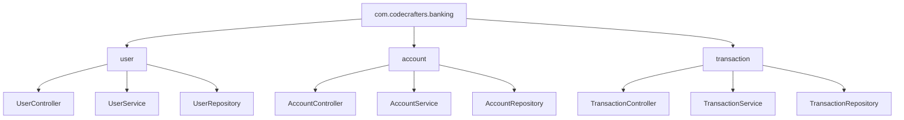

# Java Code Organization

Organizing your Java code effectively is like keeping a well-organized kitchen - it makes your work more efficient, helps others understand what you're doing, and prevents small issues from becoming big problems. In this guide, we'll explore how to structure your Java code properly to create more maintainable, readable, and professional applications.

## Why Code Organization Matters

Before diving into specific techniques, let's understand why code organization is critical:

- **Readability**: Well-organized code is easier to read and understand
- **Maintainability**: Making changes or fixing bugs becomes simpler
- **Collaboration**: Team members can navigate and contribute to the codebase more efficiently
- **Reusability**: Properly structured code promotes component reuse
- **Scalability**: Good organization allows your application to grow without becoming unwieldy

## Package Structure

Packages in Java provide a way to organize related classes and avoid naming conflicts. Think of packages as folders that group related functionality.

### Package Naming Conventions

Java uses reverse domain name notation for package names:

```java
package com.yourcompany.projectname.module;
```

For example, if you work for "CodeCrafters" on a banking application's user module:

```java
package com.codecrafters.banking.user;
```

### Package Organization Strategies

There are several approaches to organizing packages:

#### 1. By Layer (Technical Concerns)

```
com.codecrafters.banking
  ├── controller
  ├── service
  ├── repository
  └── model
```

#### 2. By Feature (Business Concerns)

```
com.codecrafters.banking
  ├── user
  │   ├── UserController
  │   ├── UserService
  │   └── UserRepository
  ├── account
  │   ├── AccountController
  │   ├── AccountService
  │   └── AccountRepository
  └── transaction
      ├── TransactionController
      ├── TransactionService
      └── TransactionRepository
```

:::tip
Feature-based organization often works better for larger applications as it groups related functionality together, making it easier to navigate the codebase.
:::

Let's visualize this structure:



## Class Design

Well-structured classes form the building blocks of your application. Here are some principles to follow:

### Single Responsibility Principle

A class should have only one reason to change. In other words, it should have a single responsibility.

**Bad Example:**

```java
public class UserManager {
    // Handles user authentication
    public boolean authenticateUser(String username, String password) {
        // Authentication logic
        return true;
    }
    
    // Handles database operations
    public void saveUserToDatabase(User user) {
        // Database logic
    }
    
    // Handles email sending
    public void sendWelcomeEmail(User user) {
        // Email logic
    }
}
```

**Better Example:**

```java
// Authentication responsibility
public class UserAuthenticator {
    public boolean authenticate(String username, String password) {
        // Authentication logic
        return true;
    }
}

// Database responsibility
public class UserRepository {
    public void save(User user) {
        // Database logic
    }
}

// Email responsibility
public class EmailService {
    public void sendWelcomeEmail(User user) {
        // Email logic
    }
}
```

### Class Organization

Within a class, follow a consistent order for elements:

1. Constants
2. Fields
3. Constructors
4. Public methods
5. Private/helper methods

Example:

```java
public class Account {
    // 1. Constants
    public static final double MINIMUM_BALANCE = 100.0;
    
    // 2. Fields
    private String accountNumber;
    private double balance;
    private Customer owner;
    
    // 3. Constructors
    public Account(String accountNumber, Customer owner) {
        this.accountNumber = accountNumber;
        this.owner = owner;
        this.balance = 0.0;
    }
    
    // 4. Public methods
    public void deposit(double amount) {
        if (amount <= 0) {
            throw new IllegalArgumentException("Deposit amount must be positive");
        }
        balance += amount;
    }
    
    public void withdraw(double amount) {
        if (amount <= 0) {
            throw new IllegalArgumentException("Withdrawal amount must be positive");
        }
        
        if (balance - amount < MINIMUM_BALANCE) {
            throw new InsufficientFundsException("Withdrawal would put account below minimum balance");
        }
        
        balance -= amount;
    }
    
    // 5. Private methods
    private void logTransaction(String type, double amount) {
        // Implementation details
    }
}
```

## Interfaces and Abstract Classes

Interfaces and abstract classes help define contracts and promote code reusability:

### Interface Example

```java
public interface PaymentProcessor {
    boolean processPayment(double amount);
    void refund(String transactionId, double amount);
    PaymentStatus checkStatus(String transactionId);
}
```

Implementation:

```java
public class CreditCardProcessor implements PaymentProcessor {
    @Override
    public boolean processPayment(double amount) {
        // Credit card processing logic
        System.out.println("Processing $" + amount + " via credit card");
        return true;
    }
    
    @Override
    public void refund(String transactionId, double amount) {
        // Refund logic
        System.out.println("Refunding $" + amount + " for transaction " + transactionId);
    }
    
    @Override
    public PaymentStatus checkStatus(String transactionId) {
        // Status check logic
        System.out.println("Checking status of transaction " + transactionId);
        return PaymentStatus.COMPLETED;
    }
}
```

### Abstract Class Example

```java
public abstract class Animal {
    protected String name;
    
    public Animal(String name) {
        this.name = name;
    }
    
    public abstract void makeSound();
    
    public void eat() {
        System.out.println(name + " is eating");
    }
}

public class Dog extends Animal {
    public Dog(String name) {
        super(name);
    }
    
    @Override
    public void makeSound() {
        System.out.println(name + " says: Woof!");
    }
}
```

## File Organization

### One Class Per File

Java enforces one public class per file, but it's a good practice to keep each file focused on a single concept:

```java
// User.java
public class User {
    private String username;
    private String email;
    
    // User fields and methods
}

// UserBuilder.java (separate file)
public class UserBuilder {
    private User user = new User();
    
    // Builder methods
}
```

### Import Organization

Organize your imports in the following order:

1. Java standard library imports
2. Third-party library imports
3. Your own application imports

Example:

```java
// 1. Java standard library
import java.util.List;
import java.util.Map;
import java.time.LocalDate;

// 2. Third-party libraries
import org.springframework.stereotype.Service;
import com.fasterxml.jackson.annotation.JsonProperty;

// 3. Your application imports
import com.yourcompany.app.model.User;
import com.yourcompany.app.exception.UserNotFoundException;
```

## Real-World Application: Banking System

Let's put all these concepts together in a simplified banking system example:

### Project Structure

```
com.bankapp
  ├── account
  │   ├── Account.java (interface)
  │   ├── CheckingAccount.java
  │   ├── SavingsAccount.java
  │   └── AccountService.java
  ├── customer
  │   ├── Customer.java
  │   ├── CustomerRepository.java
  │   └── CustomerService.java
  ├── transaction
  │   ├── Transaction.java
  │   ├── TransactionType.java (enum)
  │   └── TransactionService.java
  └── util
      ├── DateUtils.java
      └── ValidationUtils.java
```

### Implementation Example

```java
// com/bankapp/account/Account.java
package com.bankapp.account;

import com.bankapp.transaction.Transaction;

public interface Account {
    String getAccountNumber();
    double getBalance();
    void deposit(double amount);
    void withdraw(double amount);
    void transfer(Account destination, double amount);
    Transaction[] getTransactionHistory();
}
```

```java
// com/bankapp/account/CheckingAccount.java
package com.bankapp.account;

import com.bankapp.customer.Customer;
import com.bankapp.transaction.Transaction;
import com.bankapp.transaction.TransactionType;

import java.time.LocalDateTime;
import java.util.ArrayList;
import java.util.List;

public class CheckingAccount implements Account {
    private String accountNumber;
    private double balance;
    private Customer owner;
    private List<Transaction> transactions;
    
    public CheckingAccount(String accountNumber, Customer owner) {
        this.accountNumber = accountNumber;
        this.owner = owner;
        this.balance = 0.0;
        this.transactions = new ArrayList<>();
    }
    
    @Override
    public String getAccountNumber() {
        return accountNumber;
    }
    
    @Override
    public double getBalance() {
        return balance;
    }
    
    @Override
    public void deposit(double amount) {
        if (amount <= 0) {
            throw new IllegalArgumentException("Deposit amount must be positive");
        }
        
        balance += amount;
        recordTransaction(TransactionType.DEPOSIT, amount);
    }
    
    @Override
    public void withdraw(double amount) {
        if (amount <= 0) {
            throw new IllegalArgumentException("Withdrawal amount must be positive");
        }
        
        if (balance < amount) {
            throw new IllegalStateException("Insufficient funds");
        }
        
        balance -= amount;
        recordTransaction(TransactionType.WITHDRAWAL, amount);
    }
    
    @Override
    public void transfer(Account destination, double amount) {
        withdraw(amount);
        destination.deposit(amount);
        recordTransaction(TransactionType.TRANSFER_OUT, amount);
    }
    
    @Override
    public Transaction[] getTransactionHistory() {
        return transactions.toArray(new Transaction[0]);
    }
    
    private void recordTransaction(TransactionType type, double amount) {
        Transaction transaction = new Transaction(
            accountNumber,
            type,
            amount,
            LocalDateTime.now()
        );
        transactions.add(transaction);
    }
}
```

## Common Pitfalls and Tips

### Avoid Deep Nesting of Packages

Too many levels of package hierarchy can make your code difficult to navigate. Aim for 3-4 levels at most.

**Avoid:**
```
com.company.project.module.submodule.feature.subfeature.util
```

### Don't Mix Organization Strategies

Pick either layer-based or feature-based organization and stick with it. Mixing them creates confusion.

### Keep Classes Focused

If a class file becomes too long (over 300-500 lines), it's often a sign that it's trying to do too much and should be split.

### Use Meaningful Names

Package, class, and file names should clearly indicate their purpose:

**Avoid:**
```java
class Proc {} // What does this process?
```

**Better:**
```java
class PaymentProcessor {}
```

### Document Your Structure

For larger projects, maintain documentation about your code organization to help new team members:

```java
/**
 * Customer management module
 * 
 * This package contains classes related to customer operations including:
 * - Customer registration
 * - Profile management
 * - Authentication
 * - Customer search
 */
package com.bankapp.customer;
```

## Summary

Effective code organization in Java involves:

1. **Logical package structure** - Either by technical layer or business feature
2. **Well-designed classes** - Following the single responsibility principle
3. **Consistent internal organization** - Constants, fields, constructors, methods
4. **Appropriate use of interfaces and abstract classes** - For flexibility and reusability
5. **Clean file structure** - One concept per file with organized imports

When you organize your code properly, you're not just making life easier for yourself but also for everyone who will work with your code in the future.

## Additional Resources

- [Oracle's Java Code Conventions](https://www.oracle.com/java/technologies/javase/codeconventions-introduction.html)
- [Clean Code: A Handbook of Agile Software Craftsmanship](https://www.amazon.com/Clean-Code-Handbook-Software-Craftsmanship/dp/0132350882) by Robert C. Martin
- [Effective Java](https://www.amazon.com/Effective-Java-Joshua-Bloch/dp/0134685997) by Joshua Bloch

## Practice Exercises

1. Refactor a simple Java application to use proper package structure
2. Identify classes in your existing code that have multiple responsibilities and split them
3. Create an interface hierarchy for a payment processing system with at least three different payment methods
4. Design a package structure for an e-commerce application with modules for products, orders, users, and shipping

Remember, good code organization is a skill that improves with practice. Start implementing these principles in your next project, and you'll quickly see the benefits.