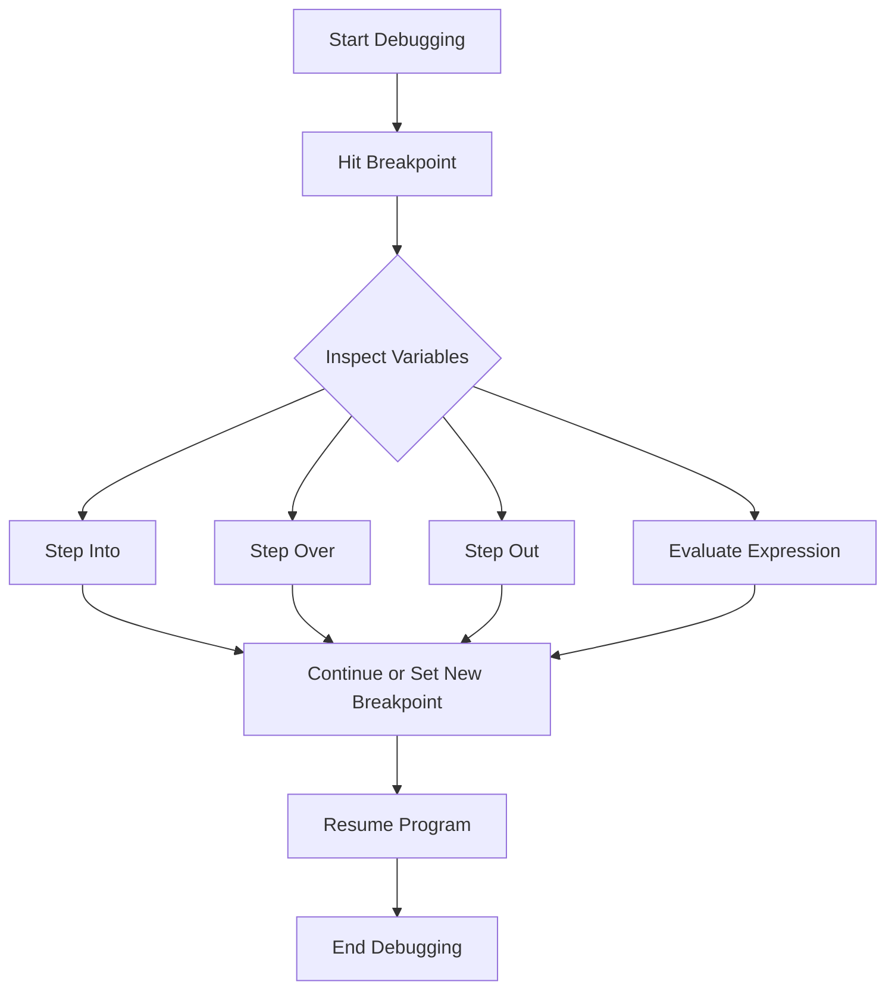

# Java Debugging Techniques

## Introduction

Debugging is an essential skill for any programmer. As you write Java code, you'll inevitably encounter bugs and errors. The ability to effectively find and fix these issues will save you countless hours of frustration and help you become a more competent developer.

In this guide, we'll explore various techniques for debugging Java applications, from basic approaches that require minimal tools to more advanced strategies using integrated development environments (IDEs). By the end of this tutorial, you'll have a comprehensive toolkit for tackling bugs in your Java programs.

## Why Debugging Skills Matter

Before diving into specific techniques, let's understand why debugging is crucial:

- **Time Efficiency**: Good debugging skills dramatically reduce the time spent finding and fixing bugs
- **Code Quality**: Understanding how to debug helps you write better, more robust code
- **Problem-Solving**: Debugging enhances your analytical thinking and problem-solving abilities
- **Confidence**: Knowing you can fix issues that arise gives you confidence to tackle complex projects

## Basic Debugging Techniques

### 1. Using `System.out.println()` Statements

The most straightforward debugging technique involves adding print statements to your code to check variable values, control flow, and program state.

```java
public class PrintDebuggingExample {
    public static void main(String[] args) {
        int[] numbers = {1, 2, 3, 4, 5};
        int sum = 0;
        
        System.out.println("Starting the loop");
        for (int i = 0; i < numbers.length; i++) {
            System.out.println("Current index: " + i);
            System.out.println("Current value: " + numbers[i]);
            sum += numbers[i];
            System.out.println("Running sum: " + sum);
        }
        
        System.out.println("Final sum: " + sum);
    }
}
```

**Output:**
```
Starting the loop
Current index: 0
Current value: 1
Running sum: 1
Current index: 1
Current value: 2
Running sum: 3
Current index: 2
Current value: 3
Running sum: 6
Current index: 3
Current value: 4
Running sum: 10
Current index: 4
Current value: 5
Running sum: 15
Final sum: 15
```

**Pros:**
- Simple and requires no additional tools
- Works in any environment

**Cons:**
- Clutters code with temporary statements
- Must be manually added and removed
- Inefficient for complex debugging scenarios

### 2. Using Exception Handling

Proper exception handling can provide valuable information about where and why a problem occurs.

```java
public class ExceptionDebugExample {
    public static void main(String[] args) {
        int[] numbers = {10, 20, 30};
        try {
            System.out.println("Attempting to access elements...");
            for (int i = 0; i <= numbers.length; i++) {
                System.out.println("Element at index " + i + ": " + numbers[i]);
            }
        } catch (ArrayIndexOutOfBoundsException e) {
            System.err.println("Debugging info - Exception caught: " + e.getMessage());
            System.err.println("Stack trace:");
            e.printStackTrace();
            System.err.println("The array only has " + numbers.length + " elements.");
        }
    }
}
```

**Output:**
```
Attempting to access elements...
Element at index 0: 10
Element at index 1: 20
Element at index 2: 30
Debugging info - Exception caught: Index 3 out of bounds for length 3
Stack trace:
java.lang.ArrayIndexOutOfBoundsException: Index 3 out of bounds for length 3
    at ExceptionDebugExample.main(ExceptionDebugExample.java:7)
The array only has 3 elements.
```

This approach catches errors and provides useful information instead of allowing the program to crash.

## Intermediate Debugging Techniques

### 1. Using Java's Built-in Logging Framework

Java's `java.util.logging` package provides a more structured approach to logging than simple print statements.

```java
import java.util.logging.*;

public class LoggingDebugExample {
    // Create a Logger
    private static final Logger logger = Logger.getLogger(LoggingDebugExample.class.getName());
    
    public static void main(String[] args) {
        // Configure the logger (optional)
        configureLogger();
        
        logger.info("Program started");
        
        int result = calculateSum(5, 7);
        logger.info("Result of calculateSum: " + result);
        
        try {
            int division = divideNumbers(10, 0);
        } catch (ArithmeticException e) {
            logger.severe("Error in division: " + e.getMessage());
        }
        
        logger.info("Program completed");
    }
    
    private static void configureLogger() {
        // Create and set a simple formatter
        ConsoleHandler handler = new ConsoleHandler();
        handler.setFormatter(new SimpleFormatter());
        logger.addHandler(handler);
        logger.setLevel(Level.ALL);
    }
    
    private static int calculateSum(int a, int b) {
        logger.fine("calculateSum called with parameters: a=" + a + ", b=" + b);
        return a + b;
    }
    
    private static int divideNumbers(int a, int b) {
        logger.fine("divideNumbers called with parameters: a=" + a + ", b=" + b);
        return a / b;
    }
}
```

**Output:**
```
May 12, 2023 10:15:27 AM LoggingDebugExample main
INFO: Program started
May 12, 2023 10:15:27 AM LoggingDebugExample main
INFO: Result of calculateSum: 12
May 12, 2023 10:15:27 AM LoggingDebugExample main
SEVERE: Error in division: / by zero
May 12, 2023 10:15:27 AM LoggingDebugExample main
INFO: Program completed
```

**Advantages of logging:**
- Can leave logging in production code
- Configurable logging levels (INFO, WARNING, SEVERE, etc.)
- Can log to files instead of console
- Provides timestamps and other metadata

### 2. Using Command-Line Debugger (jdb)

Java includes a command-line debugger called `jdb` that lets you inspect your program at runtime.

**Step 1:** Compile your Java file with debugging information:

```
javac -g DebuggingExample.java
```

**Step 2:** Start the debugger:

```
jdb DebuggingExample
```

**Step 3:** Use jdb commands:
- `stop at DebuggingExample:10` (sets a breakpoint at line 10)
- `run` (starts execution)
- `print myVariable` (displays variable value)
- `step` (executes next line)
- `cont` (continues execution)
- `quit` (exits the debugger)

While jdb isn't as user-friendly as IDE debuggers, it's valuable when you need to debug without an IDE.

## Advanced Debugging with IDEs

Modern IDEs provide powerful visual debugging tools that make finding and fixing bugs much easier.

### Debugging with IntelliJ IDEA

Here's how to use IntelliJ IDEA's debugger with a simple example:

```java
public class DebugDemoIntelliJ {
    public static void main(String[] args) {
        System.out.println("Starting calculation...");
        
        int[] values = {3, 7, 2, 9, 5};
        int result = processArray(values);
        
        System.out.println("Calculation result: " + result);
    }
    
    private static int processArray(int[] arr) {
        int sum = 0;
        for (int i = 0; i < arr.length; i++) {
            int squared = arr[i] * arr[i];
            sum += squared;
        }
        return sum;
    }
}
```

**To debug this program in IntelliJ IDEA:**

1. Set a breakpoint by clicking in the gutter area next to line 10 (where `processArray` is called)
2. Click the debug icon or press Shift+F9 to start debugging
3. When execution reaches the breakpoint, the program will pause
4. Examine variables in the "Variables" window
5. Use step-over (F8), step-into (F7), and step-out (Shift+F8) buttons to control execution
6. Use "Evaluate Expression" (Alt+F8) to test expressions with current variable values



### Debugging with Eclipse

Eclipse offers similar debugging capabilities:

1. Set breakpoints by double-clicking in the left margin
2. Right-click your class file and select "Debug As" > "Java Application"
3. Use the Debug perspective to monitor variables, control execution, and evaluate expressions
4. Use the "Step Into" (F5), "Step Over" (F6), and "Step Return" (F7) buttons
5. View the call stack to understand the execution path

### Conditional Breakpoints

Both IntelliJ IDEA and Eclipse allow you to set conditional breakpoints that only pause execution when a specific condition is met:

1. Right-click on a breakpoint
2. Select "Edit Breakpoint" or "Breakpoint Properties"
3. Enter a condition (e.g., `i == 3` to pause only when i equals 3)

This is invaluable when debugging issues that only appear after many iterations.

## Practical Debugging Examples

### Example 1: Fixing a Logic Error

Consider this faulty method that's supposed to find the minimum value in an array:

```java
public static int findMinimum(int[] array) {
    int min = Integer.MIN_VALUE; // BUG: Should be MAX_VALUE
    
    for (int value : array) {
        if (value < min) {
            min = value;
        }
    }
    
    return min;
}
```

When debugging this method:

1. Set a breakpoint at the start of the method
2. Watch the `min` variable as the loop executes
3. You'll notice `min` never changes because `Integer.MIN_VALUE` is already the smallest possible int
4. Fix by changing `Integer.MIN_VALUE` to `Integer.MAX_VALUE` or initializing with `min = array[0]`

### Example 2: Debugging a NullPointerException

Consider this common mistake:

```java
public class NullPointerExample {
    public static void main(String[] args) {
        String[] names = {"Alice", null, "Charlie"};
        printNameLengths(names);
    }
    
    private static void printNameLengths(String[] names) {
        System.out.println("Name lengths:");
        for (String name : names) {
            System.out.println(name + " - " + name.length()); // NPE when name is null
        }
    }
}
```

To debug:

1. Set a breakpoint at the line that might throw the exception
2. When execution stops due to the exception, examine the `name` variable
3. Fix by adding a null check:

```java
for (String name : names) {
    if (name != null) {
        System.out.println(name + " - " + name.length());
    } else {
        System.out.println("null - 0");
    }
}
```

### Example 3: Finding a Concurrent Modification Bug

This is a more complex issue that occurs when modifying a collection during iteration:

```java
import java.util.ArrayList;
import java.util.List;

public class ConcurrentModificationExample {
    public static void main(String[] args) {
        List<String> fruits = new ArrayList<>();
        fruits.add("Apple");
        fruits.add("Banana");
        fruits.add("Orange");
        fruits.add("Grape");
        
        // Trying to remove items during iteration
        for (String fruit : fruits) {
            if (fruit.contains("a")) {
                fruits.remove(fruit); // This will cause ConcurrentModificationException
            }
        }
        
        System.out.println("Remaining fruits: " + fruits);
    }
}
```

To debug and fix this:

1. Use the debugger to understand when and why the exception occurs
2. Fix by using an Iterator with its remove() method, or by creating a copy of items to remove:

```java
// Solution using a copy list
List<String> fruitsToRemove = new ArrayList<>();
for (String fruit : fruits) {
    if (fruit.contains("a")) {
        fruitsToRemove.add(fruit);
    }
}
fruits.removeAll(fruitsToRemove);
```

## Best Practices for Effective Debugging

1. **Be methodical**: Develop a systematic approach rather than changing code randomly
2. **Isolate the problem**: Create a minimal test case that demonstrates the issue
3. **Check your assumptions**: Verify what you believe to be true using the debugger
4. **Read the error messages**: They often contain valuable clues about the problem
5. **Use appropriate tools**: Choose the right debugging technique for the situation
6. **Keep a debugging journal**: Track what you've tried and what you've learned
7. **Take breaks**: Fresh eyes can spot issues you've overlooked

## Handling Common Java Exceptions

Understanding and properly debugging common exceptions will save you time:

| Exception Type | Common Causes | Debugging Tips |
|----------------|---------------|----------------|
| NullPointerException | Calling methods on null objects | Check for null before method calls, trace where the null is coming from |
| ArrayIndexOutOfBoundsException | Accessing invalid array indices | Verify array lengths and index calculations |
| ClassCastException | Invalid casting between incompatible types | Confirm object types before casting, use instanceof |
| NumberFormatException | Invalid string conversion to number | Validate input strings before conversion |
| ConcurrentModificationException | Modifying collections during iteration | Use proper iteration techniques (Iterator, etc.) |

## Summary

Debugging is both an art and a science. In this guide, we've covered:

- Basic debugging with print statements and exception handling
- Intermediate techniques using Java's logging framework and command-line debugging
- Advanced debugging with modern IDEs
- Real-world examples of common bugs and how to fix them
- Best practices for efficient debugging

As you gain experience, you'll develop intuition for where bugs are likely to hide and how to resolve them quickly. Remember that everyone, even expert programmers, introduces bugs into their code. The difference is that experienced developers have mastered the art of debugging.

## Additional Resources

For further study on Java debugging techniques:

- [Oracle's Java Debugging Guide](https://docs.oracle.com/javase/8/docs/technotes/guides/jpda/conninv.html)
- [IntelliJ IDEA Debugging Documentation](https://www.jetbrains.com/help/idea/debugging-code.html)
- [Eclipse Debugging Documentation](https://help.eclipse.org/latest/topic/org.eclipse.jdt.doc.user/concepts/cdebugger.htm)
- Book: "Effective Java" by Joshua Bloch (contains tips to avoid common bugs)
- Book: "Java Debugging in Eclipse" by André Hahn

## Exercises

1. Debug this program that is supposed to compute factorials but contains a logic error:
   ```java
   public static long factorial(int n) {
       long result = 0;  // Bug: should be initialized to 1
       for (int i = 1; i <= n; i++) {
           result *= i;
       }
       return result;
   }
   ```

2. Use logging to debug a program that occasionally generates incorrect results when converting temperatures between Celsius and Fahrenheit.

3. Create a program that demonstrates and then fixes each of the common exceptions discussed in this guide.

4. Set up a conditional breakpoint in your IDE to catch a bug that only appears after many loop iterations.

5. Practice using the "Evaluate Expression" feature in your IDE to test complex expressions during debugging.

Remember, the best way to become proficient at debugging is through practice. Don't be afraid of bugs—they're your opportunity to learn!