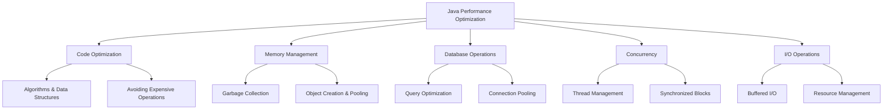

# Java Performance Optimization

## Introduction

Performance optimization is a critical aspect of Java development that can significantly impact your application's speed, resource consumption, and user experience. While Java's automatic memory management through garbage collection offers convenience, it doesn't absolve developers from thinking about performance considerations.

In this guide, we'll explore practical techniques to optimize Java applications, making them faster and more efficient. Whether you're building a small utility or an enterprise application, these optimization strategies will help you write better Java code that runs smoothly and scales effectively.

## Why Performance Optimization Matters

Even in today's era of powerful hardware, performance optimization remains crucial for several reasons:

1. **Better user experience** - Faster applications lead to better user satisfaction
2. **Cost efficiency** - Optimized code requires fewer computing resources
3. **Scalability** - Well-optimized applications can handle growth better
4. **Battery life** - For mobile applications, efficiency means longer battery life
5. **Environmental impact** - Efficient code consumes less energy

## Key Areas of Java Performance Optimization



## 1. Code-Level Optimization

### Use Appropriate Data Structures

Choosing the right data structure can dramatically impact performance.

```java
// Inefficient: Using ArrayList when you frequently search for elements
ArrayList<String> usernames = new ArrayList<>();
usernames.add("john_doe");
usernames.add("jane_smith");
// Searching is O(n) operation
boolean containsUser = usernames.contains("john_doe"); // Linear search

// Better: Using HashSet for faster lookups
HashSet<String> usernames = new HashSet<>();
usernames.add("john_doe");
usernames.add("jane_smith");
// Searching is O(1) operation
boolean containsUser = usernames.contains("john_doe"); // Constant time
```

### String Operations

String concatenation in loops can be extremely inefficient due to the immutable nature of strings.

```java
// Inefficient: Creates many temporary String objects
String result = "";
for (int i = 0; i < 10000; i++) {
    result += "Number: " + i + ", ";
}
System.out.println(result);

// Better: Using StringBuilder
StringBuilder builder = new StringBuilder();
for (int i = 0; i < 10000; i++) {
    builder.append("Number: ").append(i).append(", ");
}
System.out.println(builder.toString());
```

### Avoid Unnecessary Object Creation

Creating objects unnecessarily can burden the garbage collector.

```java
// Inefficient: Creates a new Date object on each iteration
for (int i = 0; i < 10000; i++) {
    Date now = new Date();
    processDate(now);
}

// Better: Reuse the same object
Date date = new Date();
for (int i = 0; i < 10000; i++) {
    date.setTime(System.currentTimeMillis());
    processDate(date);
}
```

## 2. Memory Management Optimization

### Understanding the Garbage Collector

The Java Garbage Collector (GC) automatically reclaims memory from objects that are no longer used. Although automatic, understanding how it works can help you write more efficient code.

```java
// Explicit nullification for large objects when you're done with them
public void processLargeData() {
    byte[] largeArray = new byte[100_000_000]; // ~100MB
    // Process data
    processByteArray(largeArray);
    
    // Make it eligible for garbage collection as soon as possible
    largeArray = null;
}
```

### Use Object Pools for Expensive Objects

For objects that are expensive to create but can be reused:

```java
import org.apache.commons.pool2.impl.GenericObjectPool;

public class ConnectionExample {
    private GenericObjectPool<DatabaseConnection> connectionPool;
    
    public void init() {
        // Setup connection pool
        connectionPool = new GenericObjectPool<>(new DatabaseConnectionFactory());
    }
    
    public void executeQuery(String query) {
        DatabaseConnection connection = null;
        try {
            // Borrow a connection from the pool
            connection = connectionPool.borrowObject();
            connection.executeQuery(query);
        } catch (Exception e) {
            e.printStackTrace();
        } finally {
            // Return connection to the pool instead of closing
            if (connection != null) {
                try {
                    connectionPool.returnObject(connection);
                } catch (Exception e) {
                    e.printStackTrace();
                }
            }
        }
    }
}
```

### Monitor Memory Usage

Use memory profilers to identify memory leaks and high memory usage areas:

```java
// Add JVM arguments to enable memory profiling
// -XX:+HeapDumpOnOutOfMemoryError -XX:HeapDumpPath=/path/to/dump.hprof

// Or programmatically request a heap dump
public void generateHeapDump() throws IOException {
    MBeanServer server = ManagementFactory.getPlatformMBeanServer();
    HotSpotDiagnosticMXBean mxBean = ManagementFactory.newPlatformMXBeanProxy(
            server, "com.sun.management:type=HotSpotDiagnostic", 
            HotSpotDiagnosticMXBean.class);
    mxBean.dumpHeap("/path/to/dump.hprof", true);
}
```

## 3. Database Performance Optimization

Database operations are often the performance bottleneck in applications.

### Use Connection Pooling

Establishing database connections is expensive. Use connection pools to reuse connections:

```java
// Using HikariCP connection pool
HikariConfig config = new HikariConfig();
config.setJdbcUrl("jdbc:mysql://localhost:3306/mydb");
config.setUsername("user");
config.setPassword("password");
config.addDataSourceProperty("cachePrepStmts", "true");
config.addDataSourceProperty("prepStmtCacheSize", "250");
config.addDataSourceProperty("prepStmtCacheSqlLimit", "2048");

HikariDataSource dataSource = new HikariDataSource(config);

// Get connection from pool
try (Connection conn = dataSource.getConnection()) {
    // Use connection
    // It will be automatically returned to the pool when closed
}
```

### Use Prepared Statements

Prepared statements improve security and performance by caching query execution plans:

```java
// Inefficient: New statement parsed each time
String name = "John";
Statement stmt = connection.createStatement();
ResultSet rs = stmt.executeQuery(
    "SELECT * FROM users WHERE username = '" + name + "'"
);

// Better: Prepared statement
PreparedStatement pstmt = connection.prepareStatement(
    "SELECT * FROM users WHERE username = ?"
);
pstmt.setString(1, name);
ResultSet rs = pstmt.executeQuery();
```

### Fetch Only What You Need

Retrieve only the columns and rows you actually need:

```java
// Inefficient: Fetching all columns
ResultSet rs = stmt.executeQuery("SELECT * FROM products");

// Better: Fetch only needed columns
ResultSet rs = stmt.executeQuery("SELECT id, name, price FROM products");

// Even better: Add filtering to reduce rows
ResultSet rs = stmt.executeQuery(
    "SELECT id, name, price FROM products WHERE category_id = 5 LIMIT 100"
);
```

## 4. Concurrency Optimization

### Use Thread Pools

Creating new threads is expensive. Use thread pools to reuse threads:

```java
// Thread pool with a fixed number of threads
ExecutorService executor = Executors.newFixedThreadPool(10);

// Submit tasks to the pool
for (int i = 0; i < 100; i++) {
    final int taskNum = i;
    executor.submit(() -> {
        System.out.println("Executing task " + taskNum);
        // Task execution
    });
}

// Shutdown the executor when no longer needed
executor.shutdown();
```

### Minimize Synchronized Blocks

Keep synchronized blocks as small as possible:

```java
// Inefficient: Entire method is synchronized
public synchronized void processData(String data) {
    // Validation (doesn't need synchronization)
    if (data == null || data.isEmpty()) {
        return;
    }
    
    // Expensive operation (doesn't need synchronization)
    String preprocessedData = heavyPreprocessing(data);
    
    // This is the only part that needs synchronization
    updateSharedData(preprocessedData);
}

// Better: Only synchronize what's necessary
public void processData(String data) {
    // Validation outside synchronized block
    if (data == null || data.isEmpty()) {
        return;
    }
    
    // Expensive operation outside synchronized block
    String preprocessedData = heavyPreprocessing(data);
    
    // Only synchronize the critical section
    synchronized (lock) {
        updateSharedData(preprocessedData);
    }
}
```

### Use Concurrent Collections

Java provides thread-safe collections in the `java.util.concurrent` package:

```java
// Thread-safe collections
ConcurrentHashMap<String, User> userMap = new ConcurrentHashMap<>();
CopyOnWriteArrayList<String> eventLog = new CopyOnWriteArrayList<>();
BlockingQueue<Task> taskQueue = new LinkedBlockingQueue<>();

// Producer-consumer pattern example
class TaskProcessor {
    private final BlockingQueue<Task> queue;
    
    public TaskProcessor() {
        this.queue = new LinkedBlockingQueue<>(1000);
        // Start consumer thread
        new Thread(this::processTasksFromQueue).start();
    }
    
    // Producer method
    public void addTask(Task task) {
        try {
            queue.put(task);
        } catch (InterruptedException e) {
            Thread.currentThread().interrupt();
        }
    }
    
    // Consumer method
    private void processTasksFromQueue() {
        while (true) {
            try {
                Task task = queue.take(); // Blocks if queue is empty
                task.execute();
            } catch (InterruptedException e) {
                Thread.currentThread().interrupt();
                break;
            }
        }
    }
}
```

## 5. I/O Operation Optimization

### Use Buffered I/O

Buffering reduces the number of system calls:

```java
// Inefficient: Unbuffered read
try (FileReader reader = new FileReader("data.txt")) {
    int character;
    while ((character = reader.read()) != -1) {
        // Process each character
    }
}

// Better: Buffered read
try (BufferedReader reader = new BufferedReader(new FileReader("data.txt"))) {
    String line;
    while ((line = reader.readLine()) != null) {
        // Process each line
    }
}
```

### Use NIO for Large Files

Java NIO provides more efficient file handling for large files:

```java
// Using NIO for reading large files
Path path = Paths.get("largefile.dat");
try (ByteChannel channel = Files.newByteChannel(path)) {
    ByteBuffer buffer = ByteBuffer.allocate(8192);
    while (channel.read(buffer) != -1) {
        buffer.flip();
        // Process the data in buffer
        buffer.clear();
    }
}
```

## 6. Profiling and Benchmarking

### Using JVM Profilers

Profilers help identify bottlenecks in your application:

1. **VisualVM**: A visual tool for monitoring and profiling Java applications
2. **JProfiler**: Commercial Java profiler with advanced features
3. **YourKit**: Another commercial Java profiler with memory and CPU profiling
4. **Java Flight Recorder**: Built-in profiling tool in Oracle JDK

### Benchmarking with JMH

JMH (Java Microbenchmark Harness) provides a framework for accurate benchmarking:

```java
import org.openjdk.jmh.annotations.*;
import org.openjdk.jmh.runner.Runner;
import org.openjdk.jmh.runner.options.Options;
import org.openjdk.jmh.runner.options.OptionsBuilder;

@BenchmarkMode(Mode.AverageTime)
@OutputTimeUnit(TimeUnit.MICROSECONDS)
@State(Scope.Thread)
@Fork(1)
@Warmup(iterations = 3)
@Measurement(iterations = 5)
public class StringConcatenationBenchmark {

    @Benchmark
    public String stringConcat() {
        String result = "";
        for (int i = 0; i < 100; i++) {
            result += i;
        }
        return result;
    }

    @Benchmark
    public String stringBuilder() {
        StringBuilder sb = new StringBuilder();
        for (int i = 0; i < 100; i++) {
            sb.append(i);
        }
        return sb.toString();
    }

    public static void main(String[] args) throws Exception {
        Options opt = new OptionsBuilder()
            .include(StringConcatenationBenchmark.class.getSimpleName())
            .build();
        new Runner(opt).run();
    }
}
```

## Real-World Example: Optimizing a REST API Service

Let's optimize a simple REST API service that retrieves and processes user data:

```java
@RestController
public class UserController {
    private final UserRepository userRepository;
    private final CacheManager cacheManager;
    
    // Constructor injection
    public UserController(UserRepository userRepository, CacheManager cacheManager) {
        this.userRepository = userRepository;
        this.cacheManager = cacheManager;
    }
    
    // Before optimization
    @GetMapping("/api/users")
    public List<UserDTO> getAllUsers() {
        // Inefficient: Fetches all users and keeps connection open
        List<User> users = userRepository.findAll();
        
        // Inefficient: Creates a new UserDTO for each User
        return users.stream()
            .map(user -> new UserDTO(user.getId(), user.getName(), user.getEmail()))
            .collect(Collectors.toList());
    }
    
    // After optimization
    @GetMapping("/api/users")
    public List<UserDTO> getAllUsers() {
        // Check cache first
        Cache cache = cacheManager.getCache("users");
        List<UserDTO> cachedUsers = cache.get("all", List.class);
        if (cachedUsers != null) {
            return cachedUsers;
        }
        
        // Use pagination to limit result size
        Pageable pageable = PageRequest.of(0, 100);
        Page<User> userPage = userRepository.findAll(pageable);
        
        // Pre-size the ArrayList to avoid resizing
        List<UserDTO> userDTOs = new ArrayList<>(userPage.getNumberOfElements());
        
        // Process in batches
        for (User user : userPage) {
            userDTOs.add(convertToDTO(user));
        }
        
        // Store in cache for future requests
        cache.put("all", userDTOs);
        
        return userDTOs;
    }
    
    // Reuse this method to avoid creating multiple identical DTOs
    private UserDTO convertToDTO(User user) {
        return new UserDTO(user.getId(), user.getName(), user.getEmail());
    }
}
```

## Summary

Java performance optimization is a multifaceted discipline that spans various levels of application development:

1. **Code-level optimization**: Choose appropriate data structures, minimize object creation, and use efficient algorithms
2. **Memory management**: Understand garbage collection, pool expensive objects, and monitor memory usage
3. **Database operations**: Use connection pools, prepared statements, and fetch only necessary data
4. **Concurrency**: Utilize thread pools, minimize synchronized blocks, and use concurrent collections
5. **I/O operations**: Apply buffering and leverage NIO for large files
6. **Profiling and benchmarking**: Use tools like JVM profilers and JMH to identify bottlenecks

Performance optimization is an iterative process. Always measure before and after your optimizations to ensure they're actually improving performance. Remember Donald Knuth's wisdom: "Premature optimization is the root of all evil." Focus on writing clear, maintainable code first, then optimize where measurements show it's necessary.

## Additional Resources

1. **Books**:
   - "Java Performance: The Definitive Guide" by Scott Oaks
   - "Optimizing Java" by Benjamin Evans, James Gough, and Chris Newland

2. **Online Resources**:
   - [Java Performance Tuning Guide](https://docs.oracle.com/en/java/javase/11/gctuning/introduction-garbage-collection-tuning.html) by Oracle
   - [Baeldung Performance Articles](https://www.baeldung.com/tag/performance/)
   - [Java Performance Optimization Course](https://www.pluralsight.com/courses/java-performance-optimization) on Pluralsight

3. **Tools**:
   - [VisualVM](https://visualvm.github.io/)
   - [JMH](https://openjdk.org/projects/code-tools/jmh/)
   - [JProfiler](https://www.ej-technologies.com/products/jprofiler/overview.html)

## Practice Exercises

1. Profile a simple application using VisualVM and identify potential bottlenecks
2. Compare the performance of different Java collections (ArrayList, LinkedList, HashSet) for various operations
3. Implement object pooling for a resource-intensive class
4. Optimize a method that reads and processes a large text file
5. Write JMH benchmarks to compare different string concatenation techniques