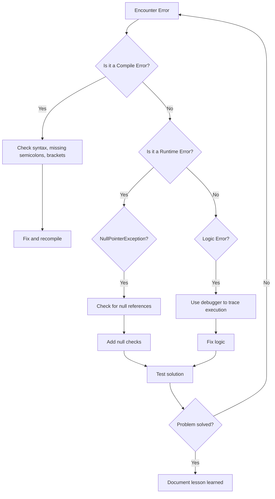

# Java Common Mistakes

When learning Java, beginners often encounter similar stumbling blocks. Understanding these common mistakes not only helps you avoid them but also deepens your understanding of how Java works. In this guide, we'll explore frequently made Java mistakes and provide solutions to help you write better code.

## Introduction

Java is a robust programming language with strict syntax and rules. While this strictness helps catch errors early, it can also lead to common pitfalls for beginners. Recognizing and understanding these mistakes will save you debugging time and help you become a more proficient Java programmer.

Let's dive into the most common Java mistakes and how to avoid them.

## Syntax Errors

### 1. Missing Semicolons

One of the most frequent mistakes in Java is forgetting to end statements with semicolons.

```java
// Incorrect
System.out.println("Hello World")

// Correct
System.out.println("Hello World");
```

### 2. Incorrect Bracket Placement

Mismatched or missing brackets can cause your code to behave unexpectedly or fail to compile.

```java
// Incorrect
public class BracketExample {
    public static void main(String[] args) {
        if (true) {
            System.out.println("This is correct");
        
        System.out.println("This is outside the if block");
    } // Missing closing bracket for the if statement

// Correct
public class BracketExample {
    public static void main(String[] args) {
        if (true) {
            System.out.println("This is correct");
        }
        System.out.println("This is outside the if block");
    }
}
```

### 3. Case Sensitivity Issues

Java is case-sensitive, meaning `myVariable`, `MyVariable`, and `MYVARIABLE` are all different identifiers.

```java
// Declaring a variable
String userName = "John";

// Incorrect usage
System.out.println(Username); // Compilation error: Username cannot be resolved

// Correct usage
System.out.println(userName);
```

## Logical Errors

### 1. Using `==` Instead of `.equals()` for String Comparison

```java
public class StringComparisonExample {
    public static void main(String[] args) {
        String str1 = "Hello";
        String str2 = new String("Hello");
        
        // Incorrect - compares object references, not content
        System.out.println("Using == operator: " + (str1 == str2)); // Output: false
        
        // Correct - compares string content
        System.out.println("Using equals method: " + str1.equals(str2)); // Output: true
    }
}
```

### 2. Array Index Out of Bounds

Trying to access an array element at an invalid index is a common mistake.

```java
public class ArrayIndexExample {
    public static void main(String[] args) {
        int[] numbers = {1, 2, 3, 4, 5};
        
        // Incorrect - arrays are zero-indexed, valid indices are 0-4
        try {
            System.out.println(numbers[5]); // Throws ArrayIndexOutOfBoundsException
        } catch (ArrayIndexOutOfBoundsException e) {
            System.out.println("Error: " + e.getMessage());
        }
        
        // Correct
        System.out.println("Last element: " + numbers[4]); // Output: Last element: 5
    }
}
```

### 3. Misunderstanding Integer Division

Integer division in Java truncates the decimal part, which can lead to unexpected results.

```java
public class IntegerDivisionExample {
    public static void main(String[] args) {
        // Incorrect - if you expect decimal result
        int result1 = 5 / 2;
        System.out.println("5 / 2 = " + result1);  // Output: 5 / 2 = 2
        
        // Correct - for decimal result, use floating-point numbers
        double result2 = 5.0 / 2.0;
        System.out.println("5.0 / 2.0 = " + result2);  // Output: 5.0 / 2.0 = 2.5
        
        // Alternative - cast one operand to double
        double result3 = (double)5 / 2;
        System.out.println("(double)5 / 2 = " + result3);  // Output: (double)5 / 2 = 2.5
    }
}
```

## Resource Management

### 1. Not Closing Resources

Forgetting to close resources like files, database connections, or streams can cause resource leaks.

```java
import java.io.*;

public class ResourceManagementExample {
    public static void main(String[] args) {
        // Incorrect - resource not closed
        BufferedReader badReader = null;
        try {
            badReader = new BufferedReader(new FileReader("example.txt"));
            String line = badReader.readLine();
            System.out.println(line);
            // Missing badReader.close();
        } catch (IOException e) {
            System.out.println("Error: " + e.getMessage());
        }
        
        // Correct - using try-with-resources (Java 7+)
        try (BufferedReader goodReader = new BufferedReader(new FileReader("example.txt"))) {
            String line = goodReader.readLine();
            System.out.println(line);
            // Resource automatically closed
        } catch (IOException e) {
            System.out.println("Error: " + e.getMessage());
        }
    }
}
```

### 2. Ignoring Exceptions

Simply catching exceptions without proper handling can hide bugs and make debugging difficult.

```java
// Incorrect
try {
    // Code that might throw exceptions
    int result = 10 / 0;
} catch (Exception e) {
    // Empty catch block - this is bad practice!
}

// Correct
try {
    // Code that might throw exceptions
    int result = 10 / 0;
} catch (ArithmeticException e) {
    System.err.println("Error: Division by zero occurred");
    // Log the exception or take appropriate action
    e.printStackTrace();
}
```

## Performance Issues

### 1. String Concatenation in Loops

Using the `+` operator for String concatenation inside loops is inefficient.

```java
public class StringConcatenationExample {
    public static void main(String[] args) {
        // Inefficient way
        long startTime1 = System.currentTimeMillis();
        String result1 = "";
        for (int i = 0; i < 100000; i++) {
            result1 += i; // Creates a new String object each iteration
        }
        long endTime1 = System.currentTimeMillis();
        System.out.println("Time with + operator: " + (endTime1 - startTime1) + "ms");
        
        // Efficient way
        long startTime2 = System.currentTimeMillis();
        StringBuilder result2 = new StringBuilder();
        for (int i = 0; i < 100000; i++) {
            result2.append(i);
        }
        long endTime2 = System.currentTimeMillis();
        System.out.println("Time with StringBuilder: " + (endTime2 - startTime2) + "ms");
    }
}
```

### 2. Using Unnecessary Objects

Creating objects unnecessarily, especially in loops, can impact performance.

```java
public class UnnecessaryObjectsExample {
    public static void main(String[] args) {
        // Inefficient - creates 1000 Integer objects
        long startTime1 = System.currentTimeMillis();
        for (int i = 0; i < 1000000; i++) {
            Integer num = new Integer(i); // Deprecated and inefficient
            // Do something with num
        }
        long endTime1 = System.currentTimeMillis();
        
        // Better - autoboxing, but still creates objects
        long startTime2 = System.currentTimeMillis();
        for (int i = 0; i < 1000000; i++) {
            Integer num = i; // Autoboxing
            // Do something with num
        }
        long endTime2 = System.currentTimeMillis();
        
        // Best - use primitive types when possible
        long startTime3 = System.currentTimeMillis();
        for (int i = 0; i < 1000000; i++) {
            int num = i; // No object creation
            // Do something with num
        }
        long endTime3 = System.currentTimeMillis();
        
        System.out.println("Time with new Integer(): " + (endTime1 - startTime1) + "ms");
        System.out.println("Time with autoboxing: " + (endTime2 - startTime2) + "ms");
        System.out.println("Time with primitive: " + (endTime3 - startTime3) + "ms");
    }
}
```

## Object-Oriented Programming Mistakes

### 1. Not Understanding Variable Scope

```java
public class ScopeExample {
    public static void main(String[] args) {
        // Variable declaration
        int x = 10;
        
        if (x > 5) {
            int y = 20; // y is only accessible within this block
            System.out.println("x = " + x + ", y = " + y);
        }
        
        // Incorrect - trying to access y outside its scope
        // System.out.println("y = " + y); // Compilation error
        
        // Correct - y should be declared outside if block to be used here
        int y = 30;
        System.out.println("x = " + x + ", y = " + y); // Output: x = 10, y = 30
    }
}
```

### 2. Misuse of Static

Misunderstanding when to use static methods and variables is common.

```java
public class StaticMisuseExample {
    // Instance variable - each object has its own copy
    private int instanceCounter = 0;
    
    // Static variable - shared across all objects
    private static int staticCounter = 0;
    
    public void incrementCounters() {
        instanceCounter++;
        staticCounter++;
        System.out.println("Instance counter: " + instanceCounter);
        System.out.println("Static counter: " + staticCounter);
    }
    
    public static void main(String[] args) {
        StaticMisuseExample obj1 = new StaticMisuseExample();
        StaticMisuseExample obj2 = new StaticMisuseExample();
        
        System.out.println("Object 1:");
        obj1.incrementCounters(); // Output: Instance: 1, Static: 1
        
        System.out.println("\nObject 2:");
        obj2.incrementCounters(); // Output: Instance: 1, Static: 2
        
        System.out.println("\nObject 1 again:");
        obj1.incrementCounters(); // Output: Instance: 2, Static: 3
    }
}
```

### 3. Forgetting to Override Both equals() and hashCode()

When you override `equals()`, you should also override `hashCode()`. Not doing so can cause unexpected behavior with collections like HashSet or HashMap.

```java
import java.util.*;

// Incorrect implementation
class IncorrectPerson {
    private String name;
    private int age;
    
    public IncorrectPerson(String name, int age) {
        this.name = name;
        this.age = age;
    }
    
    @Override
    public boolean equals(Object obj) {
        if (this == obj) return true;
        if (obj == null || getClass() != obj.getClass()) return false;
        IncorrectPerson person = (IncorrectPerson) obj;
        return age == person.age && Objects.equals(name, person.name);
    }
    
    // hashCode not overridden!
}

// Correct implementation
class CorrectPerson {
    private String name;
    private int age;
    
    public CorrectPerson(String name, int age) {
        this.name = name;
        this.age = age;
    }
    
    @Override
    public boolean equals(Object obj) {
        if (this == obj) return true;
        if (obj == null || getClass() != obj.getClass()) return false;
        CorrectPerson person = (CorrectPerson) obj;
        return age == person.age && Objects.equals(name, person.name);
    }
    
    @Override
    public int hashCode() {
        return Objects.hash(name, age);
    }
}

public class EqualsHashCodeExample {
    public static void main(String[] args) {
        // Testing the incorrect implementation
        Set<IncorrectPerson> incorrectSet = new HashSet<>();
        incorrectSet.add(new IncorrectPerson("John", 30));
        
        // Should be true but might be false
        System.out.println("incorrectSet contains John, 30: " + 
                           incorrectSet.contains(new IncorrectPerson("John", 30)));
        
        // Testing the correct implementation
        Set<CorrectPerson> correctSet = new HashSet<>();
        correctSet.add(new CorrectPerson("John", 30));
        
        // Will correctly return true
        System.out.println("correctSet contains John, 30: " + 
                          correctSet.contains(new CorrectPerson("John", 30)));
    }
}
```

## Null Pointer Exceptions

NullPointerExceptions are among the most common runtime errors in Java.

```java
public class NullPointerExample {
    public static void main(String[] args) {
        // Example 1: Direct null reference
        String str = null;
        
        // Incorrect
        try {
            System.out.println(str.length()); // Throws NullPointerException
        } catch (NullPointerException e) {
            System.out.println("Error: " + e.getMessage());
        }
        
        // Correct - check before using
        if (str != null) {
            System.out.println(str.length());
        } else {
            System.out.println("String is null");
        }
        
        // Example 2: Null in method chain
        Person person = getPerson(); // This method might return null
        
        // Incorrect
        try {
            String address = person.getAddress().getCity(); // May throw NullPointerException
            System.out.println("City: " + address);
        } catch (NullPointerException e) {
            System.out.println("Error in chain: " + e.getMessage());
        }
        
        // Correct - check each step
        if (person != null && person.getAddress() != null) {
            String city = person.getAddress().getCity();
            System.out.println("City: " + city);
        } else {
            System.out.println("Person or address is null");
        }
    }
    
    // Helper method that might return null
    private static Person getPerson() {
        // Simulating a case where we might get null
        return null;
    }
    
    // Simple classes for demonstration
    static class Person {
        private Address address;
        
        public Address getAddress() {
            return address;
        }
    }
    
    static class Address {
        private String city;
        
        public String getCity() {
            return city;
        }
    }
}
```

## Concurrency Issues

Multithreaded programming introduces its own set of common mistakes.

```java
public class ConcurrencyMistakeExample {
    // Shared resource
    private static int counter = 0;
    
    // Incorrect - not thread-safe
    public static void incrementUnsafe() {
        counter++; // This is not atomic
    }
    
    // Correct - thread-safe with synchronization
    public static synchronized void incrementSafe() {
        counter++;
    }
    
    public static void main(String[] args) throws InterruptedException {
        // Reset counter
        counter = 0;
        
        // Creating threads using the unsafe method
        Thread[] unsafeThreads = new Thread[1000];
        for (int i = 0; i < unsafeThreads.length; i++) {
            unsafeThreads[i] = new Thread(() -> {
                for (int j = 0; j < 100; j++) {
                    incrementUnsafe();
                }
            });
            unsafeThreads[i].start();
        }
        
        // Wait for all unsafe threads to complete
        for (Thread t : unsafeThreads) {
            t.join();
        }
        
        System.out.println("Expected value: 100000");
        System.out.println("Actual value with unsafe increment: " + counter);
        
        // Reset counter
        counter = 0;
        
        // Creating threads using the safe method
        Thread[] safeThreads = new Thread[1000];
        for (int i = 0; i < safeThreads.length; i++) {
            safeThreads[i] = new Thread(() -> {
                for (int j = 0; j < 100; j++) {
                    incrementSafe();
                }
            });
            safeThreads[i].start();
        }
        
        // Wait for all safe threads to complete
        for (Thread t : safeThreads) {
            t.join();
        }
        
        System.out.println("Expected value: 100000");
        System.out.println("Actual value with safe increment: " + counter);
    }
}
```

## Common Workflow Flow Chart

Here's a visual representation of a typical debug workflow when encountering Java errors:



## Summary

Understanding common Java mistakes is crucial for developing reliable and efficient Java applications. In this guide, we've covered:

1. **Syntax Errors**: Missing semicolons, incorrect brackets, and case sensitivity issues.
2. **Logical Errors**: String comparison issues, array index mistakes, and integer division problems.
3. **Resource Management**: The importance of properly closing resources and handling exceptions.
4. **Performance Issues**: Inefficient string concatenation and unnecessary object creation.
5. **Object-Oriented Programming Mistakes**: Variable scope, static misuse, and equals/hashCode implementation.
6. **Null Pointer Exceptions**: How to safely handle potentially null references.
7. **Concurrency Issues**: Race conditions and thread safety concerns.

By being aware of these common mistakes and understanding how to avoid them, you'll write more robust Java code and spend less time debugging.

## Additional Resources

1. [Oracle's Java Tutorials](https://docs.oracle.com/javase/tutorial/)
2. [Java Code Geeks - Common Mistakes](https://www.javacodegeeks.com/)
3. [Effective Java by Joshua Bloch](https://www.amazon.com/Effective-Java-Joshua-Bloch/dp/0134685997) - A must-read book for Java developers

## Practice Exercises

1. **Debug Challenge**: Fix the following code that contains multiple common Java mistakes:
   ```java
   public class DebugMe {
       public static main(String args) {
           String message = "Hello";
           String anotherMessage = new String("Hello");
           
           if (message == anotherMessage)
               System.out.println("They match!");
               System.out.println("Processing...");
           
           int items = 5;
           double price = 10;
           double average = items / price;
           
           System.out.println("Average price: " + average);
       }
   }
   ```

2. **Resource Management**: Write a program that reads a text file line by line and counts the number of words. Ensure you handle resources properly.

3. **Concurrency**: Create a simple bank account class with deposit and withdraw methods. Make it thread-safe so multiple threads can access it concurrently without causing inconsistencies.

Happy coding, and remember that making mistakes is an essential part of the learning process!