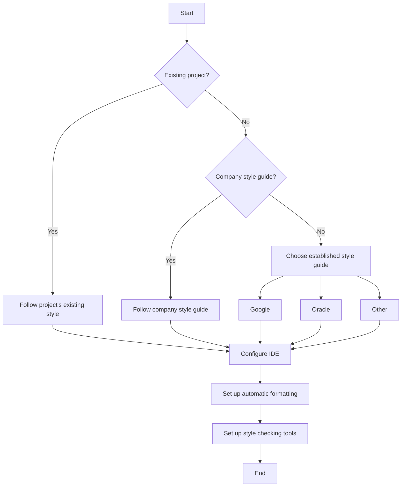

# Java Style Guides

## Introduction

A style guide is a set of standards and conventions that dictate how code should be written in a programming language. For Java developers, following a consistent style guide is essential for several reasons:

- **Readability**: Well-formatted code is easier to read and understand
- **Maintainability**: Consistent code is easier to maintain and modify
- **Collaboration**: Style guides facilitate teamwork by establishing common coding conventions
- **Professionalism**: Clean code reflects professional development practices

In this guide, we'll explore Java style conventions, looking at widely accepted standards, and provide practical examples to help you write cleaner, more professional Java code.

## Popular Java Style Guides

Several well-established style guides exist for Java:

1. **Google Java Style Guide**: Google's comprehensive guidelines for Java code
2. **Oracle's Code Conventions**: The original Java coding standards
3. **Sun Microsystems Style Guide**: Historical conventions that influenced modern practices
4. **Twitter's Java Style Guide**: Twitter's adaptation of standard Java conventions

Let's look at the key principles common to most Java style guides.

## Naming Conventions

### Package Names

Packages should be named in all lowercase, with meaningful, short names. Multiple words are concatenated together without underscores.

```java
// Good package naming
package com.example.utilities;
package org.myproject.database;

// Bad package naming
package com.example.Utilities; // Don't use capital letters
package org.my_project.database; // Don't use underscores
```

### Class and Interface Names

Classes and interfaces should use `PascalCase` (also called `UpperCamelCase`), where each word starts with an uppercase letter.

```java
// Good class names
public class Customer { }
public class BankAccount { }
public class TransactionProcessor { }

// Good interface names
public interface Comparable { }
public interface Runnable { }
public interface AccountManager { }

// Bad class/interface names
public class customer { } // Should start with uppercase
public class bank_account { } // Should use camel case, not underscores
```

### Method and Variable Names

Methods and variables should use `camelCase`, starting with a lowercase letter.

```java
// Good method names
public void calculateTotal() { }
public void sendEmail() { }

// Good variable names
int itemCount;
String customerName;
boolean isActive;

// Bad method/variable names
public void CalculateTotal() { } // Should start with lowercase
String customer_name; // Should use camel case, not underscores
```

### Constant Names

Constants (static final variables) should use `UPPER_SNAKE_CASE`.

```java
// Good constant naming
public static final int MAX_USERS = 100;
public static final String API_KEY = "abc123";

// Bad constant naming
public static final int maxUsers = 100; // Should be uppercase with underscores
public static final String ApiKey = "abc123"; // Should be uppercase with underscores
```

## Code Formatting

### Indentation

Most Java style guides recommend using 4 spaces for indentation rather than tabs.

```java
public class Example {
    public void method() {
        if (condition) {
            doSomething();
        }
    }
}
```

### Line Length

Keep lines to a reasonable length (typically 80-100 characters) to ensure readability.

```java
// Before - line too long
String message = "This is a very long string that exceeds the recommended line length and makes the code harder to read on most displays.";

// After - properly formatted with line breaks
String message = "This is a very long string that exceeds the recommended " +
                 "line length and makes the code harder to read on most displays.";
```

### Braces

For braces, most Java style guides recommend the "Egyptian style" or "K&R style", where the opening brace appears at the end of the line, and the closing brace is aligned with the start of the opening line.

```java
// Recommended brace style
if (condition) {
    statement1;
    statement2;
} else {
    statement3;
    statement4;
}

// Not recommended
if (condition)
{
    statement1;
    statement2;
}
else
{
    statement3;
    statement4;
}
```

### Whitespace

Use blank lines to separate logical groups of code and improve readability.

```java
public class Example {
    private int field1;
    private String field2;
    
    // Blank line separates fields from constructor
    public Example(int value, String text) {
        this.field1 = value;
        this.field2 = text;
    }
    
    // Blank line separates methods
    public void method1() {
        // Method implementation
        int localVar = 10;
        
        // Blank line separates logical sections within methods
        if (localVar > 5) {
            System.out.println("Greater than 5");
        }
    }
}
```

## Comments

### Class and Method Comments

Use JavaDoc comments for classes, interfaces, methods, and public fields.

```java
/**
 * Represents a bank account with basic functionality.
 * This class provides methods for deposits, withdrawals, and balance inquiries.
 */
public class BankAccount {
    private double balance;
    
    /**
     * Withdraws the specified amount from the account.
     * 
     * @param amount The amount to withdraw
     * @return true if the withdrawal was successful, false otherwise
     * @throws IllegalArgumentException if amount is negative
     */
    public boolean withdraw(double amount) {
        if (amount < 0) {
            throw new IllegalArgumentException("Withdrawal amount cannot be negative");
        }
        
        if (amount <= balance) {
            balance -= amount;
            return true;
        }
        
        return false;
    }
}
```

### Implementation Comments

Use regular comments to explain complex sections of code.

```java
// Calculate the average of the values
double sum = 0;
for (double value : values) {
    sum += value;
}
double average = values.length > 0 ? sum / values.length : 0;
```

## Best Practices

### Organize Imports

Organize imports alphabetically, with static imports last.

```java
import java.util.ArrayList;
import java.util.List;
import javax.swing.JButton;
import javax.swing.JFrame;

import static java.lang.Math.PI;
```

### Avoid Magic Numbers

Replace magic numbers with named constants to improve readability.

```java
// Before - with magic numbers
if (status == 0) {
    processOrder(items, 15.99);
}

// After - using constants
private static final int STATUS_PENDING = 0;
private static final double STANDARD_PROCESSING_FEE = 15.99;

if (status == STATUS_PENDING) {
    processOrder(items, STANDARD_PROCESSING_FEE);
}
```

### Proper Exception Handling

Follow good exception handling practices.

```java
// Bad practice
try {
    // Code that might throw exceptions
} catch (Exception e) {
    // Catching all exceptions and doing nothing
}

// Good practice
try {
    // Code that might throw exceptions
} catch (IOException e) {
    logger.error("Failed to read file", e);
    throw new ServiceException("Could not process request", e);
} catch (SQLException e) {
    logger.error("Database error", e);
    // Handle database errors appropriately
} finally {
    // Clean up resources
    if (connection != null) {
        try {
            connection.close();
        } catch (SQLException e) {
            logger.warn("Failed to close connection", e);
        }
    }
}
```

## Real-World Example: Building a Customer Management System

Let's look at a practical example that follows proper Java style conventions:

```java
package com.example.crm;

import java.time.LocalDate;
import java.util.ArrayList;
import java.util.List;

/**
 * Represents a customer in the CRM system.
 */
public class Customer {
    // Constants
    private static final int MAX_USERNAME_LENGTH = 50;
    
    // Instance variables
    private final String id;
    private String firstName;
    private String lastName;
    private String email;
    private LocalDate registrationDate;
    private List<Order> orders;
    
    /**
     * Creates a new customer with the given details.
     * 
     * @param id Unique identifier for the customer
     * @param firstName Customer's first name
     * @param lastName Customer's last name
     * @param email Customer's email address
     */
    public Customer(String id, String firstName, String lastName, String email) {
        // Input validation
        if (id == null || id.isEmpty()) {
            throw new IllegalArgumentException("Customer ID cannot be empty");
        }
        
        this.id = id;
        this.firstName = firstName;
        this.lastName = lastName;
        this.email = email;
        this.registrationDate = LocalDate.now();
        this.orders = new ArrayList<>();
    }
    
    /**
     * Returns the full name of the customer.
     * 
     * @return The customer's full name (first and last name combined)
     */
    public String getFullName() {
        return firstName + " " + lastName;
    }
    
    /**
     * Adds a new order for this customer.
     * 
     * @param order The order to add
     */
    public void addOrder(Order order) {
        if (order == null) {
            throw new IllegalArgumentException("Order cannot be null");
        }
        orders.add(order);
    }
    
    /**
     * Calculates the total value of all orders made by this customer.
     * 
     * @return The total value of all customer orders
     */
    public double calculateTotalOrderValue() {
        double totalValue = 0.0;
        
        for (Order order : orders) {
            totalValue += order.getTotalPrice();
        }
        
        return totalValue;
    }
    
    // Getters and setters with appropriate JavaDoc omitted for brevity
}
```

## Automating Style Checking

Modern IDEs and build tools can help enforce style guides:

1. **IDE Formatting**: Both IntelliJ IDEA and Eclipse have built-in code formatters
2. **Checkstyle**: A development tool that checks Java code against a defined set of rules
3. **PMD**: A source code analyzer that finds common programming flaws
4. **SonarQube**: A platform for continuous inspection of code quality

Example of Checkstyle configuration:

```xml
<?xml version="1.0"?>
<!DOCTYPE module PUBLIC
          "-//Checkstyle//DTD Checkstyle Configuration 1.3//EN"
          "https://checkstyle.org/dtds/configuration_1_3.dtd">
<module name="Checker">
    <module name="LineLength">
        <property name="max" value="100"/>
    </module>
    <module name="TreeWalker">
        <module name="NeedBraces"/>
        <module name="LeftCurly"/>
        <module name="RightCurly"/>
        <module name="WhitespaceAfter"/>
        <module name="WhitespaceAround"/>
        <module name="MethodLength">
            <property name="max" value="50"/>
        </module>
    </module>
</module>
```

## Style Guide Decision Flow



## Summary

Following a consistent style guide is essential for writing clean, maintainable Java code. Key points to remember:

- **Naming Conventions**: Use appropriate case for different identifiers (packages, classes, variables, constants)
- **Code Formatting**: Maintain consistent indentation, line length, and bracing style
- **Documentation**: Use JavaDoc comments for public APIs and regular comments for implementation details
- **Best Practices**: Organize imports, avoid magic numbers, and handle exceptions properly
- **Automation**: Leverage tools to enforce style consistency

By adopting and consistently applying these style conventions, you'll write more professional Java code that's easier to read, maintain, and collaborate on.

## Additional Resources

1. [Google Java Style Guide](https://google.github.io/styleguide/javaguide.html)
2. [Oracle's Code Conventions for the Java Programming Language](https://www.oracle.com/java/technologies/javase/codeconventions-contents.html)
3. [Checkstyle Documentation](https://checkstyle.org/)
4. [Clean Code: A Handbook of Agile Software Craftsmanship](https://www.amazon.com/Clean-Code-Handbook-Software-Craftsmanship/dp/0132350882) by Robert C. Martin

## Practice Exercises

1. Take an existing Java file and reformat it according to the guidelines in this article.
2. Configure Checkstyle in your IDE or build system and run it against your code.
3. Create a style guide for your own project, drawing on the principles discussed here but tailored to your specific needs.
4. Refactor a piece of code to remove magic numbers, improve variable naming, and add appropriate comments.
5. Review some open-source Java projects and analyze their adherence to style conventions.