# Java Design Patterns

## Introduction

Design patterns represent the best practices used by experienced software developers. They are solutions to general problems that software developers faced during software development. Design patterns are about reusable designs and interactions of objects.

In this guide, we'll explore the concept of design patterns in Java, understand why they're important, and learn how to implement some of the most common patterns with practical examples.

## What are Design Patterns?

Design patterns are typical solutions to commonly occurring problems in software design. They are like pre-made blueprints that you can customize to solve a recurring design problem in your code.

Design patterns are not specific to any programming language. However, we'll focus on implementing them in Java, which is an object-oriented language that naturally supports many design patterns.

## Types of Design Patterns

Design patterns are typically categorized into three main groups:

1. **Creational Patterns**: These deal with object creation mechanisms, trying to create objects in a manner suitable to the situation.
2. **Structural Patterns**: These are concerned with object composition and typically identify simple ways to realize relationships between different objects.
3. **Behavioral Patterns**: These are concerned with communication between objects, how objects interact and distribute responsibility.

Let's explore some common patterns from each category.

## Creational Design Patterns

### Singleton Pattern

The Singleton pattern ensures a class has only one instance and provides a global point of access to it.

```java
public class Singleton {
    // Private static variable that holds the single instance
    private static Singleton instance;
    
    // Private constructor to prevent instantiation from outside
    private Singleton() {
        // Initialization code
    }
    
    // Public static method to get the instance
    public static Singleton getInstance() {
        if (instance == null) {
            instance = new Singleton();
        }
        return instance;
    }
    
    // Other methods
    public void showMessage() {
        System.out.println("Hello from Singleton!");
    }
}
```

Usage:

```java
public class SingletonPatternDemo {
    public static void main(String[] args) {
        // Get the only object available
        Singleton object = Singleton.getInstance();
        
        // Show the message
        object.showMessage();
    }
}
```

Output:
```
Hello from Singleton!
```

Note: The implementation above is not thread-safe. For a thread-safe implementation, you would need to use synchronized methods or an eagerly created instance.

### Factory Pattern

The Factory pattern provides an interface for creating objects in a superclass, but allows subclasses to alter the type of objects that will be created.

```java
// Step 1: Create an interface
interface Shape {
    void draw();
}

// Step 2: Create concrete classes implementing the interface
class Rectangle implements Shape {
    @Override
    public void draw() {
        System.out.println("Drawing Rectangle");
    }
}

class Circle implements Shape {
    @Override
    public void draw() {
        System.out.println("Drawing Circle");
    }
}

// Step 3: Create a Factory to generate objects of concrete classes
class ShapeFactory {
    public Shape getShape(String shapeType) {
        if (shapeType == null) {
            return null;
        }
        if (shapeType.equalsIgnoreCase("CIRCLE")) {
            return new Circle();
        } else if (shapeType.equalsIgnoreCase("RECTANGLE")) {
            return new Rectangle();
        }
        return null;
    }
}
```

Usage:

```java
public class FactoryPatternDemo {
    public static void main(String[] args) {
        ShapeFactory shapeFactory = new ShapeFactory();

        // Get an object of Circle and call its draw method
        Shape circle = shapeFactory.getShape("CIRCLE");
        circle.draw();

        // Get an object of Rectangle and call its draw method
        Shape rectangle = shapeFactory.getShape("RECTANGLE");
        rectangle.draw();
    }
}
```

Output:
```
Drawing Circle
Drawing Rectangle
```

## Structural Design Patterns

### Adapter Pattern

The Adapter pattern allows objects with incompatible interfaces to collaborate.

```java
// Step 1: Create interfaces
interface MediaPlayer {
    void play(String audioType, String fileName);
}

interface AdvancedMediaPlayer {
    void playMp4(String fileName);
    void playVlc(String fileName);
}

// Step 2: Create concrete classes implementing the AdvancedMediaPlayer interface
class Mp4Player implements AdvancedMediaPlayer {
    @Override
    public void playMp4(String fileName) {
        System.out.println("Playing mp4 file. Name: " + fileName);
    }

    @Override
    public void playVlc(String fileName) {
        // Do nothing
    }
}

class VlcPlayer implements AdvancedMediaPlayer {
    @Override
    public void playMp4(String fileName) {
        // Do nothing
    }

    @Override
    public void playVlc(String fileName) {
        System.out.println("Playing vlc file. Name: " + fileName);
    }
}

// Step 3: Create adapter class
class MediaAdapter implements MediaPlayer {
    AdvancedMediaPlayer advancedMusicPlayer;

    public MediaAdapter(String audioType) {
        if (audioType.equalsIgnoreCase("vlc")) {
            advancedMusicPlayer = new VlcPlayer();
        } else if (audioType.equalsIgnoreCase("mp4")) {
            advancedMusicPlayer = new Mp4Player();
        }
    }

    @Override
    public void play(String audioType, String fileName) {
        if (audioType.equalsIgnoreCase("vlc")) {
            advancedMusicPlayer.playVlc(fileName);
        } else if (audioType.equalsIgnoreCase("mp4")) {
            advancedMusicPlayer.playMp4(fileName);
        }
    }
}

// Step 4: Create concrete class implementing the MediaPlayer interface
class AudioPlayer implements MediaPlayer {
    MediaAdapter mediaAdapter;

    @Override
    public void play(String audioType, String fileName) {
        // Built-in support for mp3
        if (audioType.equalsIgnoreCase("mp3")) {
            System.out.println("Playing mp3 file. Name: " + fileName);
        }
        // MediaAdapter provides support for other formats
        else if (audioType.equalsIgnoreCase("vlc") || audioType.equalsIgnoreCase("mp4")) {
            mediaAdapter = new MediaAdapter(audioType);
            mediaAdapter.play(audioType, fileName);
        } else {
            System.out.println("Invalid media. " + audioType + " format not supported");
        }
    }
}
```

Usage:

```java
public class AdapterPatternDemo {
    public static void main(String[] args) {
        AudioPlayer audioPlayer = new AudioPlayer();
        
        audioPlayer.play("mp3", "beyond_the_horizon.mp3");
        audioPlayer.play("mp4", "alone.mp4");
        audioPlayer.play("vlc", "far_far_away.vlc");
        audioPlayer.play("avi", "mind_me.avi");
    }
}
```

Output:
```
Playing mp3 file. Name: beyond_the_horizon.mp3
Playing mp4 file. Name: alone.mp4
Playing vlc file. Name: far_far_away.vlc
Invalid media. avi format not supported
```

## Behavioral Design Patterns

### Observer Pattern

The Observer pattern defines a one-to-many dependency between objects so that when one object changes state, all its dependents are notified and updated automatically.

```java
import java.util.ArrayList;
import java.util.List;

// Step 1: Create Subject interface
interface Subject {
    void register(Observer obj);
    void unregister(Observer obj);
    void notifyObservers();
    Object getUpdate();
}

// Step 2: Create Observer interface
interface Observer {
    void update();
}

// Step 3: Create concrete subject
class NewsChannel implements Subject {
    private List<Observer> observers;
    private String news;

    public NewsChannel() {
        this.observers = new ArrayList<>();
    }

    @Override
    public void register(Observer obj) {
        if (!observers.contains(obj)) observers.add(obj);
    }

    @Override
    public void unregister(Observer obj) {
        observers.remove(obj);
    }

    @Override
    public void notifyObservers() {
        for (Observer obj : observers) {
            obj.update();
        }
    }

    @Override
    public Object getUpdate() {
        return this.news;
    }

    // Method to post news
    public void setNews(String news) {
        this.news = news;
        notifyObservers();
    }
}

// Step 4: Create concrete observer
class NewsSubscriber implements Observer {
    private String name;
    private Subject channel;

    public NewsSubscriber(String name, Subject channel) {
        this.name = name;
        this.channel = channel;
    }

    @Override
    public void update() {
        String news = (String) channel.getUpdate();
        System.out.println(name + " received news: " + news);
    }
}
```

Usage:

```java
public class ObserverPatternDemo {
    public static void main(String[] args) {
        // Create subject
        NewsChannel channel = new NewsChannel();
        
        // Create observers
        Observer sub1 = new NewsSubscriber("Subscriber 1", channel);
        Observer sub2 = new NewsSubscriber("Subscriber 2", channel);
        
        // Register observers
        channel.register(sub1);
        channel.register(sub2);
        
        // Attach observers to subject
        
        // Change subject state
        channel.setNews("Breaking News: Java Design Patterns are awesome!");
        
        // Unregister one observer
        channel.unregister(sub2);
        
        // Change subject state again
        channel.setNews("Another Breaking News: New Java version released!");
    }
}
```

Output:
```
Subscriber 1 received news: Breaking News: Java Design Patterns are awesome!
Subscriber 2 received news: Breaking News: Java Design Patterns are awesome!
Subscriber 1 received news: Another Breaking News: New Java version released!
```

### Strategy Pattern

The Strategy pattern enables selecting an algorithm's behavior at runtime.

```java
// Step 1: Create a Strategy interface
interface PaymentStrategy {
    void pay(int amount);
}

// Step 2: Create concrete strategies
class CreditCardStrategy implements PaymentStrategy {
    private String name;
    private String cardNumber;
    private String cvv;
    private String dateOfExpiry;
    
    public CreditCardStrategy(String name, String cardNumber, String cvv, String dateOfExpiry) {
        this.name = name;
        this.cardNumber = cardNumber;
        this.cvv = cvv;
        this.dateOfExpiry = dateOfExpiry;
    }
    
    @Override
    public void pay(int amount) {
        System.out.println(amount + " paid with credit card");
    }
}

class PayPalStrategy implements PaymentStrategy {
    private String email;
    private String password;
    
    public PayPalStrategy(String email, String password) {
        this.email = email;
        this.password = password;
    }
    
    @Override
    public void pay(int amount) {
        System.out.println(amount + " paid using PayPal");
    }
}

// Step 3: Create context class
class ShoppingCart {
    private PaymentStrategy paymentStrategy;
    
    public void setPaymentStrategy(PaymentStrategy paymentStrategy) {
        this.paymentStrategy = paymentStrategy;
    }
    
    public void checkout(int amount) {
        paymentStrategy.pay(amount);
    }
}
```

Usage:

```java
public class StrategyPatternDemo {
    public static void main(String[] args) {
        ShoppingCart cart = new ShoppingCart();
        
        // Pay with credit card
        cart.setPaymentStrategy(new CreditCardStrategy("John Doe", "1234567890123456", "123", "12/25"));
        cart.checkout(1000);
        
        // Pay with PayPal
        cart.setPaymentStrategy(new PayPalStrategy("johndoe@example.com", "password"));
        cart.checkout(1500);
    }
}
```

Output:
```
1000 paid with credit card
1500 paid using PayPal
```

## Design Pattern Relationships

Let's visualize how different design patterns relate to each other:

```mermaid
graph TD
    A[Design Patterns] --> B[Creational]
    A --> C[Structural]
    A --> D[Behavioral]
    
    B --> B1[Singleton]
    B --> B2[Factory]
    B --> B3[Abstract Factory]
    B --> B4[Builder]
    B --> B5[Prototype]
    
    C --> C1[Adapter]
    C --> C2[Bridge]
    C --> C3[Composite]
    C --> C4[Decorator]
    C --> C5[Facade]
    C --> C6[Flyweight]
    C --> C7[Proxy]
    
    D --> D1[Chain of Responsibility]
    D --> D2[Command]
    D --> D3[Interpreter]
    D --> D4[Iterator]
    D --> D5[Mediator]
    D --> D6[Memento]
    D --> D7[Observer]
    D --> D8[State]
    D --> D9[Strategy]
    D --> D10[Template Method]
    D --> D11[Visitor]
```



## When to Use Design Patterns

Design patterns are not a silver bullet for all your programming problems. Here are some guidelines on when to use design patterns:

1. **Use the Singleton pattern** when a class should have exactly one instance that is accessible to clients from a well-known access point.

2. **Use the Factory pattern** when you don't know beforehand the exact types and dependencies of the objects your code should work with.

3. **Use the Adapter pattern** when you want to use an existing class, but its interface doesn't match the one you need.

4. **Use the Observer pattern** when changes to the state of one object may require changing other objects, and the actual set of objects is unknown beforehand or changes dynamically.

5. **Use the Strategy pattern** when you want to define a family of algorithms, encapsulate each one, and make them interchangeable.

## Real-world Application: Building a Document Management System

Let's see how we can apply multiple design patterns to build a simple document management system:

```java
// Step 1: Use Singleton pattern for DocumentManager
class DocumentManager {
    private static DocumentManager instance;
    private List<Document> documents;
    
    private DocumentManager() {
        documents = new ArrayList<>();
    }
    
    public static DocumentManager getInstance() {
        if (instance == null) {
            instance = new DocumentManager();
        }
        return instance;
    }
    
    public void addDocument(Document document) {
        documents.add(document);
    }
    
    public List<Document> getDocuments() {
        return documents;
    }
}

// Step 2: Use Factory pattern for Document creation
interface Document {
    void open();
    void save();
}

class PDFDocument implements Document {
    private String name;
    
    public PDFDocument(String name) {
        this.name = name;
        System.out.println("Creating PDF document: " + name);
    }
    
    @Override
    public void open() {
        System.out.println("Opening PDF document: " + name);
    }
    
    @Override
    public void save() {
        System.out.println("Saving PDF document: " + name);
    }
}

class WordDocument implements Document {
    private String name;
    
    public WordDocument(String name) {
        this.name = name;
        System.out.println("Creating Word document: " + name);
    }
    
    @Override
    public void open() {
        System.out.println("Opening Word document: " + name);
    }
    
    @Override
    public void save() {
        System.out.println("Saving Word document: " + name);
    }
}

class DocumentFactory {
    public Document createDocument(String type, String name) {
        if (type.equalsIgnoreCase("pdf")) {
            return new PDFDocument(name);
        } else if (type.equalsIgnoreCase("word")) {
            return new WordDocument(name);
        }
        return null;
    }
}

// Step 3: Use Observer pattern for document changes
interface DocumentObserver {
    void update(String message);
}

class Logger implements DocumentObserver {
    @Override
    public void update(String message) {
        System.out.println("Log: " + message);
    }
}

class DocumentSubject {
    private List<DocumentObserver> observers = new ArrayList<>();
    
    public void addObserver(DocumentObserver observer) {
        observers.add(observer);
    }
    
    public void notifyObservers(String message) {
        for (DocumentObserver observer : observers) {
            observer.update(message);
        }
    }
}
```

Usage:

```java
public class DocumentManagementDemo {
    public static void main(String[] args) {
        // Use Singleton
        DocumentManager manager = DocumentManager.getInstance();
        
        // Use Factory
        DocumentFactory factory = new DocumentFactory();
        Document pdfDoc = factory.createDocument("pdf", "report.pdf");
        Document wordDoc = factory.createDocument("word", "letter.docx");
        
        // Add documents to manager
        manager.addDocument(pdfDoc);
        manager.addDocument(wordDoc);
        
        // Use Observer
        DocumentSubject subject = new DocumentSubject();
        subject.addObserver(new Logger());
        
        // Open documents
        for (Document doc : manager.getDocuments()) {
            doc.open();
            subject.notifyObservers("Document opened");
        }
        
        // Save documents
        for (Document doc : manager.getDocuments()) {
            doc.save();
            subject.notifyObservers("Document saved");
        }
    }
}
```

Output:
```
Creating PDF document: report.pdf
Creating Word document: letter.docx
Opening PDF document: report.pdf
Log: Document opened
Opening Word document: letter.docx
Log: Document opened
Saving PDF document: report.pdf
Log: Document saved
Saving Word document: letter.docx
Log: Document saved
```

## Summary

Design patterns are essential tools in a developer's toolkit. They help solve common design problems, make code more maintainable, and facilitate communication between developers.

In this guide, we covered:
- What design patterns are and why they're important
- The three main categories of design patterns: Creational, Structural, and Behavioral
- Specific patterns like Singleton, Factory, Adapter, Observer, and Strategy
- A real-world application combining multiple design patterns

Remember that design patterns should be used judiciously. Don't force a pattern into your code if it doesn't fit naturally. The goal is to create clean, maintainable, and efficient code, not to use as many patterns as possible.

## Additional Resources and Exercises

### Resources
1. "Design Patterns: Elements of Reusable Object-Oriented Software" by Erich Gamma, Richard Helm, Ralph Johnson, and John Vlissides (Gang of Four)
2. [Refactoring.Guru](https://refactoring.guru/design-patterns) - A website with clear explanations and examples of design patterns
3. [Java Design Patterns](https://www.javatpoint.com/design-patterns-in-java) - JavaTPoint's collection of design patterns in Java

### Exercises

1. **Implement a Builder Pattern**: Create a `User` class with many attributes (name, age, address, phone, etc.) and implement the Builder pattern to construct instances.

2. **Create a Decorator Pattern**: Design a simple text formatting system where you can add formatting like bold, italic, and underline to text using decorators.

3. **Apply the Command Pattern**: Build a simple remote control system that can control multiple devices like TV, lights, and music player using the command pattern.

4. **Use the MVC Pattern**: Design a simple student management system using the Model-View-Controller (MVC) pattern.

5. **Combine Multiple Patterns**: Extend the document management system example by adding more functionality and incorporating additional design patterns.