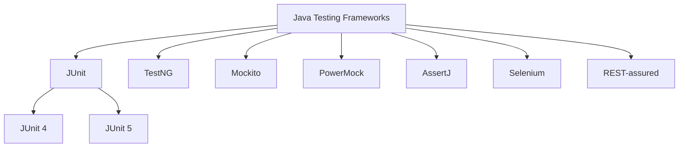

# Java Testing Frameworks

Testing is a critical part of the software development process that ensures your code works as expected. In Java, there are numerous testing frameworks available that make it easier to write and execute tests. This guide will introduce you to the most popular Java testing frameworks and show you how to use them effectively.

## Introduction to Java Testing

Testing is the process of evaluating a system or its components to find if it satisfies the specified requirements. In software development, testing helps identify bugs, ensures code quality, and validates that your application behaves as expected.

### Types of Testing in Java

Java testing can be broadly categorized into:

1. **Unit Testing**: Testing individual components in isolation
2. **Integration Testing**: Testing how components work together
3. **Functional Testing**: Testing against functional requirements
4. **Performance Testing**: Testing system performance under load
5. **End-to-End Testing**: Testing the complete application flow

## Major Java Testing Frameworks

Let's explore the most popular Java testing frameworks:



### 1. JUnit

JUnit is the most widely used testing framework in Java. JUnit 5, the latest version, is composed of several modules from three sub-projects:

- JUnit Platform
- JUnit Jupiter
- JUnit Vintage

#### Setting Up JUnit 5

To get started with JUnit 5, add the following dependencies to your Maven `pom.xml` file:

```xml
<dependencies>
    <dependency>
        <groupId>org.junit.jupiter</groupId>
        <artifactId>junit-jupiter-api</artifactId>
        <version>5.9.2</version>
        <scope>test</scope>
    </dependency>
    <dependency>
        <groupId>org.junit.jupiter</groupId>
        <artifactId>junit-jupiter-engine</artifactId>
        <version>5.9.2</version>
        <scope>test</scope>
    </dependency>
</dependencies>
```

#### Writing Your First JUnit 5 Test

Here's a simple JUnit 5 test example:

```java
import org.junit.jupiter.api.Test;
import static org.junit.jupiter.api.Assertions.*;

public class CalculatorTest {
    
    @Test
    public void testAddition() {
        Calculator calculator = new Calculator();
        assertEquals(5, calculator.add(2, 3), "2 + 3 should equal 5");
    }
    
    @Test
    public void testDivision() {
        Calculator calculator = new Calculator();
        assertEquals(2, calculator.divide(10, 5), "10 / 5 should equal 2");
        assertThrows(ArithmeticException.class, () -> calculator.divide(1, 0), 
                     "Dividing by zero should throw ArithmeticException");
    }
}
```

And here's the `Calculator` class that we're testing:

```java
public class Calculator {
    public int add(int a, int b) {
        return a + b;
    }
    
    public int divide(int a, int b) {
        if (b == 0) {
            throw new ArithmeticException("Cannot divide by zero");
        }
        return a / b;
    }
}
```

#### JUnit 5 Key Features

- **Annotations**: `@Test`, `@BeforeEach`, `@AfterEach`, `@BeforeAll`, `@AfterAll`, etc.
- **Assertions**: Various assertion methods like `assertEquals`, `assertTrue`, `assertThrows`, etc.
- **Assumptions**: Conditions that must be met for test execution
- **Parameterized Tests**: Run the same test multiple times with different inputs
- **Test Lifecycle**: Control the execution flow of tests

### 2. TestNG

TestNG is a testing framework inspired by JUnit but with more functionality. It's particularly popular for integration and end-to-end testing scenarios.

#### Setting Up TestNG

Add the TestNG dependency to your Maven `pom.xml` file:

```xml
<dependency>
    <groupId>org.testng</groupId>
    <artifactId>testng</artifactId>
    <version>7.7.1</version>
    <scope>test</scope>
</dependency>
```

#### Writing TestNG Tests

```java
import org.testng.annotations.*;
import static org.testng.Assert.*;

public class UserServiceTest {

    private UserService userService;
    
    @BeforeClass
    public void setup() {
        userService = new UserService();
    }
    
    @Test(groups = "validation")
    public void testValidUsername() {
        assertTrue(userService.isValidUsername("john_doe"));
        assertFalse(userService.isValidUsername("j"));  // too short
        assertFalse(userService.isValidUsername("john@doe"));  // invalid character
    }
    
    @Test(groups = "database", dependsOnGroups = "validation")
    public void testUserRegistration() {
        User user = new User("jane_doe", "password123");
        assertTrue(userService.registerUser(user));
        
        User retrievedUser = userService.getUserByUsername("jane_doe");
        assertNotNull(retrievedUser);
        assertEquals("jane_doe", retrievedUser.getUsername());
    }
    
    @AfterClass
    public void cleanup() {
        userService.cleanupTestData();
    }
}
```

#### TestNG vs JUnit

TestNG offers several advantages over JUnit:

- Built-in support for test groups and dependencies
- Parameterized tests with data providers
- Better parallel test execution
- More flexible test configuration through XML files
- Support for dependent methods with clear pass/fail dependencies

### 3. Mockito

Mockito is a mocking framework for Java. It lets you create mock objects for dependencies in your unit tests.

#### Setting Up Mockito

Add the Mockito dependency to your Maven `pom.xml` file:

```xml
<dependency>
    <groupId>org.mockito</groupId>
    <artifactId>mockito-core</artifactId>
    <version>5.3.1</version>
    <scope>test</scope>
</dependency>
```

#### Creating Mocks with Mockito

```java
import static org.mockito.Mockito.*;
import static org.junit.jupiter.api.Assertions.*;
import org.junit.jupiter.api.Test;

public class OrderServiceTest {

    @Test
    public void testPlaceOrder() {
        // Create mock objects
        PaymentGateway paymentGatewayMock = mock(PaymentGateway.class);
        InventoryService inventoryServiceMock = mock(InventoryService.class);
        
        // Set up return values for mock methods
        when(paymentGatewayMock.processPayment(anyDouble())).thenReturn(true);
        when(inventoryServiceMock.isInStock("PROD-1")).thenReturn(true);
        
        // Create the service to test, injecting the mocks
        OrderService orderService = new OrderService(paymentGatewayMock, inventoryServiceMock);
        
        // Test the method
        Order order = new Order("PROD-1", 2, 99.99);
        boolean result = orderService.placeOrder(order);
        
        // Verify the result
        assertTrue(result, "Order should be placed successfully");
        
        // Verify interactions with mocks
        verify(paymentGatewayMock).processPayment(199.98);  // 2 items at $99.99 each
        verify(inventoryServiceMock).removeFromInventory("PROD-1", 2);
    }
}
```

Here are the interfaces and classes needed for the above test:

```java
public class Order {
    private String productId;
    private int quantity;
    private double unitPrice;
    
    public Order(String productId, int quantity, double unitPrice) {
        this.productId = productId;
        this.quantity = quantity;
        this.unitPrice = unitPrice;
    }
    
    // Getters
    public String getProductId() { return productId; }
    public int getQuantity() { return quantity; }
    public double getUnitPrice() { return unitPrice; }
    public double getTotalPrice() { return quantity * unitPrice; }
}

public interface PaymentGateway {
    boolean processPayment(double amount);
}

public interface InventoryService {
    boolean isInStock(String productId);
    void removeFromInventory(String productId, int quantity);
}

public class OrderService {
    private PaymentGateway paymentGateway;
    private InventoryService inventoryService;
    
    public OrderService(PaymentGateway paymentGateway, InventoryService inventoryService) {
        this.paymentGateway = paymentGateway;
        this.inventoryService = inventoryService;
    }
    
    public boolean placeOrder(Order order) {
        if (inventoryService.isInStock(order.getProductId())) {
            boolean paymentSuccessful = paymentGateway.processPayment(order.getTotalPrice());
            if (paymentSuccessful) {
                inventoryService.removeFromInventory(order.getProductId(), order.getQuantity());
                return true;
            }
        }
        return false;
    }
}
```

### 4. AssertJ

AssertJ is a library that provides a rich set of assertions, making your tests more readable and expressive.

#### Setting Up AssertJ

Add the AssertJ dependency to your Maven `pom.xml` file:

```xml
<dependency>
    <groupId>org.assertj</groupId>
    <artifactId>assertj-core</artifactId>
    <version>3.24.2</version>
    <scope>test</scope>
</dependency>
```

#### Using AssertJ for Fluent Assertions

```java
import org.junit.jupiter.api.Test;
import static org.assertj.core.api.Assertions.*;

import java.util.Arrays;
import java.util.List;

public class AssertJExampleTest {

    @Test
    public void demonstrateAssertJ() {
        // String assertions
        String text = "Hello, World!";
        assertThat(text)
            .isNotNull()
            .startsWith("Hello")
            .endsWith("!")
            .contains("World");
            
        // Numeric assertions
        int result = 42;
        assertThat(result)
            .isPositive()
            .isEven()
            .isGreaterThan(40)
            .isLessThan(50);
            
        // Collection assertions
        List<String> fruits = Arrays.asList("Apple", "Banana", "Orange");
        assertThat(fruits)
            .hasSize(3)
            .contains("Banana")
            .doesNotContain("Grape")
            .containsExactly("Apple", "Banana", "Orange");
    }
}
```

### 5. REST-assured

REST-assured is a Java library designed for testing RESTful APIs.

#### Setting Up REST-assured

Add REST-assured dependencies to your Maven `pom.xml` file:

```xml
<dependency>
    <groupId>io.rest-assured</groupId>
    <artifactId>rest-assured</artifactId>
    <version>5.3.0</version>
    <scope>test</scope>
</dependency>
<dependency>
    <groupId>org.hamcrest</groupId>
    <artifactId>hamcrest</artifactId>
    <version>2.2</version>
    <scope>test</scope>
</dependency>
```

#### Testing REST APIs with REST-assured

```java
import org.junit.jupiter.api.Test;
import static io.restassured.RestAssured.*;
import static org.hamcrest.Matchers.*;

public class ApiTest {

    @Test
    public void testGetUsers() {
        // This test assumes a REST API at https://jsonplaceholder.typicode.com
        given()
            .baseUri("https://jsonplaceholder.typicode.com")
        .when()
            .get("/users")
        .then()
            .statusCode(200)
            .contentType("application/json")
            .body("size()", greaterThan(0))
            .body("[0].name", notNullValue())
            .body("[0].email", containsString("@"))
            .log().body();
    }
    
    @Test
    public void testCreateUser() {
        String requestBody = """
            {
                "name": "John Smith",
                "username": "jsmith",
                "email": "jsmith@example.com"
            }
            """;
            
        given()
            .baseUri("https://jsonplaceholder.typicode.com")
            .header("Content-Type", "application/json")
            .body(requestBody)
        .when()
            .post("/users")
        .then()
            .statusCode(201)
            .body("name", equalTo("John Smith"))
            .body("username", equalTo("jsmith"))
            .body("email", equalTo("jsmith@example.com"))
            .body("id", notNullValue());
    }
}
```

## Best Practices for Java Testing

To get the most out of your testing efforts, follow these best practices:

1. **Follow the AAA Pattern**: Arrange, Act, Assert
2. **Keep Tests Independent**: Tests should not depend on each other
3. **Use Descriptive Test Names**: Tests should describe what they're testing
4. **Test One Thing at a Time**: Each test should focus on a single functionality
5. **Don't Test Trivial Code**: Skip testing getters/setters without logic
6. **Use Mocks Appropriately**: Mock external dependencies, not the class under test
7. **Aim for High Coverage**: Aim for good test coverage, but focus on quality over quantity
8. **Test Edge Cases**: Don't just test the happy path
9. **Run Tests Regularly**: Integrate tests into your CI/CD pipeline

## Integrating Multiple Frameworks

In real-world scenarios, you'll often use multiple testing frameworks together. Here's an example combining JUnit 5, Mockito, and AssertJ:

```java
import org.junit.jupiter.api.BeforeEach;
import org.junit.jupiter.api.Test;
import static org.mockito.Mockito.*;
import static org.assertj.core.api.Assertions.*;

public class IntegratedTest {

    private UserRepository userRepositoryMock;
    private EmailService emailServiceMock;
    private UserService userService;
    
    @BeforeEach
    public void setup() {
        userRepositoryMock = mock(UserRepository.class);
        emailServiceMock = mock(EmailService.class);
        userService = new UserService(userRepositoryMock, emailServiceMock);
    }
    
    @Test
    public void sendWelcomeEmail_shouldSendEmailToNewUser() {
        // Arrange
        User newUser = new User("testuser", "test@example.com");
        when(userRepositoryMock.findByUsername("testuser")).thenReturn(newUser);
        
        // Act
        boolean result = userService.sendWelcomeEmail("testuser");
        
        // Assert
        assertThat(result).isTrue();
        verify(emailServiceMock).sendEmail(
            eq("test@example.com"),
            eq("Welcome!"),
            contains("Welcome to our platform")
        );
    }
    
    @Test
    public void sendWelcomeEmail_shouldReturnFalse_whenUserNotFound() {
        // Arrange
        when(userRepositoryMock.findByUsername("nonexistent")).thenReturn(null);
        
        // Act
        boolean result = userService.sendWelcomeEmail("nonexistent");
        
        // Assert
        assertThat(result).isFalse();
        verify(emailServiceMock, never()).sendEmail(anyString(), anyString(), anyString());
    }
}
```

Interfaces and class for the above example:

```java
public class User {
    private String username;
    private String email;
    
    public User(String username, String email) {
        this.username = username;
        this.email = email;
    }
    
    public String getUsername() { return username; }
    public String getEmail() { return email; }
}

public interface UserRepository {
    User findByUsername(String username);
}

public interface EmailService {
    void sendEmail(String to, String subject, String body);
}

public class UserService {
    private UserRepository userRepository;
    private EmailService emailService;
    
    public UserService(UserRepository userRepository, EmailService emailService) {
        this.userRepository = userRepository;
        this.emailService = emailService;
    }
    
    public boolean sendWelcomeEmail(String username) {
        User user = userRepository.findByUsername(username);
        if (user == null) {
            return false;
        }
        
        emailService.sendEmail(
            user.getEmail(),
            "Welcome!",
            "Welcome to our platform, " + user.getUsername() + "!"
        );
        return true;
    }
}
```

## Summary

Testing is an essential part of Java development that ensures your code works correctly and remains maintainable. The Java ecosystem offers a rich variety of testing frameworks to support different testing needs:

- **JUnit** is the standard for unit testing in Java
- **TestNG** provides additional features for complex testing scenarios
- **Mockito** makes it easy to create mock objects for dependencies
- **AssertJ** offers fluent assertions for more readable tests
- **REST-assured** specializes in testing REST APIs

By integrating these frameworks and following testing best practices, you can build a robust test suite that catches bugs early and gives you confidence in your code.

## Additional Resources

To further your understanding of Java testing frameworks, check out these resources:

1. [JUnit 5 User Guide](https://junit.org/junit5/docs/current/user-guide/)
2. [TestNG Documentation](https://testng.org/doc/)
3. [Mockito Documentation](https://javadoc.io/doc/org.mockito/mockito-core/latest/org/mockito/Mockito.html)
4. [AssertJ Documentation](https://assertj.github.io/doc/)
5. [REST-assured Documentation](https://rest-assured.io/)

## Practice Exercises

1. Write unit tests for a calculator class that handles basic arithmetic operations.
2. Create a mock for a database connection and test a service class that uses it.
3. Use parameterized tests to verify a method with different inputs and expected outputs.
4. Write an integration test for a REST controller using REST-assured.
5. Refactor an existing test suite to use AssertJ assertions for improved readability.

Happy testing!