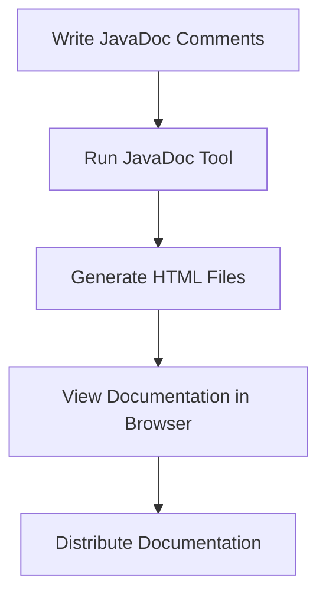

# Java Documentation

## Introduction

Documentation is a crucial aspect of software development that is often overlooked by beginners. Well-documented code is easier to understand, maintain, and collaborate on. In Java, documentation plays an especially important role due to the language's extensive use in enterprise applications and the need for clear API documentation.

In this guide, you'll learn:
- Why documentation is important
- Different types of Java comments
- How to use JavaDoc to create professional documentation
- Best practices for documenting your Java code
- Tools for generating documentation

## Why Documentation Matters

Good documentation serves several key purposes:

1. **Knowledge Transfer**: Helps other developers understand your code
2. **Maintenance**: Makes future modifications easier
3. **Onboarding**: Reduces the learning curve for new team members
4. **API Usage**: Provides clear instructions on how to use your code
5. **Code Reviews**: Facilitates more effective code reviews

## Types of Java Comments

Java supports three types of comments:

### 1. Single-line Comments

Used for brief explanations that fit on a single line.

```java
// This is a single-line comment
int count = 0; // Initialize counter to zero
```

### 2. Multi-line Comments

Used for longer explanations that span multiple lines.

```java
/* This is a multi-line comment
   that spans several lines
   and can contain more detailed explanations
*/
```

### 3. JavaDoc Comments

Special comments that can be processed by the JavaDoc tool to generate HTML documentation.

```java
/**
 * This is a JavaDoc comment.
 * It's used to describe classes, methods, and fields.
 */
```

## JavaDoc: Professional Documentation

JavaDoc is a documentation generator that extracts comments from Java source code and generates HTML documentation. It's the standard for documenting Java APIs and is used extensively in professional Java development.

### Basic JavaDoc Structure

```java
/**
 * Class description goes here.
 * 
 * @author Your Name
 * @version 1.0
 * @since 2023-09-15
 */
public class MyClass {
    /**
     * Brief description of what the method does.
     *
     * @param param1 Description of the first parameter
     * @param param2 Description of the second parameter
     * @return Description of the return value
     * @throws ExceptionType Description of when this exception is thrown
     */
    public ReturnType methodName(Type param1, Type param2) throws ExceptionType {
        // Method implementation
    }
}
```

### Common JavaDoc Tags

| Tag | Description | Example |
|-----|-------------|---------|
| `@author` | Identifies the author | `@author John Doe` |
| `@version` | Specifies the version | `@version 1.2` |
| `@param` | Describes a parameter | `@param username The user's name` |
| `@return` | Describes the return value | `@return The calculated area` |
| `@throws` | Documents an exception | `@throws IOException If file cannot be read` |
| `@see` | Provides a reference | `@see OtherClass#method()` |
| `@since` | When this feature was added | `@since 2.0` |
| `@deprecated` | Marks as deprecated | `@deprecated Use newMethod() instead` |

## Complete Example: Documented Java Class

Here's a complete example showing proper documentation for a class and its methods:

```java
/**
 * Represents a bank account with basic operations such as deposit and withdraw.
 * This class demonstrates proper JavaDoc usage for a simple domain object.
 * 
 * @author Java Documentation Tutorial
 * @version 1.0
 * @since 2023-09-15
 */
public class BankAccount {
    
    private String accountNumber;
    private String accountHolder;
    private double balance;
    
    /**
     * Constructs a new bank account with the specified details.
     * 
     * @param accountNumber The unique account number
     * @param accountHolder The name of the account holder
     * @param initialBalance The starting balance of the account
     * @throws IllegalArgumentException If initialBalance is negative
     */
    public BankAccount(String accountNumber, String accountHolder, double initialBalance) {
        if (initialBalance < 0) {
            throw new IllegalArgumentException("Initial balance cannot be negative");
        }
        
        this.accountNumber = accountNumber;
        this.accountHolder = accountHolder;
        this.balance = initialBalance;
    }
    
    /**
     * Deposits the specified amount into this account.
     * 
     * @param amount The amount to deposit
     * @return The new balance after the deposit
     * @throws IllegalArgumentException If amount is negative
     */
    public double deposit(double amount) {
        if (amount < 0) {
            throw new IllegalArgumentException("Deposit amount cannot be negative");
        }
        
        balance += amount;
        return balance;
    }
    
    /**
     * Withdraws the specified amount from this account.
     * 
     * @param amount The amount to withdraw
     * @return The new balance after the withdrawal
     * @throws IllegalArgumentException If amount is negative
     * @throws InsufficientFundsException If the balance is less than the amount
     */
    public double withdraw(double amount) throws InsufficientFundsException {
        if (amount < 0) {
            throw new IllegalArgumentException("Withdrawal amount cannot be negative");
        }
        
        if (balance < amount) {
            throw new InsufficientFundsException("Insufficient funds for withdrawal");
        }
        
        balance -= amount;
        return balance;
    }
    
    /**
     * Returns the current balance of this account.
     * 
     * @return The current balance
     */
    public double getBalance() {
        return balance;
    }
    
    /**
     * Returns a string representation of this bank account.
     * 
     * @return A string containing the account number, account holder, and balance
     */
    @Override
    public String toString() {
        return "BankAccount{" +
                "accountNumber='" + accountNumber + '\'' +
                ", accountHolder='" + accountHolder + '\'' +
                ", balance=" + balance +
                '}';
    }
}

/**
 * Exception thrown when a withdrawal is attempted with insufficient funds.
 */
class InsufficientFundsException extends Exception {
    public InsufficientFundsException(String message) {
        super(message);
    }
}
```

### Example Usage

Here's how you might use the above class:

```java
public class BankDemo {
    public static void main(String[] args) {
        try {
            // Create a new account
            BankAccount account = new BankAccount("123456789", "John Doe", 1000.0);
            
            // Perform some transactions
            System.out.println("Initial balance: $" + account.getBalance());
            
            account.deposit(500.0);
            System.out.println("Balance after deposit: $" + account.getBalance());
            
            account.withdraw(200.0);
            System.out.println("Balance after withdrawal: $" + account.getBalance());
            
            // This will cause an exception
            account.withdraw(2000.0);
            
        } catch (InsufficientFundsException e) {
            System.out.println("Transaction failed: " + e.getMessage());
        }
    }
}
```

**Output:**
```
Initial balance: $1000.0
Balance after deposit: $1500.0
Balance after withdrawal: $1300.0
Transaction failed: Insufficient funds for withdrawal
```

## Generating JavaDoc Documentation

You can generate HTML documentation from your JavaDoc comments using the `javadoc` command-line tool that comes with the JDK:

```bash
javadoc -d docs *.java
```

This command generates documentation for all Java files in the current directory and saves it to a `docs` directory.

Modern IDEs like IntelliJ IDEA, Eclipse, and NetBeans also provide tools to generate JavaDoc documentation:



## Documentation Best Practices

### DO:

1. **Document Public APIs**: Always document public classes, methods, and fields.
2. **Be Concise**: Keep comments clear and to the point.
3. **Update Docs**: Update documentation when you change code.
4. **Use Clear Language**: Avoid jargon and complex sentences.
5. **Document Exceptions**: Clearly document when and why exceptions are thrown.
6. **Include Examples**: Add usage examples for complex functionality.

### DON'T:

1. **State the Obvious**: Don't document what is already clear from the code.
2. **Write Misleading Comments**: Ensure your comments accurately reflect the code.
3. **Leave TODOs**: Don't leave unresolved TODOs in production code.
4. **Overcomment**: Too many comments can make code harder to read.
5. **Add Redundant Information**: Don't repeat what's already in the method/variable name.

### Example of Poor Documentation vs. Good Documentation

**Poor Documentation:**
```java
/**
 * Gets user.
 * @return user
 */
public User getUser(String id) {
    // This gets the user
    return userRepository.findById(id);
}
```

**Good Documentation:**
```java
/**
 * Retrieves a user from the database based on their unique identifier.
 *
 * @param id The unique identifier of the user
 * @return The user object if found, or null if no user with the given ID exists
 * @throws DatabaseConnectionException If the database connection fails
 */
public User getUser(String id) throws DatabaseConnectionException {
    return userRepository.findById(id);
}
```

## Real-World Example: Documentation-Driven Development

Many professional Java projects use a documentation-driven approach, where the API is documented before implementation. This is particularly common in library development.

Consider this example from a hypothetical payment processing library:

```java
/**
 * Processes payment transactions securely across multiple payment providers.
 * This class serves as the main entry point for the payment processing API.
 * 
 * <p>Example usage:</p>
 * <pre>
 * PaymentProcessor processor = new PaymentProcessor(config);
 * PaymentResult result = processor.processPayment(
 *     new PaymentRequest.Builder()
 *         .amount(99.99)
 *         .currency("USD")
 *         .method(PaymentMethod.CREDIT_CARD)
 *         .cardDetails(cardInfo)
 *         .build()
 * );
 * </pre>
 * 
 * @author Payment API Team
 * @version 2.1.0
 * @since 1.0.0
 */
public class PaymentProcessor {
    // Implementation follows...
}
```

This approach helps define clear interfaces before implementation and ensures that documentation meets users' needs.

## Tools for Better Documentation

Beyond JavaDoc, several tools can enhance your Java documentation:

1. **Markdown**: Use Markdown in JavaDoc comments (supported in modern Java)
2. **PlantUML**: Create UML diagrams in documentation
3. **Asciidoctor**: More powerful alternative to JavaDoc
4. **Swagger/OpenAPI**: For documenting REST APIs built with Java
5. **Doclets**: Custom JavaDoc processors for specialized documentation

## Summary

Effective documentation is a skill that distinguishes professional Java developers. By using JavaDoc and following best practices, you can create code that is not only functional but also maintainable and accessible to other developers.

Key points to remember:
- Use JavaDoc comments for classes, methods, and fields
- Include appropriate tags like `@param`, `@return`, and `@throws`
- Document exceptions and edge cases
- Keep documentation updated as code changes
- Use tools to generate and maintain documentation

Good documentation is an investment that pays off whenever someone needs to understand, use, or modify your code—including your future self!

## Additional Resources

- [Oracle's JavaDoc Guide](https://www.oracle.com/technical-resources/articles/java/javadoc-tool.html)
- [How to Write Doc Comments for the Javadoc Tool](https://www.oracle.com/java/technologies/javase/javadoc-tool.html)
- [Effective Java](https://www.oreilly.com/library/view/effective-java-3rd/9780134686097/) by Joshua Bloch (has excellent sections on documentation)

## Exercises

1. Add proper JavaDoc comments to an existing class in one of your projects.
2. Generate HTML documentation using the JavaDoc tool.
3. Review open-source Java projects on GitHub to see how professional developers document their code.
4. Write a class with multiple methods and document it according to JavaDoc standards.
5. Create a public API for a simple library and document it completely before implementation.