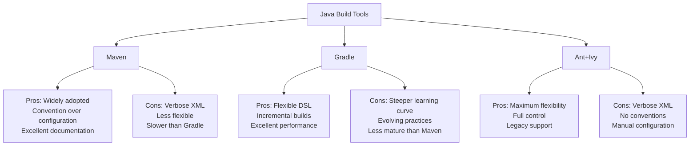

# Java Build Tools

## Introduction

When you start developing Java applications beyond simple programs, you'll quickly encounter the need for build tools. These specialized tools help manage the complexity of modern software development by automating repetitive tasks, managing dependencies, and ensuring consistent builds across different environments.

In this guide, we'll explore the most popular Java build tools, understand their purpose, and learn how to incorporate them into your development workflow. By the end, you'll understand which build tool might be right for your projects and how to get started with them.

## Why Use Build Tools?

Before we dive into specific build tools, let's understand why they're essential in Java development:

1. **Dependency Management**: Automatically download and manage third-party libraries your project needs.
2. **Compilation**: Compile your source code with the right settings.
3. **Testing**: Run automated tests to ensure code quality.
4. **Packaging**: Create distributable packages like JARs, WARs, or EARs.
5. **Deployment**: Deploy applications to servers or repositories.
6. **Standardization**: Ensure consistent builds regardless of the developer's environment.

Without build tools, you'd need to perform these tasks manually, which would be time-consuming and error-prone.

## Popular Java Build Tools

### 1. Maven

Apache Maven is one of the most widely-used build tools in the Java ecosystem. It follows the principle of "convention over configuration," meaning it provides sensible defaults that work for most projects.

#### Key Features of Maven

- **Project Object Model (POM)**: XML configuration defining your project's structure and dependencies
- **Dependency Management**: Automatic handling of your project's dependencies
- **Repository System**: Central repositories for sharing libraries
- **Lifecycle**: Predefined build phases (compile, test, package, etc.)
- **Plugins**: Extend functionality through plugins

#### Getting Started with Maven

**1. Install Maven**

Download Maven from the [Apache Maven website](https://maven.apache.org/download.cgi) and add it to your PATH.

**2. Create a New Maven Project**

```bash
mvn archetype:generate -DgroupId=com.example -DartifactId=my-app -DarchetypeArtifactId=maven-archetype-quickstart -DinteractiveMode=false
```

**3. Explore the Project Structure**

Maven creates a standard directory structure:

```
my-app/
├── pom.xml
└── src/
    ├── main/
    │   └── java/
    │       └── com/
    │           └── example/
    │               └── App.java
    └── test/
        └── java/
            └── com/
                └── example/
                    └── AppTest.java
```

**4. The POM File**

The `pom.xml` is the heart of a Maven project:

```xml
<project xmlns="http://maven.apache.org/POM/4.0.0" 
         xmlns:xsi="http://www.w3.org/2001/XMLSchema-instance"
         xsi:schemaLocation="http://maven.apache.org/POM/4.0.0 http://maven.apache.org/xsd/maven-4.0.0.xsd">
  <modelVersion>4.0.0</modelVersion>

  <groupId>com.example</groupId>
  <artifactId>my-app</artifactId>
  <version>1.0-SNAPSHOT</version>

  <properties>
    <maven.compiler.source>11</maven.compiler.source>
    <maven.compiler.target>11</maven.compiler.target>
    <project.build.sourceEncoding>UTF-8</project.build.sourceEncoding>
  </properties>

  <dependencies>
    <dependency>
      <groupId>junit</groupId>
      <artifactId>junit</artifactId>
      <version>4.13.2</version>
      <scope>test</scope>
    </dependency>
  </dependencies>
</project>
```

**5. Adding Dependencies**

To add a dependency, simply add an entry to the `<dependencies>` section:

```xml
<dependency>
  <groupId>org.apache.commons</groupId>
  <artifactId>commons-lang3</artifactId>
  <version>3.12.0</version>
</dependency>
```

**6. Common Maven Commands**

```bash
# Compile the project
mvn compile

# Run tests
mvn test

# Package the application
mvn package

# Install to local repository
mvn install

# Clean the build directory
mvn clean

# Combined commands
mvn clean install
```

### 2. Gradle

Gradle is a newer build tool that combines the best features of Ant and Maven while offering greater flexibility through a Groovy or Kotlin-based DSL.

#### Key Features of Gradle

- **Build as Code**: Define builds using a powerful DSL instead of XML
- **Incremental Builds**: Only process what's changed for faster builds
- **Multi-Project Builds**: Better support for complex, multi-module projects
- **Dependency Management**: Similar to Maven but more flexible
- **Highly Extensible**: Create custom tasks and plugins

#### Getting Started with Gradle

**1. Install Gradle**

Download Gradle from the [Gradle website](https://gradle.org/install/) or use a package manager, and add it to your PATH.

**2. Create a New Gradle Project**

```bash
mkdir my-gradle-app
cd my-gradle-app
gradle init --type java-application
```

**3. Explore the Project Structure**

Gradle creates a structure similar to Maven but with its own configuration files:

```
my-gradle-app/
├── build.gradle
├── gradle/
├── gradlew
├── gradlew.bat
├── settings.gradle
└── src/
    ├── main/
    │   └── java/
    │       └── com/
    │           └── example/
    │               └── App.java
    └── test/
        └── java/
            └── com/
                └── example/
                    └── AppTest.java
```

**4. The build.gradle File**

This is Gradle's equivalent to Maven's POM file:

```groovy
plugins {
    id 'java'
    id 'application'
}

repositories {
    mavenCentral()
}

dependencies {
    testImplementation 'junit:junit:4.13.2'
    implementation 'com.google.guava:guava:30.1-jre'
}

application {
    mainClass = 'com.example.App'
}

java {
    sourceCompatibility = JavaVersion.VERSION_11
    targetCompatibility = JavaVersion.VERSION_11
}
```

**5. Adding Dependencies**

Adding dependencies in Gradle is straightforward:

```groovy
dependencies {
    implementation 'org.apache.commons:commons-lang3:3.12.0'
}
```

**6. Common Gradle Commands**

```bash
# Build the project
./gradlew build

# Run tests
./gradlew test

# Run the application
./gradlew run

# Clean the build directory
./gradlew clean

# See all available tasks
./gradlew tasks
```

### 3. Ant + Ivy

Apache Ant is one of the oldest Java build tools. While less common in new projects, it's still found in many legacy applications, often paired with Ivy for dependency management.

#### Key Features of Ant + Ivy

- **XML-based**: Builds defined in build.xml files
- **Fine-grained Control**: Explicit task-based approach
- **Flexibility**: No enforced conventions, complete freedom
- **Ivy Integration**: Add dependency management capabilities

#### Basic Ant + Ivy Example

**1. build.xml:**

```xml
<project name="MyProject" default="compile" basedir="." xmlns:ivy="antlib:org.apache.ivy.ant">
    <property name="src.dir" value="src"/>
    <property name="build.dir" value="build"/>
    <property name="lib.dir" value="lib"/>
    
    <!-- Define Ivy tasks -->
    <target name="init">
        <mkdir dir="${build.dir}"/>
        <mkdir dir="${lib.dir}"/>
        <ivy:retrieve pattern="${lib.dir}/[artifact]-[revision].[ext]"/>
    </target>
    
    <target name="compile" depends="init">
        <javac srcdir="${src.dir}" destdir="${build.dir}">
            <classpath>
                <fileset dir="${lib.dir}">
                    <include name="**/*.jar"/>
                </fileset>
            </classpath>
        </javac>
    </target>
    
    <target name="clean">
        <delete dir="${build.dir}"/>
        <delete dir="${lib.dir}"/>
    </target>
</project>
```

**2. ivy.xml (for dependency management):**

```xml
<ivy-module version="2.0">
    <info organisation="com.example" module="my-app"/>
    <dependencies>
        <dependency org="junit" name="junit" rev="4.13.2"/>
        <dependency org="org.apache.commons" name="commons-lang3" rev="3.12.0"/>
    </dependencies>
</ivy-module>
```

## Comparing Build Tools

Let's compare these build tools to help you choose the right one for your projects:



### Selection Guide

- **Choose Maven** if you want a well-established tool with great documentation and community support. It's perfect for standard Java projects.

- **Choose Gradle** if you need more flexibility, better performance, or are working on complex multi-module projects. Also ideal for Android development.

- **Use Ant+Ivy** primarily for maintaining legacy projects or when you need absolute control over the build process.

## Real-World Application: Creating a Spring Boot Project

Let's see these build tools in action with a practical example - setting up a Spring Boot project:

### Using Maven

**1. Create a Spring Boot project with Maven:**

```bash
mvn archetype:generate -DgroupId=com.example -DartifactId=spring-boot-demo -DarchetypeArtifactId=maven-archetype-quickstart -DinteractiveMode=false
```

**2. Edit the pom.xml to add Spring Boot:**

```xml
<?xml version="1.0" encoding="UTF-8"?>
<project xmlns="http://maven.apache.org/POM/4.0.0" xmlns:xsi="http://www.w3.org/2001/XMLSchema-instance"
         xsi:schemaLocation="http://maven.apache.org/POM/4.0.0 https://maven.apache.org/xsd/maven-4.0.0.xsd">
    <modelVersion>4.0.0</modelVersion>
    
    <parent>
        <groupId>org.springframework.boot</groupId>
        <artifactId>spring-boot-starter-parent</artifactId>
        <version>2.7.1</version>
    </parent>
    
    <groupId>com.example</groupId>
    <artifactId>spring-boot-demo</artifactId>
    <version>0.0.1-SNAPSHOT</version>
    <name>spring-boot-demo</name>
    
    <properties>
        <java.version>11</java.version>
    </properties>
    
    <dependencies>
        <dependency>
            <groupId>org.springframework.boot</groupId>
            <artifactId>spring-boot-starter-web</artifactId>
        </dependency>
        <dependency>
            <groupId>org.springframework.boot</groupId>
            <artifactId>spring-boot-starter-test</artifactId>
            <scope>test</scope>
        </dependency>
    </dependencies>
    
    <build>
        <plugins>
            <plugin>
                <groupId>org.springframework.boot</groupId>
                <artifactId>spring-boot-maven-plugin</artifactId>
            </plugin>
        </plugins>
    </build>
</project>
```

**3. Create a simple Spring Boot application:**

```java
package com.example;

import org.springframework.boot.SpringApplication;
import org.springframework.boot.autoconfigure.SpringBootApplication;
import org.springframework.web.bind.annotation.GetMapping;
import org.springframework.web.bind.annotation.RestController;

@SpringBootApplication
@RestController
public class App {
    public static void main(String[] args) {
        SpringApplication.run(App.class, args);
    }
    
    @GetMapping("/")
    public String hello() {
        return "Hello from Spring Boot!";
    }
}
```

**4. Build and run the application:**

```bash
mvn spring-boot:run
```

### Using Gradle

**1. Create a Spring Boot project with Gradle:**

```bash
mkdir spring-boot-gradle
cd spring-boot-gradle
gradle init --type java-application
```

**2. Edit the build.gradle file:**

```groovy
plugins {
    id 'java'
    id 'org.springframework.boot' version '2.7.1'
    id 'io.spring.dependency-management' version '1.0.11.RELEASE'
}

repositories {
    mavenCentral()
}

dependencies {
    implementation 'org.springframework.boot:spring-boot-starter-web'
    testImplementation 'org.springframework.boot:spring-boot-starter-test'
}

java {
    sourceCompatibility = JavaVersion.VERSION_11
    targetCompatibility = JavaVersion.VERSION_11
}

test {
    useJUnitPlatform()
}
```

**3. Create the same Spring Boot application as in the Maven example.**

**4. Build and run the application:**

```bash
./gradlew bootRun
```

## Build Tool Integration with IDEs

Modern IDEs provide excellent integration with build tools:

- **IntelliJ IDEA**: Excellent support for Maven and Gradle
- **Eclipse**: Good support via plugins for all three build tools
- **NetBeans**: Native Maven support, plugins for Gradle and Ant
- **VS Code**: Extensions available for all build tools

When using an IDE, you can often:
- Import projects directly from build files
- Run build tasks from GUI interfaces
- Get code completion for build file editing
- Debug build scripts

## Best Practices

Regardless of which build tool you choose, follow these best practices:

1. **Keep builds reproducible**: Ensure builds work consistently across environments
2. **Pin dependency versions**: Avoid using dynamic version ranges
3. **Organize multi-module projects clearly**: Structure modules logically
4. **Use property substitution**: Define versions in one place
5. **Minimize custom plugins/tasks**: Stick to standard features when possible
6. **Include comprehensive tests**: Integrate testing into your build
7. **Set up continuous integration**: Automate builds and testing
8. **Document custom build steps**: Leave comments for non-standard configurations

## Summary

Java build tools are essential for modern development, offering automation, dependency management, and standardization. We've explored:

- **Maven**: Convention-driven, XML-based, with excellent community support
- **Gradle**: Flexible, performance-focused, with a powerful DSL
- **Ant+Ivy**: Highly customizable but verbose, mainly for legacy projects

Each tool has its strengths and ideal use cases. As you grow as a Java developer, becoming proficient with at least one build tool (preferably Maven or Gradle) will significantly enhance your productivity and the quality of your projects.

## Additional Resources

- [Maven Official Documentation](https://maven.apache.org/guides/)
- [Gradle User Manual](https://docs.gradle.org/current/userguide/userguide.html)
- [Apache Ant Manual](https://ant.apache.org/manual/)
- [Spring Boot with Maven Guide](https://spring.io/guides/gs/maven/)
- [Spring Boot with Gradle Guide](https://spring.io/guides/gs/gradle/)

## Exercises

1. Create a simple Java application with both Maven and Gradle. Compare the setup process and build files.
2. Add a third-party library dependency to a project using each build tool.
3. Create a multi-module project with a shared core module and a web module.
4. Set up a continuous integration pipeline using GitHub Actions for a Maven or Gradle project.
5. Convert an existing Ant project to use Maven or Gradle.