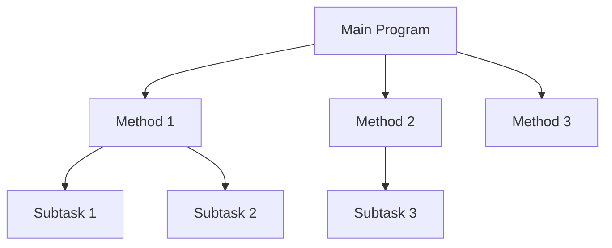

# Java Methods Basics

## Introduction

Methods are one of the fundamental building blocks in Java programming. They allow you to encapsulate a sequence of statements into a single unit that can be reused throughout your code. Think of methods as "actions" your program can perform.

In this tutorial, you'll learn:
- What Java methods are and why they're important
- How to define and call methods
- Working with parameters and return values
- Method overloading
- Best practices for creating effective methods

## What Are Java Methods?

A method in Java is a block of code that performs a specific task and is executed when called. Methods help organize code, make it more reusable, and provide a way to break down complex problems into smaller, manageable pieces.



## Method Structure

Here's the basic structure of a method in Java:

```java
accessModifier returnType methodName(parameterType parameterName, ...) {
    // Method body
    // Code to be executed
    
    return value; // Optional, depending on return type
}
```

Let's break down each component:

- **Access Modifier**: Controls the visibility of the method (e.g., `public`, `private`, `protected`, or default)
- **Return Type**: The data type of the value the method returns (or `void` if it doesn't return anything)
- **Method Name**: The identifier used to call the method
- **Parameters**: Input values the method needs to perform its task (optional)
- **Method Body**: The actual code that gets executed when the method is called

## Defining Your First Method

Let's start with a simple method that displays a greeting message:

```java
public void displayGreeting() {
    System.out.println("Hello, welcome to Java Methods!");
}
```

In this example:
- `public` is the access modifier
- `void` means the method doesn't return any value
- `displayGreeting` is the method name
- The method has no parameters
- The body simply prints a message

## Calling a Method

To use a method, you need to call it from somewhere in your code. Here's how to call the `displayGreeting` method:

```java
public class MethodsDemo {
    public static void main(String[] args) {
        // Creating an object to call the method
        MethodsDemo demo = new MethodsDemo();
        
        // Calling the method
        demo.displayGreeting();
    }
    
    public void displayGreeting() {
        System.out.println("Hello, welcome to Java Methods!");
    }
}
```

**Output:**
```
Hello, welcome to Java Methods!
```

For now, notice we need to create an object to call our method. We'll discuss static methods (which don't require an object) shortly.

## Methods with Parameters

Parameters allow you to pass data to methods. Let's create a method that greets a specific person:

```java
public void greetPerson(String name) {
    System.out.println("Hello, " + name + "! Welcome to Java Methods!");
}
```

Now, when calling this method, you need to provide a name:

```java
public class MethodsDemo {
    public static void main(String[] args) {
        MethodsDemo demo = new MethodsDemo();
        
        // Calling the method with a parameter
        demo.greetPerson("Alex");
        demo.greetPerson("Taylor");
    }
    
    public void greetPerson(String name) {
        System.out.println("Hello, " + name + "! Welcome to Java Methods!");
    }
}
```

**Output:**
```
Hello, Alex! Welcome to Java Methods!
Hello, Taylor! Welcome to Java Methods!
```

### Multiple Parameters

Methods can have multiple parameters separated by commas:

```java
public void displayPersonInfo(String name, int age, String occupation) {
    System.out.println("Name: " + name);
    System.out.println("Age: " + age);
    System.out.println("Occupation: " + occupation);
}
```

Calling this method:

```java
demo.displayPersonInfo("Emma", 28, "Software Developer");
```

**Output:**
```
Name: Emma
Age: 28
Occupation: Software Developer
```

## Methods with Return Values

Methods can also return values after processing. The return type specifies what kind of value the method will return:

```java
public int addNumbers(int a, int b) {
    int sum = a + b;
    return sum;  // Returns the result to the caller
}
```

When calling such a method, you can capture the returned value:

```java
public class MethodsDemo {
    public static void main(String[] args) {
        MethodsDemo demo = new MethodsDemo();
        
        // Calling method and storing result
        int result = demo.addNumbers(5, 3);
        System.out.println("The sum is: " + result);
        
        // Calling method directly in an expression
        System.out.println("10 + 20 = " + demo.addNumbers(10, 20));
    }
    
    public int addNumbers(int a, int b) {
        int sum = a + b;
        return sum;
    }
}
```

**Output:**
```
The sum is: 8
10 + 20 = 30
```

## Static Methods

So far, we've been creating objects to call methods. Static methods belong to the class rather than to instances (objects) of the class. You can call them without creating an object:

```java
public class StaticMethodDemo {
    public static void main(String[] args) {
        // Calling static method without creating an object
        printMessage();
        
        // For static methods in other classes
        StaticMethodDemo.printMessage();
    }
    
    public static void printMessage() {
        System.out.println("This is a static method");
    }
}
```

**Output:**
```
This is a static method
This is a static method
```

The `main` method is always static because it's called by the JVM before any objects are created.

## Method Overloading

Method overloading allows you to define multiple methods with the same name but different parameters. Java determines which method to call based on the arguments provided:

```java
public class CalculatorDemo {
    public static void main(String[] args) {
        CalculatorDemo calc = new CalculatorDemo();
        
        System.out.println("Sum of 2 integers: " + calc.add(5, 3));
        System.out.println("Sum of 3 integers: " + calc.add(5, 3, 2));
        System.out.println("Sum of 2 doubles: " + calc.add(5.5, 3.2));
    }
    
    // Method with 2 integer parameters
    public int add(int a, int b) {
        return a + b;
    }
    
    // Overloaded method with 3 integer parameters
    public int add(int a, int b, int c) {
        return a + b + c;
    }
    
    // Overloaded method with 2 double parameters
    public double add(double a, double b) {
        return a + b;
    }
}
```

**Output:**
```
Sum of 2 integers: 8
Sum of 3 integers: 10
Sum of 2 doubles: 8.7
```

Java determines which method to call based on:
1. The number of parameters
2. The types of parameters
3. The order of parameters

## Real-World Example: Simple Banking System

Let's create a simple banking system that demonstrates methods with different return types and parameters:

```java
public class BankAccount {
    private String accountNumber;
    private String accountHolder;
    private double balance;
    
    // Constructor method
    public BankAccount(String accountNumber, String accountHolder, double initialBalance) {
        this.accountNumber = accountNumber;
        this.accountHolder = accountHolder;
        this.balance = initialBalance;
    }
    
    // Method to deposit money
    public void deposit(double amount) {
        if (amount > 0) {
            balance += amount;
            System.out.println(amount + " deposited successfully");
            displayBalance();
        } else {
            System.out.println("Invalid deposit amount");
        }
    }
    
    // Method to withdraw money with return value
    public boolean withdraw(double amount) {
        if (amount > 0 && amount <= balance) {
            balance -= amount;
            System.out.println(amount + " withdrawn successfully");
            displayBalance();
            return true;
        } else {
            System.out.println("Insufficient funds or invalid amount");
            return false;
        }
    }
    
    // Method to display account information
    public void displayAccountInfo() {
        System.out.println("Account Number: " + accountNumber);
        System.out.println("Account Holder: " + accountHolder);
        displayBalance();
    }
    
    // Private helper method - only used inside the class
    private void displayBalance() {
        System.out.println("Current Balance: $" + balance);
    }
    
    // Method that returns a value
    public double getBalance() {
        return balance;
    }
}
```

Now let's use this class:

```java
public class BankingDemo {
    public static void main(String[] args) {
        // Create a new account
        BankAccount account = new BankAccount("123456789", "John Doe", 1000.0);
        
        // Display account information
        account.displayAccountInfo();
        
        // Deposit money
        account.deposit(500.0);
        
        // Withdraw money
        boolean withdrawalSuccess = account.withdraw(200.0);
        System.out.println("Withdrawal successful? " + withdrawalSuccess);
        
        // Try to withdraw too much
        withdrawalSuccess = account.withdraw(2000.0);
        System.out.println("Withdrawal successful? " + withdrawalSuccess);
        
        // Get balance using getter method
        double currentBalance = account.getBalance();
        System.out.println("Final balance retrieved: $" + currentBalance);
    }
}
```

**Output:**
```
Account Number: 123456789
Account Holder: John Doe
Current Balance: $1000.0
500.0 deposited successfully
Current Balance: $1500.0
200.0 withdrawn successfully
Current Balance: $1300.0
Withdrawal successful? true
Insufficient funds or invalid amount
Withdrawal successful? false
Final balance retrieved: $1300.0
```

This example demonstrates:
1. Methods with different return types (`void`, `boolean`, `double`)
2. Methods with parameters
3. Private helper methods
4. How methods can call other methods

## Best Practices for Creating Methods

1. **Follow naming conventions**: Method names should be verbs and follow camelCase (start with lowercase letter)
   - Good: `calculateTotal()`, `sendMessage()`
   - Poor: `CalculateTotal()`, `total_calculate()`

2. **Keep methods focused**: Each method should do one thing and do it well

3. **Keep methods short**: Aim for methods under 20 lines - if a method gets too long, consider breaking it into smaller methods

4. **Use meaningful parameter names**: Names should indicate what the parameter represents

5. **Document your methods**: Use comments to explain what the method does, parameters it takes, and what it returns

6. **Validate inputs**: Check parameter values before using them

7. **Organize related methods**: Group related methods in the same class

## Summary

In this tutorial, you've learned:
- What methods are and why they're important in Java
- How to define methods with and without parameters
- How to create methods that return values
- The concept of static methods
- Method overloading
- Real-world application of methods in a simple banking system

Methods are essential for organizing code, reducing repetition, and making programs easier to understand and maintain. As you continue learning Java, you'll discover how methods form the foundation of object-oriented programming concepts.

## Exercise Ideas

1. Create a `Calculator` class with methods for addition, subtraction, multiplication, and division
2. Write a program with methods to convert temperatures between Celsius and Fahrenheit
3. Create a `StringUtil` class with static methods like `countVowels`, `reverseString`, and `isPalindrome`
4. Build a simple student grading system with methods to add scores, calculate averages, and determine letter grades
5. Implement a method that takes an array of integers and returns the maximum value

## Additional Resources

- [Oracle's Java Documentation on Methods](https://docs.oracle.com/javase/tutorial/java/javaOO/methods.html)
- [Java Method Exercises on CodeGym](https://codegym.cc/)
- [Practice Method Challenges on HackerRank](https://www.hackerrank.com/domains/java)
- [Method Design Best Practices by Clean Code](https://clean-code-developer.com/)

By mastering methods, you're taking an important step in your journey to becoming a proficient Java programmer!