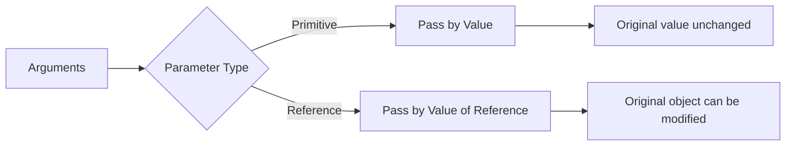

# Java Method Parameters

In programming, methods (also known as functions) are designed to perform specific tasks. Method parameters are the variables that provide input data to these methods. Understanding how to work with parameters is essential for creating flexible and reusable code in Java.

## Introduction to Method Parameters

Method parameters allow you to pass information into methods. They act as variables inside the method and are filled with the values (arguments) that you pass when calling the method.

```java
public static void greet(String name) {  // 'name' is the parameter
    System.out.println("Hello, " + name + "!");
}

// Calling the method
public static void main(String[] args) {
    greet("John");  // "John" is the argument
}
```

**Output:**
```
Hello, John!
```

In this example:
- `String name` is the parameter defined in the method declaration
- `"John"` is the argument passed when calling the method

## Types of Parameters in Java

### 1. Primitive Type Parameters

When you pass primitive types (like `int`, `boolean`, `char`, etc.) to methods, Java uses "pass-by-value" - a copy of the value is passed, not the original variable.

```java
public static void modifyValue(int number) {
    number = number + 10;
    System.out.println("Inside method: " + number);
}

public static void main(String[] args) {
    int x = 5;
    System.out.println("Before method call: " + x);
    modifyValue(x);
    System.out.println("After method call: " + x);
}
```

**Output:**
```
Before method call: 5
Inside method: 15
After method call: 5
```

Notice how the value of `x` remains unchanged outside the method, even though we modified `number` inside the method.

### 2. Reference Type Parameters

When you pass objects (reference types), Java passes a copy of the reference, not a copy of the object. This means methods can modify the object's state.

```java
public static void modifyArray(int[] numbers) {
    numbers[0] = 100;
    System.out.println("Inside method: " + numbers[0]);
}

public static void main(String[] args) {
    int[] myArray = {1, 2, 3};
    System.out.println("Before method call: " + myArray[0]);
    modifyArray(myArray);
    System.out.println("After method call: " + myArray[0]);
}
```

**Output:**
```
Before method call: 1
Inside method: 100
After method call: 100
```

In this case, the array was modified because we passed a reference to the same array object.

## Parameter Passing Mechanisms in Java



### Pass by Value

Java uses "pass by value" for all parameters, but this can be confusing. What's actually happening is:

- For primitives: A copy of the value is passed
- For objects: A copy of the reference is passed (not the object itself)

## Multiple Parameters

Methods can accept multiple parameters of different types, separated by commas:

```java
public static double calculateRectangleArea(double length, double width) {
    return length * width;
}

public static void main(String[] args) {
    double area = calculateRectangleArea(5.0, 3.0);
    System.out.println("Rectangle area: " + area);
}
```

**Output:**
```
Rectangle area: 15.0
```

## Default Parameter Values

Unlike some other languages, Java doesn't support default parameter values directly. However, you can achieve similar functionality using method overloading:

```java
public static int sum(int a, int b) {
    return a + b;
}

// Overloaded method with a default value for the third parameter
public static int sum(int a, int b, int c) {
    return a + b + c;
}

public static void main(String[] args) {
    System.out.println("Sum of two numbers: " + sum(5, 10));
    System.out.println("Sum of three numbers: " + sum(5, 10, 15));
}
```

**Output:**
```
Sum of two numbers: 15
Sum of three numbers: 30
```

## Variable-Length Parameters (Varargs)

Java allows you to define methods that can accept a variable number of arguments using the varargs syntax (`...`). This is useful when you don't know how many parameters will be passed.

```java
public static int sumNumbers(int... numbers) {
    int sum = 0;
    for (int num : numbers) {
        sum += num;
    }
    return sum;
}

public static void main(String[] args) {
    System.out.println("Sum of 2 numbers: " + sumNumbers(5, 10));
    System.out.println("Sum of 4 numbers: " + sumNumbers(5, 10, 15, 20));
    System.out.println("Sum of no numbers: " + sumNumbers());
}
```

**Output:**
```
Sum of 2 numbers: 15
Sum of 4 numbers: 50
Sum of no numbers: 0
```

Important rules for varargs:
1. A method can only have one varargs parameter
2. The varargs parameter must be the last parameter in the method declaration

## Real-World Examples

### Example 1: Shopping Cart Calculator

```java
public class ShoppingCart {
    public static double calculateTotal(double[] prices, double taxRate, boolean applyDiscount) {
        double subtotal = 0;
        
        for (double price : prices) {
            subtotal += price;
        }
        
        if (applyDiscount && subtotal > 100) {
            subtotal = subtotal * 0.9; // 10% discount
        }
        
        return subtotal * (1 + taxRate);
    }
    
    public static void main(String[] args) {
        double[] cartItems = {45.99, 29.99, 35.50};
        double finalPrice = calculateTotal(cartItems, 0.08, true);
        System.out.printf("Final price: $%.2f", finalPrice);
    }
}
```

**Output:**
```
Final price: $120.40
```

### Example 2: User Authentication

```java
public class UserAuthentication {
    public static boolean authenticateUser(String username, String password, boolean rememberMe) {
        // In a real application, this would check against a database
        boolean isValid = username.equals("admin") && password.equals("secure123");
        
        if (isValid && rememberMe) {
            System.out.println("User authenticated with extended session");
            // Code to set longer session timeout
        } else if (isValid) {
            System.out.println("User authenticated with standard session");
            // Code to set standard session timeout
        } else {
            System.out.println("Authentication failed");
        }
        
        return isValid;
    }
    
    public static void main(String[] args) {
        authenticateUser("admin", "secure123", true);
        authenticateUser("admin", "secure123", false);
        authenticateUser("guest", "wrongpass", false);
    }
}
```

**Output:**
```
User authenticated with extended session
User authenticated with standard session
Authentication failed
```

## Best Practices for Method Parameters

1. **Use descriptive parameter names** - Names like `firstName` are better than `fn` or `x`
2. **Limit the number of parameters** - Methods with too many parameters are hard to use. Consider using objects to group related parameters.
3. **Keep parameter order consistent** - If similar methods use the same parameters, keep them in the same order.
4. **Validate parameters** - Check for null values or invalid inputs to prevent errors.
5. **Consider immutability** - When possible, avoid modifying parameters to make code more predictable.

### Parameter Validation Example

```java
public static double divideNumbers(double dividend, double divisor) {
    if (divisor == 0) {
        throw new IllegalArgumentException("Divisor cannot be zero");
    }
    return dividend / divisor;
}

public static void main(String[] args) {
    try {
        System.out.println(divideNumbers(10, 2));
        System.out.println(divideNumbers(10, 0)); // This will cause an exception
    } catch (IllegalArgumentException e) {
        System.out.println("Error: " + e.getMessage());
    }
}
```

**Output:**
```
5.0
Error: Divisor cannot be zero
```

## Summary

Method parameters are crucial for creating flexible and reusable methods in Java. Key points to remember:

- Parameters act as variables within methods, receiving values from arguments
- Java uses pass-by-value for all parameters (for objects, the reference is passed by value)
- Multiple parameters must be separated by commas
- Variable-length parameters (varargs) allow methods to accept a variable number of arguments
- Good parameter design makes code more readable and maintainable

## Practice Exercises

1. Create a method that accepts a name and age as parameters and prints a personalized greeting.
2. Write a method that takes an array and two indices as parameters and swaps the elements at those positions.
3. Create a calculator class with methods for basic operations (add, subtract, multiply, divide) that use appropriate parameters.
4. Write a method using varargs that finds the largest number from all inputs.
5. Create a method that demonstrates the difference between modifying a primitive parameter and a reference parameter.

## Additional Resources

- [Java Official Documentation on Methods](https://docs.oracle.com/javase/tutorial/java/javaOO/methods.html)
- [Oracle Tutorial on Passing Information to Methods](https://docs.oracle.com/javase/tutorial/java/javaOO/arguments.html)
- "Effective Java" by Joshua Bloch - Chapter on Methods
- "Head First Java" - Chapters covering method design

Happy coding! Understanding method parameters is a fundamental skill that will help you build more sophisticated Java applications.