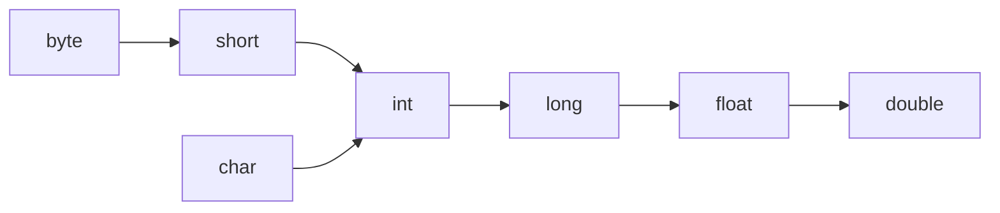

# Java Method Overloading

## Introduction

Method overloading is a powerful feature in Java that allows a class to have multiple methods with the **same name** but **different parameters**. This enhances the readability and flexibility of your code by enabling you to perform similar operations with different types or amounts of data without creating separate method names.

Think of method overloading as having multiple doors (methods) with the same name but different keys (parameters) to enter a room (perform a task). The Java compiler determines which method to call based on the parameters you provide.

## Understanding Method Overloading

Method overloading is part of Java's polymorphism feature. It occurs when a class has multiple methods with:

1. The same method name
2. Different parameter lists (different number of parameters, different types of parameters, or both)

### How Java Identifies Overloaded Methods

Java distinguishes between overloaded methods based on their **method signatures**. A method signature consists of:

- The method name
- The number of parameters
- The types of parameters
- The order of parameters

:::note
Return types and access modifiers (like `public`, `private`) are **not** part of the method signature for overloading. This means you cannot overload methods by changing only the return type.
:::

## Basic Method Overloading

Let's start with a simple example of method overloading:

```java
public class CalculatorDemo {
    
    // Method with two parameters
    public int add(int a, int b) {
        System.out.println("Adding two integers");
        return a + b;
    }
    
    // Overloaded method with three parameters
    public int add(int a, int b, int c) {
        System.out.println("Adding three integers");
        return a + b + c;
    }
    
    // Overloaded method with different parameter types
    public double add(double a, double b) {
        System.out.println("Adding two doubles");
        return a + b;
    }
    
    public static void main(String[] args) {
        CalculatorDemo calc = new CalculatorDemo();
        
        // Calls the first add method
        int sum1 = calc.add(5, 10);
        System.out.println("Sum 1: " + sum1);
        
        // Calls the second add method
        int sum2 = calc.add(5, 10, 15);
        System.out.println("Sum 2: " + sum2);
        
        // Calls the third add method
        double sum3 = calc.add(5.5, 10.5);
        System.out.println("Sum 3: " + sum3);
    }
}
```

**Output:**
```
Adding two integers
Sum 1: 15
Adding three integers
Sum 2: 30
Adding two doubles
Sum 3: 16.0
```

In this example, we have overloaded the `add()` method in three different ways:
1. With two integer parameters
2. With three integer parameters
3. With two double parameters

The compiler automatically selects the appropriate method based on the arguments we provide when calling the method.

## Ways to Overload Methods

You can overload methods in Java in several ways:

### 1. Different Number of Parameters

```java
public class MessagePrinter {
    
    public void print(String message) {
        System.out.println(message);
    }
    
    public void print(String message, int times) {
        for (int i = 0; i < times; i++) {
            System.out.println(message);
        }
    }
    
    public static void main(String[] args) {
        MessagePrinter printer = new MessagePrinter();
        
        // Calls the first print method
        printer.print("Hello, World!");
        
        System.out.println("---");
        
        // Calls the second print method
        printer.print("Java is fun!", 3);
    }
}
```

**Output:**
```
Hello, World!
---
Java is fun!
Java is fun!
Java is fun!
```

### 2. Different Types of Parameters

```java
public class DisplayInfo {
    
    public void show(int value) {
        System.out.println("Integer value: " + value);
    }
    
    public void show(String value) {
        System.out.println("String value: " + value);
    }
    
    public void show(double value) {
        System.out.println("Double value: " + value);
    }
    
    public static void main(String[] args) {
        DisplayInfo display = new DisplayInfo();
        
        display.show(100);       // Calls show(int)
        display.show("Hello");   // Calls show(String)
        display.show(15.75);     // Calls show(double)
    }
}
```

**Output:**
```
Integer value: 100
String value: Hello
Double value: 15.75
```

### 3. Different Order of Parameters

```java
public class UserProfile {
    
    public void setDetails(String name, int age) {
        System.out.println("Setting details: Name first, then age");
        System.out.println("Name: " + name + ", Age: " + age);
    }
    
    public void setDetails(int age, String name) {
        System.out.println("Setting details: Age first, then name");
        System.out.println("Name: " + name + ", Age: " + age);
    }
    
    public static void main(String[] args) {
        UserProfile profile = new UserProfile();
        
        profile.setDetails("John Doe", 25);  // Calls the first method
        profile.setDetails(30, "Jane Smith"); // Calls the second method
    }
}
```

**Output:**
```
Setting details: Name first, then age
Name: John Doe, Age: 25
Setting details: Age first, then name
Name: Jane Smith, Age: 30
```

## Type Promotion in Overloading

When an exact match for a method call isn't found, Java tries to use type promotion (automatic widening conversion) to find a matching method.



Here's an example showing type promotion:

```java
public class TypePromotionExample {
    
    public void display(int num) {
        System.out.println("Method with int parameter: " + num);
    }
    
    public void display(double num) {
        System.out.println("Method with double parameter: " + num);
    }
    
    public static void main(String[] args) {
        TypePromotionExample example = new TypePromotionExample();
        
        byte byteValue = 10;
        example.display(byteValue);  // Promotes byte to int
        
        float floatValue = 20.5f;
        example.display(floatValue); // Promotes float to double
    }
}
```

**Output:**
```
Method with int parameter: 10
Method with double parameter: 20.5
```

In this example:
- When we pass a `byte`, Java promotes it to `int` and calls the `display(int)` method.
- When we pass a `float`, Java promotes it to `double` and calls the `display(double)` method.

## Common Errors and Best Practices

### 1. Cannot Overload Based on Return Type Only

```java
public class InvalidOverloading {
    
    // Original method
    public int getValue() {
        return 10;
    }
    
    // Invalid overload - differs only in return type
    // This will cause a compilation error
    /*
    public double getValue() {
        return 10.5;
    }
    */
}
```

### 2. Ambiguous Method Calls

```java
public class AmbiguousExample {
    
    public void show(int num, double value) {
        System.out.println("Method 1: " + num + ", " + value);
    }
    
    public void show(double value, int num) {
        System.out.println("Method 2: " + value + ", " + num);
    }
    
    public static void main(String[] args) {
        AmbiguousExample example = new AmbiguousExample();
        
        example.show(10, 20.5);  // Calls the first method
        example.show(10.5, 20);  // Calls the second method
        
        // The following call is ambiguous and will cause a compilation error
        // example.show(10, 20);
    }
}
```

### Best Practices for Method Overloading

1. **Keep it simple**: Don't create too many overloaded versions of a method.
2. **Be consistent**: The behavior of overloaded methods should be related.
3. **Documentation**: Clearly document each overloaded method's purpose.
4. **Use descriptive names**: If methods perform significantly different operations, consider using different names.
5. **Consider using varargs**: For methods that take variable numbers of arguments.

## Real-World Applications of Method Overloading

### Example 1: String Concatenation

Java's `String` class uses method overloading for the `concat` method:

```java
public class StringExample {
    public static void main(String[] args) {
        // Java's built-in StringBuilder uses method overloading
        StringBuilder sb = new StringBuilder();
        
        sb.append("Hello");        // Appends a String
        sb.append(123);            // Appends an int
        sb.append(true);           // Appends a boolean
        sb.append(3.14);           // Appends a double
        
        System.out.println("Result: " + sb.toString());
    }
}
```

**Output:**
```
Result: Hello123true3.14
```

### Example 2: A File Utility Class

```java
public class FileUtils {
    
    // Open a file with default permissions
    public void openFile(String filename) {
        System.out.println("Opening file: " + filename);
        System.out.println("Using default read-only permissions");
    }
    
    // Open a file with specific permissions
    public void openFile(String filename, boolean readOnly) {
        System.out.println("Opening file: " + filename);
        System.out.println("Read-only mode: " + readOnly);
    }
    
    // Open a file with detailed options
    public void openFile(String filename, String mode, boolean createIfNotExists) {
        System.out.println("Opening file: " + filename);
        System.out.println("Mode: " + mode);
        System.out.println("Create if not exists: " + createIfNotExists);
    }
    
    public static void main(String[] args) {
        FileUtils utils = new FileUtils();
        
        utils.openFile("document.txt");
        System.out.println();
        
        utils.openFile("spreadsheet.xlsx", false);
        System.out.println();
        
        utils.openFile("config.properties", "rw", true);
    }
}
```

**Output:**
```
Opening file: document.txt
Using default read-only permissions

Opening file: spreadsheet.xlsx
Read-only mode: false

Opening file: config.properties
Mode: rw
Create if not exists: true
```

### Example 3: Database Connection Handler

```java
public class DatabaseConnection {
    
    // Connect with default parameters
    public void connect() {
        System.out.println("Connecting to default database at localhost");
        System.out.println("Using default credentials");
    }
    
    // Connect with specific server
    public void connect(String server) {
        System.out.println("Connecting to database at: " + server);
        System.out.println("Using default credentials");
    }
    
    // Connect with server and credentials
    public void connect(String server, String username, String password) {
        System.out.println("Connecting to database at: " + server);
        System.out.println("Using username: " + username);
        System.out.println("Using provided password");
    }
    
    public static void main(String[] args) {
        DatabaseConnection db = new DatabaseConnection();
        
        db.connect();
        System.out.println();
        
        db.connect("db.example.com");
        System.out.println();
        
        db.connect("prod-db.example.com", "admin", "secretPassword");
    }
}
```

**Output:**
```
Connecting to default database at localhost
Using default credentials

Connecting to database at: db.example.com
Using default credentials

Connecting to database at: prod-db.example.com
Using username: admin
Using provided password
```

## Constructors and Method Overloading

Constructor overloading is one of the most common and useful applications of method overloading in Java:

```java
public class Person {
    private String name;
    private int age;
    private String address;
    
    // Default constructor
    public Person() {
        name = "Unknown";
        age = 0;
        address = "Not provided";
    }
    
    // Constructor with name
    public Person(String name) {
        this.name = name;
        age = 0;
        address = "Not provided";
    }
    
    // Constructor with name and age
    public Person(String name, int age) {
        this.name = name;
        this.age = age;
        address = "Not provided";
    }
    
    // Constructor with all fields
    public Person(String name, int age, String address) {
        this.name = name;
        this.age = age;
        this.address = address;
    }
    
    public void displayInfo() {
        System.out.println("Name: " + name);
        System.out.println("Age: " + age);
        System.out.println("Address: " + address);
        System.out.println();
    }
    
    public static void main(String[] args) {
        Person p1 = new Person();
        Person p2 = new Person("John");
        Person p3 = new Person("Jane", 25);
        Person p4 = new Person("Mike", 30, "123 Main St");
        
        p1.displayInfo();
        p2.displayInfo();
        p3.displayInfo();
        p4.displayInfo();
    }
}
```

**Output:**
```
Name: Unknown
Age: 0
Address: Not provided

Name: John
Age: 0
Address: Not provided

Name: Jane
Age: 25
Address: Not provided

Name: Mike
Age: 30
Address: 123 Main St
```

## Summary

Method overloading is a fundamental Java concept that allows you to define multiple methods with the same name but different parameters. Key points to remember:

- Methods can be overloaded by changing the number of parameters, their types, or their order.
- Return types and access modifiers cannot be used alone to overload methods.
- The Java compiler determines which overloaded method to call based on the arguments provided.
- Type promotion happens automatically when exact matches aren't found.
- Constructor overloading is an important application that helps create flexible object initialization.

Method overloading enhances code readability, reduces complexity, and makes your code more intuitive by allowing related operations to be performed using the same method name.

## Exercises

1. Create a `Calculator` class with overloaded methods for addition, subtraction, multiplication, and division that work with different numbers and types of parameters.

2. Design a `ShapeCalculator` class with overloaded methods to calculate the area of different shapes (circle, rectangle, triangle).

3. Implement a `MessageFormatter` class with overloaded methods that format messages with different levels of detail.

4. Create a `PrintArray` class with overloaded methods that print arrays of different data types (int, double, String).

5. Design a `UserRegistration` class with overloaded constructors to create users with different levels of information.

## Additional Resources

- [Oracle Java Documentation on Methods](https://docs.oracle.com/javase/tutorial/java/javaOO/methods.html)
- [Method Overloading vs Method Overriding](https://www.baeldung.com/java-method-overload-override)
- [Java Method Overloading Best Practices](https://www.geeksforgeeks.org/overloading-in-java/)
- [Java Constructor Overloading](https://www.w3schools.com/java/java_constructors.asp)

Happy coding!