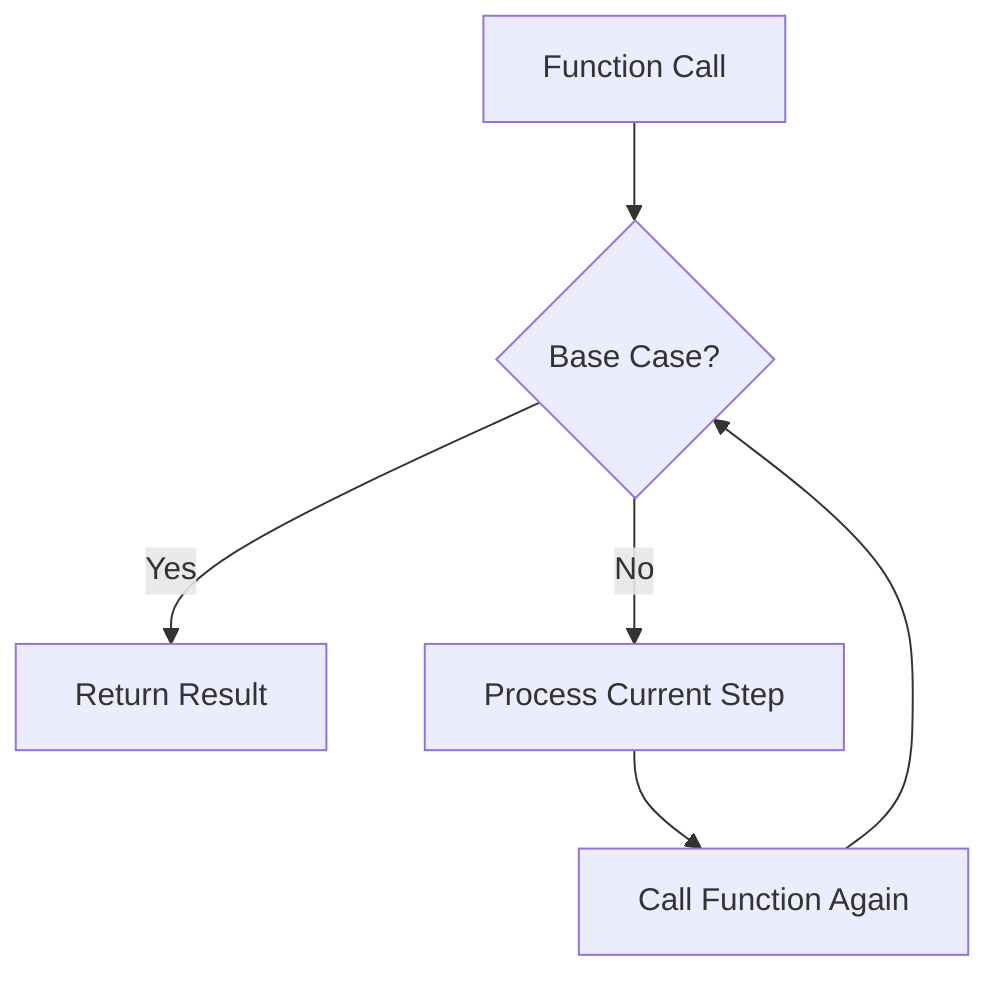

# Java Recursion

## Introduction

Recursion is a powerful programming technique where a function calls itself to solve a problem. Think of it as a way to break down complex problems into smaller, more manageable subproblems. In Java, recursion can help create elegant solutions to problems that might otherwise require complex iterative approaches.

In this guide, we'll explore how recursion works in Java, when to use it, and how to implement recursive functions effectively.

## What is Recursion?

Recursion is a programming concept where a method calls itself during its execution. Every recursive function has two components:

1. **Base case(s)**: The condition(s) under which the function stops calling itself
2. **Recursive case(s)**: The condition(s) under which the function calls itself

A visual representation of recursion:



Without a proper base case, recursion will continue indefinitely, causing a `StackOverflowError` in Java.

## Basic Recursion Example: Factorial

The factorial of a number is a classic example to understand recursion. The factorial of a positive integer n (denoted as n!) is the product of all positive integers less than or equal to n.

Mathematically:
- 0! = 1
- n! = n × (n-1)!

Here's how to implement factorial using recursion in Java:

```java
public class FactorialExample {
    public static int factorial(int n) {
        // Base case
        if (n == 0 || n == 1) {
            return 1;
        }
        // Recursive case
        else {
            return n * factorial(n - 1);
        }
    }
    
    public static void main(String[] args) {
        int number = 5;
        int result = factorial(number);
        System.out.println(number + "! = " + result);
    }
}
```

**Output:**
```
5! = 120
```

### Understanding the factorial execution:

Here's how `factorial(5)` is calculated:
1. `factorial(5)` calls `factorial(4)` and waits for its result
2. `factorial(4)` calls `factorial(3)` and waits for its result
3. `factorial(3)` calls `factorial(2)` and waits for its result
4. `factorial(2)` calls `factorial(1)` and waits for its result
5. `factorial(1)` returns 1 (base case reached!)
6. `factorial(2)` completes as 2 × 1 = 2
7. `factorial(3)` completes as 3 × 2 = 6
8. `factorial(4)` completes as 4 × 6 = 24
9. `factorial(5)` completes as 5 × 24 = 120

## Common Recursive Patterns

### 1. Linear Recursion

In linear recursion, each method call makes at most one recursive call. Our factorial example is a linear recursion.

### 2. Binary Recursion

Binary recursion occurs when a method makes two recursive calls. The classic example is calculating Fibonacci numbers:

```java
public class FibonacciExample {
    public static int fibonacci(int n) {
        // Base cases
        if (n <= 1) {
            return n;
        }
        // Recursive case with two recursive calls
        else {
            return fibonacci(n - 1) + fibonacci(n - 2);
        }
    }
    
    public static void main(String[] args) {
        int number = 8;
        System.out.println("Fibonacci(" + number + ") = " + fibonacci(number));
        
        System.out.println("\nFibonacci sequence up to " + number + ":");
        for (int i = 0; i <= number; i++) {
            System.out.print(fibonacci(i) + " ");
        }
    }
}
```

**Output:**
```
Fibonacci(8) = 21

Fibonacci sequence up to 8:
0 1 1 2 3 5 8 13 21 
```

### 3. Multiple Recursion

In multiple recursion, a method may make multiple recursive calls (more than two). This is common in problems involving permutations or combinations.

## Detailed Walkthrough: Recursive File System Explorer

Let's implement a practical example where recursion is naturally useful: exploring directories in a file system.

```java
import java.io.File;

public class RecursiveFileExplorer {
    public static void exploreDirectory(File dir, int level) {
        // Create indentation based on level
        String indent = "";
        for (int i = 0; i < level; i++) {
            indent += "  ";
        }
        
        // Print current directory name
        System.out.println(indent + "📁 " + dir.getName());
        
        // Base case: if not a directory or cannot list files, return
        if (!dir.isDirectory() || dir.listFiles() == null) {
            return;
        }
        
        // Recursive case: explore each file/subdirectory
        for (File file : dir.listFiles()) {
            if (file.isDirectory()) {
                // Recursively explore subdirectory
                exploreDirectory(file, level + 1);
            } else {
                // Print file with indentation
                System.out.println(indent + "  📄 " + file.getName());
            }
        }
    }
    
    public static void main(String[] args) {
        // Replace with a path on your system
        String directoryPath = "C:/Projects";
        File rootDir = new File(directoryPath);
        
        if (rootDir.exists()) {
            System.out.println("Exploring directory: " + directoryPath);
            exploreDirectory(rootDir, 0);
        } else {
            System.out.println("Directory does not exist!");
        }
    }
}
```

**Sample Output:**
```
Exploring directory: C:/Projects
📁 Projects
  📁 WebApp
    📄 index.html
    📄 styles.css
    📄 script.js
  📁 JavaExamples
    📄 Main.java
    📄 Helper.java
  📄 README.md
  📄 project-plan.txt
```

### Analysis of the File Explorer Example:

1. **Base Case**: If the current item is not a directory or we can't list its contents, we stop recursion
2. **Recursive Case**: For each subdirectory, we make a recursive call with an increased level
3. **Additional Processing**: We print files with proper indentation to visualize the hierarchy

## When to Use Recursion

Recursion is particularly useful for:

1. **Problems with recursive structures**: Trees, graphs, and nested data structures
2. **Divide and conquer algorithms**: Merge sort, quicksort, binary search
3. **Problems that can be broken down into similar subproblems**
4. **Backtracking algorithms**: Solving puzzles, finding paths

## When to Avoid Recursion

Recursion may not be ideal in these situations:

1. **When dealing with deep recursion**: Can cause stack overflow errors
2. **Performance-critical code**: Each recursive call adds overhead
3. **Simple iterative problems**: When loops are clearer and more efficient
4. **Memory-constrained environments**: Due to call stack usage

## Optimizing Recursive Solutions

### Tail Recursion

Tail recursion occurs when the recursive call is the last operation in a method. Some programming languages optimize tail recursion, though Java doesn't do this automatically.

```java
public class TailRecursionFactorial {
    // Non-tail recursive factorial
    public static int factorial(int n) {
        if (n == 0 || n == 1) return 1;
        return n * factorial(n - 1); // Not tail recursive (multiplication happens after recursive call)
    }
    
    // Tail recursive factorial
    public static int factorialTail(int n, int accumulator) {
        if (n == 0 || n == 1) return accumulator;
        return factorialTail(n - 1, n * accumulator); // Tail recursive
    }
    
    public static void main(String[] args) {
        System.out.println("Regular factorial: " + factorial(5));
        System.out.println("Tail recursive factorial: " + factorialTail(5, 1));
    }
}
```

**Output:**
```
Regular factorial: 120
Tail recursive factorial: 120
```

### Memoization

For recursive functions that recalculate the same values multiple times (like Fibonacci), we can use memoization to store and reuse results:

```java
import java.util.HashMap;
import java.util.Map;

public class MemoizedFibonacci {
    private static Map<Integer, Integer> memo = new HashMap<>();
    
    public static int fibonacci(int n) {
        // Check if we've already calculated this value
        if (memo.containsKey(n)) {
            return memo.get(n);
        }
        
        // Base cases
        if (n <= 1) {
            return n;
        }
        
        // Calculate and store result
        int result = fibonacci(n - 1) + fibonacci(n - 2);
        memo.put(n, result);
        
        return result;
    }
    
    public static void main(String[] args) {
        int n = 30;
        long startTime = System.nanoTime();
        int result = fibonacci(n);
        long endTime = System.nanoTime();
        
        System.out.println("Fibonacci(" + n + ") = " + result);
        System.out.println("Calculation time: " + (endTime - startTime) / 1000000.0 + " ms");
    }
}
```

**Output:**
```
Fibonacci(30) = 832040
Calculation time: 1.4523 ms
```

Without memoization, calculating `fibonacci(30)` would take significantly longer due to the exponential number of redundant calculations.

## Practical Application: Sum of Array Elements

Let's implement a simple but practical example of calculating the sum of an array using recursion:

```java
public class ArraySum {
    // Recursive sum of array elements
    public static int sumArray(int[] arr, int index) {
        // Base case: reached the end of array
        if (index >= arr.length) {
            return 0;
        }
        
        // Recursive case: current element + sum of remaining elements
        return arr[index] + sumArray(arr, index + 1);
    }
    
    public static void main(String[] args) {
        int[] numbers = {5, 10, 15, 20, 25};
        int sum = sumArray(numbers, 0);
        
        System.out.print("Sum of array [");
        for (int i = 0; i < numbers.length; i++) {
            System.out.print(numbers[i]);
            if (i < numbers.length - 1) {
                System.out.print(", ");
            }
        }
        System.out.println("] = " + sum);
    }
}
```

**Output:**
```
Sum of array [5, 10, 15, 20, 25] = 75
```

## Real-World Application: Recursive Directory Size Calculation

Let's create a practical tool that calculates the total size of a directory by recursively summing the sizes of all files:

```java
import java.io.File;
import java.text.DecimalFormat;

public class DirectorySizeCalculator {
    public static long calculateSize(File file) {
        // Base case: If file, return its size
        if (file.isFile()) {
            return file.length();
        }
        
        // Base case: If directory cannot be accessed
        if (!file.isDirectory() || file.listFiles() == null) {
            return 0;
        }
        
        // Recursive case: Sum size of all files and subdirectories
        long size = 0;
        for (File subFile : file.listFiles()) {
            size += calculateSize(subFile);
        }
        
        return size;
    }
    
    public static String formatSize(long bytes) {
        if (bytes < 1024) return bytes + " B";
        
        DecimalFormat df = new DecimalFormat("#.##");
        String[] units = {"KB", "MB", "GB", "TB"};
        int unitIndex = 0;
        double size = bytes;
        
        while (size >= 1024 && unitIndex < units.length - 1) {
            size /= 1024;
            unitIndex++;
        }
        
        return df.format(size) + " " + units[unitIndex];
    }
    
    public static void main(String[] args) {
        // Replace with path to directory you want to measure
        String path = "C:/Projects";
        File directory = new File(path);
        
        if (directory.exists() && directory.isDirectory()) {
            long startTime = System.currentTimeMillis();
            long size = calculateSize(directory);
            long endTime = System.currentTimeMillis();
            
            System.out.println("Directory: " + directory.getAbsolutePath());
            System.out.println("Total size: " + formatSize(size));
            System.out.println("Calculation took " + (endTime - startTime) + " ms");
        } else {
            System.out.println("Invalid directory path!");
        }
    }
}
```

**Sample Output:**
```
Directory: C:\Projects
Total size: 45.23 MB
Calculation took 358 ms
```

This example demonstrates how recursion can elegantly solve problems involving hierarchical structures like file systems.

## Common Recursion Pitfalls and How to Avoid Them

### 1. Stack Overflow

Java stores all method calls in a call stack, and excessive recursion depth can cause a `StackOverflowError`.

**Prevention:**
- Ensure base cases are correctly defined
- Consider iterative solutions for deep recursion
- Use tail recursion where possible
- Increase stack size (if necessary) using `-Xss` JVM parameter

### 2. Infinite Recursion

If the base case is never reached, the recursion will continue indefinitely.

**Prevention:**
- Always verify that your recursive function makes progress toward the base case
- Double-check logic that modifies parameters for recursive calls

### 3. Redundant Calculations

Naive recursive implementations often recalculate the same values multiple times.

**Prevention:**
- Use memoization to store and reuse results
- Consider dynamic programming approaches

## Summary

Recursion is a powerful technique in Java programming that allows functions to call themselves to solve complex problems by breaking them down into smaller, similar subproblems. Key points to remember:

- Every recursive solution needs at least one base case and one recursive case
- Recursion is particularly useful for tree structures, divide-and-conquer algorithms, and problems with natural recursive structures
- Optimization techniques like memoization and tail recursion can improve performance
- Consider memory usage and call stack limitations when using recursion

By mastering recursion, you'll add a powerful tool to your programming toolkit that can elegantly solve many complex problems.

## Additional Resources and Exercises

### Further Reading
- [Oracle's Java Documentation on Recursion](https://docs.oracle.com/javase/tutorial/java/javaOO/methods.html)
- "Introduction to Algorithms" by Cormen, Leiserson, Rivest, and Stein - Contains in-depth discussion of recursive algorithms
- "Thinking Recursively" by Eric Roberts - A book focused entirely on the recursive problem-solving approach

### Practice Exercises

1. **Basic**: Write a recursive function to count the number of digits in an integer
2. **Intermediate**: Implement a recursive binary search algorithm
3. **Intermediate**: Create a recursive function to generate all permutations of a string
4. **Advanced**: Solve the Tower of Hanoi puzzle using recursion
5. **Advanced**: Implement a recursive solution for the N-Queens problem
6. **Project**: Build a recursive maze solver that finds a path from entrance to exit

Try solving these problems to strengthen your understanding of recursion and discover its power in solving complex problems!