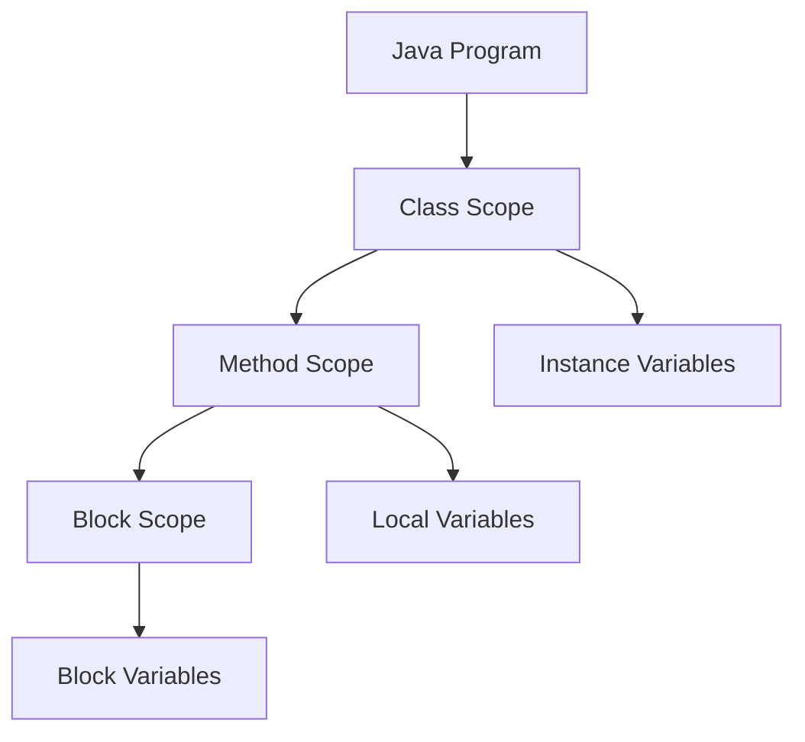

# Java Method Scope

## Introduction

When writing Java programs, understanding **method scope** is crucial for creating well-structured and error-free code. Scope defines the region of a program where a variable is accessible and visible. In Java, variables can have different levels of visibility depending on where they are declared.

This guide will help you understand how method scope works in Java, how different variables interact with each other, and best practices for managing scope in your programs.

## What is Method Scope?

Method scope refers to the visibility and accessibility of variables within and around methods. In Java, variables have specific lifetimes and areas of the program where they can be accessed.

Let's visualize the concept of scope:



## Types of Variables Based on Scope

In Java, we can identify several types of variables based on their scope:

1. **Class Variables** (Static Variables)
2. **Instance Variables** (Member Variables)
3. **Method Parameters**
4. **Local Variables**
5. **Block Variables**

Let's explore each of these with examples.

## 1. Class and Instance Variables

Variables declared at the class level (but outside methods) can have two forms:

### Instance Variables

These are declared in a class but outside any method and are not marked as `static`. Each object of the class has its own copy of these variables.

### Class Variables

These are declared with the `static` keyword and are shared among all instances of the class.

```java
public class ScopeExample {
    // Instance variable - each object has its own copy
    String instanceVar = "I'm an instance variable";
    
    // Class variable - shared among all instances
    static String classVar = "I'm a class variable";
    
    public void printVariables() {
        System.out.println(instanceVar);  // Accessible
        System.out.println(classVar);     // Accessible
    }
}
```

Both instance and class variables are accessible from any method within the class.

## 2. Method Parameters

Parameters passed to a method are only accessible within that method:

```java
public class MethodParameterExample {
    public void greetPerson(String name) {  // 'name' is a method parameter
        System.out.println("Hello, " + name + "!");
        // 'name' is accessible anywhere in this method
    }
    
    public void anotherMethod() {
        // System.out.println(name);  // ERROR! 'name' is not accessible here
    }
}
```

**Example usage:**
```java
MethodParameterExample example = new MethodParameterExample();
example.greetPerson("Alice");  // Output: Hello, Alice!
```

## 3. Local Variables

Variables declared within a method are called local variables and are only accessible within that method:

```java
public class LocalVariableExample {
    public void calculateArea() {
        int length = 10;  // Local variable
        int width = 5;    // Local variable
        int area = length * width;
        System.out.println("Area: " + area);
    }
    
    public void displayInfo() {
        // System.out.println(length);  // ERROR! 'length' is not accessible here
        // System.out.println(width);   // ERROR! 'width' is not accessible here
        // System.out.println(area);    // ERROR! 'area' is not accessible here
    }
}
```

**Example usage:**
```java
LocalVariableExample example = new LocalVariableExample();
example.calculateArea();  // Output: Area: 50
```

## 4. Block Variables

A block is a group of statements enclosed within curly braces `{}`. Variables declared within a block are only accessible within that block.

```java
public class BlockScopeExample {
    public void demonstrateBlockScope() {
        // Method scope begins
        int outerVar = 10;
        System.out.println("Outside block: " + outerVar);  // Accessible
        
        // Block begins
        {
            int innerVar = 20;  // Block variable
            System.out.println("Inside block: " + outerVar);  // outer variable is accessible
            System.out.println("Inside block: " + innerVar);  // inner variable is accessible
        }
        // Block ends
        
        System.out.println("Outside block: " + outerVar);  // Still accessible
        // System.out.println("Outside block: " + innerVar);  // ERROR! Not accessible here
    }
}
```

**Example output:**
```
Outside block: 10
Inside block: 10
Inside block: 20
Outside block: 10
```

## Common Scope Scenarios

### Loops and Conditionals

Variables declared in loop headers are only accessible within the loop:

```java
public void loopScopeExample() {
    for (int i = 0; i < 5; i++) {
        System.out.println("Loop iteration: " + i);
    }
    // System.out.println("After loop: " + i);  // ERROR! 'i' is not accessible here
}
```

Similarly, variables declared within an `if` statement block are scoped to that block:

```java
public void conditionalScopeExample(int number) {
    if (number > 0) {
        String result = "Positive";
        System.out.println(result);
    }
    // System.out.println(result);  // ERROR! 'result' is not accessible here
}
```

### Variable Shadowing

When a local variable has the same name as an instance variable, the local variable "shadows" the instance variable:

```java
public class ShadowingExample {
    String name = "Global Name";
    
    public void printName() {
        System.out.println(name);  // Prints "Global Name"
    }
    
    public void shadowName() {
        String name = "Local Name";
        System.out.println(name);        // Prints "Local Name" (local variable)
        System.out.println(this.name);   // Prints "Global Name" (instance variable)
    }
}
```

**Example output:**
```
Global Name
Local Name
Global Name
```

## Real-World Application

Let's explore a practical example of scope in a banking application:

```java
public class BankAccount {
    // Instance variables - available to all methods in this class
    private String accountNumber;
    private double balance;
    private static double interestRate = 0.05;  // Class variable
    
    public BankAccount(String accountNumber, double initialDeposit) {
        this.accountNumber = accountNumber;
        this.balance = initialDeposit;
    }
    
    public void deposit(double amount) {
        // 'amount' is a method parameter
        if (amount <= 0) {
            System.out.println("Invalid deposit amount");
            return;
        }
        
        // Local variable
        double newBalance = balance + amount;
        
        // Update instance variable
        balance = newBalance;
        System.out.println("Deposited: $" + amount);
        System.out.println("New balance: $" + balance);
    }
    
    public void withdraw(double amount) {
        // 'amount' is only accessible in this method
        if (amount <= 0) {
            System.out.println("Invalid withdrawal amount");
            return;
        }
        
        if (amount > balance) {
            System.out.println("Insufficient funds");
            return;
        }
        
        balance -= amount;
        System.out.println("Withdrawn: $" + amount);
        System.out.println("New balance: $" + balance);
    }
    
    public void calculateYearlyInterest() {
        // Local variables
        double yearlyInterest = balance * interestRate;
        double futureBalance = balance + yearlyInterest;
        
        System.out.println("Current balance: $" + balance);
        System.out.println("Yearly interest at " + (interestRate * 100) + "%: $" + yearlyInterest);
        System.out.println("Balance after one year: $" + futureBalance);
    }
    
    public static void changeInterestRate(double newRate) {
        // Cannot access instance variables here without an object reference
        // System.out.println(accountNumber);  // ERROR! Not accessible
        
        interestRate = newRate;
        System.out.println("New interest rate: " + (interestRate * 100) + "%");
    }
}
```

**Example usage:**
```java
public class BankDemo {
    public static void main(String[] args) {
        BankAccount account = new BankAccount("123456789", 1000);
        
        account.deposit(500);
        account.withdraw(200);
        account.calculateYearlyInterest();
        
        BankAccount.changeInterestRate(0.06);
        account.calculateYearlyInterest();
    }
}
```

**Output:**
```
Deposited: $500.0
New balance: $1500.0
Withdrawn: $200.0
New balance: $1300.0
Current balance: $1300.0
Yearly interest at 5.0%: $65.0
Balance after one year: $1365.0
New interest rate: 6.0%
Current balance: $1300.0
Yearly interest at 6.0%: $78.0
Balance after one year: $1378.0
```

## Best Practices for Managing Scope

1. **Keep variables at the narrowest scope possible**
   - Declare variables where they are used, not at the top of methods

2. **Avoid variable shadowing**
   - Use different names for local variables and instance variables to prevent confusion

3. **Be careful with instance variables**
   - Use private access modifiers to limit the scope of instance variables

4. **Use meaningful variable names**
   - This helps clarify the intended use and scope of the variable

5. **Initialize variables when declaring them**
   - This ensures variables have valid values when they come into scope

## Common Mistakes with Scope

### Using Variables Before Declaration

```java
public void wrongOrderExample() {
    System.out.println(value);  // ERROR! Cannot use before declaration
    int value = 10;
}
```

### Accessing Out-of-Scope Variables

```java
public void scopeError() {
    if (true) {
        int localVar = 100;
    }
    // ERROR! localVar is not accessible here
    System.out.println(localVar);  
}
```

### Forgetting that Local Variables Hide Instance Variables

```java
public class ScopeMistake {
    private int counter = 0;
    
    public void increment() {
        int counter = 1;  // Creates a new local variable instead of using the instance variable
        counter++;        // Only incrementing the local variable, not the instance variable
        System.out.println("Counter: " + counter);  // Will always print 2
    }
}
```

## Summary

Understanding method scope in Java is essential for writing clean, error-free, and maintainable code:

- **Instance variables** are accessible throughout the class
- **Local variables** are only accessible within their declaring method
- **Block variables** are only accessible within their declaring block
- **Method parameters** are only accessible within their method
- Variables declared in the narrowest scope possible make code more maintainable

By properly managing variable scope, you can write more robust Java programs that are easier to debug and maintain.

## Exercises

1. Write a Java class with an instance variable, a class variable, and methods that demonstrate the difference in their scope.

2. Create a method that has local variables with the same names as instance variables and demonstrate how to access both.

3. Write a program that demonstrates variable shadowing and how to resolve it.

4. Create a banking application that tracks multiple accounts and uses proper scope for all variables.

5. Debug the following code and identify the scope issues:
```java
public class ScopeChallenge {
    int x = 10;
    
    public void method1() {
        int x = 20;
        System.out.println(x);
        
        for (int i = 0; i < 3; i++) {
            int y = x + i;
            System.out.println(y);
        }
        
        System.out.println(y);  // Is this valid?
    }
    
    public void method2() {
        System.out.println(x);  // Which x is this?
    }
}
```

## Additional Resources

- [Java Tutorials: Variables](https://docs.oracle.com/javase/tutorial/java/nutsandbolts/variables.html)
- [Oracle Documentation on Variable Scope](https://docs.oracle.com/javase/specs/jls/se17/html/jls-6.html#jls-6.3)
- [The Java Language Specification: Names and Scopes](https://docs.oracle.com/javase/specs/jls/se17/html/jls-6.html)
- Book: "Effective Java" by Joshua Bloch (Chapter on Methods)