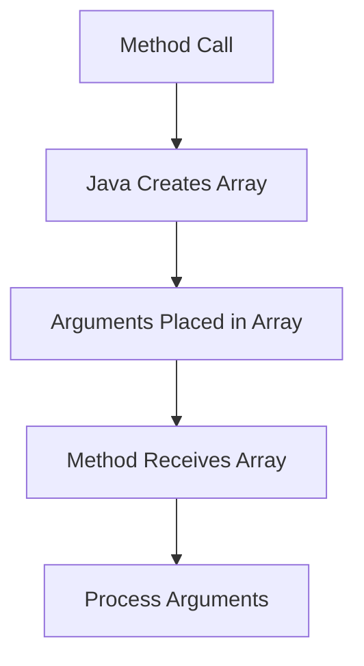

# Java Variable Arguments

## Introduction

When writing Java functions, you sometimes face a situation where you want to pass a varying number of arguments to a method. For example, you might want to write a sum function that can accept any number of integers. Before Java 5, this was cumbersome - you'd have to either overload methods or pass arrays explicitly. With Java 5 came a feature called **Variable Arguments** (or **varargs** for short), which provides an elegant solution to this problem.

Variable arguments allow methods to accept zero or more arguments of a specified type. This feature makes your code more readable, flexible, and maintainable by eliminating the need for multiple method overloads or explicit array creation.

## Basic Syntax of Variable Arguments

To declare a method with variable arguments, you use the following syntax:

```java
returnType methodName(parameterType... parameterName) {
    // Method body
}
```

The three dots (`...`) after the parameter type indicate that this parameter can accept variable number of arguments. Some important points to note:

- A method can have only one vararg parameter
- The vararg parameter must be the last parameter in the method declaration

Let's look at a simple example:

```java
public class VarargsDemo {
    public static void main(String[] args) {
        // Call with different number of arguments
        printNumbers();                     // No arguments
        printNumbers(10);                   // One argument
        printNumbers(10, 20, 30);           // Multiple arguments
        
        System.out.println("Sum: " + sum(1, 2, 3, 4, 5));
    }
    
    public static void printNumbers(int... numbers) {
        System.out.println("Number of arguments: " + numbers.length);
        
        for (int num : numbers) {
            System.out.print(num + " ");
        }
        System.out.println();
    }
    
    public static int sum(int... numbers) {
        int total = 0;
        for (int num : numbers) {
            total += num;
        }
        return total;
    }
}
```

**Output:**
```
Number of arguments: 0

Number of arguments: 1
10 
Number of arguments: 3
10 20 30 
Sum: 15
```

## How Varargs Work Internally

Behind the scenes, when you call a method with variable arguments, Java automatically creates an array and puts all the arguments into that array. This is why you can treat the parameter `numbers` as an array inside the method body.



This internal mechanism explains why:
1. You can access the length of arguments using `numbers.length`
2. You can iterate through arguments using a for-each loop
3. You can access individual elements using array indexing (`numbers[i]`)

## Common Use Cases

### 1. Mathematical Operations

Variable arguments are perfect for mathematical functions that need to operate on varying numbers of values:

```java
public class MathOperations {
    public static void main(String[] args) {
        System.out.println("Maximum: " + findMax(5, 9, 3, 12, 7));
        System.out.println("Minimum: " + findMin(5, 9, 3, 12, 7));
        System.out.println("Average: " + calculateAverage(5, 9, 3, 12, 7));
    }
    
    public static int findMax(int... numbers) {
        if (numbers.length == 0) {
            throw new IllegalArgumentException("No arguments provided");
        }
        
        int max = numbers[0];
        for (int i = 1; i < numbers.length; i++) {
            if (numbers[i] > max) {
                max = numbers[i];
            }
        }
        return max;
    }
    
    public static int findMin(int... numbers) {
        if (numbers.length == 0) {
            throw new IllegalArgumentException("No arguments provided");
        }
        
        int min = numbers[0];
        for (int i = 1; i < numbers.length; i++) {
            if (numbers[i] < min) {
                min = numbers[i];
            }
        }
        return min;
    }
    
    public static double calculateAverage(int... numbers) {
        if (numbers.length == 0) {
            throw new IllegalArgumentException("No arguments provided");
        }
        
        int sum = 0;
        for (int num : numbers) {
            sum += num;
        }
        return (double) sum / numbers.length;
    }
}
```

**Output:**
```
Maximum: 12
Minimum: 3
Average: 7.2
```

### 2. String Formatting and Concatenation

Varargs work with any data type, making them useful for string operations:

```java
public class StringUtils {
    public static void main(String[] args) {
        String message = concatenate("-", "Java", "is", "awesome");
        System.out.println(message);
        
        printFormatted("Students: ", "Alice", "Bob", "Charlie");
    }
    
    public static String concatenate(String delimiter, String... strings) {
        if (strings.length == 0) {
            return "";
        }
        
        StringBuilder result = new StringBuilder(strings[0]);
        for (int i = 1; i < strings.length; i++) {
            result.append(delimiter).append(strings[i]);
        }
        return result.toString();
    }
    
    public static void printFormatted(String header, String... items) {
        System.out.println(header);
        for (int i = 0; i < items.length; i++) {
            System.out.println((i+1) + ". " + items[i]);
        }
    }
}
```

**Output:**
```
Java-is-awesome
Students: 
1. Alice
2. Bob
3. Charlie
```

## Combining Varargs with Regular Parameters

You can combine variable arguments with regular parameters, but remember that the vararg parameter must come last:

```java
public class CombiningParameters {
    public static void main(String[] args) {
        printInfo("User Report", 42, "Alice", "Bob", "Charlie");
        printInfo("Error Log", 500);
    }
    
    public static void printInfo(String header, int code, String... names) {
        System.out.println("====== " + header + " ======");
        System.out.println("Code: " + code);
        System.out.println("Names: ");
        
        if (names.length == 0) {
            System.out.println("  No names provided");
        } else {
            for (String name : names) {
                System.out.println("  - " + name);
            }
        }
        System.out.println();
    }
}
```

**Output:**
```
====== User Report ======
Code: 42
Names: 
  - Alice
  - Bob
  - Charlie

====== Error Log ======
Code: 500
Names: 
  No names provided
```

## Common Pitfalls and Best Practices

### 1. Null Handling

Be careful when passing `null` to a vararg method:

```java
public static void handleNull(String... strings) {
    // This is safe - checks if the array itself is null (which it never should be)
    if (strings == null) {
        System.out.println("Array is null");
        return;
    }
    
    // This checks if any elements in the array are null
    for (String s : strings) {
        if (s == null) {
            System.out.println("Found null string");
        } else {
            System.out.println("String: " + s);
        }
    }
}
```

### 2. Type Safety

Variable arguments work with all types, including primitive types, objects, and even arrays:

```java
// This works with primitive types
void method1(int... numbers) { }

// This works with objects
void method2(String... strings) { }

// This works with arrays, but creates confusion
void method3(int[]... arrays) { }
```

### 3. Overloading Methods with Varargs

Be cautious when overloading methods with varargs as it can lead to ambiguity:

```java
// These two methods can create ambiguity
void print(String... strings) { }
void print(String first, String... rest) { }
```

The compiler might not be able to determine which method to call in some cases.

### 4. Performance Considerations

Since varargs create a new array for each method call, there can be a small performance overhead. For performance-critical code that's called frequently, consider using overloaded methods instead.

## Real-world Example: Logger Implementation

Here's a practical example of using varargs to implement a simple logging system:

```java
public class SimpleLogger {
    public enum LogLevel {
        INFO, DEBUG, WARNING, ERROR
    }
    
    private LogLevel level;
    
    public SimpleLogger(LogLevel level) {
        this.level = level;
    }
    
    public void info(String message, Object... args) {
        if (level.ordinal() <= LogLevel.INFO.ordinal()) {
            log("INFO", message, args);
        }
    }
    
    public void debug(String message, Object... args) {
        if (level.ordinal() <= LogLevel.DEBUG.ordinal()) {
            log("DEBUG", message, args);
        }
    }
    
    public void warning(String message, Object... args) {
        if (level.ordinal() <= LogLevel.WARNING.ordinal()) {
            log("WARNING", message, args);
        }
    }
    
    public void error(String message, Object... args) {
        if (level.ordinal() <= LogLevel.ERROR.ordinal()) {
            log("ERROR", message, args);
        }
    }
    
    private void log(String levelName, String message, Object... args) {
        // Format the message with the provided args
        String formattedMessage = String.format(message, args);
        
        // Print with timestamp
        System.out.printf("[%s] %s: %s%n", 
            java.time.LocalTime.now(), 
            levelName, 
            formattedMessage);
    }
    
    public static void main(String[] args) {
        SimpleLogger logger = new SimpleLogger(LogLevel.DEBUG);
        
        // Using varargs to format messages
        logger.info("Application started");
        logger.debug("Processing file %s with %d records", "data.csv", 500);
        logger.warning("Low disk space: %d%% remaining", 15);
        logger.error("Failed to connect to %s on port %d", "database.server", 5432);
    }
}
```

**Output (times will vary):**
```
[10:25:17.345] INFO: Application started
[10:25:17.347] DEBUG: Processing file data.csv with 500 records
[10:25:17.347] WARNING: Low disk space: 15% remaining
[10:25:17.348] ERROR: Failed to connect to database.server on port 5432
```

This example shows how varargs make it easy to implement a flexible logging system that can format messages with various parameters.

## Summary

Java Variable Arguments (varargs) provide a clean and flexible way to handle methods that need to accept a variable number of parameters. Key takeaways include:

1. **Syntax**: Use `type... paramName` in the method declaration
2. **Behavior**: Java treats the parameter as an array internally
3. **Constraints**: 
   - Only one vararg parameter per method
   - The vararg parameter must be the last in the parameter list
4. **Common uses**: Mathematical operations, string manipulation, logging, and configuration

Varargs reduce code duplication by eliminating the need for multiple method overloads, making your code more readable and maintainable.

## Practice Exercises

1. Create a method `findMedian` that takes a variable number of integers and returns the median value.

2. Implement a `joinWords` method that takes a delimiter string and a variable number of words, and joins them together.

3. Write a `createHtmlTag` method that takes a tag name and a variable number of content strings, and wraps each content with the specified HTML tag.

4. Implement a `queryBuilder` method that takes a base SQL query string and a variable number of WHERE conditions to append to the query.

## Additional Resources

- [Java Documentation on Varargs](https://docs.oracle.com/javase/8/docs/technotes/guides/language/varargs.html)
- [Oracle Java Tutorial: Variable Arguments](https://docs.oracle.com/javase/tutorial/java/javaOO/arguments.html)
- [Effective Java by Joshua Bloch](https://www.oreilly.com/library/view/effective-java-3rd/9780134686097/) - Item 53: Use varargs judiciously

By mastering Java Variable Arguments, you gain a powerful tool for writing more flexible and expressive code that can adapt to various usage scenarios without unnecessary complexity.