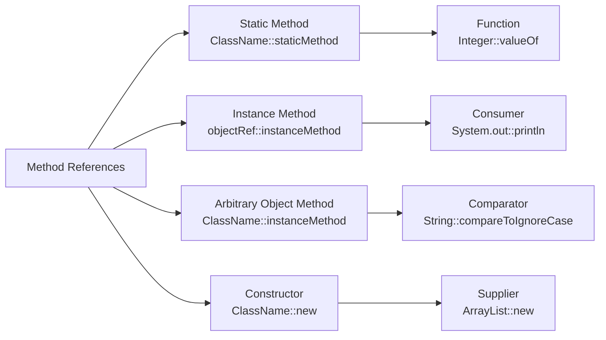

# Java Method References

## Introduction

Method references, introduced in Java 8, are a shorthand notation that simplifies the syntax of lambda expressions. They provide a way to refer to methods (or constructors) without executing them. Think of method references as compact lambda expressions that make your code more readable and concise when all you're doing in a lambda expression is calling an existing method.

Instead of explicitly providing the parameters and the body of a lambda, method references allow you to point to a method that already has the behavior you need. This feature is especially useful when working with functional interfaces in Java's functional programming paradigm.

## Understanding Method References

Before diving into method references, let's quickly recall lambda expressions:

```java
List<String> names = Arrays.asList("Alice", "Bob", "Charlie");

// Using a lambda expression
names.forEach(name -> System.out.println(name));
```

With method references, we can simplify this even further:

```java
// Using a method reference
names.forEach(System.out::println);
```

The `::` operator is the key to method references. It separates the class or object name from the method name.

## Types of Method References

There are four types of method references in Java:

### 1. Reference to a Static Method

Syntax: `ClassName::staticMethodName`

```java
// Lambda expression
Function<String, Integer> converter1 = s -> Integer.parseInt(s);

// Method reference equivalent
Function<String, Integer> converter2 = Integer::parseInt;

// Usage
String strNumber = "123";
int result = converter2.apply(strNumber);
System.out.println("Converted number: " + result);
```

Output:
```
Converted number: 123
```

### 2. Reference to an Instance Method of a Particular Object

Syntax: `objectReference::instanceMethodName`

```java
// Lambda expression
String message = "Hello, World!";
Supplier<String> supplier1 = () -> message.toUpperCase();

// Method reference equivalent
Supplier<String> supplier2 = message::toUpperCase;

// Usage
System.out.println("Uppercase message: " + supplier2.get());
```

Output:
```
Uppercase message: HELLO, WORLD!
```

### 3. Reference to an Instance Method of an Arbitrary Object of a Particular Type

Syntax: `ClassName::instanceMethodName`

```java
// Lambda expression
Comparator<String> comparator1 = (s1, s2) -> s1.compareTo(s2);

// Method reference equivalent
Comparator<String> comparator2 = String::compareTo;

// Usage
List<String> names = Arrays.asList("Charlie", "Alice", "Bob");
Collections.sort(names, comparator2);
System.out.println("Sorted names: " + names);
```

Output:
```
Sorted names: [Alice, Bob, Charlie]
```

### 4. Reference to a Constructor

Syntax: `ClassName::new`

```java
// Lambda expression
Supplier<ArrayList<String>> listSupplier1 = () -> new ArrayList<String>();

// Method reference equivalent
Supplier<ArrayList<String>> listSupplier2 = ArrayList::new;

// Usage
ArrayList<String> newList = listSupplier2.get();
newList.add("Item 1");
System.out.println("New list with item: " + newList);
```

Output:
```
New list with item: [Item 1]
```

## Method References and Functional Interfaces

Method references are most useful with Java's functional interfaces. A functional interface is one with a single abstract method (SAM). Here's how different method references work with common functional interfaces:



## Practical Examples

### Example 1: Processing a List with Method References

```java
import java.util.Arrays;
import java.util.List;
import java.util.stream.Collectors;

public class MethodReferenceExample {
    public static void main(String[] args) {
        List<String> words = Arrays.asList("hello", "world", "java", "programming");
        
        // Using method references to convert all words to uppercase
        List<String> uppercaseWords = words.stream()
                                          .map(String::toUpperCase)
                                          .collect(Collectors.toList());
        
        System.out.println("Original words: " + words);
        System.out.println("Uppercase words: " + uppercaseWords);
    }
}
```

Output:
```
Original words: [hello, world, java, programming]
Uppercase words: [HELLO, WORLD, JAVA, PROGRAMMING]
```

### Example 2: Custom Methods with Method References

```java
import java.util.Arrays;
import java.util.List;
import java.util.function.Predicate;

public class CustomMethodReferenceExample {
    public static void main(String[] args) {
        List<Integer> numbers = Arrays.asList(1, 2, 3, 4, 5, 6, 7, 8, 9, 10);
        
        // Print even numbers using a static method reference
        System.out.println("Even numbers:");
        printFiltered(numbers, CustomMethodReferenceExample::isEven);
        
        // Print odd numbers using a static method reference
        System.out.println("\nOdd numbers:");
        printFiltered(numbers, CustomMethodReferenceExample::isOdd);
    }
    
    // Static helper methods
    public static boolean isEven(Integer n) {
        return n % 2 == 0;
    }
    
    public static boolean isOdd(Integer n) {
        return n % 2 != 0;
    }
    
    // Method to print filtered numbers
    public static void printFiltered(List<Integer> numbers, Predicate<Integer> filter) {
        numbers.stream()
               .filter(filter)
               .forEach(System.out::println);
    }
}
```

Output:
```
Even numbers:
2
4
6
8
10

Odd numbers:
1
3
5
7
9
```

### Example 3: Sorting Objects Using Method References

```java
import java.util.ArrayList;
import java.util.Comparator;
import java.util.List;

public class SortingMethodReferenceExample {
    public static void main(String[] args) {
        List<Person> people = new ArrayList<>();
        people.add(new Person("Alice", 28));
        people.add(new Person("Bob", 35));
        people.add(new Person("Charlie", 21));
        people.add(new Person("David", 42));
        
        // Sort by name using method reference
        people.sort(Comparator.comparing(Person::getName));
        System.out.println("Sorted by name:");
        people.forEach(p -> System.out.println(p.getName() + " - " + p.getAge()));
        
        System.out.println();
        
        // Sort by age using method reference
        people.sort(Comparator.comparing(Person::getAge));
        System.out.println("Sorted by age:");
        people.forEach(p -> System.out.println(p.getName() + " - " + p.getAge()));
    }
    
    static class Person {
        private final String name;
        private final int age;
        
        public Person(String name, int age) {
            this.name = name;
            this.age = age;
        }
        
        public String getName() {
            return name;
        }
        
        public int getAge() {
            return age;
        }
    }
}
```

Output:
```
Sorted by name:
Alice - 28
Bob - 35
Charlie - 21
David - 42

Sorted by age:
Charlie - 21
Alice - 28
Bob - 35
David - 42
```

## When to Use Method References

Method references are most effective when:

1. You're just calling a method with the parameters received by the lambda
2. The method already exists (you don't need to define new functionality)
3. You want to improve code readability

However, if you need to perform additional operations or transformations on the parameters before calling a method, a standard lambda expression would be more appropriate.

## Method References vs. Lambda Expressions

| Scenario | Lambda Expression | Method Reference |
|----------|-------------------|-----------------|
| Simple method call | `s -> System.out.println(s)` | `System.out::println` |
| Passing parameters as-is | `(a, b) -> Math.max(a, b)` | `Math::max` |
| Additional operations | `s -> System.out.println("Log: " + s)` | Not applicable (use lambda) |
| Constructor call | `() -> new ArrayList<>()` | `ArrayList::new` |

## Summary

Method references in Java provide a concise way to refer to methods or constructors without invoking them. They work as a shorthand notation for lambda expressions and make your code more readable, especially when working with functional interfaces.

The four types of method references are:
1. Reference to static methods (`ClassName::staticMethod`)
2. Reference to instance methods of specific objects (`objectRef::instanceMethod`)
3. Reference to instance methods of arbitrary objects (`ClassName::instanceMethod`)
4. Reference to constructors (`ClassName::new`)

Method references are particularly useful when working with streams, collections, and other functional programming constructs in Java.

## Practice Exercises

1. Convert the following lambda expressions to method references:
   - `s -> s.length()`
   - `(s1, s2) -> s1.concat(s2)`
   - `() -> Thread.currentThread().getName()`

2. Create a program that uses method references to sort a list of strings by their length.

3. Implement a program that uses method references to filter a list of files by their extension.

## Additional Resources

- [Java Official Documentation on Method References](https://docs.oracle.com/javase/tutorial/java/javaOO/methodreferences.html)
- [Effective Java by Joshua Bloch](https://www.oreilly.com/library/view/effective-java-3rd/9780134686097/) - Chapter on Lambdas and Method References
- [Java Stream API Documentation](https://docs.oracle.com/javase/8/docs/api/java/util/stream/package-summary.html)