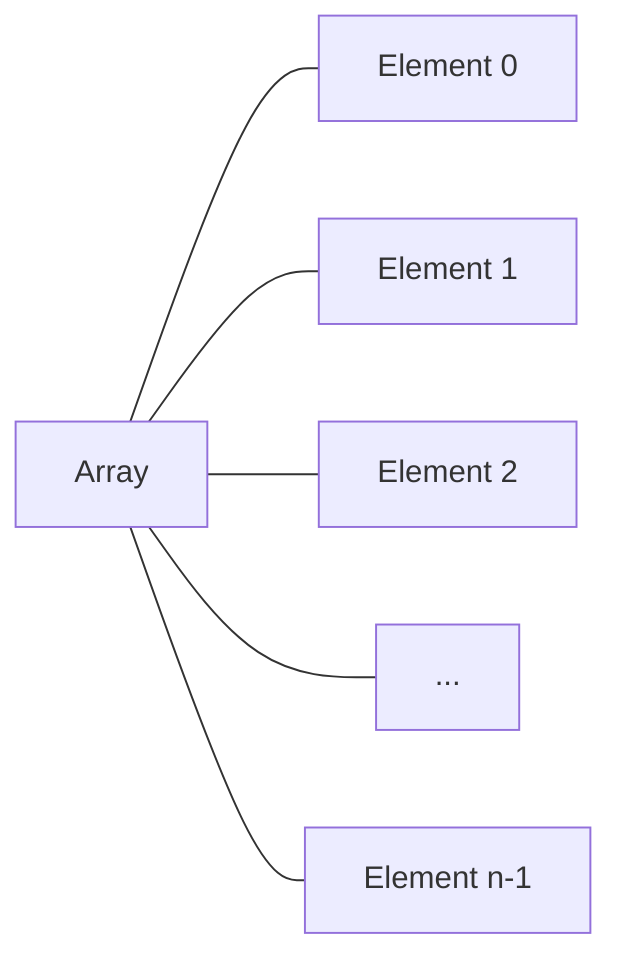

# Java Arrays

Arrays are one of the most fundamental data structures in Java programming. They allow you to store multiple values of the same type in a single variable, making it easier to manage collections of related data. In this tutorial, we'll explore how arrays work in Java and how to use them effectively in your programs.

## What Are Arrays?

An array is a container object that holds a fixed number of values of a single type. The length of an array is established when the array is created. After creation, its length is fixed.

Think of an array as a bookshelf with a specific number of slots. Each slot can hold one book (or one data value), and all books on the shelf are of the same type.



## Declaring Arrays in Java

In Java, arrays are declared using square brackets `[]`:

```java
// Array declaration
dataType[] arrayName;
```

For example:

```java
int[] numbers;       // An array of integers
String[] names;      // An array of strings
double[] prices;     // An array of doubles
```

## Creating Arrays in Java

After declaring an array, you need to create it using the `new` keyword:

```java
// Array creation
arrayName = new dataType[size];
```

For example:

```java
numbers = new int[5];     // Creates an array that can hold 5 integers
names = new String[10];   // Creates an array that can hold 10 strings
```

You can also declare and create an array in a single line:

```java
int[] numbers = new int[5];
```

## Initializing Arrays

You can initialize arrays in several ways:

### Method 1: Element by element

```java
int[] scores = new int[5];
scores[0] = 85;  // First element
scores[1] = 92;  // Second element
scores[2] = 78;  // Third element
scores[3] = 95;  // Fourth element
scores[4] = 88;  // Fifth element
```

### Method 2: Shorthand initialization

```java
int[] scores = {85, 92, 78, 95, 88};
```

### Method 3: Using Arrays.fill()

```java
import java.util.Arrays;

int[] scores = new int[5];
Arrays.fill(scores, 100);  // Fill all elements with 100
```

## Accessing Array Elements

Array elements are accessed using their index. In Java, array indices start at 0:

```java
int[] numbers = {10, 20, 30, 40, 50};
System.out.println("First element: " + numbers[0]);    // Output: 10
System.out.println("Third element: " + numbers[2]);    // Output: 30
System.out.println("Last element: " + numbers[4]);     // Output: 50
```

## Array Length

You can find out how many elements an array has using the `length` property:

```java
int[] numbers = {10, 20, 30, 40, 50};
System.out.println("Array length: " + numbers.length);  // Output: 5
```

## Iterating Through Arrays

There are several ways to iterate through arrays in Java:

### Using a for loop with index

```java
int[] numbers = {10, 20, 30, 40, 50};

for (int i = 0; i < numbers.length; i++) {
    System.out.println("Element at index " + i + ": " + numbers[i]);
}
```

Output:
```
Element at index 0: 10
Element at index 1: 20
Element at index 2: 30
Element at index 3: 40
Element at index 4: 50
```

### Using an enhanced for loop (for-each)

```java
int[] numbers = {10, 20, 30, 40, 50};

for (int number : numbers) {
    System.out.println("Element: " + number);
}
```

Output:
```
Element: 10
Element: 20
Element: 30
Element: 40
Element: 50
```

## Multidimensional Arrays

Java supports multidimensional arrays, which are essentially arrays of arrays:

### Two-dimensional Arrays

```java
// Declaration
int[][] matrix = new int[3][4];  // 3 rows, 4 columns

// Initialization
matrix[0][0] = 1;  // First element of first row
matrix[2][3] = 12; // Last element of last row

// Another way to initialize
int[][] grid = {
    {1, 2, 3, 4},
    {5, 6, 7, 8},
    {9, 10, 11, 12}
};

// Iterating through a 2D array
for (int i = 0; i < grid.length; i++) {
    for (int j = 0; j < grid[i].length; j++) {
        System.out.print(grid[i][j] + "\t");
    }
    System.out.println();  // New line after each row
}
```

Output:
```
1	2	3	4	
5	6	7	8	
9	10	11	12	
```

## Common Array Operations

### Copying Arrays

There are several ways to copy arrays in Java:

#### Using System.arraycopy()

```java
int[] source = {1, 2, 3, 4, 5};
int[] destination = new int[5];

System.arraycopy(source, 0, destination, 0, source.length);

System.out.println("Source: " + Arrays.toString(source));
System.out.println("Destination: " + Arrays.toString(destination));
```

Output:
```
Source: [1, 2, 3, 4, 5]
Destination: [1, 2, 3, 4, 5]
```

#### Using Arrays.copyOf()

```java
int[] source = {1, 2, 3, 4, 5};
int[] destination = Arrays.copyOf(source, source.length);

System.out.println("Source: " + Arrays.toString(source));
System.out.println("Destination: " + Arrays.toString(destination));
```

Output:
```
Source: [1, 2, 3, 4, 5]
Destination: [1, 2, 3, 4, 5]
```

### Sorting Arrays

```java
int[] numbers = {5, 2, 8, 1, 9};
Arrays.sort(numbers);
System.out.println("Sorted array: " + Arrays.toString(numbers));
```

Output:
```
Sorted array: [1, 2, 5, 8, 9]
```

### Searching in Arrays

```java
int[] numbers = {10, 20, 30, 40, 50};
int index = Arrays.binarySearch(numbers, 30);
System.out.println("30 is found at index: " + index);
```

Output:
```
30 is found at index: 2
```

Note: For `binarySearch()` to work correctly, the array needs to be sorted first.

## Common Pitfalls and How to Avoid Them

### 1. Array Index Out of Bounds Exception

```java
int[] numbers = {1, 2, 3};
// The following line will cause an ArrayIndexOutOfBoundsException
// System.out.println(numbers[3]);  // There's no element at index 3!

// To avoid this, always check the array length
int index = 3;
if (index < numbers.length) {
    System.out.println(numbers[index]);
} else {
    System.out.println("Index is out of bounds!");
}
```

Output:
```
Index is out of bounds!
```

### 2. Forgetting That Arrays are Zero-indexed

```java
int[] numbers = new int[5];  // Creates an array with indices 0 to 4
// The valid indices are 0, 1, 2, 3, and 4
// NOT 1, 2, 3, 4, and 5
```

## Practical Example: Computing Average Temperature

Let's use arrays to compute the average temperature for a week:

```java
public class TemperatureAnalysis {
    public static void main(String[] args) {
        // Temperatures for each day of the week (in Celsius)
        double[] temperatures = {22.5, 23.7, 21.8, 20.5, 24.2, 25.0, 23.1};
        String[] days = {"Monday", "Tuesday", "Wednesday", "Thursday", "Friday", "Saturday", "Sunday"};
        
        // Calculate the average
        double sum = 0;
        for (double temp : temperatures) {
            sum += temp;
        }
        double average = sum / temperatures.length;
        
        // Find the hottest and coldest days
        double hottest = temperatures[0];
        double coldest = temperatures[0];
        int hottestDayIndex = 0;
        int coldestDayIndex = 0;
        
        for (int i = 1; i < temperatures.length; i++) {
            if (temperatures[i] > hottest) {
                hottest = temperatures[i];
                hottestDayIndex = i;
            }
            if (temperatures[i] < coldest) {
                coldest = temperatures[i];
                coldestDayIndex = i;
            }
        }
        
        // Print results
        System.out.printf("Average weekly temperature: %.1f°C\n", average);
        System.out.printf("Hottest day: %s (%.1f°C)\n", days[hottestDayIndex], hottest);
        System.out.printf("Coldest day: %s (%.1f°C)\n", days[coldestDayIndex], coldest);
    }
}
```

Output:
```
Average weekly temperature: 23.0°C
Hottest day: Saturday (25.0°C)
Coldest day: Thursday (20.5°C)
```

## Summary

Arrays in Java are powerful tools for storing and managing collections of related data. We've covered:

- How to declare and initialize arrays
- Accessing array elements
- Array iteration techniques
- Multidimensional arrays
- Common array operations like copying and sorting
- Avoiding common pitfalls
- A practical example of using arrays

Arrays are essential building blocks in Java programming, and mastering them is crucial for developing more complex applications.

## Additional Resources

- [Oracle's Java Arrays Tutorial](https://docs.oracle.com/javase/tutorial/java/nutsandbolts/arrays.html)
- [Java API Documentation for Arrays](https://docs.oracle.com/en/java/javase/11/docs/api/java.base/java/util/Arrays.html)

## Exercises

1. Create an array of 10 integers and fill it with random numbers between 1 and 100. Find the minimum, maximum, and average of these numbers.

2. Write a program that reverses an array without using a second array.

3. Create a two-dimensional array to represent a tic-tac-toe board. Initialize it with 'X', 'O', and empty spaces, then print the board.

4. Implement a program that checks if an array is a palindrome (reads the same forwards and backwards).

5. Create a program that merges two sorted arrays into a single sorted array.