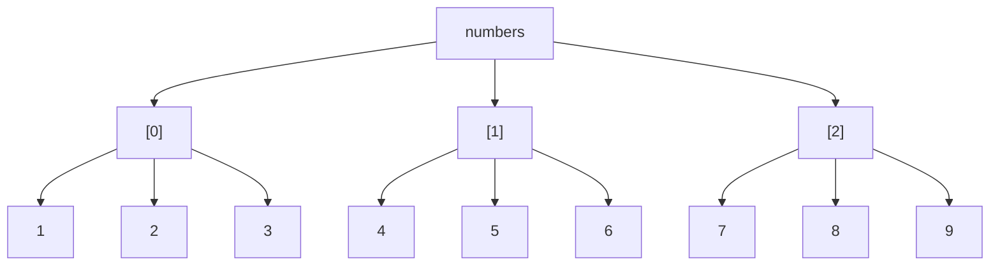

# Java Multidimensional Arrays

## Introduction

In programming, we often need to work with data that is naturally structured in multiple dimensions. For example, a chess board can be represented as an 8×8 grid, and a Rubik's cube as a 3×3×3 structure. In Java, multidimensional arrays provide a way to store and manipulate such data efficiently.

A multidimensional array is essentially an array of arrays. The most common type is a two-dimensional (2D) array, which can be visualized as a table with rows and columns. Java also supports higher-dimensional arrays, such as three-dimensional (3D) arrays and beyond.

In this tutorial, you'll learn how to:
- Create and initialize multidimensional arrays
- Access and modify elements in these arrays
- Iterate through multidimensional arrays
- Apply these concepts to solve real-world problems

## Understanding Two-Dimensional Arrays

A 2D array consists of rows and columns, similar to a spreadsheet or a matrix. In Java, a 2D array is actually an array where each element is another array.

### Creating 2D Arrays

Here's how to create a 2D array in Java:

```java
// Method 1: Declaration and initialization in separate steps
int[][] matrix; // Declaration
matrix = new int[3][4]; // Initialization with 3 rows and 4 columns

// Method 2: Combined declaration and initialization
int[][] grid = new int[2][3]; // A 2×3 grid

// Method 3: Initialize with values
int[][] numbers = {
    {1, 2, 3},
    {4, 5, 6},
    {7, 8, 9}
}; // A 3×3 matrix with predefined values
```

### Visualizing a 2D Array

Let's visualize the 2D array `numbers` from the example above:



### Accessing Elements in a 2D Array

To access an element in a 2D array, you need to specify both the row and column indices:

```java
int[][] matrix = {
    {1, 2, 3},
    {4, 5, 6},
    {7, 8, 9}
};

// Accessing elements
int element = matrix[1][2]; // Gets the element at row 1, column 2 (value: 6)
System.out.println("Element at position [1][2]: " + element);

// Modifying an element
matrix[0][0] = 10; // Changes the element at row 0, column 0 from 1 to 10
System.out.println("Updated element at position [0][0]: " + matrix[0][0]);
```

Output:
```
Element at position [1][2]: 6
Updated element at position [0][0]: 10
```

### Iterating Through a 2D Array

You'll often need to process all elements in a 2D array. This requires nested loops:

```java
int[][] matrix = {
    {1, 2, 3},
    {4, 5, 6},
    {7, 8, 9}
};

// Using nested for loops to iterate through all elements
System.out.println("All elements in the matrix:");
for (int row = 0; row < matrix.length; row++) {
    for (int col = 0; col < matrix[row].length; col++) {
        System.out.print(matrix[row][col] + " ");
    }
    System.out.println(); // Move to the next line after each row
}

// Enhanced for loop approach
System.out.println("\nUsing enhanced for loop:");
for (int[] row : matrix) {
    for (int element : row) {
        System.out.print(element + " ");
    }
    System.out.println();
}
```

Output:
```
All elements in the matrix:
1 2 3 
4 5 6 
7 8 9 

Using enhanced for loop:
1 2 3 
4 5 6 
7 8 9 
```

## Jagged Arrays in Java

A jagged array is a 2D array where each row can have a different number of columns. This is possible in Java because a 2D array is actually an array of arrays.

```java
// Creating a jagged array
int[][] jaggedArray = new int[3][];
jaggedArray[0] = new int[3]; // First row has 3 columns
jaggedArray[1] = new int[5]; // Second row has 5 columns
jaggedArray[2] = new int[2]; // Third row has 2 columns

// Initializing a jagged array
int[][] jagged = {
    {1, 2, 3},
    {4, 5},
    {6, 7, 8, 9}
};

// Accessing and printing elements of a jagged array
System.out.println("Elements in the jagged array:");
for (int[] row : jagged) {
    for (int element : row) {
        System.out.print(element + " ");
    }
    System.out.println();
}
```

Output:
```
Elements in the jagged array:
1 2 3 
4 5 
6 7 8 9 
```

## Three-Dimensional Arrays and Beyond

Java supports arrays of more than two dimensions. A 3D array can be thought of as an array of 2D arrays.

```java
// Creating a 3D array (2 layers, 3 rows, 4 columns)
int[][][] threeDArray = new int[2][3][4];

// Initializing a 3D array
int[][][] cube = {
    // First 2D array
    {
        {1, 2}, {3, 4}, {5, 6}
    },
    // Second 2D array
    {
        {7, 8}, {9, 10}, {11, 12}
    }
};

// Accessing elements in a 3D array
System.out.println("Element at [1][2][0]: " + cube[1][2][0]); // Outputs: 11

// Iterating through a 3D array
System.out.println("\nAll elements in the 3D array:");
for (int i = 0; i < cube.length; i++) {
    for (int j = 0; j < cube[i].length; j++) {
        for (int k = 0; k < cube[i][j].length; k++) {
            System.out.print(cube[i][j][k] + " ");
        }
        System.out.println();
    }
    System.out.println();
}
```

Output:
```
Element at [1][2][0]: 11

All elements in the 3D array:
1 2 
3 4 
5 6 

7 8 
9 10 
11 12 

```

## Practical Applications of Multidimensional Arrays

### Example 1: Matrix Addition

Here's how you can add two matrices using 2D arrays:

```java
public class MatrixAddition {
    public static void main(String[] args) {
        int[][] matrix1 = {
            {1, 2, 3},
            {4, 5, 6},
            {7, 8, 9}
        };
        
        int[][] matrix2 = {
            {9, 8, 7},
            {6, 5, 4},
            {3, 2, 1}
        };
        
        int rows = matrix1.length;
        int columns = matrix1[0].length;
        int[][] result = new int[rows][columns];
        
        // Adding matrices
        for (int i = 0; i < rows; i++) {
            for (int j = 0; j < columns; j++) {
                result[i][j] = matrix1[i][j] + matrix2[i][j];
            }
        }
        
        // Displaying the result
        System.out.println("Result of matrix addition:");
        for (int[] row : result) {
            for (int element : row) {
                System.out.print(element + " ");
            }
            System.out.println();
        }
    }
}
```

Output:
```
Result of matrix addition:
10 10 10 
10 10 10 
10 10 10 
```

### Example 2: Game Board Representation

A 2D array can represent a game board, such as for Tic-Tac-Toe:

```java
public class TicTacToe {
    public static void main(String[] args) {
        // Initialize an empty board (0: empty, 1: X, 2: O)
        int[][] board = new int[3][3];
        
        // Make some moves
        board[0][0] = 1; // X in top-left
        board[1][1] = 2; // O in center
        board[0][1] = 1; // X in top-center
        
        // Display the board
        System.out.println("Tic-Tac-Toe Board:");
        for (int i = 0; i < board.length; i++) {
            for (int j = 0; j < board[i].length; j++) {
                char symbol = ' ';
                if (board[i][j] == 1) {
                    symbol = 'X';
                } else if (board[i][j] == 2) {
                    symbol = 'O';
                }
                System.out.print("| " + symbol + " ");
            }
            System.out.println("|");
            
            // Print separator line
            if (i < board.length - 1) {
                System.out.println("|---|---|---|");
            }
        }
    }
}
```

Output:
```
Tic-Tac-Toe Board:
| X | X |   |
|---|---|---|
|   | O |   |
|---|---|---|
|   |   |   |
```

### Example 3: Image Processing

A grayscale image can be represented as a 2D array where each element represents the pixel intensity:

```java
public class ImageProcessing {
    public static void main(String[] args) {
        // Sample 5x5 grayscale image (0-255 values)
        int[][] image = {
            {100, 120, 130, 140, 150},
            {110, 130, 140, 150, 160},
            {120, 140, 150, 160, 170},
            {130, 150, 160, 170, 180},
            {140, 160, 170, 180, 190}
        };
        
        // Apply a simple blur filter
        int[][] blurredImage = applyBlur(image);
        
        // Display original and blurred images
        System.out.println("Original Image:");
        displayImage(image);
        
        System.out.println("\nBlurred Image:");
        displayImage(blurredImage);
    }
    
    // Simple blur filter that averages each pixel with its neighbors
    public static int[][] applyBlur(int[][] image) {
        int rows = image.length;
        int cols = image[0].length;
        int[][] result = new int[rows][cols];
        
        for (int i = 0; i < rows; i++) {
            for (int j = 0; j < cols; j++) {
                // Get average of pixel and its valid neighbors
                int sum = 0;
                int count = 0;
                
                // Check 3x3 neighborhood
                for (int di = -1; di <= 1; di++) {
                    for (int dj = -1; dj <= 1; dj++) {
                        int ni = i + di;
                        int nj = j + dj;
                        
                        // Check if neighbor is valid
                        if (ni >= 0 && ni < rows && nj >= 0 && nj < cols) {
                            sum += image[ni][nj];
                            count++;
                        }
                    }
                }
                
                result[i][j] = sum / count;
            }
        }
        
        return result;
    }
    
    // Display image as a grid
    public static void displayImage(int[][] image) {
        for (int[] row : image) {
            for (int pixel : row) {
                System.out.printf("%3d ", pixel);
            }
            System.out.println();
        }
    }
}
```

The output shows the original image values and the blurred image values as numeric matrices.

## Common Pitfalls and Best Practices

### 1. Array Index Out of Bounds

Be careful not to access indices beyond the array boundaries:

```java
int[][] matrix = new int[3][3];
// This will throw ArrayIndexOutOfBoundsException
// int value = matrix[3][3];
```

### 2. Length of 2D Arrays

Remember that `array.length` gives the number of rows, and `array[i].length` gives the number of columns in row `i`:

```java
int[][] matrix = {
    {1, 2, 3},
    {4, 5},
    {6, 7, 8, 9}
};

System.out.println("Number of rows: " + matrix.length); // 3
System.out.println("Number of columns in row 0: " + matrix[0].length); // 3
System.out.println("Number of columns in row 1: " + matrix[1].length); // 2
System.out.println("Number of columns in row 2: " + matrix[2].length); // 4
```

### 3. Null Arrays

Be careful with jagged arrays or partially initialized arrays, as they may contain null references:

```java
int[][] partialArray = new int[3][];
// This will throw NullPointerException if not initialized
// int element = partialArray[0][0];

// Correct approach is to initialize each row first
partialArray[0] = new int[2];
partialArray[0][0] = 5; // Now this works
```

## Summary

In this tutorial, you've learned:

- How to create, initialize, and access elements in multidimensional arrays
- How to iterate through 2D and 3D arrays using loops
- How to work with jagged arrays (arrays with varying row lengths)
- Real-world applications of multidimensional arrays
- Common pitfalls and best practices

Multidimensional arrays are powerful tools for representing complex data structures and solving problems in fields like game development, image processing, and scientific computing. By mastering these concepts, you've added an essential skill to your Java programming toolkit.

## Exercises

1. **Matrix Multiplication**: Write a program that multiplies two matrices using 2D arrays.
2. **Sudoku Checker**: Create a program to verify if a 9×9 Sudoku solution is valid.
3. **Spiral Traversal**: Write a function that prints the elements of a 2D array in spiral order.
4. **Conway's Game of Life**: Implement this classic cellular automaton using a 2D array to represent the grid.
5. **Image Rotation**: Write a program that rotates a 2D array (representing an image) by 90 degrees clockwise.

## Additional Resources

- [Oracle Java Documentation on Arrays](https://docs.oracle.com/javase/tutorial/java/nutsandbolts/arrays.html)
- [Matrices and Linear Algebra in Java](https://commons.apache.org/proper/commons-math/userguide/linear.html)
- [Java Algorithms and Data Structures for Multidimensional Data](https://algs4.cs.princeton.edu/35applications/)