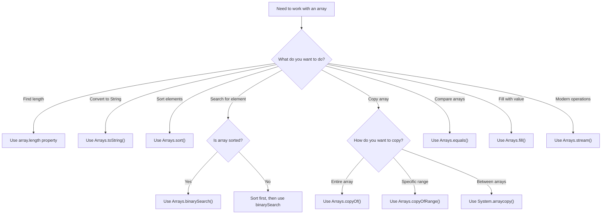

# Java Array Methods

Arrays are fundamental data structures in Java that allow you to store multiple values of the same type. While arrays themselves don't have methods like ArrayList or other collection classes, Java provides several utility methods and operations to manipulate arrays effectively. In this tutorial, we'll explore the most common array operations and methods available in Java.

## Introduction to Java Array Operations

In Java, arrays are objects, but they don't have their own methods like `.length()` or `.add()`. Instead, Java provides utility classes and operations to work with arrays. The main sources of array functionality in Java are:

1. Array properties (like `length`)
2. The `java.util.Arrays` class
3. System methods for array manipulation

Let's dive into each of these to understand how to effectively work with arrays in Java.

## Basic Array Properties

### The `length` Property

Every array in Java has a `length` property (not a method) that returns the number of elements in the array.

```java
int[] numbers = {1, 2, 3, 4, 5};
System.out.println("Array length: " + numbers.length); // Output: Array length: 5

// Using length in a for loop
for (int i = 0; i < numbers.length; i++) {
    System.out.print(numbers[i] + " ");
}
// Output: 1 2 3 4 5
```

:::tip
Remember that `length` is a property, not a method, so you don't use parentheses. Using `numbers.length()` will cause a compilation error.
:::

## The `java.util.Arrays` Class

The `java.util.Arrays` class provides several static methods to manipulate arrays. To use these methods, you need to import this class:

```java
import java.util.Arrays;
```

Let's explore the most commonly used methods from the `Arrays` class:

### 1. `toString()` - Converting Array to String

The `toString()` method returns a string representation of the array.

```java
int[] numbers = {1, 2, 3, 4, 5};
String arrayString = Arrays.toString(numbers);
System.out.println(arrayString); // Output: [1, 2, 3, 4, 5]
```

### 2. `sort()` - Sorting Arrays

The `sort()` method sorts the array in ascending order.

```java
int[] numbers = {5, 2, 9, 1, 7};
Arrays.sort(numbers);
System.out.println(Arrays.toString(numbers)); // Output: [1, 2, 5, 7, 9]

// For String arrays
String[] fruits = {"orange", "apple", "banana", "grape"};
Arrays.sort(fruits);
System.out.println(Arrays.toString(fruits)); // Output: [apple, banana, grape, orange]
```

### 3. `binarySearch()` - Searching in Sorted Arrays

The `binarySearch()` method searches for a specific value in a sorted array and returns its index.

```java
int[] numbers = {1, 2, 5, 7, 9};
int index = Arrays.binarySearch(numbers, 5);
System.out.println("Index of 5: " + index); // Output: Index of 5: 2

// If the element is not found, it returns a negative value
int notFoundIndex = Arrays.binarySearch(numbers, 6);
System.out.println("Index of 6: " + notFoundIndex); // Output will be negative
```

:::warning
The array must be sorted before calling `binarySearch()`. Using this method on an unsorted array will produce unpredictable results.
:::

### 4. `fill()` - Filling Arrays

The `fill()` method assigns the specified value to each element of the array.

```java
int[] numbers = new int[5];
Arrays.fill(numbers, 10);
System.out.println(Arrays.toString(numbers)); // Output: [10, 10, 10, 10, 10]

// You can also fill a specific range
int[] moreNumbers = new int[10];
Arrays.fill(moreNumbers, 2, 6, 42); // Fill indexes 2 to 5 with value 42
System.out.println(Arrays.toString(moreNumbers)); // Output: [0, 0, 42, 42, 42, 42, 0, 0, 0, 0]
```

### 5. `equals()` - Comparing Arrays

The `equals()` method compares two arrays for equality.

```java
int[] array1 = {1, 2, 3};
int[] array2 = {1, 2, 3};
int[] array3 = {3, 2, 1};

System.out.println(Arrays.equals(array1, array2)); // Output: true
System.out.println(Arrays.equals(array1, array3)); // Output: false
```

### 6. `copyOf()` and `copyOfRange()` - Copying Arrays

These methods create a new array by copying elements from an existing array.

```java
int[] original = {1, 2, 3, 4, 5};

// Copy with the same length
int[] copy1 = Arrays.copyOf(original, original.length);
System.out.println(Arrays.toString(copy1)); // Output: [1, 2, 3, 4, 5]

// Copy with a different length
int[] expandedCopy = Arrays.copyOf(original, 7);
System.out.println(Arrays.toString(expandedCopy)); // Output: [1, 2, 3, 4, 5, 0, 0]

int[] shorterCopy = Arrays.copyOf(original, 3);
System.out.println(Arrays.toString(shorterCopy)); // Output: [1, 2, 3]

// Copy a range of elements (fromIndex inclusive, toIndex exclusive)
int[] partialCopy = Arrays.copyOfRange(original, 1, 4);
System.out.println(Arrays.toString(partialCopy)); // Output: [2, 3, 4]
```

## System Array Copy Method

Java also provides a low-level but efficient method for copying arrays through the `System` class.

### `System.arraycopy()` - Copying Elements Between Arrays

This method copies elements from one array to another.

```java
int[] source = {1, 2, 3, 4, 5};
int[] destination = new int[5];

// Parameters: source array, source starting position, 
// destination array, destination starting position, number of elements to copy
System.arraycopy(source, 0, destination, 0, source.length);
System.out.println(Arrays.toString(destination)); // Output: [1, 2, 3, 4, 5]

// Copying partial array
int[] partDest = new int[5];
System.arraycopy(source, 2, partDest, 0, 3);
System.out.println(Arrays.toString(partDest)); // Output: [3, 4, 5, 0, 0]

// Overlapping copy within the same array (shifting elements)
int[] shiftArray = {1, 2, 3, 4, 5};
System.arraycopy(shiftArray, 0, shiftArray, 1, 4);
shiftArray[0] = 0;
System.out.println(Arrays.toString(shiftArray)); // Output: [0, 1, 2, 3, 4]
```

:::tip
`System.arraycopy()` is generally more efficient than loops for copying large arrays because it's implemented natively.
:::

## Practical Examples

Now let's see some practical examples of using these array methods in real-world scenarios.

### Example 1: Finding the Maximum Value in an Array

```java
public static int findMax(int[] array) {
    if (array == null || array.length == 0) {
        throw new IllegalArgumentException("Array cannot be empty or null");
    }
    
    // One approach: Sort and get the last element
    // int[] sortedArray = Arrays.copyOf(array, array.length);
    // Arrays.sort(sortedArray);
    // return sortedArray[sortedArray.length - 1];
    
    // More efficient approach: Iterate through the array
    int max = array[0];
    for (int i = 1; i < array.length; i++) {
        if (array[i] > max) {
            max = array[i];
        }
    }
    return max;
}

// Usage
int[] scores = {85, 92, 78, 95, 88};
System.out.println("Maximum score: " + findMax(scores)); // Output: Maximum score: 95
```

### Example 2: Removing Duplicates from a Sorted Array

```java
public static int[] removeDuplicates(int[] sortedArray) {
    if (sortedArray == null || sortedArray.length <= 1) {
        return sortedArray;
    }
    
    int uniqueCount = 1;
    for (int i = 1; i < sortedArray.length; i++) {
        if (sortedArray[i] != sortedArray[i-1]) {
            uniqueCount++;
        }
    }
    
    int[] result = new int[uniqueCount];
    result[0] = sortedArray[0];
    
    int index = 1;
    for (int i = 1; i < sortedArray.length; i++) {
        if (sortedArray[i] != sortedArray[i-1]) {
            result[index++] = sortedArray[i];
        }
    }
    
    return result;
}

// Usage
int[] sortedArray = {1, 1, 2, 3, 3, 5, 5, 5, 8};
int[] uniqueArray = removeDuplicates(sortedArray);
System.out.println("Array after removing duplicates: " + Arrays.toString(uniqueArray));
// Output: Array after removing duplicates: [1, 2, 3, 5, 8]
```

### Example 3: Merging Two Sorted Arrays

```java
public static int[] mergeSortedArrays(int[] arr1, int[] arr2) {
    int[] result = new int[arr1.length + arr2.length];
    int i = 0, j = 0, k = 0;
    
    // Compare elements from both arrays and add the smaller one to result
    while (i < arr1.length && j < arr2.length) {
        if (arr1[i] <= arr2[j]) {
            result[k++] = arr1[i++];
        } else {
            result[k++] = arr2[j++];
        }
    }
    
    // Copy remaining elements from arr1, if any
    while (i < arr1.length) {
        result[k++] = arr1[i++];
    }
    
    // Copy remaining elements from arr2, if any
    while (j < arr2.length) {
        result[k++] = arr2[j++];
    }
    
    return result;
}

// Usage
int[] arr1 = {1, 3, 5, 7};
int[] arr2 = {2, 4, 6, 8, 10};
int[] merged = mergeSortedArrays(arr1, arr2);
System.out.println("Merged array: " + Arrays.toString(merged));
// Output: Merged array: [1, 2, 3, 4, 5, 6, 7, 8, 10]
```

## Arrays in Java 8 and Beyond

Modern Java versions provide additional ways to work with arrays using streams and lambda expressions.

### Converting Arrays to Streams

```java
import java.util.Arrays;
import java.util.stream.IntStream;

public class ModernArrayMethods {
    public static void main(String[] args) {
        int[] numbers = {1, 2, 3, 4, 5};
        
        // Create a stream from an array
        IntStream stream = Arrays.stream(numbers);
        
        // Use stream operations on the array
        double average = stream.average().orElse(0);
        System.out.println("Average: " + average); // Output: Average: 3.0
        
        // Since streams can only be consumed once, we need to create a new stream
        int sum = Arrays.stream(numbers).sum();
        System.out.println("Sum: " + sum); // Output: Sum: 15
        
        // Find the maximum value
        int max = Arrays.stream(numbers).max().orElse(0);
        System.out.println("Max value: " + max); // Output: Max value: 5
        
        // Filter and map operations
        int[] evenSquares = Arrays.stream(numbers)
                                 .filter(n -> n % 2 == 0)  // Keep only even numbers
                                 .map(n -> n * n)          // Square each number
                                 .toArray();               // Convert back to array
                                 
        System.out.println("Squares of even numbers: " + Arrays.toString(evenSquares));
        // Output: Squares of even numbers: [4, 16]
    }
}
```

## Array Methods Flow Chart

Here's a flowchart to help you decide which array method to use:



## Summary

In this tutorial, we've explored the essential array methods and operations available in Java:

- The `length` property for determining array size
- `Arrays.toString()` for string representation
- `Arrays.sort()` for sorting arrays
- `Arrays.binarySearch()` for finding elements
- `Arrays.fill()` for setting values
- `Arrays.equals()` for comparing arrays
- `Arrays.copyOf()` and `Arrays.copyOfRange()` for copying
- `System.arraycopy()` for efficient copying between arrays
- Modern array operations using streams

These methods provide powerful tools for manipulating array data in Java. While arrays have a fixed size and don't have built-in methods like Java Collections, these utility methods make working with arrays convenient and efficient.

## Exercises

To practice what you've learned, try these exercises:

1. Write a program that reverses an array without using any additional array.
2. Write a method to rotate an array by a given number of positions.
3. Implement a method to find the second largest element in an array.
4. Write a program that checks if two arrays are anagrams (contain the same elements but in different order).
5. Create a method that merges two unsorted arrays into a single sorted array.

## Additional Resources

- [Official Java Documentation on Arrays](https://docs.oracle.com/javase/tutorial/java/nutsandbolts/arrays.html)
- [Java Arrays Class Documentation](https://docs.oracle.com/en/java/javase/17/docs/api/java.base/java/util/Arrays.html)
- [Java Stream API Documentation](https://docs.oracle.com/javase/8/docs/api/java/util/stream/package-summary.html)

Remember that while arrays are powerful, Java also offers more flexible collection classes like ArrayList, which provide dynamic sizing and additional methods. As you advance in your Java journey, you'll learn when to use arrays and when to use these more advanced collections.