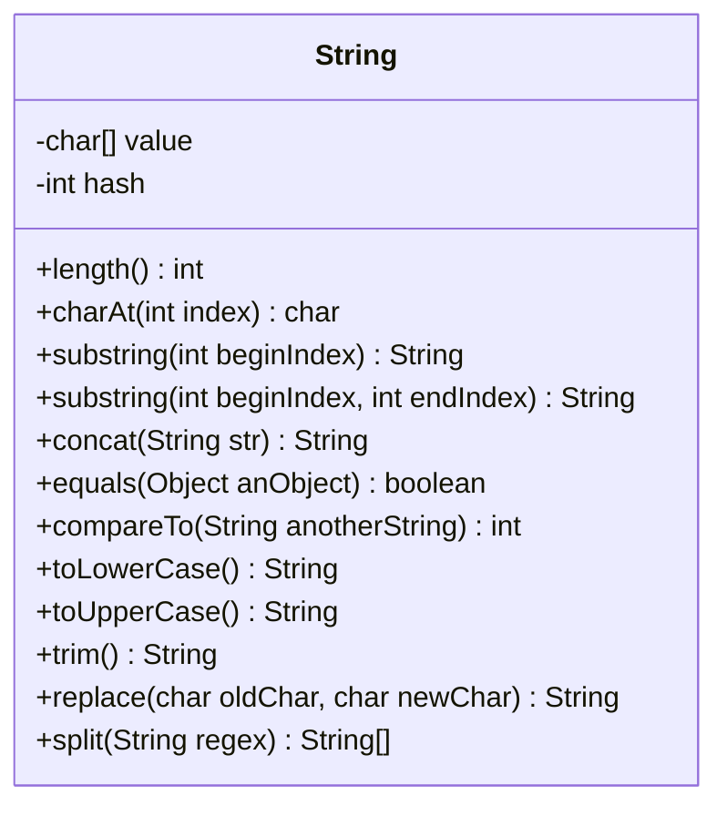

# Java Strings

## Introduction

Strings are one of the most commonly used data types in programming. In Java, a String represents a sequence of characters. Unlike primitive data types like `int` or `char`, String is a reference type, which means it's actually an object of the `String` class.

In this tutorial, you'll learn:
- What Strings are and how they work in Java
- Different ways to create and initialize Strings
- Common String operations and methods
- String immutability and its implications
- Practical examples of String manipulation

## What Are Strings in Java?

A String in Java is a sequence of characters. For example, the text "Hello, World!" is a String containing 13 characters (including spaces and punctuation). Strings are used to store and manipulate text data in Java applications.

In Java, Strings are represented by the `String` class, which is part of the `java.lang` package (automatically imported). This class provides many useful methods for working with textual data.



## Creating Strings

### Using String Literals

The most common way to create a String in Java is using a string literal, which is enclosed in double quotes:

```java
String greeting = "Hello, Java!";
```

### Using the String Constructor

You can also create Strings using the `String` class constructor:

```java
String greeting = new String("Hello, Java!");
```

### Using Character Arrays

Strings can be created from character arrays:

```java
char[] charArray = {'H', 'e', 'l', 'l', 'o'};
String greeting = new String(charArray);
System.out.println(greeting); // Output: Hello
```

### String Concatenation

You can combine Strings using the `+` operator or the `concat()` method:

```java
String firstName = "John";
String lastName = "Doe";

// Using the + operator
String fullName1 = firstName + " " + lastName;
System.out.println(fullName1); // Output: John Doe

// Using the concat() method
String fullName2 = firstName.concat(" ").concat(lastName);
System.out.println(fullName2); // Output: John Doe
```

## String Immutability

One of the most important characteristics of Java Strings is that they are **immutable**. This means that once a String object is created, it cannot be changed. Any operation that appears to modify a String actually creates a new String.

```java
String message = "Hello";
message = message + " World"; // Creates a new String object
System.out.println(message); // Output: Hello World
```

In this example, when we add " World" to "Hello", Java creates a new String containing "Hello World" and assigns it to the `message` variable. The original "Hello" String is not modified.

### Why are Strings Immutable?

1. **Security**: Strings are used in many sensitive operations like network connections, database access, etc.
2. **Thread safety**: Immutable objects are inherently thread-safe.
3. **Hashcode caching**: Since Strings can't change, Java can cache their hash codes for better performance.
4. **String pool optimization**: Java maintains a "string pool" to reuse string literals.

## String Methods

Java's String class comes with many useful methods to manipulate strings:

### Basic String Operations

```java
String text = "Java Programming";

// Getting the length of a string
int length = text.length();
System.out.println("Length: " + length); // Output: Length: 16

// Getting a character at a specific position
char character = text.charAt(0);
System.out.println("First character: " + character); // Output: First character: J

// Converting case
String lowercase = text.toLowerCase();
String uppercase = text.toUpperCase();
System.out.println(lowercase); // Output: java programming
System.out.println(uppercase); // Output: JAVA PROGRAMMING
```

### Searching and Extracting

```java
String sentence = "The quick brown fox jumps over the lazy dog";

// Checking if a string contains a substring
boolean contains = sentence.contains("fox");
System.out.println("Contains 'fox': " + contains); // Output: Contains 'fox': true

// Finding the position of a substring
int position = sentence.indexOf("brown");
System.out.println("Position of 'brown': " + position); // Output: Position of 'brown': 10

// Extracting a substring
String substring = sentence.substring(4, 9);
System.out.println("Substring: " + substring); // Output: Substring: quick
```

### Comparing Strings

```java
String str1 = "Hello";
String str2 = "hello";
String str3 = "Hello";

// Checking equality (case-sensitive)
boolean isEqual1 = str1.equals(str2);
System.out.println("str1 equals str2: " + isEqual1); // Output: str1 equals str2: false

// Checking equality (ignoring case)
boolean isEqual2 = str1.equalsIgnoreCase(str2);
System.out.println("str1 equals str2 (ignore case): " + isEqual2); // Output: str1 equals str2 (ignore case): true

// Comparing string references
boolean isSameReference = (str1 == str3);
System.out.println("str1 == str3: " + isSameReference); // Output may vary
```

### Modifying Strings

```java
String original = "   Java is fun!   ";

// Removing whitespace from both ends
String trimmed = original.trim();
System.out.println("Trimmed: '" + trimmed + "'"); // Output: Trimmed: 'Java is fun!'

// Replacing characters or substrings
String replaced = original.replace("fun", "awesome");
System.out.println(replaced); // Output:    Java is awesome!   

// Splitting a string
String fruits = "apple,banana,orange,grape";
String[] fruitArray = fruits.split(",");
System.out.println("First fruit: " + fruitArray[0]); // Output: First fruit: apple
System.out.println("Second fruit: " + fruitArray[1]); // Output: Second fruit: banana
```

## String vs StringBuilder vs StringBuffer

When you need to perform many string manipulations, using the String class can be inefficient because each operation creates a new String object. Java provides two alternatives:

### StringBuilder

`StringBuilder` is a mutable class that provides an efficient way to concatenate strings:

```java
StringBuilder builder = new StringBuilder();
builder.append("Hello");
builder.append(" ");
builder.append("World");
String result = builder.toString();
System.out.println(result); // Output: Hello World
```

### StringBuffer

`StringBuffer` is similar to `StringBuilder` but is thread-safe (synchronized):

```java
StringBuffer buffer = new StringBuffer();
buffer.append("Hello");
buffer.append(" ");
buffer.append("World");
String result = buffer.toString();
System.out.println(result); // Output: Hello World
```

### When to Use Each?

- Use `String` for simple string values that don't change much.
- Use `StringBuilder` for intensive string manipulations in a single-threaded environment.
- Use `StringBuffer` when multiple threads need to modify a string.

## Practical Examples

### Example 1: Password Validation

```java
public class PasswordValidator {
    public static void main(String[] args) {
        String password = "Secure123!";
        
        boolean isValid = true;
        String message = "";
        
        if (password.length() < 8) {
            isValid = false;
            message = "Password must be at least 8 characters long";
        } else if (!password.matches(".*[A-Z].*")) {
            isValid = false;
            message = "Password must contain at least one uppercase letter";
        } else if (!password.matches(".*[a-z].*")) {
            isValid = false;
            message = "Password must contain at least one lowercase letter";
        } else if (!password.matches(".*\\d.*")) {
            isValid = false;
            message = "Password must contain at least one digit";
        } else if (!password.matches(".*[!@#$%^&*()].*")) {
            isValid = false;
            message = "Password must contain at least one special character";
        }
        
        if (isValid) {
            System.out.println("Password is valid!");
        } else {
            System.out.println("Password is invalid: " + message);
        }
    }
}

// Output: Password is valid!
```

### Example 2: Text Analysis

```java
public class TextAnalyzer {
    public static void main(String[] args) {
        String text = "To be or not to be, that is the question.";
        
        // Convert to lowercase for case-insensitive analysis
        text = text.toLowerCase();
        
        // Count occurrences of a specific word
        String word = "be";
        String[] words = text.split("\\W+"); // Split by non-word characters
        
        int count = 0;
        for (String w : words) {
            if (w.equals(word)) {
                count++;
            }
        }
        
        System.out.println("The word '" + word + "' appears " + count + " times.");
        
        // Count total words
        System.out.println("Total words: " + words.length);
        
        // Get unique words
        java.util.Set<String> uniqueWords = new java.util.HashSet<>();
        for (String w : words) {
            if (!w.isEmpty()) {
                uniqueWords.add(w);
            }
        }
        
        System.out.println("Unique words: " + uniqueWords.size());
        System.out.println("Unique words: " + uniqueWords);
    }
}

/* Output:
The word 'be' appears 2 times.
Total words: 10
Unique words: 8
Unique words: [or, the, that, is, question, to, not, be]
*/
```

## Common String Interview Problems

### Problem 1: Reverse a String

```java
public class ReverseString {
    public static void main(String[] args) {
        String original = "Hello, World!";
        
        // Method 1: Using StringBuilder
        StringBuilder sb = new StringBuilder(original);
        String reversed1 = sb.reverse().toString();
        System.out.println("Reversed (StringBuilder): " + reversed1);
        
        // Method 2: Manual character iteration
        char[] chars = original.toCharArray();
        for (int i = 0; i < chars.length / 2; i++) {
            char temp = chars[i];
            chars[i] = chars[chars.length - 1 - i];
            chars[chars.length - 1 - i] = temp;
        }
        String reversed2 = new String(chars);
        System.out.println("Reversed (Manual): " + reversed2);
    }
}

/* Output:
Reversed (StringBuilder): !dlroW ,olleH
Reversed (Manual): !dlroW ,olleH
*/
```

### Problem 2: Check if a String is a Palindrome

```java
public class PalindromeChecker {
    public static void main(String[] args) {
        checkPalindrome("racecar");
        checkPalindrome("hello");
        checkPalindrome("A man, a plan, a canal: Panama");
    }
    
    public static void checkPalindrome(String input) {
        // Remove non-alphanumeric characters and convert to lowercase
        String cleaned = input.replaceAll("[^a-zA-Z0-9]", "").toLowerCase();
        
        boolean isPalindrome = true;
        int length = cleaned.length();
        
        for (int i = 0; i < length / 2; i++) {
            if (cleaned.charAt(i) != cleaned.charAt(length - 1 - i)) {
                isPalindrome = false;
                break;
            }
        }
        
        System.out.println("'" + input + "' is " + (isPalindrome ? "a palindrome" : "not a palindrome"));
    }
}

/* Output:
'racecar' is a palindrome
'hello' is not a palindrome
'A man, a plan, a canal: Panama' is a palindrome
*/
```

## Summary

In this tutorial, you've learned:

- What Strings are and how they work in Java
- How to create and initialize Strings using different methods
- String immutability and its implications
- Common String operations and methods
- The differences between String, StringBuilder, and StringBuffer
- How to solve practical problems using String manipulation techniques

Java Strings are fundamental to almost all Java programs, from simple text processing to complex applications. Understanding how to work with them efficiently is an essential skill for any Java programmer.

## Exercises

1. Write a program that counts the number of vowels and consonants in a given String.
2. Create a method that checks if two Strings are anagrams of each other.
3. Implement a simple string encryption algorithm (e.g., Caesar cipher).
4. Write a program that finds the longest word in a sentence.
5. Create a method that converts a sentence into "title case" (first letter of each word capitalized).

## Additional Resources

- [Java String Documentation](https://docs.oracle.com/en/java/javase/11/docs/api/java.base/java/lang/String.html)
- [Java Regular Expressions](https://docs.oracle.com/en/java/javase/11/docs/api/java.base/java/util/regex/Pattern.html)
- [Java StringBuilder Documentation](https://docs.oracle.com/en/java/javase/11/docs/api/java.base/java/lang/StringBuilder.html)
- [Java StringBuffer Documentation](https://docs.oracle.com/en/java/javase/11/docs/api/java.base/java/lang/StringBuffer.html)

Happy coding!