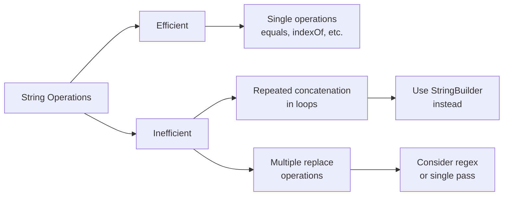

# Java String Methods

Strings are one of the most commonly used data types in programming. In Java, the `String` class provides numerous methods to manipulate text data effectively. This guide will introduce you to the most useful String methods that will help you handle text processing tasks in your Java programs.

## Introduction to String Methods

In Java, a `String` is an object that represents a sequence of characters. The `String` class, part of the `java.lang` package, comes with dozens of built-in methods that allow you to:

- Search within strings
- Extract portions of strings
- Convert strings to different cases
- Compare strings
- Replace content within strings
- And much more!

Since strings are immutable in Java (cannot be modified after creation), these methods don't change the original string but return a new one with the requested changes.

## Basic String Operations

### Creating Strings

Let's start by understanding how to create strings in Java:

```java
// Different ways to create strings
String greeting = "Hello World!";
String emptyString = "";
String fromCharArray = new String(new char[] {'J', 'a', 'v', 'a'});

System.out.println(greeting);      // Output: Hello World!
System.out.println(emptyString);   // Output: (empty line)
System.out.println(fromCharArray); // Output: Java
```

### Getting String Information

These methods help you gather basic information about a string:

```java
String text = "Java Programming";

// Getting string length
int length = text.length();
System.out.println("Length: " + length);  // Output: Length: 16

// Check if string is empty
boolean isEmpty = text.isEmpty();
System.out.println("Is empty: " + isEmpty);  // Output: Is empty: false

// In Java 11 and later, check if string is blank (empty or whitespace)
// boolean isBlank = text.isBlank();  // Would return false
```

## String Searching Methods

Searching within strings is a common operation in text processing.

### Finding Characters and Substrings

```java
String sentence = "Java is a popular programming language";

// indexOf() - find the first occurrence of a character or substring
int indexOfA = sentence.indexOf('a');
System.out.println("First 'a' at index: " + indexOfA);  // Output: First 'a' at index: 1

int indexOfPopular = sentence.indexOf("popular");
System.out.println("'popular' starts at: " + indexOfPopular);  // Output: 'popular' starts at: 10

// lastIndexOf() - find the last occurrence
int lastA = sentence.lastIndexOf('a');
System.out.println("Last 'a' at index: " + lastA);  // Output: Last 'a' at index: 29

// Search from a specific position
int secondA = sentence.indexOf('a', 2);  // Start searching from index 2
System.out.println("Second 'a' at index: " + secondA);  // Output: Second 'a' at index: 3
```

### Checking for Content

```java
String email = "user@example.com";

// contains() - check if string contains a sequence
boolean hasAt = email.contains("@");
System.out.println("Contains @ symbol: " + hasAt);  // Output: Contains @ symbol: true

// startsWith() and endsWith() - check beginning and end
boolean startsWithUser = email.startsWith("user");
System.out.println("Starts with 'user': " + startsWithUser);  // Output: Starts with 'user': true

boolean endsWithCom = email.endsWith(".com");
System.out.println("Ends with '.com': " + endsWithCom);  // Output: Ends with '.com': true
```

## String Extraction Methods

These methods help you extract parts of a string.

### Substring Methods

```java
String message = "Welcome to Java Programming!";

// substring() - extract part of a string
String sub1 = message.substring(11);  // From index 11 to end
System.out.println(sub1);  // Output: Java Programming!

String sub2 = message.substring(11, 15);  // From index 11 to 14 (15-1)
System.out.println(sub2);  // Output: Java
```

### Character Extraction

```java
String word = "Hello";

// charAt() - get character at specific position
char firstChar = word.charAt(0);
System.out.println("First character: " + firstChar);  // Output: First character: H

// Convert to char array
char[] charArray = word.toCharArray();
System.out.println("Third character: " + charArray[2]);  // Output: Third character: l
```

## String Comparison Methods

Comparing strings is a fundamental operation in text processing.

### Equality Checks

```java
String str1 = "Hello";
String str2 = "hello";
String str3 = "Hello";
String str4 = new String("Hello");

// equals() - case-sensitive comparison
boolean exactMatch = str1.equals(str2);
System.out.println("str1 equals str2: " + exactMatch);  // Output: str1 equals str2: false

boolean exactMatch2 = str1.equals(str3);
System.out.println("str1 equals str3: " + exactMatch2);  // Output: str1 equals str3: true

// equalsIgnoreCase() - ignore case when comparing
boolean ignoreCaseMatch = str1.equalsIgnoreCase(str2);
System.out.println("ignoring case, str1 equals str2: " + ignoreCaseMatch);  // Output: ignoring case, str1 equals str2: true

// == compares references, not content!
System.out.println("str1 == str3: " + (str1 == str3));  // Output: str1 == str3: true
System.out.println("str1 == str4: " + (str1 == str4));  // Output: str1 == str4: false
```

### Comparing Order

```java
String apple = "apple";
String banana = "banana";

// compareTo() - lexicographical comparison
int result = apple.compareTo(banana);
System.out.println("apple vs banana: " + result);  // Output: apple vs banana: -1 (negative means apple comes first)

int result2 = banana.compareTo(apple);
System.out.println("banana vs apple: " + result2);  // Output: banana vs apple: 1 (positive means banana comes second)
```

## String Modification Methods

While strings are immutable, these methods return new strings with the requested changes.

### Case Conversion

```java
String mixed = "Hello World";

// Convert to uppercase/lowercase
String upper = mixed.toUpperCase();
System.out.println(upper);  // Output: HELLO WORLD

String lower = mixed.toLowerCase();
System.out.println(lower);  // Output: hello world
```

### Trimming and Removing Whitespace

```java
String padded = "   Hello World   ";

// trim() - remove leading and trailing whitespace
String trimmed = padded.trim();
System.out.println("Trimmed: '" + trimmed + "'");  // Output: Trimmed: 'Hello World'

// In Java 11+, strip() methods are available
// String stripped = padded.strip(); // removes all leading and trailing whitespace
// String stripLeading = padded.stripLeading(); // removes leading whitespace only
// String stripTrailing = padded.stripTrailing(); // removes trailing whitespace only
```

### Replacing Content

```java
String original = "Java is cool. Java is powerful.";

// replace() - replace all occurrences of a char or substring
String replaced = original.replace('a', 'u');
System.out.println(replaced);  // Output: Juvu is cool. Juvu is powerful.

String replacedStr = original.replace("Java", "Python");
System.out.println(replacedStr);  // Output: Python is cool. Python is powerful.

// replaceFirst() - replace only first occurrence
String replacedFirst = original.replaceFirst("Java", "Python");
System.out.println(replacedFirst);  // Output: Python is cool. Java is powerful.

// replaceAll() - replace using regular expressions
String text = "Java123is456cool";
String replacedNums = text.replaceAll("\\d+", " ");  // Replace digits with space
System.out.println(replacedNums);  // Output: Java is cool
```

## String Joining and Splitting

These methods help you combine strings or break them apart.

### Joining Strings

```java
// Concatenation with +
String firstName = "John";
String lastName = "Doe";
String fullName = firstName + " " + lastName;
System.out.println(fullName);  // Output: John Doe

// concat() method
String greeting = "Hello, ".concat(firstName).concat("!");
System.out.println(greeting);  // Output: Hello, John!

// String.join() (Java 8+)
String joined = String.join(", ", "Apple", "Banana", "Cherry");
System.out.println(joined);  // Output: Apple, Banana, Cherry

// Using StringBuilder (more efficient for multiple concatenations)
StringBuilder sb = new StringBuilder();
sb.append("Hello, ");
sb.append(firstName);
sb.append("! Welcome to ");
sb.append("Java Programming");
String message = sb.toString();
System.out.println(message);  // Output: Hello, John! Welcome to Java Programming
```

### Splitting Strings

```java
String csv = "apple,banana,cherry,date";

// split() - divide string into an array
String[] fruits = csv.split(",");
System.out.println("Number of fruits: " + fruits.length);  // Output: Number of fruits: 4
System.out.println("Second fruit: " + fruits[1]);  // Output: Second fruit: banana

// Splitting with limit
String[] limitedFruits = csv.split(",", 3);
System.out.println("Limited split count: " + limitedFruits.length);  // Output: Limited split count: 3
System.out.println("Last element: " + limitedFruits[2]);  // Output: Last element: cherry,date
```

## Real-World String Method Applications

Let's explore some practical examples of using string methods in real applications.

### Email Validation

```java
public static boolean isValidEmail(String email) {
    // Basic validation: contains @ and at least one dot after @
    if (email == null || email.isEmpty()) {
        return false;
    }
    
    int atIndex = email.indexOf('@');
    if (atIndex <= 0) {
        return false;  // @ symbol not found or at beginning
    }
    
    int dotIndex = email.lastIndexOf('.');
    return dotIndex > atIndex;  // Ensures dot appears after @
}

// Example usage
String[] emails = {"user@example.com", "invalid.email", "john.doe@company"};
for (String email : emails) {
    System.out.println(email + " is valid: " + isValidEmail(email));
}

// Output:
// user@example.com is valid: true
// invalid.email is valid: false
// john.doe@company is valid: false
```

### Text Analysis

```java
public static void analyzeText(String text) {
    // Convert to lowercase for case-insensitive counting
    text = text.toLowerCase();
    
    int vowels = 0;
    int consonants = 0;
    int digits = 0;
    int spaces = 0;
    
    for (int i = 0; i < text.length(); i++) {
        char ch = text.charAt(i);
        
        if (ch == 'a' || ch == 'e' || ch == 'i' || ch == 'o' || ch == 'u') {
            vowels++;
        } else if (ch >= 'a' && ch <= 'z') {
            consonants++;
        } else if (ch >= '0' && ch <= '9') {
            digits++;
        } else if (ch == ' ') {
            spaces++;
        }
    }
    
    System.out.println("Text analysis:");
    System.out.println("Vowels: " + vowels);
    System.out.println("Consonants: " + consonants);
    System.out.println("Digits: " + digits);
    System.out.println("Spaces: " + spaces);
    System.out.println("Word count: " + (spaces + 1));  // Approximate word count
}

// Example usage
analyzeText("Java 11 has many new String methods!");

// Output:
// Text analysis:
// Vowels: 10
// Consonants: 15
// Digits: 2
// Spaces: 6
// Word count: 7
```

### URL Parsing

```java
public static void parseURL(String url) {
    // Extract protocol
    int protocolEnd = url.indexOf("://");
    if (protocolEnd == -1) {
        System.out.println("Invalid URL format");
        return;
    }
    
    String protocol = url.substring(0, protocolEnd);
    
    // Extract domain and path
    String rest = url.substring(protocolEnd + 3);
    int pathStart = rest.indexOf('/');
    
    String domain;
    String path;
    
    if (pathStart == -1) {
        domain = rest;
        path = "/";
    } else {
        domain = rest.substring(0, pathStart);
        path = rest.substring(pathStart);
    }
    
    // Extract query parameters
    String query = "";
    int queryStart = path.indexOf('?');
    if (queryStart != -1) {
        query = path.substring(queryStart + 1);
        path = path.substring(0, queryStart);
    }
    
    // Print results
    System.out.println("URL components:");
    System.out.println("Protocol: " + protocol);
    System.out.println("Domain: " + domain);
    System.out.println("Path: " + path);
    System.out.println("Query: " + query);
}

// Example usage
parseURL("https://www.example.com/products?category=books&sort=price");

// Output:
// URL components:
// Protocol: https
// Domain: www.example.com
// Path: /products
// Query: category=books&sort=price
```

## String Methods Performance Considerations



When working with strings, especially in performance-sensitive applications, keep these tips in mind:

1. **String concatenation**: Using `+` in loops is inefficient; use `StringBuilder` instead
2. **Method chaining**: Several string methods chained together create multiple intermediate strings
3. **Regular expressions**: Methods like `replaceAll()` are powerful but may be slower for simple operations
4. **Large strings**: Be cautious when working with very large strings, as they consume significant memory

## Summary

Java String methods provide powerful ways to work with text data. In this guide, we've covered:

- Basic string operations and information retrieval
- Searching within strings
- Extracting substrings and characters
- Comparing strings for equality and order
- Modifying strings (creating new string objects)
- Joining and splitting strings
- Practical real-world applications

Understanding these methods thoroughly will help you write more efficient and cleaner code when handling text data in Java.

## Practice Exercises

1. **Name Formatter**: Write a program that accepts full names (first and last) in different formats and standardizes them to "Last, First" format.

2. **Password Validator**: Create a function that checks if a password is strong by verifying it:
   - Is at least 8 characters long
   - Contains at least one uppercase letter
   - Contains at least one lowercase letter
   - Contains at least one digit
   - Contains at least one special character

3. **Word Counter**: Write a method that counts the number of words in a text, considering that words can be separated by spaces, tabs, or new lines.

4. **CSV Parser**: Create a function that parses CSV data (comma-separated values) into a two-dimensional array, handling cases where values might contain commas themselves (usually enclosed in quotes).

5. **String Reverser**: Implement a function that reverses a string without using the built-in StringBuilder reverse method.

## Additional Resources

- [Java String Documentation](https://docs.oracle.com/en/java/javase/11/docs/api/java.base/java/lang/String.html)
- [Java Regular Expressions Guide](https://docs.oracle.com/javase/tutorial/essential/regex/)
- [Apache Commons Lang](https://commons.apache.org/proper/commons-lang/) - Library with additional string utilities
- [Google Guava Strings](https://github.com/google/guava/wiki/StringsExplained) - Enhanced string operations

Happy coding with Java strings!