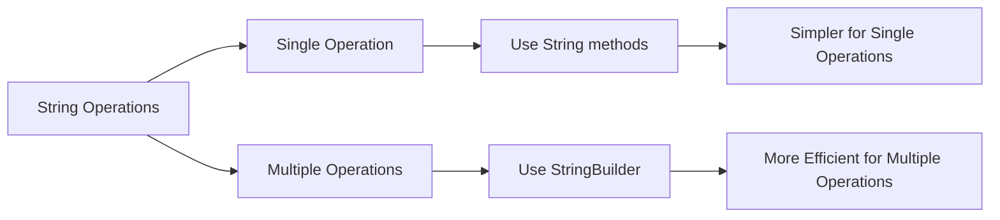

# Java String Manipulation

String manipulation is a fundamental skill for any Java programmer. In this tutorial, you'll learn how to perform various operations on strings such as concatenation, searching, extracting substrings, and modifying string content.

## Introduction to Strings in Java

In Java, strings are objects of the `String` class that represent sequences of characters. Unlike primitive data types, strings are reference types, and they come with many built-in methods that make text manipulation easier.

One important characteristic of Java strings is that they are **immutable**, which means once a String object is created, its content cannot be changed. Any operation that appears to modify a string actually creates a new string object.

## Basic String Operations

### Creating Strings

There are several ways to create strings in Java:

```java
// Using string literal
String greeting = "Hello, World!";

// Using new keyword
String greeting2 = new String("Hello, World!");

// From character array
char[] chars = {'H', 'e', 'l', 'l', 'o'};
String greeting3 = new String(chars);
```

### String Length

To find the length of a string (number of characters):

```java
String text = "Java Programming";
int length = text.length();
System.out.println("Length: " + length); // Output: Length: 16
```

## String Concatenation

Java provides multiple ways to join strings together:

### Using + Operator

```java
String firstName = "John";
String lastName = "Doe";
String fullName = firstName + " " + lastName;
System.out.println(fullName); // Output: John Doe
```

### Using concat() Method

```java
String str1 = "Hello";
String str2 = "World";
String result = str1.concat(" ").concat(str2);
System.out.println(result); // Output: Hello World
```

### Using StringBuilder (More Efficient for Multiple Concatenations)

```java
StringBuilder builder = new StringBuilder();
builder.append("Java ");
builder.append("is ");
builder.append("awesome!");
String message = builder.toString();
System.out.println(message); // Output: Java is awesome!
```

## Searching Within Strings

### Check if a String Contains a Substring

```java
String sentence = "The quick brown fox jumps over the lazy dog";
boolean containsFox = sentence.contains("fox");
System.out.println("Contains 'fox': " + containsFox); // Output: Contains 'fox': true
```

### Finding the Position of a Substring

```java
String sentence = "The quick brown fox jumps over the lazy dog";
int position = sentence.indexOf("brown");
System.out.println("Position of 'brown': " + position); // Output: Position of 'brown': 10

// Find last occurrence
int lastPosition = sentence.lastIndexOf("the");
System.out.println("Last position of 'the': " + lastPosition); // Output: Last position of 'the': 31
```

### Checking Start and End of Strings

```java
String email = "user@example.com";
boolean startsWithUser = email.startsWith("user");
boolean endsWithCom = email.endsWith(".com");

System.out.println("Starts with 'user': " + startsWithUser); // Output: Starts with 'user': true
System.out.println("Ends with '.com': " + endsWithCom);     // Output: Ends with '.com': true
```

## Extracting Substrings

### Using substring() Method

```java
String sentence = "Java programming is fun";

// Extract from start index to end of string
String part1 = sentence.substring(5);
System.out.println("From index 5: " + part1); // Output: From index 5: programming is fun

// Extract from start index to end index (exclusive)
String part2 = sentence.substring(0, 4);
System.out.println("From index 0 to 4: " + part2); // Output: From index 0 to 4: Java
```

## Modifying Strings

Remember, strings in Java are immutable, so these methods return new string objects.

### Replacing Content

```java
String original = "I like apples";

// Replace a single character
String replaced = original.replace('a', 'o');
System.out.println(replaced); // Output: I like opples

// Replace a substring
String replacedSubstring = original.replace("apples", "oranges");
System.out.println(replacedSubstring); // Output: I like oranges

// Replace first match only
String text = "banana banana";
String replacedFirst = text.replaceFirst("banana", "apple");
System.out.println(replacedFirst); // Output: apple banana

// Replace with regular expression
String numberedText = "a1b2c3";
String noNumbers = numberedText.replaceAll("\\d", "");
System.out.println(noNumbers); // Output: abc
```

### Changing Case

```java
String mixed = "Java Programming";
String lowercase = mixed.toLowerCase();
String uppercase = mixed.toUpperCase();

System.out.println("Lowercase: " + lowercase); // Output: Lowercase: java programming
System.out.println("Uppercase: " + uppercase); // Output: Uppercase: JAVA PROGRAMMING
```

### Trimming Whitespace

```java
String withSpaces = "   Hello World!   ";
String trimmed = withSpaces.trim();
System.out.println("Trimmed: '" + trimmed + "'"); // Output: Trimmed: 'Hello World!'

// Java 11+ strip methods (also handles Unicode whitespace)
String stripped = withSpaces.strip();
String stripLeading = withSpaces.stripLeading(); // Removes leading whitespace
String stripTrailing = withSpaces.stripTrailing(); // Removes trailing whitespace
```

## Comparing Strings

### Using equals() and equalsIgnoreCase()

```java
String str1 = "Hello";
String str2 = "hello";

boolean areEqual = str1.equals(str2);
System.out.println("str1 equals str2: " + areEqual); // Output: str1 equals str2: false

boolean equalIgnoreCase = str1.equalsIgnoreCase(str2);
System.out.println("Ignoring case: " + equalIgnoreCase); // Output: Ignoring case: true
```

### Using compareTo()

```java
String apple = "apple";
String banana = "banana";

int result = apple.compareTo(banana);
System.out.println("apple compared to banana: " + result); // Output: negative value

result = banana.compareTo(apple);
System.out.println("banana compared to apple: " + result); // Output: positive value

String apple2 = "apple";
result = apple.compareTo(apple2);
System.out.println("apple compared to apple2: " + result); // Output: 0
```

## Splitting Strings

```java
String csvData = "John,Doe,28,New York";
String[] parts = csvData.split(",");
System.out.println("First name: " + parts[0]); // Output: First name: John
System.out.println("Last name: " + parts[1]);  // Output: Last name: Doe
System.out.println("Age: " + parts[2]);        // Output: Age: 28
System.out.println("City: " + parts[3]);       // Output: City: New York

// Limit the number of splits
String text = "one:two:three:four:five";
String[] limitedParts = text.split(":", 3);
for (String part : limitedParts) {
    System.out.println(part);
}
// Output:
// one
// two
// three:four:five
```

## Joining Strings

Java 8 introduced a new `join()` method:

```java
String[] words = {"Java", "is", "cool"};
String joined = String.join(" ", words);
System.out.println(joined); // Output: Java is cool

// Join with any collection
List<String> fruits = Arrays.asList("apple", "banana", "cherry");
String fruitList = String.join(", ", fruits);
System.out.println(fruitList); // Output: apple, banana, cherry
```

## Real-World Applications

### Example 1: Form Validation

```java
public boolean isValidEmail(String email) {
    // Basic email validation
    return email != null 
           && email.contains("@") 
           && email.contains(".") 
           && email.indexOf("@") < email.lastIndexOf(".")
           && !email.startsWith("@")
           && !email.endsWith(".");
}

// Test the method
String email1 = "user@example.com";
String email2 = "invalid@email";
System.out.println(isValidEmail(email1)); // Output: true
System.out.println(isValidEmail(email2)); // Output: false
```

### Example 2: Processing CSV Data

```java
public static void processCsvLine(String line) {
    String[] values = line.split(",");
    if (values.length >= 3) {
        String name = values[0].trim();
        int age = Integer.parseInt(values[1].trim());
        String city = values[2].trim();
        
        System.out.println("Name: " + name);
        System.out.println("Age: " + age);
        System.out.println("City: " + city);
    }
}

// Test the method
String csvLine = "Alice Smith, 29, Chicago";
processCsvLine(csvLine);
// Output:
// Name: Alice Smith
// Age: 29
// City: Chicago
```

### Example 3: URL Parsing

```java
public static void parseUrl(String url) {
    if (url.startsWith("http://") || url.startsWith("https://")) {
        // Remove protocol
        int protocolEnd = url.indexOf("//") + 2;
        String withoutProtocol = url.substring(protocolEnd);
        
        // Get domain name
        int pathStart = withoutProtocol.indexOf('/');
        String domain = pathStart >= 0 ? 
            withoutProtocol.substring(0, pathStart) : 
            withoutProtocol;
            
        // Get path if exists
        String path = pathStart >= 0 ? 
            withoutProtocol.substring(pathStart) : 
            "";
            
        System.out.println("Domain: " + domain);
        System.out.println("Path: " + path);
    }
}

// Test the method
parseUrl("https://www.example.com/products/index.html");
// Output:
// Domain: www.example.com
// Path: /products/index.html
```

## String Manipulation Efficiency



When performing multiple string manipulations, especially in loops, use `StringBuilder` instead of string concatenation to improve performance:

```java
// Inefficient - creates many String objects
String result = "";
for (int i = 0; i < 10000; i++) {
    result += "number " + i + ", ";
}

// Efficient - uses a single StringBuilder object
StringBuilder builder = new StringBuilder();
for (int i = 0; i < 10000; i++) {
    builder.append("number ").append(i).append(", ");
}
String result = builder.toString();
```

## Summary

In this tutorial, you've learned:

- How to create and manipulate strings in Java
- Various string methods for searching, extracting, and modifying content
- How to compare, split, and join strings
- Real-world applications of string manipulation
- Performance considerations for string operations

String manipulation is a core skill in Java programming that you'll use in almost every application you build. Remember that Java strings are immutable, so operations that modify strings actually create new string objects. For operations that require multiple string modifications, especially in loops, use `StringBuilder` to improve performance.

## Additional Exercises

1. Write a program that counts the occurrences of each character in a string.
2. Create a method that validates a password based on common criteria (length, special characters, uppercase, etc.).
3. Write a program that reverses a string without using StringBuilder's `reverse()` method.
4. Implement a method that checks if a string is a palindrome (reads the same forward and backward).
5. Create a program that extracts all email addresses from a text document.

## Further Resources

- [Java String Documentation](https://docs.oracle.com/javase/8/docs/api/java/lang/String.html)
- [Java StringBuilder Documentation](https://docs.oracle.com/javase/8/docs/api/java/lang/StringBuilder.html)
- [Regular Expressions in Java](https://docs.oracle.com/javase/tutorial/essential/regex/)
- [Java String Methods Cheat Sheet](https://www.w3schools.com/java/java_ref_string.asp)

Happy coding!