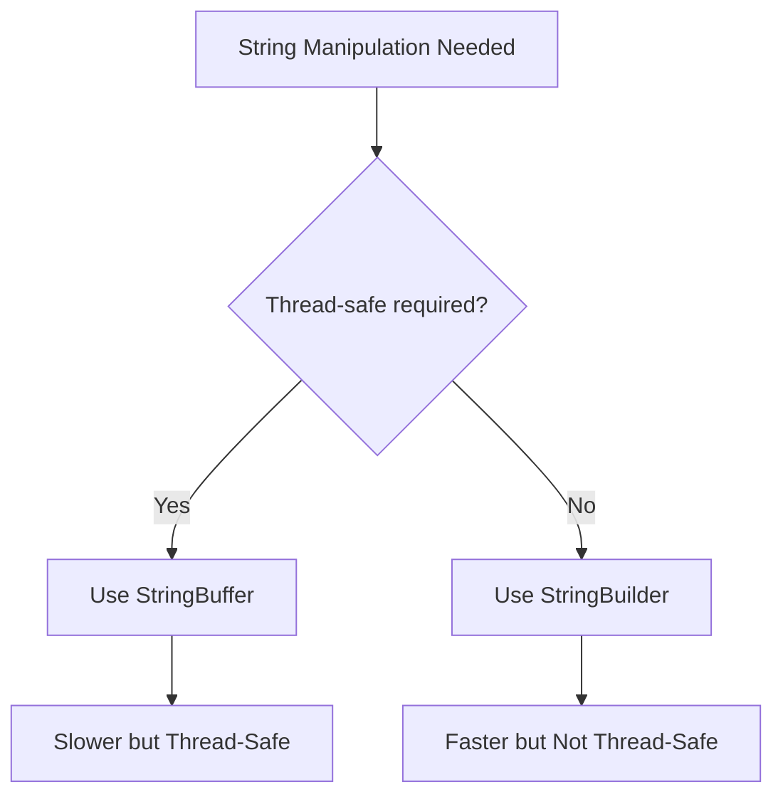

# Java StringBuilder

## Introduction

When working with strings in Java, you'll often need to modify them by adding, removing, or replacing characters. While the `String` class is perfect for storing and accessing string data, it has a significant limitation: **strings in Java are immutable**, meaning once created, they cannot be changed.

This is where `StringBuilder` comes in. It provides a **mutable** sequence of characters, allowing you to modify string content without creating new objects each time. This makes `StringBuilder` much more efficient for operations that involve frequent string modifications.

## Why Use StringBuilder?

To understand why `StringBuilder` is important, let's first look at what happens when you concatenate strings using the regular `String` class:

```java
String greeting = "Hello";
greeting = greeting + " World"; // Creates a new String object
greeting = greeting + "!";      // Creates another new String object
```

In this example, each concatenation creates a new `String` object because the original cannot be modified. This leads to:

1. Increased memory usage
2. Decreased performance due to object creation
3. More work for the garbage collector

With `StringBuilder`, you can modify the same object:

```java
StringBuilder greeting = new StringBuilder("Hello");
greeting.append(" World");  // Modifies the same StringBuilder object
greeting.append("!");       // Modifies the same StringBuilder object
String result = greeting.toString(); // Converts to String when needed

System.out.println(result); // Output: Hello World!
```

## Creating a StringBuilder

There are three ways to create a `StringBuilder`:

```java
// Method 1: Empty StringBuilder with default capacity (16)
StringBuilder sb1 = new StringBuilder();

// Method 2: Empty StringBuilder with specified capacity
StringBuilder sb2 = new StringBuilder(100);

// Method 3: StringBuilder initialized with content
StringBuilder sb3 = new StringBuilder("Hello World");
```

:::tip
Setting an appropriate initial capacity can improve performance if you know approximately how large your final string will be.
:::

## Basic StringBuilder Operations

### Appending Content

The most common operation is adding content to the end of a `StringBuilder`:

```java
StringBuilder sb = new StringBuilder("Hello");
sb.append(" ").append("World").append("!"); // Method chaining
System.out.println(sb); // Output: Hello World!
```

You can append various data types:

```java
StringBuilder sb = new StringBuilder();
sb.append("Score: ");
sb.append(100);
sb.append(", Success rate: ");
sb.append(75.5);
sb.append("%, Completed: ");
sb.append(true);

System.out.println(sb); // Output: Score: 100, Success rate: 75.5%, Completed: true
```

### Inserting Content

You can insert content at any position:

```java
StringBuilder sb = new StringBuilder("Hello World");
sb.insert(5, " Beautiful");
System.out.println(sb); // Output: Hello Beautiful World
```

### Deleting Content

Remove characters from the `StringBuilder`:

```java
StringBuilder sb = new StringBuilder("Hello World!");
sb.delete(5, 12); // Removes from index 5 (inclusive) to 12 (exclusive)
System.out.println(sb); // Output: Hello!
```

Remove a single character:

```java
StringBuilder sb = new StringBuilder("Hello World!");
sb.deleteCharAt(5); // Removes character at index 5 (space)
System.out.println(sb); // Output: HelloWorld!
```

### Replacing Content

Replace a range of characters:

```java
StringBuilder sb = new StringBuilder("Hello World");
sb.replace(6, 11, "Java");
System.out.println(sb); // Output: Hello Java
```

### Reversing Content

Reverse the entire sequence:

```java
StringBuilder sb = new StringBuilder("Hello");
sb.reverse();
System.out.println(sb); // Output: olleH
```

### Getting and Setting Characters

Access or modify individual characters:

```java
StringBuilder sb = new StringBuilder("Hello");
char c = sb.charAt(1); // Gets character at index 1
System.out.println(c); // Output: e

sb.setCharAt(0, 'J'); // Sets character at index 0 to 'J'
System.out.println(sb); // Output: Jello
```

### Getting Length and Capacity

```java
StringBuilder sb = new StringBuilder("Hello");
System.out.println("Length: " + sb.length()); // Output: Length: 5
System.out.println("Capacity: " + sb.capacity()); // Output: Capacity: 21
```

The capacity is the number of characters the `StringBuilder` can hold without reallocating. It's typically larger than the current length.

## StringBuilder vs StringBuffer

`StringBuffer` is an older alternative to `StringBuilder` with one key difference: it's thread-safe (synchronized). This makes it suitable for multi-threaded environments but slower than `StringBuilder`.



## Real-World Examples

### Example 1: Building a CSV Row

```java
public String createCSVRow(String[] data) {
    StringBuilder csvRow = new StringBuilder();
    
    for (int i = 0; i < data.length; i++) {
        csvRow.append(data[i]);
        
        // Add comma if not the last element
        if (i < data.length - 1) {
            csvRow.append(",");
        }
    }
    
    return csvRow.toString();
}

// Using the method
String[] userData = {"John", "Doe", "john@example.com", "123-456-7890"};
String csvRecord = createCSVRow(userData);
System.out.println(csvRecord); // Output: John,Doe,john@example.com,123-456-7890
```

### Example 2: URL Parameter Builder

```java
public String buildUrlWithParams(String baseUrl, Map<String, String> parameters) {
    StringBuilder urlBuilder = new StringBuilder(baseUrl);
    
    // Add ? if parameters exist
    if (!parameters.isEmpty()) {
        urlBuilder.append("?");
    }
    
    // Counter for proper & placement
    int count = 0;
    
    // Add each parameter
    for (Map.Entry<String, String> param : parameters.entrySet()) {
        // Add & for all but first parameter
        if (count > 0) {
            urlBuilder.append("&");
        }
        
        urlBuilder.append(param.getKey())
                 .append("=")
                 .append(param.getValue());
                 
        count++;
    }
    
    return urlBuilder.toString();
}

// Using the method
Map<String, String> params = new HashMap<>();
params.put("page", "1");
params.put("size", "10");
params.put("sort", "name");

String url = buildUrlWithParams("https://api.example.com/users", params);
System.out.println(url);
// Output: https://api.example.com/users?page=1&size=10&sort=name
```

### Example 3: Formatting Table Output

```java
public String formatAsTable(String[] headers, String[][] data) {
    StringBuilder table = new StringBuilder();
    
    // Add headers
    for (String header : headers) {
        table.append(String.format("%-15s", header));
    }
    table.append("\n");
    
    // Add separator line
    for (int i = 0; i < headers.length; i++) {
        table.append("--------------");
    }
    table.append("\n");
    
    // Add data rows
    for (String[] row : data) {
        for (String cell : row) {
            table.append(String.format("%-15s", cell));
        }
        table.append("\n");
    }
    
    return table.toString();
}

// Using the method
String[] headers = {"Name", "Age", "City"};
String[][] data = {
    {"John", "25", "New York"},
    {"Anna", "30", "Paris"},
    {"Luis", "22", "Madrid"}
};

String formattedTable = formatAsTable(headers, data);
System.out.println(formattedTable);
/*
Output:
Name           Age            City           
--------------------------------------------
John           25             New York       
Anna           30             Paris          
Luis           22             Madrid         
*/
```

## Performance Comparison: String vs StringBuilder

Let's look at a simple benchmark that compares string concatenation with `String` versus `StringBuilder`:

```java
// Using String concatenation
long startTime = System.currentTimeMillis();
String result = "";
for (int i = 0; i < 100000; i++) {
    result += "a";
}
long endTime = System.currentTimeMillis();
System.out.println("String concatenation time: " + (endTime - startTime) + "ms");

// Using StringBuilder
startTime = System.currentTimeMillis();
StringBuilder sb = new StringBuilder();
for (int i = 0; i < 100000; i++) {
    sb.append("a");
}
result = sb.toString();
endTime = System.currentTimeMillis();
System.out.println("StringBuilder time: " + (endTime - startTime) + "ms");

// Output (example):
// String concatenation time: 8574ms
// StringBuilder time: 3ms
```

The difference is dramatic! String concatenation in a loop can be thousands of times slower than using `StringBuilder`.

## When to Use StringBuilder

Use `StringBuilder` when:
- You need to modify strings frequently
- You're building strings in loops
- You're concatenating many strings together
- Performance is a concern

Use regular `String` when:
- You need immutability
- You're doing simple one-time string concatenation
- Thread safety is required (or use `StringBuffer`)

## Summary

`StringBuilder` is a powerful tool for efficient string manipulation in Java:

- It provides a mutable sequence of characters
- It's much more efficient than `String` concatenation
- It offers methods for appending, inserting, deleting, and replacing text
- It's perfect for building complex strings in loops
- It trades immutability for performance

By understanding when and how to use `StringBuilder`, you'll write more efficient Java code that's especially important when working with larger strings or in performance-sensitive applications.

## Practice Exercises

1. Write a program that takes a sentence and reverses each word but keeps the words in the same order using `StringBuilder`.
2. Create a utility method that builds an HTML table from a 2D array of data using `StringBuilder`.
3. Implement a method that formats a phone number in different international formats using `StringBuilder`.
4. Write a program that reads a text file and counts word frequencies, using `StringBuilder` to normalize words.
5. Create a simple benchmark comparing the performance of `String` vs. `StringBuilder` vs. `StringBuffer` for different string manipulation tasks.

## Additional Resources

- [Java Documentation: StringBuilder](https://docs.oracle.com/javase/8/docs/api/java/lang/StringBuilder.html)
- [Java Documentation: StringBuffer](https://docs.oracle.com/javase/8/docs/api/java/lang/StringBuffer.html)
- [Oracle's Java Tutorials: Strings](https://docs.oracle.com/javase/tutorial/java/data/strings.html)