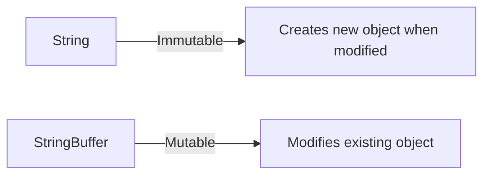
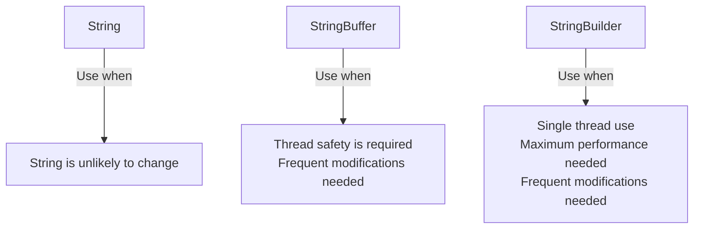

# Java StringBuffer

## Introduction

In Java, `String` objects are immutable, meaning once they are created, they cannot be changed. This immutability comes with advantages like security and thread safety, but it can lead to performance issues when you need to modify strings frequently. Every time you concatenate or modify a `String`, a new object is created in memory.

This is where `StringBuffer` comes in. `StringBuffer` provides a mutable (modifiable) sequence of characters. Unlike `String`, when you modify a `StringBuffer`, it doesn't create a new object but modifies the existing one, making it much more efficient for string manipulations.



## Why Use StringBuffer?

- **Memory Efficiency**: Modifies strings without creating new objects
- **Thread Safety**: All methods are synchronized, making it safe for multi-threaded applications
- **Performance**: Better than `String` for concatenations in loops
- **Dynamic Content**: Good for strings that change frequently

## Creating a StringBuffer

There are three constructors for StringBuffer:

```java
// Default constructor - creates empty buffer with capacity of 16
StringBuffer sb1 = new StringBuffer();

// Constructor with initial capacity
StringBuffer sb2 = new StringBuffer(50);

// Constructor with initial string
StringBuffer sb3 = new StringBuffer("Hello");
```

The default constructor creates an empty buffer with a capacity of 16 characters. You can specify a different initial capacity, or initialize with a string.

## Common StringBuffer Methods

### Appending Content

The `append()` method is probably the most commonly used method in StringBuffer. It adds the string representation of various data types at the end.

```java
StringBuffer sb = new StringBuffer("Hello");
sb.append(" World");
System.out.println(sb); // Output: Hello World

// You can chain append calls
sb.append("!").append(" Welcome").append(" to Java");
System.out.println(sb); // Output: Hello World! Welcome to Java

// Append different data types
sb = new StringBuffer("Number: ");
sb.append(42).append(", Boolean: ").append(true);
System.out.println(sb); // Output: Number: 42, Boolean: true
```

### Inserting Content

The `insert()` method lets you insert content at a specified position:

```java
StringBuffer sb = new StringBuffer("Hello World");
sb.insert(5, " Beautiful");
System.out.println(sb); // Output: Hello Beautiful World

// Insert different data types
sb.insert(0, 123);
System.out.println(sb); // Output: 123Hello Beautiful World
```

### Replacing Content

The `replace()` method replaces characters in a substring:

```java
StringBuffer sb = new StringBuffer("Hello World");
sb.replace(6, 11, "Java");
System.out.println(sb); // Output: Hello Java
```

### Deleting Content

Use `delete()` or `deleteCharAt()` to remove characters:

```java
StringBuffer sb = new StringBuffer("Hello World");
sb.delete(5, 11); // Delete from index 5 to 10
System.out.println(sb); // Output: Hello

sb = new StringBuffer("Hello World");
sb.deleteCharAt(5); // Delete the character at index 5 (space)
System.out.println(sb); // Output: HelloWorld
```

### Reversing a StringBuffer

The `reverse()` method reverses the characters in the buffer:

```java
StringBuffer sb = new StringBuffer("Hello");
sb.reverse();
System.out.println(sb); // Output: olleH
```

### Other Useful Methods

```java
StringBuffer sb = new StringBuffer("Hello World");

// Get the length
System.out.println("Length: " + sb.length()); // Output: Length: 11

// Get the capacity
System.out.println("Capacity: " + sb.capacity()); // Output: Capacity: 27 (16+11)

// Set the length (truncates if smaller)
sb.setLength(5);
System.out.println(sb); // Output: Hello

// Get character at index
System.out.println(sb.charAt(1)); // Output: e

// Get substring
sb = new StringBuffer("Hello World");
System.out.println(sb.substring(6)); // Output: World
System.out.println(sb.substring(0, 5)); // Output: Hello
```

## StringBuffer vs. StringBuilder vs. String

Understanding when to use each class is important for efficient Java programming:



| Class | Mutability | Thread Safety | Performance |
|-------|------------|--------------|------------|
| String | Immutable | Thread-safe | Slow for concatenations |
| StringBuffer | Mutable | Thread-safe | Better than String for modifications |
| StringBuilder | Mutable | Not thread-safe | Faster than StringBuffer |

## Real-World Examples

### Example 1: Building a Dynamic SQL Query

```java
public String buildQuery(String[] columns, String table, String condition) {
    StringBuffer query = new StringBuffer();
    query.append("SELECT ");
    
    // Append columns
    for (int i = 0; i < columns.length; i++) {
        query.append(columns[i]);
        if (i < columns.length - 1) {
            query.append(", ");
        }
    }
    
    query.append(" FROM ").append(table);
    
    if (condition != null && !condition.isEmpty()) {
        query.append(" WHERE ").append(condition);
    }
    
    return query.toString();
}

// Usage example
String[] columns = {"id", "name", "email"};
String query = buildQuery(columns, "users", "age > 18");
System.out.println(query);
// Output: SELECT id, name, email FROM users WHERE age > 18
```

### Example 2: Creating a CSV Builder

```java
public class CSVBuilder {
    private StringBuffer buffer;
    private final String delimiter;
    
    public CSVBuilder() {
        this(",");
    }
    
    public CSVBuilder(String delimiter) {
        this.delimiter = delimiter;
        this.buffer = new StringBuffer();
    }
    
    public void addRow(String[] values) {
        if (buffer.length() > 0) {
            buffer.append("\n");
        }
        
        for (int i = 0; i < values.length; i++) {
            buffer.append(values[i]);
            if (i < values.length - 1) {
                buffer.append(delimiter);
            }
        }
    }
    
    public String getCSV() {
        return buffer.toString();
    }
    
    public void clear() {
        buffer = new StringBuffer();
    }
}

// Usage example
CSVBuilder builder = new CSVBuilder();
builder.addRow(new String[]{"Name", "Age", "City"});
builder.addRow(new String[]{"John", "25", "New York"});
builder.addRow(new String[]{"Sarah", "30", "Boston"});
System.out.println(builder.getCSV());
/* Output:
Name,Age,City
John,25,New York
Sarah,30,Boston
*/
```

## Performance Considerations

When dealing with string manipulations, it's essential to consider performance:

```java
// BAD: Uses String concatenation in a loop
String result = "";
for (int i = 0; i < 10000; i++) {
    result += "Number " + i + " ";
}

// GOOD: Uses StringBuffer in a loop
StringBuffer sb = new StringBuffer();
for (int i = 0; i < 10000; i++) {
    sb.append("Number ").append(i).append(" ");
}
String result = sb.toString();
```

The first example creates thousands of intermediate String objects, while the second example modifies the same StringBuffer, resulting in better performance and less memory usage.

## Summary

`StringBuffer` is a powerful class for working with mutable strings in Java, especially in multi-threaded environments. It provides better performance than `String` for frequent modifications and is thread-safe unlike `StringBuilder`.

Key points to remember:
- Use `StringBuffer` when you need a thread-safe mutable string
- The `append()` method is the most commonly used and can be chained
- `StringBuffer` is more efficient than `String` for concatenations in loops
- If thread safety isn't required, consider using `StringBuilder` for better performance

## Practice Exercises

1. Create a StringBuffer program that takes a sentence and reverses each word while keeping the order of words.
2. Write a method that uses StringBuffer to check if a string is a palindrome.
3. Implement a simple text formatter that takes a long string and wraps it to a specified line length using StringBuffer.
4. Create a method that uses StringBuffer to replace all occurrences of a word in a sentence.
5. Implement a simple template engine that replaces placeholders like `{name}` with actual values using StringBuffer.

## Additional Resources

- [Oracle's StringBuffer Documentation](https://docs.oracle.com/en/java/javase/17/docs/api/java.base/java/lang/StringBuffer.html)
- [Java StringBuffer vs StringBuilder](https://docs.oracle.com/javase/tutorial/java/data/buffers.html)
- [More String Handling in Java](https://www.baeldung.com/java-string-processing)

By understanding and using StringBuffer appropriately, you can significantly improve the performance of your Java applications when dealing with strings that require frequent modifications.