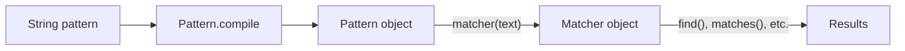

import Tabs from '@theme/Tabs';
import TabItem from '@theme/TabItem';

# Java Regular Expressions

## Introduction

Regular expressions (regex or regexp) are powerful tools for working with text patterns. In Java, they provide a way to search, extract, replace, and validate strings based on pattern matching. Whether you want to validate email addresses, extract specific information from text, or replace certain patterns in a string, regular expressions offer an elegant solution.

This guide will introduce you to Java's regular expression capabilities, starting with basic concepts and moving on to more advanced techniques, all with practical examples.

## Understanding Regular Expressions

Regular expressions are special sequences of characters that define a search pattern. Java implements regular expressions through the `java.util.regex` package, which primarily consists of three classes:

1. `Pattern`: Represents a compiled regex pattern
2. `Matcher`: Performs match operations on a character sequence
3. `PatternSyntaxException`: Indicates syntax error in a regular expression pattern



## Basic Pattern Matching

Let's start with a simple example to understand how regex works in Java:

```java
import java.util.regex.Matcher;
import java.util.regex.Pattern;

public class RegexBasics {
    public static void main(String[] args) {
        // The pattern we're looking for
        String regex = "Java";
        
        // The text to search in
        String text = "I love Java programming. Java is fun!";
        
        // Compile the regex into a Pattern object
        Pattern pattern = Pattern.compile(regex);
        
        // Create a Matcher for the input text
        Matcher matcher = pattern.matcher(text);
        
        // Find and print all matches
        System.out.println("Matches found for '" + regex + "':");
        int count = 0;
        
        while (matcher.find()) {
            count++;
            System.out.println("Match " + count + ": " + matcher.group() + 
                               " at positions " + matcher.start() + "-" + (matcher.end() - 1));
        }
    }
}
```

Output:
```
Matches found for 'Java':
Match 1: Java at positions 7-10
Match 2: Java at positions 25-28
```

In this example:
- We defined a simple pattern: the word "Java"
- The `Pattern.compile()` method created a pattern object
- The `matcher()` method created a matcher for our text
- The `find()` method found each occurrence of our pattern
- `group()`, `start()`, and `end()` methods gave us information about each match

## Regular Expression Syntax

Java's regex syntax includes various characters with special meanings:

| Character | Description |
|-----------|-------------|
| `.` | Matches any single character |
| `^` | Matches beginning of line |
| `$` | Matches end of line |
| `\d` | Matches a digit |
| `\D` | Matches a non-digit |
| `\s` | Matches a whitespace character |
| `\S` | Matches a non-whitespace character |
| `\w` | Matches a word character (alphanumeric + underscore) |
| `\W` | Matches a non-word character |

### Quantifiers

Quantifiers specify how many instances of the previous element should be matched:

| Quantifier | Description |
|------------|-------------|
| `*` | Zero or more times |
| `+` | One or more times |
| `?` | Zero or one time |
| `{n}` | Exactly n times |
| `{n,}` | At least n times |
| `{n,m}` | Between n and m times |

Let's see quantifiers in action:

```java
import java.util.regex.Matcher;
import java.util.regex.Pattern;

public class RegexQuantifiers {
    public static void main(String[] args) {
        // Test data
        String text = "1 12 123 1234 12345";
        
        // Find numbers with 3 or more digits
        String regex = "\\d{3,}";
        
        Pattern pattern = Pattern.compile(regex);
        Matcher matcher = pattern.matcher(text);
        
        System.out.println("Numbers with 3 or more digits:");
        while (matcher.find()) {
            System.out.println(matcher.group());
        }
    }
}
```

Output:
```
Numbers with 3 or more digits:
123
1234
12345
```

## Character Classes and Groups

Character classes let you match a single character against multiple possible characters:

- `[abc]`: Matches either 'a', 'b', or 'c'
- `[^abc]`: Matches any character except 'a', 'b', or 'c'
- `[a-z]`: Matches any lowercase letter
- `[A-Z]`: Matches any uppercase letter
- `[0-9]`: Matches any digit

Groups allow you to treat multiple characters as a single unit:

- `(pattern)`: Creates a capturing group
- `(?:pattern)`: Creates a non-capturing group

Example using character classes and groups:

```java
import java.util.regex.Matcher;
import java.util.regex.Pattern;

public class RegexClassesAndGroups {
    public static void main(String[] args) {
        String text = "JDK8 was released in March 2014, JDK11 in September 2018, and JDK17 in September 2021.";
        
        // Pattern to match JDK version numbers (e.g., JDK8, JDK11, JDK17)
        String regex = "(JDK)(\\d+)";
        
        Pattern pattern = Pattern.compile(regex);
        Matcher matcher = pattern.matcher(text);
        
        System.out.println("Java version information:");
        while (matcher.find()) {
            System.out.println("Full match: " + matcher.group());
            System.out.println("  Prefix: " + matcher.group(1));
            System.out.println("  Version: " + matcher.group(2));
        }
    }
}
```

Output:
```
Java version information:
Full match: JDK8
  Prefix: JDK
  Version: 8
Full match: JDK11
  Prefix: JDK
  Version: 11
Full match: JDK17
  Prefix: JDK
  Version: 17
```

## Common Use Cases for Regular Expressions

### Email Validation

One of the most common uses of regular expressions is validating email addresses:

```java
import java.util.Scanner;
import java.util.regex.Pattern;

public class EmailValidator {
    public static void main(String[] args) {
        // Basic email regex pattern
        String emailRegex = "^[a-zA-Z0-9._%+-]+@[a-zA-Z0-9.-]+\\.[a-zA-Z]{2,}$";
        Pattern pattern = Pattern.compile(emailRegex);
        
        Scanner scanner = new Scanner(System.in);
        System.out.print("Enter an email address: ");
        String email = scanner.nextLine();
        
        if (pattern.matcher(email).matches()) {
            System.out.println("Valid email address.");
        } else {
            System.out.println("Invalid email address.");
        }
        scanner.close();
    }
}
```

Sample Inputs/Outputs:
```
Enter an email address: user@example.com
Valid email address.

Enter an email address: invalid-email
Invalid email address.
```

### String Replacement

Regular expressions are excellent for replacing text patterns:

```java
public class RegexReplacement {
    public static void main(String[] args) {
        String code = "System.out.println(\"Hello\"); // Print greeting\n" +
                      "int x = 5; // Initialize x\n" +
                      "// This is a comment line\n" +
                      "String name = \"John\"; // Set name";
        
        // Replace all comments with empty strings
        String cleanCode = code.replaceAll("//.*", "");
        
        System.out.println("Original code:");
        System.out.println(code);
        System.out.println("\nCode without comments:");
        System.out.println(cleanCode);
    }
}
```

Output:
```
Original code:
System.out.println("Hello"); // Print greeting
int x = 5; // Initialize x
// This is a comment line
String name = "John"; // Set name

Code without comments:
System.out.println("Hello"); 
int x = 5; 

String name = "John"; 
```

### Text Extraction

Regular expressions can extract specific information from text:

```java
import java.util.regex.Matcher;
import java.util.regex.Pattern;

public class InfoExtractor {
    public static void main(String[] args) {
        String text = "John Doe's phone number is 555-123-4567, and his email is john.doe@example.com";
        
        // Extract phone number
        Pattern phonePattern = Pattern.compile("(\\d{3})-(\\d{3})-(\\d{4})");
        Matcher phoneMatcher = phonePattern.matcher(text);
        
        if (phoneMatcher.find()) {
            System.out.println("Phone: (" + phoneMatcher.group(1) + ") " + 
                               phoneMatcher.group(2) + "-" + phoneMatcher.group(3));
        }
        
        // Extract email
        Pattern emailPattern = Pattern.compile("[a-zA-Z0-9._%+-]+@[a-zA-Z0-9.-]+\\.[a-zA-Z]{2,}");
        Matcher emailMatcher = emailPattern.matcher(text);
        
        if (emailMatcher.find()) {
            System.out.println("Email: " + emailMatcher.group());
        }
    }
}
```

Output:
```
Phone: (555) 123-4567
Email: john.doe@example.com
```

## Advanced Regex Features

### Lookahead and Lookbehind

These are zero-width assertions that don't consume characters:

- **Positive lookahead** `(?=...)`: Matches if `...` matches next, but doesn't consume
- **Negative lookahead** `(?!...)`: Matches if `...` doesn't match next
- **Positive lookbehind** `(?<=...)`: Matches if `...` matches before, but doesn't consume
- **Negative lookbehind** `(?<!...)`: Matches if `...` doesn't match before

Example of password validation with lookahead:

```java
import java.util.Scanner;

public class PasswordValidator {
    public static void main(String[] args) {
        Scanner scanner = new Scanner(System.in);
        System.out.print("Enter a password: ");
        String password = scanner.nextLine();
        
        // Password must:
        // - Be at least 8 characters long
        // - Contain at least one digit
        // - Contain at least one lowercase letter
        // - Contain at least one uppercase letter
        // - Contain at least one special character
        String regex = "^(?=.*[0-9])(?=.*[a-z])(?=.*[A-Z])(?=.*[@#$%^&+=])(?=\\S+$).{8,}$";
        
        if (password.matches(regex)) {
            System.out.println("Strong password!");
        } else {
            System.out.println("Weak password. Password must be at least 8 characters long and contain " +
                              "digits, lowercase letters, uppercase letters, and special characters.");
        }
        scanner.close();
    }
}
```

Sample Inputs/Outputs:
```
Enter a password: Passw0rd
Weak password. Password must be at least 8 characters long and contain digits, lowercase letters, uppercase letters, and special characters.

Enter a password: Str0ng@Password
Strong password!
```

### Boundary Matchers

Boundary matchers help define where patterns should occur:

- `^`: Start of line
- `$`: End of line
- `\b`: Word boundary
- `\B`: Non-word boundary

Example using word boundaries:

```java
import java.util.regex.Matcher;
import java.util.regex.Pattern;

public class WordBoundaryExample {
    public static void main(String[] args) {
        String text = "The cat scattered the cats across the cathedral.";
        
        // Find the word "cat" as a complete word, not as part of other words
        Pattern pattern = Pattern.compile("\\bcat\\b");
        Matcher matcher = pattern.matcher(text);
        
        System.out.println("Occurrences of 'cat' as a complete word:");
        while (matcher.find()) {
            System.out.println("Found at position " + matcher.start());
        }
    }
}
```

Output:
```
Occurrences of 'cat' as a complete word:
Found at position 4
```

## Performance Considerations

When using regular expressions, keep these performance tips in mind:

1. **Compile once, use many times**: If you're using the same pattern repeatedly, compile it once and reuse the Pattern object.
2. **Avoid excessive backtracking**: Complex patterns with many quantifiers can cause performance issues.
3. **Use non-capturing groups** `(?:pattern)` when you don't need the matched content.
4. **Be specific**: The more specific your pattern, the faster it will execute.

Example of efficient regex usage:

<Tabs>
  <TabItem value="inefficient" label="Inefficient Way">

```java
public boolean validateEmails(List<String> emails) {
    for (String email : emails) {
        // Creates a new Pattern object for each email
        if (!email.matches("[a-zA-Z0-9._%+-]+@[a-zA-Z0-9.-]+\\.[a-zA-Z]{2,}")) {
            return false;
        }
    }
    return true;
}
```

  </TabItem>
  <TabItem value="efficient" label="Efficient Way">

```java
public boolean validateEmails(List<String> emails) {
    // Compile once
    Pattern emailPattern = Pattern.compile("[a-zA-Z0-9._%+-]+@[a-zA-Z0-9.-]+\\.[a-zA-Z]{2,}");
    
    for (String email : emails) {
        // Reuse the same pattern
        if (!emailPattern.matcher(email).matches()) {
            return false;
        }
    }
    return true;
}
```

  </TabItem>
</Tabs>

## Summary

Regular expressions in Java provide a powerful mechanism for:

- Validating text patterns (like emails, phone numbers, passwords)
- Extracting information from text
- Replacing or modifying specific text patterns
- Parsing and analyzing strings

We've covered the basics of regex syntax, including character classes, quantifiers, groups, and boundary matchers, along with practical examples for common use cases. Remember that regular expressions are a skill that improves with practice, so don't hesitate to experiment with different patterns.

## Additional Resources

1. [Java Pattern class documentation](https://docs.oracle.com/en/java/javase/17/docs/api/java.base/java/util/regex/Pattern.html)
2. [Regular Expressions - Oracle Tutorial](https://docs.oracle.com/javase/tutorial/essential/regex/)
3. [Regex101](https://regex101.com/) - An online tool for testing regular expressions
4. [RegExr](https://regexr.com/) - Another great interactive regex testing tool

## Practice Exercises

1. Write a regex to validate a simple URL (must start with http:// or https://)
2. Create a pattern to extract all hashtags from a tweet
3. Write a program to check if a string contains only alphanumeric characters
4. Create a function that replaces all dates in MM/DD/YYYY format with YYYY-MM-DD format
5. Write a regex to validate a 24-hour time format (HH:MM)

Happy regex matching!