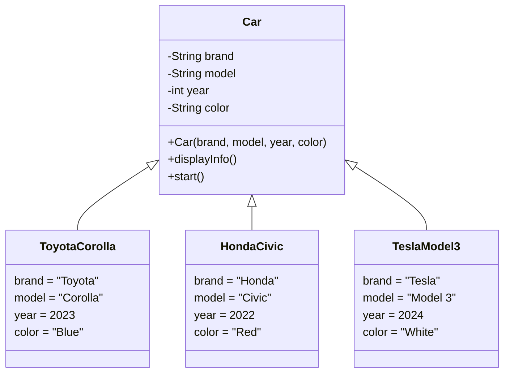

# Java Classes and Objects

## Introduction

In Java, classes and objects are the core building blocks of Object-Oriented Programming (OOP). If you're new to Java or programming in general, understanding these concepts is essential for writing effective and organized code.

A **class** is a blueprint or template that defines the characteristics and behaviors that objects of its type will have. An **object** is an instance of a class - a concrete entity created from that blueprint with its own state and behavior.

Think of a class as a cookie cutter and objects as the cookies made from that cutter. The cookie cutter defines the shape, but each cookie can have different decorations or flavors.

## Understanding Classes in Java

### What is a Class?

A class in Java contains:
- **Fields** (also called attributes or instance variables) - to store data
- **Methods** - to define behavior
- **Constructors** - special methods that initialize objects
- **Blocks** - code that runs when class loads or object is created

### Class Syntax

Here's the basic syntax for defining a class in Java:

```java
public class ClassName {
    // Fields (attributes)
    dataType fieldName1;
    dataType fieldName2;
    
    // Constructor
    public ClassName() {
        // Initialization code
    }
    
    // Methods
    returnType methodName1(parameterList) {
        // Method body
    }
    
    returnType methodName2(parameterList) {
        // Method body
    }
}
```

### Creating Your First Class

Let's create a simple `Car` class:

```java
public class Car {
    // Fields
    String brand;
    String model;
    int year;
    String color;
    
    // Constructor
    public Car(String brand, String model, int year, String color) {
        this.brand = brand;
        this.model = model;
        this.year = year;
        this.color = color;
    }
    
    // Method to display car info
    public void displayInfo() {
        System.out.println("Car: " + year + " " + brand + " " + model);
        System.out.println("Color: " + color);
    }
    
    // Method to start the car
    public void start() {
        System.out.println("The " + brand + " " + model + " is starting...");
    }
}
```

## Understanding Objects in Java

### What is an Object?

An object is an instance of a class that has:
- **State** - represented by the values of its fields
- **Behavior** - provided by its methods
- **Identity** - a unique identifier in memory

### Creating Objects (Instantiation)

To create an object in Java, we use the `new` keyword followed by a constructor call:

```java
ClassName objectName = new ClassName();
```

For our `Car` class example:

```java
Car myCar = new Car("Toyota", "Corolla", 2022, "Blue");
```

### Accessing Object Members

Once you've created an object, you can access its fields and methods using the dot (.) operator:

```java
objectName.fieldName  // Accessing a field
objectName.methodName()  // Invoking a method
```

Example with our `Car` class:

```java
// Accessing fields
System.out.println(myCar.brand);  // Output: Toyota

// Calling methods
myCar.displayInfo();
myCar.start();
```

Output:
```
Toyota
Car: 2022 Toyota Corolla
Color: Blue
The Toyota Corolla is starting...
```

## Complete Example with Multiple Objects

Let's see a complete program that creates and uses multiple car objects:

```java
public class CarDemo {
    public static void main(String[] args) {
        // Create two different Car objects
        Car car1 = new Car("Toyota", "Corolla", 2022, "Blue");
        Car car2 = new Car("Honda", "Civic", 2020, "Red");
        
        // Use the first car object
        System.out.println("First car:");
        car1.displayInfo();
        car1.start();
        
        System.out.println("\nSecond car:");
        car2.displayInfo();
        car2.start();
    }
}
```

Output:
```
First car:
Car: 2022 Toyota Corolla
Color: Blue
The Toyota Corolla is starting...

Second car:
Car: 2020 Honda Civic
Color: Red
The Honda Civic is starting...
```

## Class vs Object: Understanding the Relationship

The relationship between classes and objects is fundamental to OOP. Here's a visual representation:



## Multiple Constructors and the 'this' Keyword

A class can have multiple constructors with different parameter lists, known as constructor overloading:

```java
public class Car {
    String brand;
    String model;
    int year;
    String color;
    
    // Constructor with all fields
    public Car(String brand, String model, int year, String color) {
        this.brand = brand;
        this.model = model;
        this.year = year;
        this.color = color;
    }
    
    // Constructor with just brand and model
    public Car(String brand, String model) {
        this(brand, model, 2023, "Unknown");  // Calls the first constructor
    }
    
    // Constructor with no parameters
    public Car() {
        this("Unknown", "Unknown");  // Calls the second constructor
    }
    
    // Methods as before...
}
```

In the example above, `this` is used in two ways:
1. `this.fieldName` - refers to the current object's field
2. `this(parameters)` - calls another constructor in the same class

## Real-World Application: Student Management System

Let's create a more practical example - a simple student management system:

```java
public class Student {
    // Instance variables
    private int id;
    private String name;
    private String email;
    private double[] grades;
    
    // Constructor
    public Student(int id, String name, String email) {
        this.id = id;
        this.name = name;
        this.email = email;
        this.grades = new double[5]; // Space for 5 grades
    }
    
    // Method to add a grade at a specific position (0-4)
    public void addGrade(int position, double grade) {
        if (position >= 0 && position < grades.length) {
            grades[position] = grade;
        } else {
            System.out.println("Invalid position for grade!");
        }
    }
    
    // Method to calculate average grade
    public double calculateAverage() {
        double sum = 0;
        int count = 0;
        
        for (double grade : grades) {
            if (grade > 0) {  // Only count grades that were added
                sum += grade;
                count++;
            }
        }
        
        return count > 0 ? sum / count : 0;
    }
    
    // Method to display student information
    public void displayInfo() {
        System.out.println("Student ID: " + id);
        System.out.println("Name: " + name);
        System.out.println("Email: " + email);
        System.out.println("Average Grade: " + calculateAverage());
    }
}
```

Now, let's use this Student class in our main program:

```java
public class SchoolManagement {
    public static void main(String[] args) {
        // Create student objects
        Student student1 = new Student(1001, "John Smith", "john@example.com");
        Student student2 = new Student(1002, "Maria Garcia", "maria@example.com");
        
        // Add grades for student1
        student1.addGrade(0, 85.5);
        student1.addGrade(1, 92.0);
        student1.addGrade(2, 78.5);
        
        // Add grades for student2
        student2.addGrade(0, 90.0);
        student2.addGrade(1, 95.5);
        student2.addGrade(2, 88.0);
        
        // Display student information
        System.out.println("Student 1 Information:");
        student1.displayInfo();
        
        System.out.println("\nStudent 2 Information:");
        student2.displayInfo();
    }
}
```

Output:
```
Student 1 Information:
Student ID: 1001
Name: John Smith
Email: john@example.com
Average Grade: 85.33333333333333

Student 2 Information:
Student ID: 1002
Name: Maria Garcia
Email: maria@example.com
Average Grade: 91.16666666666667
```

## Private vs Public Members and Encapsulation

In the previous example, we used the `private` keyword for the Student class fields. This is a key concept in OOP called **encapsulation**:

- **Private members** (`private` keyword) can only be accessed within the class.
- **Public members** (`public` keyword) can be accessed from anywhere.

Encapsulation helps protect the internal state of objects and only exposes what's necessary through public methods.

If we need to access private fields, we typically use getter and setter methods:

```java
public class Student {
    private int id;
    private String name;
    
    // Getter methods
    public int getId() {
        return id;
    }
    
    public String getName() {
        return name;
    }
    
    // Setter methods
    public void setId(int id) {
        this.id = id;
    }
    
    public void setName(String name) {
        if (name != null && !name.isEmpty()) {
            this.name = name;
        }
    }
}
```

## Static Members (Class Members)

Sometimes, we want fields or methods that belong to the class itself, not to individual objects. These are called **static members** and are declared with the `static` keyword:

```java
public class Student {
    // Static variable (shared across all Student objects)
    private static int totalStudents = 0;
    
    // Instance variables (each object has its own)
    private int id;
    private String name;
    
    public Student(int id, String name) {
        this.id = id;
        this.name = name;
        totalStudents++; // Increment student count
    }
    
    // Static method
    public static int getTotalStudents() {
        return totalStudents;
    }
}
```

Usage example:

```java
public class SchoolDemo {
    public static void main(String[] args) {
        // Create student objects
        Student s1 = new Student(1, "Alice");
        Student s2 = new Student(2, "Bob");
        Student s3 = new Student(3, "Charlie");
        
        // Access static method (belongs to the class, not objects)
        System.out.println("Total students: " + Student.getTotalStudents());
    }
}
```

Output:
```
Total students: 3
```

## Summary

In this lesson, we've covered:

1. **Classes**: Blueprints that define the structure and behavior of objects
2. **Objects**: Instances of classes with their own state and behavior
3. **Constructors**: Special methods that initialize objects
4. **Fields/Attributes**: Variables that store object data
5. **Methods**: Functions that define object behavior
6. **Encapsulation**: Hiding internal data using private access modifiers
7. **Static members**: Elements that belong to the class rather than objects

Understanding classes and objects is fundamental to Java programming and will serve as the foundation for more advanced object-oriented concepts like inheritance, polymorphism, and interfaces.

## Practice Exercises

1. Create a `Rectangle` class with width and height fields, and methods to calculate area and perimeter.
2. Design a `BankAccount` class with fields for account number, owner name, and balance, with methods for deposit, withdrawal, and checking the balance.
3. Create a `Book` class with title, author, and page count, along with methods to display book information.
4. Design a `Person` class with name, age, and address, and add appropriate constructors and methods.

## Additional Resources

- [Oracle's Java Tutorial on Classes and Objects](https://docs.oracle.com/javase/tutorial/java/javaOO/index.html)
- [W3Schools Java Classes Tutorial](https://www.w3schools.com/java/java_classes.asp)
- [Baeldung on Java Classes and Objects](https://www.baeldung.com/java-classes-objects)
- [Java OOP Concepts](https://www.javatpoint.com/java-oops-concepts)

By learning about classes and objects, you've taken a significant step into the world of object-oriented programming in Java!