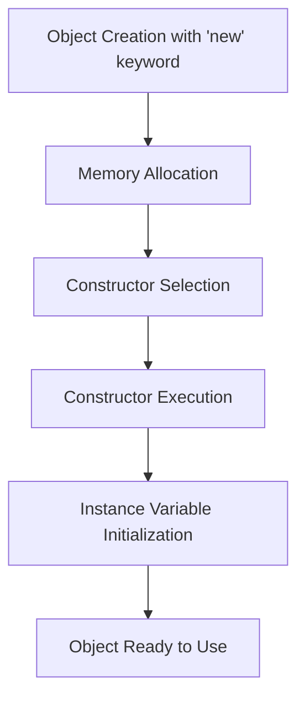

# Java Constructors

In Java object-oriented programming, a constructor is a special type of method that is automatically called when an object of a class is created. Constructors play a crucial role in initializing the newly created object before it's used.

## What is a Constructor?

A constructor is a block of code similar to a method that's called when an instance of an object is created. Unlike regular methods, constructors:

- Have the same name as the class
- Don't have any return type (not even void)
- Are automatically called when an object is instantiated using the `new` keyword

## Types of Constructors in Java

Java supports several types of constructors:

### 1. Default Constructor

If you don't define any constructor in your class, Java automatically provides a default constructor that initializes all instance variables to their default values.

```java
public class Student {
    String name;
    int age;
    
    // Java will automatically create a default constructor
    // that looks like:
    // public Student() {}
}

// Usage
public class Main {
    public static void main(String[] args) {
        Student student = new Student();
        System.out.println(student.name);  // Output: null
        System.out.println(student.age);   // Output: 0
    }
}
```

### 2. No-Argument Constructor

If you explicitly define a constructor without any parameters, it's called a no-argument constructor.

```java
public class Student {
    String name;
    int age;
    
    // No-argument constructor
    public Student() {
        name = "Unknown";
        age = 18;
    }
}

// Usage
public class Main {
    public static void main(String[] args) {
        Student student = new Student();
        System.out.println(student.name);  // Output: Unknown
        System.out.println(student.age);   // Output: 18
    }
}
```

### 3. Parameterized Constructor

You can create a constructor with parameters to initialize an object with specific values.

```java
public class Student {
    String name;
    int age;
    
    // Parameterized constructor
    public Student(String name, int age) {
        this.name = name;
        this.age = age;
    }
}

// Usage
public class Main {
    public static void main(String[] args) {
        Student student = new Student("John", 20);
        System.out.println(student.name);  // Output: John
        System.out.println(student.age);   // Output: 20
    }
}
```

## Constructor Overloading

Like methods, constructors can also be overloaded. You can define multiple constructors in a class with different parameter lists.

```java
public class Box {
    double width;
    double height;
    double depth;
    
    // Constructor for cube
    public Box(double side) {
        width = height = depth = side;
    }
    
    // Constructor for rectangular box
    public Box(double width, double height, double depth) {
        this.width = width;
        this.height = height;
        this.depth = depth;
    }
    
    // No-argument constructor
    public Box() {
        width = height = depth = 1;
    }
    
    // Calculate volume
    public double volume() {
        return width * height * depth;
    }
}

// Usage
public class Main {
    public static void main(String[] args) {
        Box cube = new Box(5);
        Box box = new Box(2, 3, 4);
        Box defaultBox = new Box();
        
        System.out.println("Cube volume: " + cube.volume());       // Output: Cube volume: 125.0
        System.out.println("Box volume: " + box.volume());         // Output: Box volume: 24.0
        System.out.println("Default box volume: " + defaultBox.volume());  // Output: Default box volume: 1.0
    }
}
```

## The `this` Keyword in Constructors

The `this` keyword refers to the current object instance and is commonly used in constructors to differentiate between instance variables and parameters with the same name.

```java
public class Person {
    String name;
    int age;
    
    public Person(String name, int age) {
        this.name = name;  // "this.name" refers to the instance variable
        this.age = age;    // "this.age" refers to the instance variable
    }
}
```

## Constructor Chaining with `this()`

You can call one constructor from another constructor of the same class using `this()`.

```java
public class Employee {
    int id;
    String name;
    String department;
    
    // Constructor with all parameters
    public Employee(int id, String name, String department) {
        this.id = id;
        this.name = name;
        this.department = department;
    }
    
    // Constructor with id and name only
    public Employee(int id, String name) {
        this(id, name, "Not Assigned");
    }
    
    // Constructor with id only
    public Employee(int id) {
        this(id, "Unknown");
    }
    
    public void displayInfo() {
        System.out.println("ID: " + id + ", Name: " + name + ", Department: " + department);
    }
}

// Usage
public class Main {
    public static void main(String[] args) {
        Employee emp1 = new Employee(101, "Alice", "Engineering");
        Employee emp2 = new Employee(102, "Bob");
        Employee emp3 = new Employee(103);
        
        emp1.displayInfo();  // Output: ID: 101, Name: Alice, Department: Engineering
        emp2.displayInfo();  // Output: ID: 102, Name: Bob, Department: Not Assigned
        emp3.displayInfo();  // Output: ID: 103, Name: Unknown, Department: Not Assigned
    }
}
```

## Practical Example: Building a Bank Account System

Let's create a more practical example using constructors to build a simple bank account system:

```java
public class BankAccount {
    private String accountNumber;
    private String accountHolderName;
    private double balance;
    private String accountType;
    private static int accountCounter = 1000;  // For generating account numbers
    
    // Constructor for new customer with initial deposit
    public BankAccount(String name, double initialDeposit, String type) {
        this.accountHolderName = name;
        this.balance = initialDeposit;
        this.accountType = type;
        this.accountNumber = generateAccountNumber();
    }
    
    // Constructor for new customer without initial deposit
    public BankAccount(String name, String type) {
        this(name, 0.0, type);
    }
    
    // Private method to generate unique account numbers
    private String generateAccountNumber() {
        accountCounter++;
        return "ACC" + accountCounter;
    }
    
    // Method to deposit money
    public void deposit(double amount) {
        if (amount > 0) {
            balance += amount;
            System.out.println("$" + amount + " deposited. New balance: $" + balance);
        } else {
            System.out.println("Invalid amount for deposit.");
        }
    }
    
    // Method to withdraw money
    public void withdraw(double amount) {
        if (amount > 0 && amount <= balance) {
            balance -= amount;
            System.out.println("$" + amount + " withdrawn. New balance: $" + balance);
        } else {
            System.out.println("Invalid amount or insufficient balance.");
        }
    }
    
    // Method to display account info
    public void displayAccountInfo() {
        System.out.println("\n===== Account Information =====");
        System.out.println("Account Number: " + accountNumber);
        System.out.println("Account Holder: " + accountHolderName);
        System.out.println("Account Type: " + accountType);
        System.out.println("Current Balance: $" + balance);
        System.out.println("==============================\n");
    }
}

// Usage
public class BankingSystem {
    public static void main(String[] args) {
        // Create a new account with initial deposit
        BankAccount account1 = new BankAccount("John Smith", 1000.0, "Savings");
        account1.displayAccountInfo();
        
        // Create a new account without initial deposit
        BankAccount account2 = new BankAccount("Mary Johnson", "Checking");
        account2.deposit(500.0);
        account2.displayAccountInfo();
        
        // Perform some transactions
        account1.withdraw(200.0);
        account1.deposit(150.0);
        account1.displayAccountInfo();
    }
}
```

**Output:**
```
===== Account Information =====
Account Number: ACC1001
Account Holder: John Smith
Account Type: Savings
Current Balance: $1000.0
==============================

$500.0 deposited. New balance: $500.0

===== Account Information =====
Account Number: ACC1002
Account Holder: Mary Johnson
Account Type: Checking
Current Balance: $500.0
==============================

$200.0 withdrawn. New balance: $800.0
$150.0 deposited. New balance: $950.0

===== Account Information =====
Account Number: ACC1001
Account Holder: John Smith
Account Type: Savings
Current Balance: $950.0
==============================
```

## Constructor Design Flow



## Best Practices for Using Constructors

1. **Initialize all important instance variables** in the constructor to ensure the object is in a valid state.

2. **Use constructor overloading** to provide flexibility in object creation.

3. **Use `this()` for constructor chaining** to avoid code duplication.

4. **Keep constructors simple** - they should focus on initializing the object, not performing complex operations.

5. **Consider using factory methods** for complex object creation instead of complicated constructors.

6. **Validate inputs** in constructors to ensure objects are created with valid data.

7. **Don't call overridable methods** in constructors as they may lead to unexpected behavior in subclasses.

## Summary

Constructors are special methods in Java that initialize objects when they are created. They have the same name as the class and don't have a return type. Java supports different types of constructors including default constructors, no-argument constructors, and parameterized constructors.

Key points to remember:
- Constructors are called automatically when an object is created
- If no constructor is defined, Java provides a default constructor
- Constructors can be overloaded to provide different ways to initialize objects
- Use `this` keyword to refer to instance variables within constructors
- Use `this()` syntax for constructor chaining

By understanding and effectively using constructors, you can ensure that your objects are properly initialized and ready to use immediately after creation.

## Exercises

1. Create a `Rectangle` class with length and width attributes. Implement constructors to create rectangles with specific dimensions, square rectangles, and default rectangles.

2. Design a `Book` class with attributes like title, author, and ISBN. Implement appropriate constructors and a method to display book information.

3. Create a `Car` class with multiple constructors that allow initializing a car with different levels of detail (e.g., just the make, make and model, full specifications).

4. Implement a `Student` class with appropriate constructors, and create a program that demonstrates constructor chaining.

## Additional Resources

- [Java Documentation on Classes and Objects](https://docs.oracle.com/javase/tutorial/java/javaOO/index.html)
- [Oracle Tutorials: Providing Constructors for Your Classes](https://docs.oracle.com/javase/tutorial/java/javaOO/constructors.html)
- [Effective Java by Joshua Bloch](https://www.oreilly.com/library/view/effective-java-3rd/9780134686097/) - Contains excellent advice on constructor usage