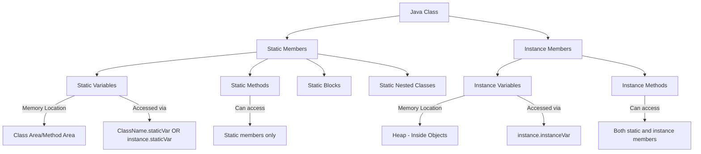

# Java Static Members

## Introduction

In Java, the `static` keyword is a powerful modifier that fundamentally changes how variables and methods behave. Static members belong to the class itself rather than to instances (objects) of that class. Understanding static members is essential for Java programmers as they provide functionality that's accessible without creating objects, enable shared resources across all instances, and form the foundation for utility classes.

In this tutorial, we'll explore:
- What static variables and methods are
- How they differ from instance members
- When and why to use static members
- Best practices for implementing static members
- Practical examples to solidify your understanding

## Static Variables

### What are Static Variables?

A static variable (also called class variable) is a variable that belongs to the class rather than instances of the class. Only one copy of a static variable exists regardless of how many objects of the class are created.

### Syntax

```java
public class MyClass {
    // Static variable declaration
    static int staticVariable = 0;
    
    // Instance variable for comparison
    int instanceVariable = 0;
}
```

### Key Characteristics

1. **Memory allocation**: Static variables are stored in the class area of Java's memory, not in the heap with objects
2. **Initialization**: They're initialized when the class is loaded by the JVM
3. **Shared value**: All instances share the same static variable
4. **Access**: Can be accessed even without creating an object of the class

### Example: Understanding Static Variables

```java
public class Counter {
    // Static variable - shared across all instances
    static int staticCount = 0;
    
    // Instance variable - each object has its own copy
    int instanceCount = 0;
    
    Counter() {
        staticCount++;      // Increments the shared counter
        instanceCount++;    // Increments this object's counter
    }
    
    public static void main(String[] args) {
        Counter c1 = new Counter();
        Counter c2 = new Counter();
        Counter c3 = new Counter();
        
        System.out.println("c1.instanceCount: " + c1.instanceCount);  
        System.out.println("c2.instanceCount: " + c2.instanceCount);  
        System.out.println("c3.instanceCount: " + c3.instanceCount);  
        System.out.println("Counter.staticCount: " + Counter.staticCount);
        
        // Can also access static variable through an instance (not recommended)
        System.out.println("c1.staticCount: " + c1.staticCount);
    }
}
```

**Output:**
```
c1.instanceCount: 1
c2.instanceCount: 1
c3.instanceCount: 1
Counter.staticCount: 3
c1.staticCount: 3
```

In this example, each object has its own `instanceCount` (always 1), but they all share the same `staticCount` (which becomes 3 after creating three objects).

## Static Methods

### What are Static Methods?

Static methods are methods that belong to the class rather than to instances of the class. They can be called without creating an object of the class.

### Syntax

```java
public class MathOperations {
    // Static method
    public static int add(int a, int b) {
        return a + b;
    }
    
    // Instance method for comparison
    public int multiply(int a, int b) {
        return a * b;
    }
}
```

### Key Characteristics

1. **No `this` reference**: Static methods don't have access to the `this` keyword
2. **Cannot access instance variables/methods directly**: They can only directly access other static variables and methods
3. **Method binding**: Static methods use static binding (compile-time binding) rather than dynamic binding
4. **Utility purposes**: Often used for operations that don't require object state

### Example: Working with Static Methods

```java
public class Calculator {
    // Static variable
    static double PI = 3.14159;
    
    // Instance variable
    double result;
    
    // Static method
    public static double calculateCircleArea(double radius) {
        return PI * radius * radius;
    }
    
    // Static method can't access instance variables directly
    public static void printInfo() {
        System.out.println("This is a calculator class");
        System.out.println("PI value: " + PI);
        
        // Error: Cannot access instance variable
        // System.out.println("Result: " + result);
    }
    
    // Instance method can access both static and instance members
    public void displayResult() {
        System.out.println("Result: " + result);
        System.out.println("PI: " + PI);  // Can access static variable
    }
    
    public static void main(String[] args) {
        // Call static method without creating object
        double area = Calculator.calculateCircleArea(5);
        System.out.println("Circle area: " + area);
        
        // Call static method directly within the same class
        printInfo();
        
        // To use instance method, we need to create an object
        Calculator calc = new Calculator();
        calc.result = 42;
        calc.displayResult();
    }
}
```

**Output:**
```
Circle area: 78.53975
This is a calculator class
PI value: 3.14159
Result: 42.0
PI: 3.14159
```

## Static Blocks

In addition to static variables and methods, Java also supports static initialization blocks, which are executed when the class is loaded.

### Syntax and Example

```java
public class DatabaseConfig {
    static String url;
    static String username;
    static String password;
    
    // Static initialization block
    static {
        System.out.println("Loading database configuration...");
        // In a real application, these might be loaded from a config file
        url = "jdbc:mysql://localhost:3306/mydb";
        username = "admin";
        password = "securePassword";
    }
    
    public static void main(String[] args) {
        System.out.println("Database URL: " + url);
        System.out.println("Username: " + username);
    }
}
```

**Output:**
```
Loading database configuration...
Database URL: jdbc:mysql://localhost:3306/mydb
Username: admin
```

The static block is executed when the class is loaded, before any methods (including `main`) are called.

## Static Import

Java allows you to import static members from other classes so you can use them without class qualification.

### Example: Static Import

```java
// Without static import
double result = Math.sqrt(25);
double angle = Math.PI / 2;

// With static import
import static java.lang.Math.sqrt;
import static java.lang.Math.PI;

// Now you can use them directly
double result = sqrt(25);
double angle = PI / 2;
```

## Static Classes (Nested Static Classes)

In Java, we can define static nested classes - these are classes defined inside another class with the static modifier.

```java
public class OuterClass {
    private static String outerStaticVar = "Static variable in outer class";
    private String outerInstanceVar = "Instance variable in outer class";
    
    // Static nested class
    public static class StaticNestedClass {
        public void display() {
            // Can access static members of outer class
            System.out.println(outerStaticVar);
            
            // Cannot access instance members of outer class
            // System.out.println(outerInstanceVar); // This would cause error
        }
    }
    
    // Inner (non-static) class for comparison
    public class InnerClass {
        public void display() {
            // Can access both static and instance members of outer class
            System.out.println(outerStaticVar);
            System.out.println(outerInstanceVar);
        }
    }
    
    public static void main(String[] args) {
        // Creating object of static nested class
        StaticNestedClass nestedObj = new StaticNestedClass();
        nestedObj.display();
        
        // Creating object of inner class requires outer class instance
        OuterClass outerObj = new OuterClass();
        InnerClass innerObj = outerObj.new InnerClass();
        innerObj.display();
    }
}
```

## Real-world Applications of Static Members

### 1. Utility Classes

Utility classes often contain static methods that perform common operations. They typically aren't meant to be instantiated.

```java
public class StringUtils {
    // Private constructor prevents instantiation
    private StringUtils() {
        throw new AssertionError("Utility class should not be instantiated");
    }
    
    public static String reverse(String input) {
        if (input == null) return null;
        return new StringBuilder(input).reverse().toString();
    }
    
    public static boolean isPalindrome(String input) {
        if (input == null) return false;
        String cleaned = input.toLowerCase().replaceAll("[^a-z0-9]", "");
        return cleaned.equals(reverse(cleaned));
    }
    
    public static void main(String[] args) {
        System.out.println(StringUtils.reverse("Hello")); // "olleH"
        System.out.println(StringUtils.isPalindrome("A man, a plan, a canal: Panama")); // true
        System.out.println(StringUtils.isPalindrome("Hello")); // false
    }
}
```

### 2. Constants

Static final variables are perfect for declaring constants that should be shared across all instances.

```java
public class ConfigConstants {
    public static final int MAX_CONNECTIONS = 100;
    public static final String API_ENDPOINT = "https://api.example.com/v1";
    public static final long TIMEOUT_MS = 30000;
    
    // Constants for different environment configurations
    public static class Environments {
        public static final String DEV = "development";
        public static final String TEST = "testing";
        public static final String PROD = "production";
    }
    
    public static void main(String[] args) {
        System.out.println("Max connections: " + MAX_CONNECTIONS);
        System.out.println("Using environment: " + Environments.DEV);
    }
}
```

### 3. Factory Methods

Static factory methods provide alternatives to constructors for creating objects.

```java
public class ConnectionFactory {
    public static Connection createMySQLConnection(String database) {
        System.out.println("Creating MySQL connection to " + database);
        // In a real app, this would return an actual connection
        return new MySQLConnection(database);
    }
    
    public static Connection createPostgresConnection(String database) {
        System.out.println("Creating Postgres connection to " + database);
        return new PostgresConnection(database);
    }
    
    // Simulated Connection interface and implementations
    interface Connection { void execute(String query); }
    
    static class MySQLConnection implements Connection {
        String db;
        MySQLConnection(String db) { this.db = db; }
        public void execute(String query) {
            System.out.println("Executing on MySQL(" + db + "): " + query);
        }
    }
    
    static class PostgresConnection implements Connection {
        String db;
        PostgresConnection(String db) { this.db = db; }
        public void execute(String query) {
            System.out.println("Executing on Postgres(" + db + "): " + query);
        }
    }
    
    public static void main(String[] args) {
        Connection mysql = ConnectionFactory.createMySQLConnection("users");
        mysql.execute("SELECT * FROM users");
        
        Connection postgres = ConnectionFactory.createPostgresConnection("products");
        postgres.execute("SELECT * FROM products");
    }
}
```

**Output:**
```
Creating MySQL connection to users
Executing on MySQL(users): SELECT * FROM users
Creating Postgres connection to products
Executing on Postgres(products): SELECT * FROM products
```

### 4. Application State and Counters

Static variables can track application-wide state:

```java
public class RequestTracker {
    private static int totalRequests = 0;
    private static int successfulRequests = 0;
    private static int failedRequests = 0;
    
    public static synchronized void logRequest(boolean success) {
        totalRequests++;
        if (success) {
            successfulRequests++;
        } else {
            failedRequests++;
        }
    }
    
    public static void printStatistics() {
        System.out.println("Total requests: " + totalRequests);
        System.out.println("Successful requests: " + successfulRequests);
        System.out.println("Failed requests: " + failedRequests);
        
        if (totalRequests > 0) {
            double successRate = (double) successfulRequests / totalRequests * 100;
            System.out.printf("Success rate: %.2f%%\n", successRate);
        }
    }
    
    public static void main(String[] args) {
        // Simulate some requests
        for (int i = 0; i < 100; i++) {
            // 80% success rate for this simulation
            boolean success = Math.random() < 0.8;
            RequestTracker.logRequest(success);
        }
        
        RequestTracker.printStatistics();
    }
}
```

## Visualizing Static vs Instance Members



## Best Practices for Static Members

1. **Use static for truly class-level concepts**:
   - Constants (static final variables)
   - Utility methods that don't depend on instance state
   - Factory methods

2. **Avoid overuse**:
   - Don't use static variables for maintaining state that should be per-instance
   - Avoid using static variables to pass state between objects (prefer explicit parameters)

3. **Thread safety**:
   - Remember that static variables are shared across all threads
   - Use synchronization or thread-local storage when needed

4. **Static methods should be "pure"**:
   - Ideally, static methods should depend only on their inputs and not on external state
   - This makes them more testable and predictable

5. **Use proper naming conventions**:
   - Constants (static final variables) should use UPPER_SNAKE_CASE
   - Static method names should clearly indicate their purpose

6. **Prevent instantiation of utility classes**:
   - Use private constructors for classes containing only static members

## Common Issues and Gotchas

### Static Variables and Thread Safety

Since static variables are shared across all instances and threads, they can cause concurrency issues:

```java
public class UnsafeCounter {
    private static int count = 0;
    
    public static void increment() {
        count++; // This is not atomic!
    }
    
    public static int getCount() {
        return count;
    }
    
    // A safer version would be:
    public static synchronized void safeIncrement() {
        count++;
    }
}
```

### Static Import Abuse

Overusing static imports can make code less readable:

```java
// Bad: Too many static imports make it unclear where methods come from
import static java.lang.Math.*;
import static com.myapp.utils.StringUtils.*;
import static java.util.Arrays.*;

double result = sqrt(pow(5, 2) + pow(7, 2));
String[] words = reverse(split(lowercase("HELLO WORLD"), " "));
```

### Inheritance Behavior

Static methods are not polymorphic - they don't participate in method overriding:

```java
public class Parent {
    public static void staticMethod() {
        System.out.println("Parent's static method");
    }
    
    public void instanceMethod() {
        System.out.println("Parent's instance method");
    }
}

public class Child extends Parent {
    // This hides the parent's static method but doesn't override it
    public static void staticMethod() {
        System.out.println("Child's static method");
    }
    
    // This overrides the parent's instance method
    @Override
    public void instanceMethod() {
        System.out.println("Child's instance method");
    }
    
    public static void main(String[] args) {
        Parent p = new Child();
        p.staticMethod();    // Calls Parent's static method
        p.instanceMethod();  // Calls Child's instance method
        
        Child c = new Child();
        c.staticMethod();    // Calls Child's static method
    }
}
```

## Summary

Static members in Java provide functionality at the class level rather than the instance level:

- **Static variables** are shared across all instances of a class
- **Static methods** belong to the class and can be called without creating an object
- **Static blocks** execute when a class is loaded, useful for one-time initialization
- **Static nested classes** exist independently of outer class instances

Static members are useful for:
- Utility methods and classes
- Constants
- Factory methods
- Application-wide state
- Counters and shared resources

Remember to use static members judiciously and be mindful of thread safety when working with static variables.

## Exercises

1. Create a utility class called `MathUtils` with static methods for calculating the factorial of a number and checking if a number is prime.

2. Implement a `Logger` class with static methods for logging messages at different levels (info, warning, error) and a static counter for each type of log.

3. Create a `DatabaseConnectionPool` class with a static pool of connections and methods to acquire and release connections from the pool.

4. Design a `Configuration` class that uses a static block to load properties from a file when the class is first used.

5. Refactor the following code to use static methods and variables appropriately:

```java
public class ShapeCalculator {
    public double pi = 3.14159;
    
    public double calculateCircleArea(double radius) {
        return pi * radius * radius;
    }
    
    public double calculateSquareArea(double side) {
        return side * side;
    }
}
```

## Additional Resources

- [Oracle's Java Documentation on Static Members](https://docs.oracle.com/javase/tutorial/java/javaOO/classvars.html)
- [Effective Java by Joshua Bloch](https://www.oreilly.com/library/view/effective-java-3rd/9780134686097/) - Item 4: Enforce noninstantiability with a private constructor
- [Baeldung - Guide to Java Static Keyword](https://www.baeldung.com/java-static)
- [Java Static Best Practices](https://www.journaldev.com/1365/static-keyword-in-java)

Happy coding with static members in Java!