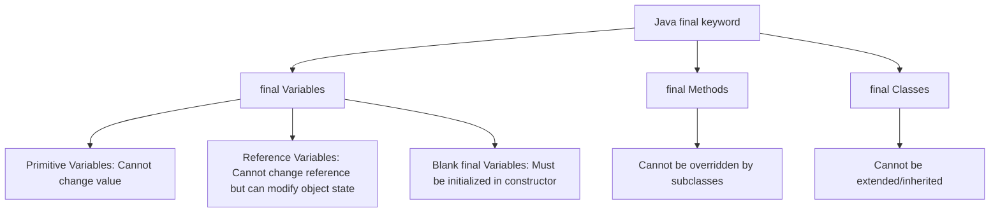

# Java Final Keyword

The `final` keyword is a powerful modifier in Java that enables you to restrict the use of classes, methods, and variables in various ways. As a beginner Java programmer, understanding how and when to use the `final` keyword will help you write more robust and secure code.

## Introduction to the `final` Keyword

In Java, the `final` keyword can be applied to:

1. **Variables** - to create constants whose value cannot be changed
2. **Methods** - to prevent method overriding
3. **Classes** - to prevent inheritance

The `final` keyword serves as a way to enforce immutability and set restrictions in your code, making it more predictable and potentially more secure.

## Using `final` with Variables

When applied to a variable, the `final` keyword makes it a constant, meaning its value cannot be changed after initialization.

### Syntax

```java
final data_type VARIABLE_NAME = value;
```

By convention, constants (final variables) are often named using uppercase letters with underscores separating words.

### Examples

#### Example 1: Final primitive variables

```java
public class FinalVariableDemo {
    public static void main(String[] args) {
        final int MAX_SPEED = 120;
        System.out.println("Maximum speed: " + MAX_SPEED + " km/h");
        
        // The following line would cause a compilation error
        // MAX_SPEED = 150; // Cannot assign a value to final variable 'MAX_SPEED'
        
        final double PI = 3.14159;
        System.out.println("Value of PI: " + PI);
    }
}
```

**Output:**
```
Maximum speed: 120 km/h
Value of PI: 3.14159
```

#### Example 2: Final reference variables

When using `final` with reference variables, the variable cannot be reassigned to refer to another object, but the object's state (its internal values) can still be changed.

```java
public class FinalReferenceDemo {
    public static void main(String[] args) {
        final StringBuilder builder = new StringBuilder("Hello");
        
        // We can modify the object that the final reference points to
        builder.append(" World");
        System.out.println(builder); // Outputs: Hello World
        
        // But we cannot reassign the reference to a new object
        // builder = new StringBuilder("New Object"); // This would cause a compilation error
    }
}
```

**Output:**
```
Hello World
```

### Blank Final Variables

Java also allows "blank final variables" which are declared but not initialized at the time of declaration. These must be initialized in every constructor of the class.

```java
public class BlankFinalDemo {
    // Blank final variable
    final int termId;
    
    // Constructor must initialize the blank final variable
    public BlankFinalDemo(int id) {
        this.termId = id; // Initialize the blank final variable
    }
    
    public void display() {
        System.out.println("Term ID: " + termId);
    }
    
    public static void main(String[] args) {
        BlankFinalDemo demo = new BlankFinalDemo(101);
        demo.display();
    }
}
```

**Output:**
```
Term ID: 101
```

## Using `final` with Methods

When you declare a method as `final`, it cannot be overridden by a subclass. This is useful when you have a method whose implementation should not be changed in any subclass.

### Syntax

```java
public final return_type methodName(parameters) {
    // method body
}
```

### Example

```java
class Parent {
    final void showMessage() {
        System.out.println("This is a final method from Parent class");
    }
    
    void regularMethod() {
        System.out.println("This is a regular method from Parent class");
    }
}

class Child extends Parent {
    // This would cause a compilation error:
    // void showMessage() {
    //     System.out.println("Attempting to override final method");
    // }
    
    // This is allowed - overriding a regular method
    @Override
    void regularMethod() {
        System.out.println("This is an overridden method in Child class");
    }
}

public class FinalMethodDemo {
    public static void main(String[] args) {
        Child child = new Child();
        child.showMessage();   // Calls parent's final method
        child.regularMethod(); // Calls child's overridden method
    }
}
```

**Output:**
```
This is a final method from Parent class
This is an overridden method in Child class
```

## Using `final` with Classes

When a class is declared as `final`, it cannot be extended or subclassed. This is useful when you want to prevent inheritance, ensuring that the class behavior remains consistent.

### Syntax

```java
final class ClassName {
    // class body
}
```

### Example

```java
final class FinalClass {
    void display() {
        System.out.println("This is a method from a final class");
    }
}

// This would cause a compilation error:
// class SubClass extends FinalClass {
//     // class body
// }

public class FinalClassDemo {
    public static void main(String[] args) {
        FinalClass obj = new FinalClass();
        obj.display();
    }
}
```

**Output:**
```
This is a method from a final class
```

## Common Use Cases for `final` Keyword

### 1. Creating Constants

The most common use of `final` is to create constants that shouldn't change throughout program execution.

```java
public class MathConstants {
    public static final double PI = 3.14159265359;
    public static final double E = 2.71828182846;
    public static final double GOLDEN_RATIO = 1.61803398875;
    
    public static void main(String[] args) {
        System.out.println("PI: " + PI);
        System.out.println("E: " + E);
        System.out.println("Golden Ratio: " + GOLDEN_RATIO);
    }
}
```

**Output:**
```
PI: 3.14159265359
E: 2.71828182846
Golden Ratio: 1.61803398875
```

### 2. Method Parameters

You can use the `final` keyword with method parameters to ensure they are not modified within the method.

```java
public class FinalParameterDemo {
    public static void processUserData(final String username, final int userId) {
        System.out.println("Processing data for: " + username + " (ID: " + userId + ")");
        // username = "newName"; // This would cause a compilation error
    }
    
    public static void main(String[] args) {
        processUserData("JohnDoe", 12345);
    }
}
```

**Output:**
```
Processing data for: JohnDoe (ID: 12345)
```

### 3. Security and Thread Safety

Making classes and methods `final` can help with security and thread safety in certain contexts:

```java
public final class ImmutablePerson {
    private final String name;
    private final int age;
    
    public ImmutablePerson(String name, int age) {
        this.name = name;
        this.age = age;
    }
    
    public String getName() {
        return name;
    }
    
    public int getAge() {
        return age;
    }
    
    @Override
    public String toString() {
        return "Person[name=" + name + ", age=" + age + "]";
    }
    
    public static void main(String[] args) {
        ImmutablePerson person = new ImmutablePerson("Alice", 30);
        System.out.println(person);
        
        // We cannot modify the person object's properties
        // person.name = "Bob"; // Would cause compilation error
    }
}
```

**Output:**
```
Person[name=Alice, age=30]
```

## Real-world Applications

### Example: Configuration Settings in an Application

```java
public class AppConfig {
    public static final String DATABASE_URL = "jdbc:mysql://localhost:3306/myapp";
    public static final int CONNECTION_TIMEOUT = 30; // seconds
    public static final String API_KEY = "abc123xyz456";
    
    public static void main(String[] args) {
        System.out.println("Connecting to: " + DATABASE_URL);
        System.out.println("Timeout set to: " + CONNECTION_TIMEOUT + " seconds");
        System.out.println("Using API key: " + API_KEY);
    }
}
```

**Output:**
```
Connecting to: jdbc:mysql://localhost:3306/myapp
Timeout set to: 30 seconds
Using API key: abc123xyz456
```

### Example: Creating an Immutable Class

Here's a real-world example of using `final` to create an immutable class for storing user information:

```java
public final class User {
    private final String userId;
    private final String username;
    private final String email;
    
    public User(String userId, String username, String email) {
        this.userId = userId;
        this.username = username;
        this.email = email;
    }
    
    // Only getters, no setters to preserve immutability
    public String getUserId() {
        return userId;
    }
    
    public String getUsername() {
        return username;
    }
    
    public String getEmail() {
        return email;
    }
    
    // To "modify" a user, we create a new instance
    public User withEmail(String newEmail) {
        return new User(this.userId, this.username, newEmail);
    }
    
    @Override
    public String toString() {
        return "User[id=" + userId + ", username=" + username + ", email=" + email + "]";
    }
    
    public static void main(String[] args) {
        User user = new User("U123", "johnsmith", "john@example.com");
        System.out.println("Original user: " + user);
        
        // "Modifying" by creating a new instance
        User updatedUser = user.withEmail("johnsmith@company.com");
        System.out.println("Updated user: " + updatedUser);
        System.out.println("Original user still intact: " + user);
    }
}
```

**Output:**
```
Original user: User[id=U123, username=johnsmith, email=john@example.com]
Updated user: User[id=U123, username=johnsmith, email=johnsmith@company.com]
Original user still intact: User[id=U123, username=johnsmith, email=john@example.com]
```

## Visual Representation of `final` Concepts



## Summary

The `final` keyword in Java is a powerful tool that helps you:

- Create constants by making variables immutable
- Prevent method overriding by making methods final
- Prevent inheritance by making classes final

Using the `final` keyword appropriately can lead to:
- More secure code
- Better performance optimization opportunities for the JVM
- Clearer intentions in your code design
- Improved thread safety in concurrent applications

Remember that while `final` can make code more robust, it also restricts flexibility, so use it judiciously based on your specific requirements.

## Practice Exercises

1. Create a class that defines several final constants representing different speed limits (e.g., RESIDENTIAL_SPEED_LIMIT, HIGHWAY_SPEED_LIMIT).

2. Create an immutable `Circle` class with final radius property and methods to calculate area and circumference.

3. Design a `Vehicle` class with a final method `startEngine()` and a non-final method `accelerate()`. Then create a subclass and try to override both methods to understand the constraints.

4. Implement a `BankAccount` class that uses final variables to store account details like account number, while allowing the balance to be modified.

## Additional Resources

- [Oracle Java Documentation on final keyword](https://docs.oracle.com/javase/tutorial/java/IandI/final.html)
- [Effective Java by Joshua Bloch](https://www.oreilly.com/library/view/effective-java-3rd/9780134686097/) - Item 17: Minimize mutability
- [Java Design Patterns](https://java-design-patterns.com/patterns/immutable/) - Immutable Object Pattern

By using the `final` keyword effectively, you can create more robust, secure, and maintainable Java applications.